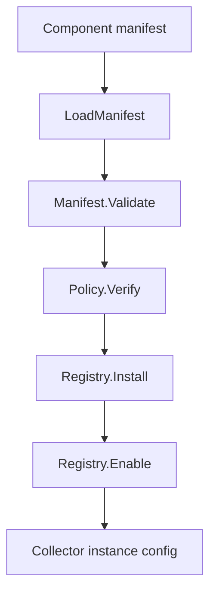

# Component

## Purpose

`component` owns Eshu's local component package metadata model. It validates
component manifests, applies local trust policy, records installed packages,
and tracks whether an installed package is activated for a collector instance.

This package does not pull runnable artifacts, start collectors, mutate core
storage schemas, or write customer documentation. It is the read/write boundary
for package-manager state and the policy boundary for optional provenance
verification.

## Where this fits in the pipeline



The CLI in `go/cmd/eshu` calls this package for `eshu component inspect`,
`verify`, `install`, `list`, `enable`, `disable`, and `uninstall`.

## Internal flow

1. `LoadManifest` reads a YAML component manifest from disk and validates its
   top-level contract.
2. `Policy.Verify` evaluates the manifest against the selected trust mode,
   allowlists, revocation lists, compatible-core range, and optional
   provenance verifier.
3. `Registry.Install` persists the manifest under the component home and records
   the manifest digest in `registry.json`.
4. `Registry.PlanEnable` validates an activation without writing state.
5. `Registry.Enable` records an activation only after a component is installed.
   Installed packages are inert until activated, and duplicate instance
   activations are rejected instead of updated in place.
6. `Registry.Disable` removes an activation without deleting the installed
   package or its manifest digest.
7. `Registry.Uninstall` removes an inactive installed package version and
   rejects removal while any activation references the component.

## Exported surface

- `Manifest`, `Metadata`, `Spec`, `Artifact`, `FactFamily`,
  `RuntimeContract`, `ConsumerContracts`, and `Telemetry` model the component
  manifest contract. `RuntimeContract` declares the supported collector SDK
  protocol and adapter before a host can consider an activation claim-capable.
  Each `FactFamily` declares a namespaced, non-core fact kind, supported schema
  versions, the non-unknown source-confidence values the component emits, and
  optionally the core fixture-pack payload schema shape that validates it.
- `LoadManifest(path)` loads and validates a manifest from disk.
- `Policy`, `ProvenancePolicy`, `ProvenanceVerifier`, and
  `VerificationResult` implement local trust checks and expose stable failure
  classes for invalid manifests, incompatible core ranges, revoked packages,
  untrusted publishers, and unavailable, invalid, or unsupported provenance.
- `CosignProvenanceVerifier` shells out to the operator-selected Cosign binary
  to verify digest-pinned artifact signatures and SLSA attestations without
  executing component code.
- `NewRegistry(home)` creates a file-backed installed component registry.
- `Registry.Install`, `List`, `Readback`, `PlanEnable`, `Enable`, `Disable`,
  and `Uninstall` manage local install and activation state.
- `InstalledComponent` records the manifest, digest, install time, verification
  metadata, and activations.
- `Activation` records the collector instance, execution mode, claim behavior,
  and optional configuration for an enabled package.
- `ActivationConfigHandle` derives the stable non-secret handle shared by the
  coordinator and component extension worker for one activation config.
- `ActivationHostClaimMetadata`, `ActivationHostClaimScope`, and
  `LoadActivationHostClaimMetadata` read the optional non-secret `host` block
  from an activation config. The reader returns only source system, scope ID,
  and scope kind, and it strips private file paths from read errors.
- `Error`, `ErrorCode`, and `ErrorSummary` carry stable operator-facing error
  classes, including installed fact-kind ownership conflicts, without embedding
  private filesystem paths in their messages.
- `RegistryReadbackComponent` reports deterministic states such as
  `installed`, `enabled`, `claim_capable`, `revoked`, `incompatible`, and
  `failed`.

## Invariants

- Git remains built in. Optional collectors and services must be installed and
  enabled explicitly.
- Installed does not mean enabled. Enabled does not mean claim-capable.
- Trust policy fails closed when provenance cannot be verified. Revocation wins
  over otherwise compatible or allowlisted packages.
- Registry writes are atomic so a partial write cannot corrupt
  `registry.json`.
- Component manifests must pin artifact images by digest.
- Component manifests must declare a supported collector SDK protocol and
  runtime adapter. The first supported protocol is `collector-sdk/v1alpha1`,
  and the first supported adapters are `oci` and `process`.
- Component manifests must declare source-confidence values per emitted fact
  family. `unknown` remains a storage compatibility fallback, not component
  output.
- `payloadSchemaRef`, when present, must name a schema shipped by the
  factschema fixture pack. A namespaced component fact with no schema ref stays
  provenance-only and is not payload-shape validated.
- Unknown or unsupported package behavior must remain inert at install time.
- Optional components cannot claim core-owned fact kinds. Installed component
  fact-kind ownership must stay unique unless the same component ID installs a
  schema-compatible version that declares the same schema major set.
- Install, dry-run enable, and enable all use the same fact-kind ownership
  comparison so old registry state cannot bypass the manifest gate.
- Duplicate activations are explicit errors. Operators must disable an existing
  instance before enabling the same instance again.
- Replacement content is accepted only for inactive package versions. Active
  versions must be disabled before their manifest content can change.
- Readback derives manifest paths from the component home, ID, and version. It
  does not trust `manifest_path` values stored in `registry.json`.

## Tests

Run package tests with:

```bash
go test ./internal/component -count=1
```

The package has focused tests for manifest validation, trust policy decisions,
registry install/list/readback/enable/disable/uninstall behavior, inactive
replacement, active replacement rejection, duplicate activation, classified
errors, fact-kind namespace collisions, version-compatible shared ownership,
uninstall/reinstall ownership release, and active uninstall protection.
