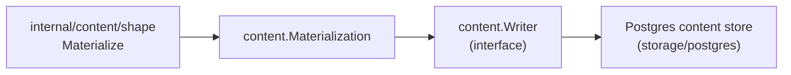

# Content

## Purpose

`content` defines the source-local content write contract used by the projector
and any future write path that persists file bodies, entity rows, and repository
ref metadata to Postgres. It owns the `Writer` port, the value types that flow
through that port, the canonical content-entity identifier, and the runtime
tunable for batch width. The Postgres storage adapter lives in
`internal/storage/postgres` and implements `Writer`; this package has no
Postgres dependency.

## Where this fits in the pipeline

The projector calls `content.Writer.Write` with a `Materialization` built by
`internal/content/shape` plus source metadata extracted from repository facts.
The concrete writer (`storage/postgres`) upserts `content_files`,
`content_entities`, and `repository_refs` rows.

## Ownership boundary

This package owns:

- `Writer` — the narrow per-scope-generation write interface
- `Materialization`, `Record`, `EntityRecord`, `RepositoryRef`, `Result` — value types
- `CanonicalEntityID`, `CanonicalEntityIDWithMetadata`, `CanonicalDependencyEntityID` — stable entity hashes
- `WriterConfig`, `LoadWriterConfig` — batch-width tunable
- `MemoryWriter` — in-process test double

This package does not own the Postgres schema, SQL, or connection pool.
Those live in `internal/storage/postgres`.

## Exported surface

See `doc.go` for the godoc contract.

Write contract:

- `Writer` — `Write(context.Context, Materialization) (Result, error)`. The
  single interface other packages depend on; implemented by the Postgres content
  adapter.
- `Materialization` — payload for one scope generation: `RepoID`, `ScopeID`,
  `GenerationID`, `SourceSystem`, `Records []Record`,
  `Entities []EntityRecord`, and `RepositoryRefs []RepositoryRef`.
  `ScopeGenerationKey()` returns the durable `"scopeID:generationID"` boundary.
- `Record` — one file write candidate: `Path`, `Body`, `Digest`, `Deleted`,
  `Metadata map[string]string`.
- `EntityRecord` — one entity write candidate; carries `EntityID`, `Path`,
  `EntityType`, `EntityName`, line/byte range, `Language`, `ArtifactType`,
  `TemplateDialect`, `IACRelevant`, `SourceCache`, `Metadata`, `Deleted`.
- `RepositoryRef` — one observed source-control ref: `Name`, `Kind`, `HeadSHA`,
  `Default`, and `ObservedAt`.
- `Result` — write summary: `ScopeID`, `GenerationID`, `RecordCount`,
  `EntityCount`, `RepositoryRefCount`, `DeletedCount`.
- `MemoryWriter` — accumulates cloned `Materialization` values in `Writes` for
  unit tests and adapters.

Identity:

- `CanonicalEntityID(repoID, relativePath, entityType, entityName string, lineNumber int) string`
  — hashes the five-field key with BLAKE2s and returns `"content-entity:e_<12-hex>"`.
- `CanonicalEntityIDWithMetadata(repoID, relativePath, entityType, entityName string, lineNumber int, metadata map[string]any) string`
  — the entry point both mint sites (`internal/content/shape.Materialize` and
  the `internal/projector` `entity_id`-fallback path) call. Routes to
  `CanonicalDependencyEntityID` when `entityType` is `"variable"` and
  `metadata` marks an in-scope manifest dependency row (`config_kind ==
  "dependency"`, `package_manager` in `dependencyIdentityPackageManagers`,
  `lockfile` not true, `section` a non-empty string); otherwise returns
  `CanonicalEntityID` unchanged. The gate excludes lockfile-sourced rows on
  purpose — see `CanonicalDependencyEntityID` below. As of #5507 the in-scope
  package managers are `npm`, `composer` (#5357), `cargo`, `gradle`, `maven`,
  `nuget`, `pypi`, `go` (gomod), `rubygems`, `pub`, and `hex`; `swift` is
  deliberately excluded (see `dependency_identity.go`'s doc comment — its only
  producer is a lockfile).
- `CanonicalDependencyEntityID(repoID, relativePath, section, name string) string`
  — hashes a six-component, `"eshu-dep-v1"`-tagged key
  (`repoID`, `relativePath`, the constant `"variable"`, `section`, `name`) with
  BLAKE2s and returns `"content-entity:e_<12-hex>"`. Line-independent: this id
  does not change when a dependency's source line moves, so reordering
  dependencies within one manifest section (e.g. `package.json`'s
  `dependencies`) does not churn its content-entity id. The domain tag and
  six-component shape make collision with `CanonicalEntityID`'s five-component
  untagged output structurally impossible. `name` here is `entityName` folded
  with an optional package-manager-specific discriminator (see
  `dependencyIdentityDiscriminator` in `dependency_identity.go`) for formats
  where `(section, name)` alone cannot guarantee uniqueness — cargo (manifest
  alias), gradle (version), maven (classifier/type), nuget (item-level MSBuild
  `Condition`, falling back to group-level), pypi (extras/marker), and go/gomod
  (raw declared version, since `modfile.Parse` does not de-duplicate `require`
  directives). `CanonicalDependencyEntityID` itself is unaware of the
  discriminator concept; its hash shape never changes, so the #5357
  npm/composer ids already minted in production stay byte-identical.

Config:

- `WriterConfig` / `LoadWriterConfig` — reads `ContentEntityBatchSizeEnv`
  (`ESHU_CONTENT_ENTITY_BATCH_SIZE`) from the environment; rejects non-positive
  values and values above `MaxContentEntityBatchSize` (4000).

## Dependencies

- `golang.org/x/crypto/blake2s` for `CanonicalEntityID`. No internal-package
  imports; this package is a leaf in the dependency graph.

## Telemetry

None directly. Postgres writer adapters in `internal/storage/postgres` add the
duration histograms and batch-size counters required by the observability
contract.

## Gotchas / invariants

- `CanonicalEntityID` lower-cases `entityType` and trims whitespace from every
  input before hashing. Callers that pre-trim or pre-lower differently will
  produce divergent IDs.
- `CanonicalEntityIDWithMetadata`'s dependency gate is narrow on purpose:
  `config_kind == "dependency"` alone is also emitted by lockfile parsers
  (`package-lock.json`, `composer.lock`, and other npm lockfile flavors),
  which legitimately repeat a package name multiple times per section (nested
  `node_modules` can carry the same name at different versions). Widening the
  gate to `config_kind` alone would collapse those distinct dependency
  versions into one identity — an accuracy violation, not a refactor. Do not
  extend the `package_manager` allow-list without proving the target format's
  parser guarantees per-section name uniqueness the way `package.json` and
  `composer.json` manifests do — directly (map/table-key uniqueness, or the
  target tooling itself rejecting a duplicate declaration) or through a proven
  `dependencyIdentityDiscriminator` case.
- `dependencyIdentityDiscriminator` (`dependency_identity.go`) is where a
  package-manager-specific uniqueness proof lives when `(section, name)` alone
  is not enough. Each case's doc comment names the concrete manifest feature
  that forces it (Cargo's `package = "..."` aliasing, Gradle's repeatable
  coordinate-at-a-different-version, Maven's classifier/type, NuGet's
  MSBuild `Condition` multi-targeting, pypi's extras/markers). Do not add or
  widen a case without the same kind of proof, and do not forget: an empty
  discriminator is the correct answer for every format whose parser already
  guarantees per-section uniqueness on its own.
- Both mint sites — `internal/content/shape.Materialize` and
  `internal/projector`'s `buildContentEntityRecord` `entity_id` fallback —
  MUST call `CanonicalEntityIDWithMetadata` with the same metadata view. The
  projector fallback only fires without a collector-minted `entity_id`
  (version skew, replayed cassettes, non-git producers); divergent minting on
  that path would silently corrupt identity.
- `Clone` methods (`Record.Clone`, `EntityRecord.Clone`, `Materialization.Clone`)
  must be called before retaining inputs across async boundaries. `MemoryWriter`
  always stores a clone, not the raw input.
- `LoadWriterConfig` returns an error when `ContentEntityBatchSizeEnv` is set to
  a non-positive integer or a value above `MaxContentEntityBatchSize` (4000).
  A zero value from the env means "use the adapter default."
- Test files (`postgres_writer_test.go`, `writer_test.go`,
  `writer_config_test.go`) are in `package content_test` — external test
  package. Do not move them to `package content` without re-checking export
  visibility.

## Related docs

- `go/internal/content/shape/README.md` — shaping layer that builds `Materialization`
- `docs/public/architecture.md` — pipeline and Postgres content store role
- `docs/public/reference/local-testing.md`
