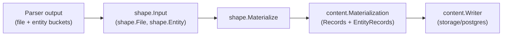

# Content Shape

## Purpose

`shape` converts parser-emitted file and entity payloads into the
`content.Materialization` rows that `content.Writer.Write` persists. It
centralizes the entity-bucket label mapping, `source_cache` snippet derivation,
and the byte limits that keep low-signal entity rows from bloating the content
store.

## Where this fits in the pipeline

The ingester or projector builds a `shape.Input` from parser output, calls
`Materialize`, and hands the result to a `content.Writer`.

## Ownership boundary

This package owns content shaping only:

- translating parser buckets into `content.EntityRecord` values
- deriving `content.CanonicalEntityID` for each entity
- extracting `source_cache` snippets from parser source or file body
- preserving per-entity line, language, artifact, template, IaC, and metadata
  fields for the content store
- applying byte limits to oversized low-signal entities

It does not own graph writes, the Postgres schema, queue operations, or fact
loading. All of those belong to `internal/projector`, `internal/collector`, or
`internal/storage/postgres`.

## Exported surface

See `doc.go` for the godoc contract.

Input types:

- `Input` — top-level shaping request: `RepoID`, `SourceSystem`, `Files []File`.
- `File` — one parser-shaped file: `Path`, `Body`, `Digest`, `Language`,
  `ArtifactType`, `TemplateDialect`, `IACRelevant`, `CommitSHA`, `Metadata`,
  `Deleted`, `EntityBuckets map[string][]Entity`.
- `Entity` — one parser-shaped entity: `Name`, `LineNumber`, `EndLine`,
  byte-range pointers, `Language`, `ArtifactType`, `TemplateDialect`,
  `IACRelevant`, `Source`, `Metadata`, `Deleted`.

Entry point:

- `Materialize(input Input) (content.Materialization, error)` — walks every
  file in `Input.Files`, builds one `content.Record` per file, extracts all
  entity buckets in fixed order, derives `content.EntityRecord` values sorted
  by line number then label then name, and returns the assembled
  `content.Materialization`. Returns an error when `RepoID` is empty or any
  file `Path` is empty.

## Dependencies

- `internal/content` — `Materialization`, `EntityRecord`, `CanonicalEntityID`.
  No other internal imports. No external imports beyond the standard library.

## Telemetry

None. Callers (ingester or projector workers) add duration and outcome metrics
around the `Materialize` call.

## Gotchas / invariants

- `contentEntityBuckets` order is fixed. Reordering the bucket list changes the
  persisted row sequence and produces diff churn in existing content-store rows.
  Add new buckets at the end.
- Terraform buckets cover authored configuration and parser evidence such as
  backends, imports, moved blocks, removed blocks, checks, and lockfile
  providers. Keep those labels in step with collector snapshot mapping and
  projector label mapping.
- `entityLabelForBucket` rewrites `Module` rows whose parser metadata carries
  `module_kind == "protocol_implementation"` to the `ProtocolImplementation`
  label. This handles Elixir `defimpl` blocks.
- `entitySourceCache` prefers the parser-supplied `Source` field for labels in
  `sourceFieldContainsCode`, then falls back to a file-body line range, then
  falls back to `item.Source` again for non-code labels. The distinction matters
  for IaC entity types that carry structured YAML rather than source code.
- `limitEntitySourceCache` truncates `Variable` snippets at 4096 bytes and
  writes `source_cache_truncated`, `source_cache_original_bytes`, and
  `source_cache_limit_bytes` into entity metadata so API clients can detect the
  cut. Truncation is UTF-8-safe (`truncateUTF8ByBytes`).
- `entityEndLine` falls back in order: entity's own `EndLine`, next entity's
  `LineNumber - 1`, `startLine + 24` capped to total lines, then `startLine`
  when the body is empty. This means entities without an `EndLine` in the
  parser output get a bounded snippet rather than the rest of the file.
- Output ordering is deterministic: entities are sorted by line number, then
  label, then name before writing. Storage diffs stay stable across re-runs.

## Related docs

- `go/internal/content/README.md` — the `Writer` port and `Materialization` shape
- `docs/docs/architecture.md` — pipeline and Postgres content store role
- `docs/docs/reference/local-testing.md`
