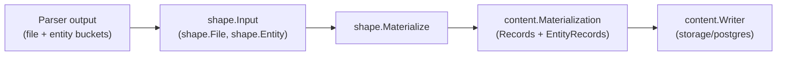

# Content Shape

## Purpose

`shape` converts parser-emitted file and entity payloads into the
`content.Materialization` rows that `content.Writer.Write` persists. It
centralizes the entity-bucket label mapping, `source_cache` snippet derivation,
and the byte limits that keep low-signal entity rows from bloating the content
store.

## Where this fits in the pipeline

The ingester or projector builds a `shape.Input` from parser output, calls
`Materialize`, and hands the result to a `content.Writer`.

## Ownership boundary

This package owns content shaping only:

- translating parser buckets into `content.EntityRecord` values
- deriving each entity's id via `content.CanonicalEntityIDWithMetadata` (which
  falls back to `content.CanonicalEntityID` outside its narrow manifest
  dependency gate)
- extracting `source_cache` snippets from parser source or file body
- preserving per-entity line, language, artifact, template, IaC, and metadata
  fields for the content store
- applying byte limits to oversized low-signal entities

It does not own graph writes, the Postgres schema, queue operations, or fact
loading. All of those belong to `internal/projector`, `internal/collector`, or
`internal/storage/postgres`.

## Exported surface

See `doc.go` for the godoc contract.

Input types:

- `Input` — top-level shaping request: `RepoID`, `SourceSystem`, `Files []File`.
- `File` — one parser-shaped file: `Path`, `Body`, `Digest`, `Language`,
  `ArtifactType`, `TemplateDialect`, `IACRelevant`, `CommitSHA`, `Metadata`,
  `Deleted`, `EntityBuckets map[string][]Entity`.
- `Entity` — one parser-shaped entity: `Name`, `LineNumber`, `EndLine`,
  byte-range pointers, `Language`, `ArtifactType`, `TemplateDialect`,
  `IACRelevant`, `Source`, `Metadata`, `Deleted`.

Entry point:

- `Materialize(input Input) (content.Materialization, error)` — walks every
  file in `Input.Files`, builds one `content.Record` per file, extracts all
  entity buckets in fixed order, derives `content.EntityRecord` values sorted
  by line number then label then name, and returns the assembled
  `content.Materialization`. Returns an error when `RepoID` is empty or any
  file `Path` is empty.

## Dependencies

- `internal/content` — `Materialization`, `EntityRecord`, `CanonicalEntityID`,
  `CanonicalEntityIDWithMetadata`. No other internal imports. No external
  imports beyond the standard library.

## Telemetry

None. Callers (ingester or projector workers) add duration and outcome metrics
around the `Materialize` call.

## Gotchas / invariants

- `contentEntityBuckets` order is fixed. Reordering the bucket list changes the
  persisted row sequence and produces diff churn in existing content-store rows.
  Add new buckets at the end.
- Terraform buckets cover authored configuration and parser evidence such as
  backends, imports, moved blocks, removed blocks, checks, lockfile providers,
  and declared PagerDuty module/tfvars evidence. Keep those labels in step with
  collector snapshot mapping and projector label mapping.
- `entityLabelForBucket` rewrites `Module` rows whose parser metadata carries
  `module_kind == "protocol_implementation"` to the `ProtocolImplementation`
  label. This handles Elixir `defimpl` blocks.
- `entitySourceCache` prefers the parser-supplied `Source` field for labels in
  `sourceFieldContainsCode`, then falls back to a file-body line range, then
  falls back to `item.Source` again for non-code labels. The distinction matters
  for IaC entity types that carry structured YAML rather than source code.
- `limitEntitySourceCache` truncates `Variable` snippets at 4096 bytes and the
  content-only GitHub Actions workflow `File` entity at 32 KiB, and
  writes `source_cache_truncated`, `source_cache_original_bytes`, and
  `source_cache_limit_bytes` into entity metadata so API clients can detect the
  cut. Truncation is UTF-8-safe (`truncateUTF8ByBytes`).
- `entityEndLine` falls back in order: entity's own `EndLine`, next entity's
  `LineNumber - 1`, `startLine + 24` capped to total lines, then `startLine`
  when the body is empty. This means entities without an `EndLine` in the
  parser output get a bounded snippet rather than the rest of the file.
- Output ordering is deterministic: entities are sorted by line number, then
  label, then name before writing. Storage diffs stay stable across re-runs.
- `Materialize` mints each entity's id via
  `content.CanonicalEntityIDWithMetadata`, passing the cloned per-entity
  `Metadata` map used for the entity's other fields. For an in-scope manifest
  dependency Variable (npm, composer, cargo, gradle, maven, nuget, pypi, go,
  rubygems, pub, hex; non-lockfile, non-empty `section` in metadata) this
  mints a section-keyed, line-independent id via
  `content.CanonicalDependencyEntityID` instead of the legacy line-keyed
  `content.CanonicalEntityID` — see `internal/content/README.md`'s Gotchas
  section for the full gate and why it must not be widened casually.

## Dependency identity (#5357, extended by #5507)

`Materialize` and `internal/projector`'s `buildContentEntityRecord`
`entity_id` fallback share one identity rule via
`content.CanonicalEntityIDWithMetadata` so a manifest dependency Variable's
content-entity id is keyed by `(repoID, path, "variable", section, name[,
discriminator])` instead of the source line. This makes reordering
dependencies within a manifest section a no-op for identity — the previous
line-keyed scheme churned every dependency's id whenever an unrelated edit
shifted lines in the same section.

`#5357` proved this for `package.json`/`composer.json`, where `(section,
name)` alone is already unique (a JSON object key). `#5507` extended the
scheme to cargo, gradle, maven, nuget, pypi, go (gomod), rubygems, pub, and
hex — for cargo, gradle, maven, nuget, pypi, and go, `(section, name)` alone
is NOT always unique (see `content.dependencyIdentityDiscriminator`'s doc
comment for the concrete manifest feature each one's added discriminator
defends: Cargo package aliasing, Gradle same-coordinate-different-version,
Maven classifier/type, NuGet multi-targeting conditions, pypi extras/markers,
and go's non-deduplicating `modfile.Parse` admitting the same module required
twice at different versions in an untidied go.mod). Only rubygems, pub, and
hex need no discriminator: each one's own tooling or file format already
guarantees per-section name uniqueness. `swift` was deliberately left out of
scope — its only current producer (`Package.resolved`) is a lockfile, already
excluded by the condition below.

The gate is intentionally narrow: `metadata["config_kind"] ==
"dependency"` alone is also set by lockfile parsers
(`package-lock.json`, `composer.lock`, `Gemfile.lock`, `pubspec.lock`,
`mix.lock`, `packages.lock.json`, `Pipfile.lock`, `poetry.lock`,
`Package.resolved`, and other lockfile flavors), which legitimately repeat a
package name multiple times per section — nested transitive dependency trees
can carry the same name at different versions. Collapsing those under
`(path, section, name)` would silently merge distinct dependency versions
into one identity. See `content.CanonicalEntityIDWithMetadata`'s doc comment
in `internal/content/dependency_identity.go` for the exact five conditions.

## Related docs

- `go/internal/content/README.md` — the `Writer` port and `Materialization` shape
- `docs/public/architecture.md` — pipeline and Postgres content store role
- `docs/public/reference/local-testing.md`

## GitHub Actions workflow content entity (#5568)

`Materialize` creates one content-only `File` entity for a workflow only when
the repository-relative path is exactly
`.github/workflows/<name>.yml` or `.github/workflows/<name>.yaml`. The path gate
rejects nested workflow subdirectories, paths that merely contain the directory
substring, and non-YAML suffixes. It is deliberately independent of the
parser's `artifact_type`: a valid workflow that a broad YAML parser labels as
an Ansible playbook remains reachable. The query-side GitHub Actions classifier
uses the same exact path contract.

The entity identity is
`CanonicalEntityID(repo_id, relative_path, "File", basename-without-extension, 1)`.
Its persisted artifact type is the canonical `github_actions_workflow`, and its
source comes from the whole workflow file rather than a parser symbol bucket.
This package owns that content row only; it does not add a parser fact, graph
node, graph edge, or reducer projection.

Retraction follows the existing writer contract. A deleted or renamed old path
is represented by a tombstoned `content.Record`, which removes the old file and
its entities. A row carrying the legacy workflow artifact classification at a
now-ineligible path sets `Record.PurgeEntities`, which removes stale entities
without deleting the still-valid file. Eligible files participate in the
normal path-scoped stale-entity reap, whose keep-set contains the one fresh
canonical workflow entity id.

Workflow `source_cache` is hard-capped at 32 KiB using the shared UTF-8-safe
limiter. A truncated row carries `source_cache_truncated=true`, the original
byte count in `source_cache_original_bytes`, and `32768` in
`source_cache_limit_bytes`. Entity context treats that row as incomplete
relationship truth: `relationships_complete=false`,
`partial_reasons=["github_actions_source_cache_truncated"]`, and
`result_limits.truncated=true`. Multi-job workflow extraction walks jobs in
stable name order. Over-limit entity-context relationships are sorted before
the deterministic 50-row cap and retain the pre-cap count in
`result_limits.relationship_count`.

Performance Evidence: the measured 38-workflow local corpus (29 repository
workflows plus 9 fixture workflows) had p50 2,290 bytes, p95 14,602 bytes,
maximum 16,172 bytes, and 162,839 total bytes. A same-data Postgres 16 shim
replicated the 29 repository workflows across 100 repositories (2,900 rows,
15,901,500 source bytes). Blank `source_cache` wrote in 11.107 ms, generated
1,989,650 WAL bytes, and occupied 876,544 total bytes. Unbounded full source
took 1,326.369 ms, generated 59,215,648 WAL bytes, and occupied 18,710,528
bytes (8,855,552 table bytes and 9,854,976 index bytes, including 9,420,800 for
the source GIN index). The unbounded shape therefore cost about 0.454 ms per
workflow, 57,225,998 additional WAL bytes, and 17,833,984 additional disk
bytes in this representative write. The 32 KiB cap preserves every measured
workflow while bounding future outliers; focused exact-boundary, +1-byte,
UTF-8, and repeat-materialization tests prove the limiter's output.

No-Observability-Change: no metric, span, log key, worker, queue, graph write,
or runtime knob is added. Operators retain the existing content-writer
`prepare_files`/entity-upsert stage logs and instrumented Postgres query
duration signals. Clients receive the existing bounded-response metadata plus
the stable source truncation metadata and partial-reason disclosure above.

## Performance Evidence: entity-cap debloat (#3676)

**Change summary.** A per-file entity cap was introduced in `Materialize` to
prevent content-entity explosion on minified and generated files. Transitive
lockfile dependency entries are fully preserved.

- `MaxFileEntityCount = 10_000` — when any single file's total entity count
  across all buckets exceeds 10,000 the entity records for that file are
  skipped entirely and the content body is still written. Representative
  examples: `ckeditor.js` produced 24,720 entities; `yacht.class.php` produced
  53,830 entities. Both now skip entity extraction while the file body remains
  available for BM25 full-text search.

- **Transitive lockfile dependency entries are preserved.** The lockfile
  variable cap was removed because transitive entries
  (`dependency_depth` ≥ 2, `direct_dependency=false`) feed the reducer's
  `PackageConsumptionDecision` for supply-chain impact analysis and security
  alerts. Silently dropping them destroys dependency truth at scale. The real
  source of lockfile entity explosion is 4× corpus nesting (#3677), not a
  shape-layer concern.

- **Stale entity retraction via `PurgeEntities`.** When the per-file entity cap
  fires for a path, `content.Record.PurgeEntities` is set to `true`. The
  content writer runs a path-scoped `DELETE FROM content_entities` for that
  `repo_id + relative_path` before upserting the content file row, so
  previously-indexed entity rows are not left queryable as orphans after
  re-indexing an oversized file.

No-Regression Evidence: the cap operates as a bounded pre-scan over entity
slices that are already resident in memory by the time `Materialize` is called;
there is no additional IO, no Cypher, and no Postgres interaction beyond the
retraction delete. The file-level cap is O(1) (a length check before sorting).
Downstream fact volume is reduced for minified/generated files, so net
wall-clock ingestion time improves. A full-corpus re-measurement against the
pre-cap baseline is pending and will be added to this note when available.

Observability Evidence: `file_entity_cap_hit_count` is emitted as a structured
field on the `materialize snapshot-stage` slog line in
`go/internal/collector/git_snapshot_native.go`. An operator can filter for
`file_entity_cap_hit_count>0` to identify which repositories and files are
hitting the cap during a sync run. When `PurgeEntities` fires, the content
writer logs the path-scoped entity delete at the `prepare_files` stage. No new
metrics or spans are required because the cap is a content-shaping guard, not
a separate pipeline stage; existing ingester duration and outcome metrics cover
the call site.
