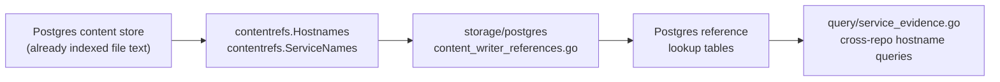

# Contentrefs

## Purpose

`contentrefs` extracts generic, queryable references from indexed file content
for Postgres-side lookup tables. The extractors — `Hostnames`,
`HostnameCandidates`, and `ServiceNames` — find runtime endpoints,
cross-repository service tokens, and explainable rejected hostname-shaped
tokens without indexing every plain word in a file. They run against content
that has already been stored; they never open files, query Postgres, or write
to the graph.

## Where this fits

## Ownership boundary

`contentrefs` owns the pattern extraction logic over string content. It does
not own content storage, Postgres writes, graph writes, or telemetry
instrumentation. Those belong to `internal/storage/postgres` and the calling
projector stages. This package has no internal-package imports and no I/O.

## Exported surface

- `Hostnames(content string) []string` — returns normalized lowercase exact
  hostnames that match the pattern of a runtime or API endpoint rather than a
  file name, config key, code property chain, or test matcher. Output is sorted
  and deduplicated.
- `HostnameCandidates(content string) []HostnameCandidate` — returns sorted
  hostname-shaped candidates classified as exact hostname evidence, rejected
  config-key evidence, rejected field-path evidence, or ambiguous
  more-evidence-needed support.
- `ServiceNames(content string) []string` — returns normalized lowercase
  hyphenated names with at least three parts that look like cross-repository
  service references. Output is sorted and deduplicated.

See `doc.go` for the godoc contract.

## Dependencies

Standard library only (`regexp`, `sort`, `strings`). No internal packages.

## Telemetry

None. The calling projector stage emits metrics for the reference write path.

## Gotchas / invariants

- Both extractors are line-scoped and key-gated before the main regex runs.
  `Hostnames` requires a line to contain a known hostname-context key or a
  `://` substring before attempting hostname extraction. `ServiceNames` requires
  a line to contain one of the service-name keywords. Lines that fail the gate
  are skipped entirely, keeping extraction noise low.
- `Hostnames` false-positive filtering removes: file extension TLDs (`.jpg`,
  `.json`, `.ts`, `.yaml`, etc.), code-shaped TLDs (`.endpoint`, `.host`,
  `.hostname`, etc.), dotted config keys, fixture field paths, segments with
  CamelCase characters, and JS/TS prototype keyword segments such as `exports`,
  `prototype`, `constructor`. `HostnameCandidates` returns those rejected or
  ambiguous tokens with reason codes so read surfaces can explain why they were
  not promoted.
- `ServiceNames` candidates must have at least three hyphen-separated parts
  and a total length of 5 to 100 characters. Double hyphens are rejected. The
  fixed denylist — `content-type`, `max-old-space-size`, `pull-requests` — is
  always excluded.
- Both extractors deduplicate with an in-loop map and sort before returning.
  Callers can rely on stable ordering for Postgres upsert idempotency.
- Neither function modifies its input string or returns errors. An empty
  content string returns an empty slice.

## Related docs

- `docs/public/architecture.md` — pipeline and ownership table
- `docs/public/reference/http-api.md` — service evidence query surface that
  consumes the extracted references
