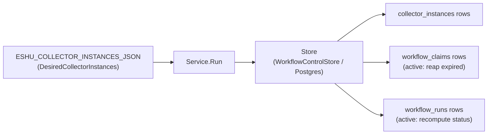
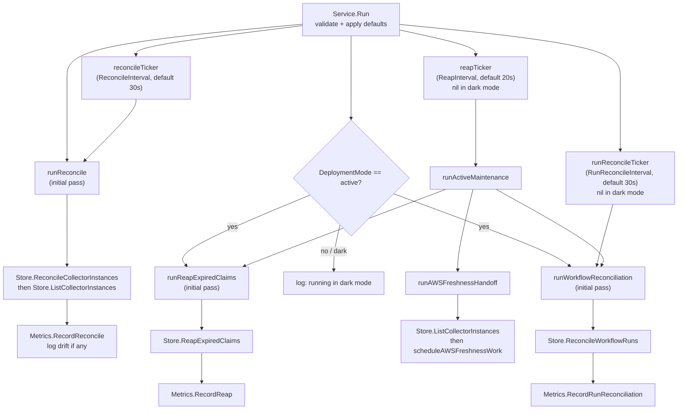

# Coordinator

## Purpose

`internal/coordinator` owns the workflow coordinator's collector reconcile,
workflow-run reconciliation, AWS freshness handoff, and expired-claim reap
loops. `Service.Run` ticks through discrete operations — collector-instance and
scheduled-work planning reconciliation (always), workflow-run progress
reconciliation (active mode only), AWS freshness handoff (active mode only),
and expired-claim reaping (active mode only) — against a narrow `Store`
interface backed by Postgres. The package also owns
`ESHU_WORKFLOW_COORDINATOR_*` env parsing and OTEL instrument registration for
the coordinator.

## Where this fits in the pipeline

## Internal flow

## Lifecycle

`Service.Run` performs an initial synchronous pass for all enabled operations,
then enters a `select` loop. The `reconcileTicker` fires `runReconcile` on every
tick. In active mode, `runReconcileTicker` fires `runWorkflowReconciliation`
independently so slow scheduled-work planning cadences do not leave completed
runs stuck in stale `collection_pending` state. The `reapTicker` also runs
active maintenance: expired-claim reaping, AWS freshness handoff from durable
collector instances, and workflow-run reconciliation. That keeps webhook-driven
AWS freshness and terminal run status moving even when scheduled scan planning
uses a long reconcile interval. The `reapTicker` and `runReconcileTicker` are
nil in dark mode — `tickerChan(nil)` returns a nil channel the `select` never
picks. Context cancellation (`ctx.Done`) exits the loop cleanly.

`Config.Validate` runs at `LoadConfig` time and again at `Service.Run` entry.
Defaults are applied by `withDefaults` before validation, so missing env vars
fall back to defaults rather than failing; malformed values fail fast.

`Service.Clock` is a testable time source. Production wiring leaves it nil;
`now()` falls back to `time.Now()`.

## Exported surface

- `Store` — the narrow durable interface `Service` depends on:
  `ReconcileCollectorInstances`, `ListCollectorInstances`, `CreateRun`,
  `CreateRunWithWorkItemsIfNoOpenTargets`, `EnqueueWorkItems`,
  `ReapExpiredClaims`, and `ReconcileWorkflowRuns`. Implemented by
  `storage/postgres.WorkflowControlStore`.
- `Service` — the long-running loop; wire `Config`, `Store`, `Metrics`, and
  `Logger` then call `Service.Run`.
- `Config` — runtime settings: `DeploymentMode`, `ClaimsEnabled`,
  `ReconcileInterval`, `RunReconcileInterval`, `ReapInterval`,
  `ClaimLeaseTTL`, `HeartbeatInterval`, `ExpiredClaimLimit`,
  `ExpiredClaimRequeueDelay`, `CollectorInstances`.
- `LoadConfig(getenv)` — parses all `ESHU_WORKFLOW_COORDINATOR_*` and
  `ESHU_COLLECTOR_INSTANCES_JSON` env vars into a validated `Config`.
- `Metrics` — recording interface: `RecordReconcile`, `RecordReap`,
  `RecordRunReconciliation`.
- `NewMetrics(meter)` — registers OTEL counters, histograms, and observable
  gauges against the `eshu_dp_workflow_coordinator_` prefix.
- `ReconcileObservation`, `ReapObservation`, `RunReconciliationObservation` —
  value types passed to `Metrics` recording methods.
- `TerraformStateWorkPlanner` — plans Terraform-state collection runs from
  resolved discovery candidates. `BackendFacts` returns both Terraform backend
  block candidates and Terragrunt remote_state candidates resolved into their
  underlying backend kind, so the planner stays on one scheduler shape.
- `OCIRegistryWorkPlanner` — plans OCI registry collection runs from configured
  repository targets without opening registry connections. Each target becomes
  one claimable work item keyed by the normalized registry repository scope.
- `PackageRegistryWorkPlanner` — plans package-registry collection runs from
  configured package/feed targets and optional active owned package evidence
  without opening registry connections. Each configured or derived target
  becomes one claimable work item keyed by its normalized `scope_id`.
- `VulnerabilityIntelligenceWorkPlanner` — plans vulnerability-intelligence
  collection runs from configured source targets and optional active owned
  package evidence. Derived OSV targets are limited to exact owned dependency
  versions; manifest ranges remain partial evidence and are skipped for exact
  source collection.
- `OwnedPackageTargetReader` — optional active-mode dependency target reader
  used by `Service` when package-registry or vulnerability-intelligence
  instances enable `derive_from_owned_packages`.
- `AWSScheduledWorkPlanner` — plans scheduled AWS collection runs from the
  configured target scopes without requiring a separate provider webhook when
  the AWS collector configuration sets `scheduled_scan_enabled=true`. Each
  valid `(account_id, region, service_kind)` tuple becomes one claimable work
  item. Regional service families run only in real AWS regions. Global-only
  service families (`cloudfront`, `iam`, `route53`) run only in `aws-global`.
  Invalid configured pairings are recorded in the workflow run
  `requested_scope_set.skipped_targets` payload with a stable reason.
- `AWSFreshnessWorkPlanner` — plans targeted AWS collection runs from claimed
  freshness triggers. Each unique `(account_id, region, service_kind)` target
  becomes one normal AWS collector claim.
- `AWSFreshnessTriggerStore` — claim, handed-off, and failed-state operations
  for the coalesced `aws_freshness_triggers` handoff queue.

## Dependencies

- `internal/workflow` — `DesiredCollectorInstance`, `CollectorInstance`,
  `Claim`, and default accessors; used throughout `Store` and `Config`.
- `internal/scope` — `CollectorKind` used by `Config` and
  `DesiredCollectorInstance`.
- `internal/telemetry` — `MetricDimensionOutcome` attribute key used in
  `otelMetrics`.
- `internal/collector/ociregistry` — OCI repository identity normalization used
  by the claim planner.
- `internal/collector/awscloud/freshness` — normalized AWS freshness trigger
  and target identity used by the AWS freshness planner.

## Telemetry

OTEL instruments registered under `eshu_dp_workflow_coordinator_`:

| Instrument | Kind | Description |
|---|---|---|
| `reconcile_total` | counter | reconcile-loop executions labeled by `outcome` |
| `reconcile_duration_seconds` | histogram | reconcile-loop wall time |
| `reap_total` | counter | expired-claim reap passes labeled by `outcome` |
| `reap_duration_seconds` | histogram | reap-pass wall time |
| `run_reconcile_total` | counter | workflow-run reconciliation passes labeled by `outcome` |
| `run_reconcile_duration_seconds` | histogram | run-reconciliation wall time |
| `desired_collector_instances` | gauge | count from `Config.CollectorInstances` |
| `durable_collector_instances` | gauge | count returned by `Store.ListCollectorInstances` |
| `collector_instance_drift` | gauge | absolute difference between desired and durable |
| `last_reaped_claims` | gauge | claims reaped in the most recent pass |
| `last_reconciled_runs` | gauge | runs recomputed in the most recent pass |

Outcome labels: `success`, `reconcile_error`, `state_read_error` for reconcile;
`success` and `error` for reap and run-reconcile.

Structured log events: startup mode message (info), collector instance drift
warning (`collector_instance_drift_detected`, fields
`desired_collector_instances`, `durable_collector_instances`,
`collector_instance_drift`).

## Operational notes

- `eshu_dp_workflow_coordinator_collector_instance_drift > 0` means the desired
  collector-instance set is not fully durable. Check Postgres connectivity and
  structured log warnings before concluding the config is wrong.
- `eshu_dp_workflow_coordinator_reconcile_total{outcome="reconcile_error"}` or
  `{outcome="state_read_error"}` rising means the Postgres store is unavailable
  or returning errors. Check `eshu_dp_postgres_query_duration_seconds`.
- `eshu_dp_workflow_coordinator_reap_total` and
  `eshu_dp_workflow_coordinator_run_reconcile_total` are zero in dark mode.
  Confirm `ESHU_WORKFLOW_COORDINATOR_DEPLOYMENT_MODE=active` before
  investigating metric absence.
- `ESHU_WORKFLOW_COORDINATOR_RECONCILE_INTERVAL` controls desired state and
  scheduled-work planning. `ESHU_WORKFLOW_COORDINATOR_RUN_RECONCILE_INTERVAL`
  controls workflow-run status freshness. Keep them separate when scheduled
  collectors should run infrequently but `/api/v0/index-status` should reflect
  completed workflow work promptly.
- `last_reaped_claims` spiking above `ExpiredClaimLimit` is not possible; that
  limit caps each reap pass. Repeated spikes at the limit indicate collectors
  are not completing claims within the lease TTL.
- Derived package and vulnerability target planning is visible in
  `workflow_runs.requested_scope_set`. Package-registry derived entries include
  `derived=true` and `package_name`; vulnerability derived entries include
  `source`, `ecosystem`, `package_name`, and exact `version`. If a derivation
  enabled instance plans no work, first check the owned dependency fact query,
  then confirm the dependency evidence is active and exact enough for the
  collector family.

## Extension points

No-Regression Evidence: owned package target derivation is covered by
`go test ./internal/coordinator -run 'Test(PackageRegistryWorkPlannerDerivesNPMTargetsFromOwnedPackageEvidence|VulnerabilityIntelligenceWorkPlannerDerivesOSVTargetsForExactOwnedVersions|ServiceRunActiveModePassesOwnedPackageEvidenceTo(PackageRegistry|Vulnerability)Planner)' -count=1`.
The package-wide proof ran as part of
`go test ./internal/coordinator ./internal/workflow ./internal/storage/postgres ./internal/collector/packageregistry/packageruntime ./internal/collector/vulnerabilityintelligence/vulnruntime ./cmd/workflow-coordinator ./cmd/collector-package-registry ./cmd/collector-vulnerability-intelligence -count=1`.
This is a planning-only change: it adds bounded target rows from active owned
dependency evidence, keeps range dependencies out of exact OSV collection, and
does not change claim leases, worker counts, queue concurrency, reducer graph
writes, or NornicDB settings.

Observability Evidence: existing coordinator reconcile counters and duration
histograms, `workflow_runs.requested_scope_set`, `workflow_work_items` status
and failure columns, collector claim status, and `/api/v0/index-status` show
whether derived targets were planned, claimed, completed, retried, or failed.
No metric labels gained package names, versions, feed URLs, or credential
material.

- `Store` — substitute any implementation satisfying the four-method interface
  for testing or future backends.
- `Metrics` — `NewMetrics` is the OTEL implementation; a nil or recording stub
  works for isolated tests. `Service` guards all metric calls with nil checks.
- `Service.Clock` — inject a custom clock for deterministic time-based tests.

## Gotchas / invariants

- `Config.Validate` rejects active mode without `ClaimsEnabled=true` and at
  least one enabled claim-capable collector instance. The binary exits if this
  is violated.
- AWS freshness planning rejects targets that are not present in the collector
  instance `target_scopes`; provider events cannot widen configured AWS access.
- Scheduled workflow creation for Terraform-state, OCI registry,
  package-registry, AWS scheduled scans, and AWS freshness uses
  `(collector_kind, collector_instance_id, scope_id, acceptance_unit_id)` as the
  durable open-target key. If a non-terminal run already owns the same target,
  the coordinator skips duplicate work instead of creating another run.
- AWS scheduled planning filters invalid global-region pairings before work-item
  creation. This prevents guaranteed-bad claims such as
  `aws-global`/`lambda` and regional `iam` while preserving valid global
  families in `aws-global`. Inspect
  `workflow_runs.requested_scope_set.skipped_targets` for skipped tuples and
  reason values (`regional_service_aws_global`,
  `global_service_regional_region`). When every configured tuple is invalid,
  the coordinator records a completed audit-only run with those skipped targets
  and no work items.
- AWS freshness handoff claims at most 100 coalesced triggers per reconcile
  tick and uses the existing workflow work-item queue; it does not bypass
  collector claim fairness or create graph writes directly.
- `HeartbeatInterval` must be strictly less than `ClaimLeaseTTL` or
  `Validate` returns an error.
- The reap ticker is nil in dark mode. `tickerChan(nil)` returns a nil channel
  that the `select` ignores — this is intentional and correct.
- `Metrics.RecordReap` and `Metrics.RecordRunReconciliation` are accessed via
  interface type assertions in `recordReap` and `recordRunReconciliation`
  because `Metrics` only declares `RecordReconcile`. If the wired `Metrics`
  does not implement the broader interface the recording calls are silently
  skipped. `otelMetrics` (returned by `NewMetrics`) implements all three.
- This package only schedules families with explicit planners. Terraform-state,
  OCI registry, package registry, and AWS scheduled scans have planners today;
  other collector families remain instance-reconciled only until they define a
  bounded work unit.

## Evidence

No-Regression Evidence: `go test ./internal/coordinator -run 'TestAWSScheduledWorkPlanner|TestServiceRunActiveModePersistsAuditOnlyAWSScheduledRun' -count=1`
covers scheduled AWS target planning, invalid `aws-global` pair filtering, and
the audit-only run recorded when all configured tuples are invalid.

No-Regression Evidence: `go test ./internal/coordinator -run 'TestLoadConfigParsesActiveRuntimeControls|TestServiceRunActiveModeReconcilesRunsOnDedicatedInterval' -count=1`
proves workflow-run status reconciliation can tick faster than scheduled-work
planning, which keeps remote all-collector Compose from waiting up to the
scheduled scan interval after all claims complete.

No-Regression Evidence: `go test ./internal/coordinator ./internal/storage/postgres -run 'TestServiceRunActiveModeSkipsAWSWorkWhenPriorScheduledTargetIsOpen|TestServiceRunActiveModeSchedulesAWSWorkWithoutFreshnessTriggers|TestServiceRunActiveModeSchedulesOCIRegistryWork|TestServiceRunActiveModeSchedulesPackageRegistryWork|TestServiceRunActiveModeSkipsAWSFreshnessWhenPriorTargetIsOpen|TestRunAWSFreshnessHandoffUsesDurableInstancesBetweenReconciles|TestRunActiveMaintenanceReconcilesWorkflowRunsBetweenReconciles|TestWorkflowControlStoreGuardedRunSkipsOpenScheduledTarget|TestWorkflowControlStoreGuardedRunCreatesEligibleScheduledTarget' -count=1`
covers the open-target admission guard, AWS freshness handoff on the reap
cadence, and workflow-run reconciliation during active maintenance.
No-Regression Evidence: `go test ./internal/storage/postgres -run 'TestWorkflowControlStoreGuardedRun(SkipsSameRunTargetReplay|SkipsTerminalSameRunReplay)' -count=1`
first reproduced same-run target replay and terminal-run append on
preserved-volume restart, then proved deterministic scheduled run ids do not
append duplicate or newly discovered target work after the run is terminal.

Observability Evidence: AWS scheduled runs persist valid planned targets and
skipped invalid configured tuples in `workflow_runs.requested_scope_set`; the
existing workflow coordinator reconcile metrics and run rows show whether the
planner generated work or intentionally skipped invalid pairings. Workflow-run
freshness remains visible through `eshu_dp_workflow_coordinator_run_reconcile_*`
metrics, `workflow_runs`, `workflow_run_completeness`, and
`/api/v0/index-status`. Duplicate target suppression emits
`reason=target_already_planned`, `planned_work_items`, `enqueued_work_items`,
`skipped_work_items`, and `trigger_kind` in structured coordinator logs.

## Related docs

- `docs/public/deployment/service-runtimes.md`
- `docs/public/reference/telemetry/index.md`
- `go/internal/workflow/README.md`
- `go/cmd/workflow-coordinator/README.md`
