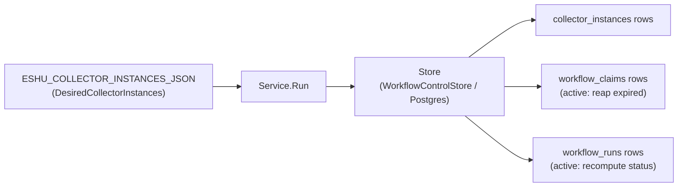
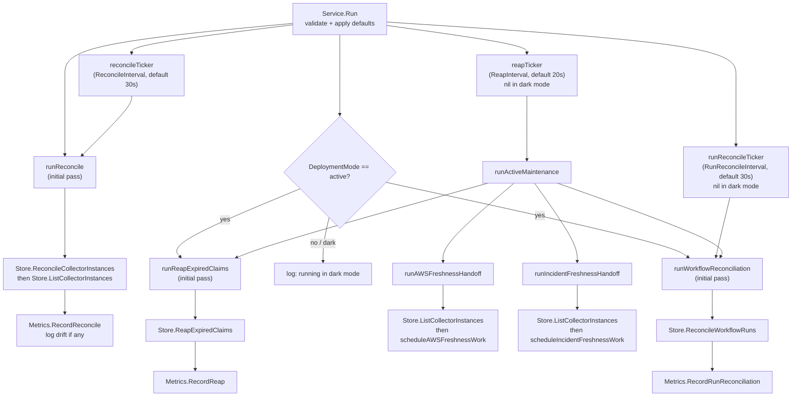

# Coordinator

## Purpose

`internal/coordinator` owns collector reconcile, the collector egress gate,
workflow-run reconciliation, AWS and incident freshness handoff, and
expired-claim reap loops. `Service.Run` ticks through collector-instance and
scheduled-work planning reconciliation, active-mode workflow-run progress, AWS
and incident freshness handoff, and expired-claim reaping against a narrow
`Store` backed by Postgres. The package also owns
`ESHU_WORKFLOW_COORDINATOR_*` env parsing and coordinator OTEL instruments.

## Where this fits in the pipeline

## Internal flow

## Lifecycle

`Service.Run` performs an initial synchronous pass for all enabled operations,
then enters a `select` loop. The `reconcileTicker` fires `runReconcile` on every
tick. In active mode, `runReconcileTicker` fires `runWorkflowReconciliation`
independently so slow scheduled-work planning cadences do not leave completed
runs stuck in stale `collection_pending` state. The `reapTicker` also runs
active maintenance: expired-claim reaping, AWS freshness handoff from durable
collector instances, incident freshness handoff from durable collector
instances, and workflow-run reconciliation. That keeps webhook-driven AWS,
PagerDuty, and Jira freshness plus terminal run status moving even when
scheduled scan planning uses a long reconcile interval. The `reapTicker` and
`runReconcileTicker` are nil in dark mode — `tickerChan(nil)` returns a nil
channel the `select` never picks. Context cancellation (`ctx.Done`) exits the
loop cleanly.

`Config.Validate` runs at `LoadConfig` time and again at `Service.Run` entry.
Defaults are applied by `withDefaults` before validation, so missing env vars
fall back to defaults rather than failing; malformed values fail fast. Enabled
GCP collector instances with `claims_enabled=true` also fail validation because
the coordinator has no GCP workflow scheduler yet.

`Service.Clock` is a testable time source. Production wiring leaves it nil;
`now()` falls back to `time.Now()`.

## Exported surface

- `Store` — the narrow durable interface `Service` depends on:
  `ReconcileCollectorInstances`, `ListCollectorInstances`, `CreateRun`,
  `CreateRunWithWorkItemsIfNoOpenTargets`, `EnqueueWorkItems`,
  `ReapExpiredClaims`, and `ReconcileWorkflowRuns`. Implemented by
  `storage/postgres.WorkflowControlStore`.
- `Service` — the long-running loop; wire `Config`, `Store`, `Metrics`, and
  `Logger` then call `Service.Run`.
- `Config` — runtime settings: `DeploymentMode`, `ClaimsEnabled`,
  `ReconcileInterval`, `RunReconcileInterval`, `ReapInterval`,
  `ClaimLeaseTTL`, `HeartbeatInterval`, `ExpiredClaimLimit`,
  `ExpiredClaimRequeueDelay`, `CollectorEgressPolicy`, `CollectorInstances`.
- `LoadConfig(getenv)` — parses all `ESHU_WORKFLOW_COORDINATOR_*` and
  `ESHU_COLLECTOR_INSTANCES_JSON` env vars into a validated `Config`.
- `Metrics` — recording interface: `RecordReconcile`, `RecordReap`,
  `RecordRunReconciliation`.
- `NewMetrics(meter)` — registers OTEL counters, histograms, and observable
  gauges against the `eshu_dp_workflow_coordinator_` prefix.
- `ReconcileObservation`, `ReapObservation`, `RunReconciliationObservation` —
  value types passed to `Metrics` recording methods.
- `TerraformStateWorkPlanner` — plans Terraform-state collection runs from
  resolved discovery candidates. `BackendFacts` returns both Terraform backend
  block candidates and Terragrunt remote_state candidates resolved into their
  underlying backend kind, so the planner stays on one scheduler shape.
- `OCIRegistryWorkPlanner` — plans OCI registry collection runs from configured
  repository targets without opening registry connections. Each target becomes
  one claimable work item keyed by the normalized registry repository scope.
- `PackageRegistryWorkPlanner` — plans package-registry collection runs from
  configured package/feed targets and optional active owned package evidence
  without opening registry connections. Each configured or derived target
  becomes one claimable work item keyed by its normalized `scope_id`. Derived
  package identities cover npm, PyPI, Go modules, Maven, NuGet, Composer,
  RubyGems, and Cargo while preserving per-instance target limits.
- `VulnerabilityIntelligenceWorkPlanner` — plans vulnerability-intelligence
  collection runs from configured source targets and optional active owned
  package evidence. Derived OSV targets are limited to exact owned dependency
  versions for npm, PyPI, Go modules, Maven, NuGet, Composer, RubyGems, Cargo,
  Pub, Hex, and Swift. Manifest ranges, aliases, workspace references,
  VCS/path/local references, branch pins, malformed versions, and Swift rows
  without a usable source URL remain partial evidence and are skipped with
  reason-coded aggregate counts by ecosystem. Exact package-version queries are
  batched across packages within one ecosystem while keeping scope IDs below
  indexed workflow tuple limits.
- `SBOMAttestationWorkPlanner` — plans hosted SBOM and attestation collection
  runs from configured document or OCI-referrer targets. Each target becomes one
  claimable work item keyed by `scope_id`.
- `CICDRunWorkPlanner` — plans CI/CD run collection from configured GitHub
  Actions repository targets. Each target becomes one claimable work item keyed
  by `scope_id`, and `requested_scope_set` omits credential environment names.
- `ScannerWorkerWorkPlanner` — plans scanner-worker source-evidence work from
  explicit configured targets. The planner only stores the analyzer, target
  kind, and `scope_id` in workflow metadata; runtime-local roots and artifact
  locators stay in the worker configuration.
- `PagerDutyWorkPlanner` — plans PagerDuty incident-context collection runs
  from configured account or service-allowlist targets. Each target becomes one
  claimable work item keyed by `scope_id`, and `requested_scope_set` omits
  token environment references, incident URLs, service IDs, and titles.
- `JiraWorkPlanner` — plans Jira work-item evidence collection runs from
  configured Jira Cloud site targets without resolving credential environment
  variables. Each target becomes one claimable work item keyed by `scope_id`.
- `PrometheusMimirWorkPlanner` — plans Prometheus/Grafana Mimir metric-metadata
  collection runs from the instance `configuration.targets[]` list. Each
  `enabled` target becomes one claimable work item keyed by `scope_id`; disabled
  targets, empty configuration, and an empty target list plan no work. The
  fairness key partitions per target scope, and `requested_scope_set` omits
  token and tenant environment references.
- `TempoWorkPlanner` — plans Grafana Tempo trace-signal collection runs from
  `configuration.targets[]`. Each enabled target becomes one claimable work item
  keyed by `scope_id`; disabled targets are skipped, and `requested_scope_set`
  omits token environment references. The per-target `FairnessKey` is
  `tempo:<instance_id>:<scope_id>` so concurrent reconciles cannot admit two
  open claims for the same target.
- `GrafanaWorkPlanner` — plans Grafana observability metadata collection runs
  from configured `configuration.targets[]` without resolving credential
  environment variables. Each `enabled` target becomes one claimable work item
  keyed by `scope_id`; disabled targets are skipped, the per-target fairness key
  is `grafana:<instance_id>:<target instance_id|scope_id>`, and
  `requested_scope_set` omits `token_env`, `base_url`, and resource limits.
- `LokiWorkPlanner` — plans Grafana Loki observability collection runs from the
  `configuration.targets[]` array. Each `enabled` target becomes one claimable
  work item keyed by `scope_id` with a per-target fairness key
  (`loki:<instance_id>:<scope_id>`); disabled targets are skipped and
  `requested_scope_set` omits token environment references.
- `OwnedPackageTargetReader` — optional active-mode dependency target reader
  used by `Service` when package-registry or vulnerability-intelligence
  instances enable `derive_from_owned_packages`.
- `OSPackageAdvisoryTargetReader` and `SBOMComponentAdvisoryTargetReader` —
  optional active-mode installed-evidence readers used by
  vulnerability-intelligence instances that enable
  `derive_from_installed_evidence`. OS package reads come from active
  `vulnerability.os_package` facts; SBOM component reads come from active
  attached `sbom.component` facts whose attachment evidence is active for the
  same scope.
- `AWSScheduledWorkPlanner` — plans scheduled AWS collection runs from the
  configured target scopes without requiring a separate provider webhook when
  the AWS collector configuration sets `scheduled_scan_enabled=true`. Each
  valid `(account_id, region, service_kind)` tuple becomes one claimable work
  item. Regional service families run only in real AWS regions. Global-only
  service families (`cloudfront`, `iam`, `route53`) run only in `aws-global`.
  Invalid configured pairings are recorded in the workflow run
  `requested_scope_set.skipped_targets` payload with a stable reason.
- `AWSFreshnessWorkPlanner` — plans targeted AWS collection runs from claimed
  freshness triggers. Each unique `(account_id, region, service_kind)` target
  becomes one normal AWS collector claim.
- `AWSFreshnessTriggerStore` — claim, handed-off, and failed-state operations
  for the coalesced `aws_freshness_triggers` handoff queue.
- `IncidentFreshnessTriggerStore` — claim, handed-off, and failed-state
  operations for PagerDuty and Jira webhook wake-ups in
  `incident_freshness_triggers`.

## Dependencies

- `internal/workflow` — `DesiredCollectorInstance`, `CollectorInstance`,
  `Claim`, and default accessors; used throughout `Store` and `Config`.
- `internal/scope` — `CollectorKind` used by `Config` and
  `DesiredCollectorInstance`.
- `internal/telemetry` — `MetricDimensionOutcome` attribute key used in
  `otelMetrics`.
- `internal/collector/ociregistry` — OCI repository identity normalization used
  by the claim planner.
- `internal/collector/scannerworker` — scanner-worker analyzer and target-kind
  contracts used by the source-evidence planner.
- `internal/collector/awscloud/freshness` — normalized AWS freshness trigger
  and target identity used by the AWS freshness planner.
- `internal/webhook` — normalized PagerDuty and Jira incident freshness
  triggers used by the coordinator handoff.
- `internal/governanceaudit` — validation-safe event envelope for denied or
  unavailable hosted collector and extension egress decisions that create no
  workflow row.

## Telemetry

OTEL instruments registered under `eshu_dp_workflow_coordinator_`:

| Instrument | Kind | Description |
|---|---|---|
| `reconcile_total` | counter | reconcile-loop executions labeled by `outcome` |
| `reconcile_duration_seconds` | histogram | reconcile-loop wall time |
| `reap_total` | counter | expired-claim reap passes labeled by `outcome` |
| `reap_duration_seconds` | histogram | reap-pass wall time |
| `run_reconcile_total` | counter | workflow-run reconciliation passes labeled by `outcome` |
| `run_reconcile_duration_seconds` | histogram | run-reconciliation wall time |
| `desired_collector_instances` | gauge | count from `Config.CollectorInstances` |
| `durable_collector_instances` | gauge | count returned by `Store.ListCollectorInstances` |
| `collector_instance_drift` | gauge | absolute difference between desired and durable |
| `last_reaped_claims` | gauge | claims reaped in the most recent pass |
| `last_reconciled_runs` | gauge | runs recomputed in the most recent pass |

Outcome labels: `success`, `reconcile_error`, `state_read_error` for reconcile;
`success` and `error` for reap and run-reconcile.

Structured log events: startup mode message (info), collector instance drift
warning, collector scheduling skips by egress policy, and component extension
scheduling skips by egress policy. Drift fields are
`desired_collector_instances`, `durable_collector_instances`, and
`collector_instance_drift`; collector egress skips include `collector_kind` and
`reason`; extension egress skips include `collector_kind`, `component_id`,
`instance_id`, and `reason`.

Denied or unavailable hosted collector and component-extension egress decisions
also append validation-safe governance audit events when a private audit sink is
wired. Events use `service_principal` actor class, hashed collector or
component scope, low-cardinality reason codes, and no provider URLs, source
IDs, account IDs, component paths, credentials, prompts, responses, or payloads.
Allowed collector and extension decisions do not append audit events because
the durable workflow rows, claim state, reconcile metrics, and status surfaces
already prove the allowed scheduling path.

## Operational notes

- `eshu_dp_workflow_coordinator_collector_instance_drift > 0` means the desired
  collector-instance set is not fully durable. Check Postgres connectivity and
  structured log warnings before concluding the config is wrong.
- `eshu_dp_workflow_coordinator_reconcile_total{outcome="reconcile_error"}` or
  `{outcome="state_read_error"}` rising means the Postgres store is unavailable
  or returning errors. Check `eshu_dp_postgres_query_duration_seconds`.
- `eshu_dp_workflow_coordinator_reap_total` and
  `eshu_dp_workflow_coordinator_run_reconcile_total` are zero in dark mode.
  Confirm `ESHU_WORKFLOW_COORDINATOR_DEPLOYMENT_MODE=active` before
  investigating metric absence.
- Keep `ESHU_WORKFLOW_COORDINATOR_RECONCILE_INTERVAL` separate from
  `ESHU_WORKFLOW_COORDINATOR_RUN_RECONCILE_INTERVAL`: one controls desired
  state and scheduled-work planning, the other controls status freshness.
- CI/CD run collector instances schedule through active-mode reconciliation;
  provider calls, rate-limit handling, artifact reads, and fact emission stay in
  the CI/CD run collector runtime.
- Hosted collector and extension egress policies filter work before claimable
  rows are planned. Missing or denied policy decisions create no claimable row;
  restricted mode requires allow rules, deny wins, and broad mode must be an
  explicit no-rule opt-in.
- If the private governance audit sink is unavailable during a denied or
  missing-policy decision, reconciliation returns an error after creating no
  claimable row. The next reconcile retries the same bucket.
- `last_reaped_claims` spiking above `ExpiredClaimLimit` is not possible; that
  limit caps each reap pass. Repeated spikes at the limit indicate collectors
  are not completing claims within the lease TTL.
- Scanner-worker runtime health is not enough to prove source evidence. An
  enabled `scanner_worker` collector instance needs an analyzer-specific target
  list so the coordinator can create claimable work; completed claims must emit
  source facts or warning facts before remote evidence marks the collector row
  `pass`.
- Disabled PagerDuty and Jira collector instances are accepted as registrations
  when their identity, kind, mode, and JSON shape are valid. Private target
  fields and the claim-capable flag may remain set while disabled; enabled
  instances are still fully target-validated before reconciliation and
  planning.
- GCP collector instances may enable claims only when their configuration sets
  `live_collection_enabled=true` and contains at least one enabled bounded
  scope. The planner creates workflow rows only; it does not resolve
  credentials, call Google Cloud APIs, or change Helm defaults.
- Derived package and vulnerability target planning is visible in
  `workflow_runs.requested_scope_set` using bounded `target_class`,
  `source_family`, and reason-code aggregates. `planning_mode=single_pass`
  pins representative proofs; the default rotating mode advances bounded owned
  targets by reconcile bucket.
- Incident freshness handoff authorizes each PagerDuty or Jira webhook trigger
  against durable collector instance configuration before creating work. A
  stale `scope_id`, disabled collector instance, or wrong provider kind is
  marked failed with `unauthorized_target`; the webhook payload is never used to
  create facts, root-cause claims, deployment links, or Jira/PagerDuty coupling.

No-Regression Evidence: `go test ./internal/coordinator -run 'Test(ParseExtensionEgressPolicyJSON|ExtensionEgressPolicy|LoadConfigParsesExtensionEgressPolicy|ServiceRun.*ComponentExtension|ServiceComponentExtension)' -count=1` proves extension egress policy parsing, restricted default-deny behavior, deny-over-allow precedence, broad-mode validation, config loading, scheduled work suppression, allowed broad opt-in scheduling, and governance audit event emission for missing or denied extension egress. The change filters component-extension scheduling before workflow rows are planned; it does not change claim lease timing, worker counts, queue ordering, reducer graph writes, fact emission, or provider API calls.

Observability Evidence: extension egress skips reuse coordinator reconcile
metrics, workflow rows, claim status, and `/api/v0/index-status`; denied
extension work creates no claimable row. The coordinator also emits a bounded
structured log with `collector_kind`, `component_id`, `instance_id`, and
low-cardinality `reason` so operators can distinguish `egress_policy_missing`
from `egress_extension_denied` without exposing provider URLs, credential
handles, source payloads, or token values. When wired to
`GovernanceAuditAppender`, the same skipped decisions are also visible through
aggregate governance audit counts by event type, decision, scope class, actor
class, and reason code.

No-Regression Evidence: `go test ./internal/coordinator -run 'TestLoadConfig.*GCP|TestGCPWorkPlanner|TestServiceRunActiveMode(SchedulesGCPWork|SkipsGCPWorkWhenPriorTargetIsOpen|FiltersDeniedGCPTenantScopes)' -count=1`
proves claim-enabled GCP instances still fail startup without explicit live
mode, explicit live-mode instances plan one durable work item per enabled
bounded scope, disabled scopes are skipped, credential handles stay out of
`requested_scope_set`, and active reconciliation uses the shared open-target
admission and tenant-authorization guards. This is planning only: no provider
call, graph write, read-model write, worker-count change, Helm exposure, or
ServiceMonitor change is introduced.

No-Observability-Change: GCP planning reuses coordinator reconcile metrics,
workflow rows, claim status rows, duplicate-skip logs, and `/api/v0/index-status`.
Provider request, page, warning, and fact-emission telemetry remains gated to
the GCP collector runtime and the explicit live Cloud Asset Inventory transport.

## Semantic-provider execution worker

`SemanticProviderWorker` is the egress-gated semantic-provider execution worker
(`semantic_provider_worker.go`). It claims semantic extraction jobs, re-checks
semantic egress with `semanticpolicy.EvaluateEgress` before consulting a
provider client, and runs from `runActiveMaintenance` only when active-mode
claims and the worker are enabled.

The worker ships no provider traffic by default. `ESHU_SEMANTIC_PROVIDER_WORKER_ENABLED`
turns the claim loop on; `ESHU_SEMANTIC_PROVIDER_EXECUTION_ENABLED` and a
concrete enabled provider client are also required before dispatch. The default
`DisabledSemanticProviderClient` performs no network I/O and terminates allowed
claims as `provider_execution_not_enabled`. Denied or missing egress policy
skips the claim behind the lease fence and records a redacted governance audit
event with low-cardinality reason data only.

Performance Evidence: `BenchmarkSemanticWorkerEgressGatedClaimLoop` measures the
full gated claim cycle with the default no-network client. Baseline on Apple
M4 Pro, Go test harness, single pending documentation job per iteration:
~953 ns/op, 2200 B/op, 14 allocs/op. After is identical to baseline because the
default client performs no network or queue I/O beyond the in-memory egress gate
and a single lifecycle write; terminal queue disposition is exactly one row per
claim (skipped_policy on deny, dead_letter/provider-disabled on allow). The
claim loop is lease-fenced and bounded by `MaxClaimsPerPass` per scope, so a
single scope cannot starve the loop. No serialization workaround was introduced:
the postgres `ClaimNext` query uses `FOR UPDATE SKIP LOCKED` so concurrent
workers claim disjoint rows.

No-Regression Evidence: `go test ./internal/coordinator -run 'TestSemanticWorker|TestLoadSemanticProviderWorkerConfig' -race -count=1`
proves denied-egress fail-closed skip, missing-egress-policy fail-closed skip,
allowed-egress + default-disabled-client no-network termination, the disabled
client never dispatching even when the execution flag is on, allowed-egress +
enabled test client dispatching only after the gate, default-OFF worker no-op,
config defaults-off parsing, and a race-tested concurrent claim loop that
processes each job exactly once. Storage proof:
`go test ./internal/storage/postgres -run 'TestSemanticExtractionQueueStore(Claim|SkipByPolicy)' -count=1`
proves the lease-fenced claim returns provider profile/source class for the
egress re-check and the policy-skip transition is terminal behind the fence.

Observability Evidence: the worker emits the
`eshu_dp_workflow_coordinator_semantic_provider_claim_total` counter dimensioned
by bounded `outcome` (`egress_denied`, `egress_policy_missing`,
`provider_disabled`, `dispatched`, `provider_unavailable`), `provider_kind`,
`provider_profile_class`, and `source_class`; redacted structured logs
distinguishing the egress-skip and provider-disabled outcomes; and the redacted
`EventTypeSemanticPolicyDecision` governance audit event for every egress
decision. No provider host, endpoint, URL, credential, raw prompt, or raw
response appears in any metric label, log field, or audit field.

## Extension points

No-Regression Evidence: incident freshness, owned package target derivation, and
budget-exhaustion coverage live in focused coordinator tests for PagerDuty/Jira
handoff, package-registry planning, and vulnerability-intelligence planning.
Those paths remain planning-only: they authorize configured scopes, create
bounded workflow rows, and do not alter claim leases, worker counts, queue
ordering, reducer graph writes, fact emission, or provider API calls.

Observability Evidence: existing coordinator reconcile counters and duration
histograms, workflow runs, work items, claim status/failure rows,
`requested_scope_set`, `/api/v0/index-status`, Postgres trigger-store
telemetry, and webhook listener request/store signals show planned, claimed,
completed, retried, failed, stale, unauthorized, budget-exhausted, and
partial-evidence states without adding incident IDs, issue keys, package
coordinates, URLs, payload fields, or credential handles to metric labels.

No-Regression Evidence: `go test ./internal/coordinator ./cmd/workflow-coordinator -run 'TestServiceRunActiveModeSchedulesCICDRunWork|TestCICDRunWorkPlanner' -count=1` proves active-mode reconciliation schedules CI/CD run work through `CICDRunPlanner`, derives the reconcile-bucket plan key from the collector mode and interval, and persists work through the existing open-target admission guard. This is planning only: it creates workflow rows for configured GitHub Actions targets and does not change claim lease timing, worker counts, queue ordering, reducer graph writes, fact emission, or provider API calls.
No-Observability-Change: CI/CD run scheduling reuses the existing coordinator reconcile counters and duration histogram, `workflow_runs`, `workflow_work_items`, claim status rows, `requested_scope_set`, and `/api/v0/index-status`. The planner keeps credential environment names out of `requested_scope_set`; provider request, rate-limit, and fact-emission telemetry remains gated to the deployable CI/CD collector runtime slice.

No-Regression Evidence: `go test ./internal/coordinator ./internal/workflow -run 'Test(ServiceRunActiveModeSinglePass(PackageRegistry|Vulnerability)DerivedBudgetDoesNotAdmitNextBucket|PackageRegistryCollectorConfigurationRejectsUnknownDerivedPlanningMode|VulnerabilityIntelligenceCollectorConfigurationRejectsUnknownDerivedPlanningMode)' -count=1` proves representative single-pass derived target planning keeps package-registry and vulnerability-intelligence derived work inside one stable plan key across reconcile buckets while preserving rotating mode as the default.

Observability Evidence: no new metrics were required. Existing collector instance configuration, workflow run IDs, `workflow_work_items`, `requested_scope_set`, coordinator reconcile metrics, and `/api/v0/index-status` show whether a proof used rotating or single-pass planning and whether the remote representative guard rejected queue growth beyond the derived-target budget.

Performance Evidence: `go test ./internal/coordinator -run '^$' -bench BenchmarkVulnerabilityDerivedQueryChunks -benchmem -count=3` on darwin/arm64 dropped derived OSV chunk planning from about `8.9 MB/op` and `48k allocs/op` to about `194 KB/op` and `2.3k allocs/op`. The planner now grows chunks in place and tracks encoded scope length incrementally instead of rebuilding candidate slices and scope IDs on every query.

No-Regression Evidence: `go test ./internal/coordinator -run 'InstalledEvidence|OSPackageAdvisory|SBOMComponentAdvisory|BatchesInstalled|BatchesSBOM' -count=1` proves vulnerability-intelligence installed-evidence planning admits exact OS package and SBOM component targets, rejects conflicting SBOM PURL/component versions, batches exact OSV queries where supported, keeps bounded single-pass reader state, and reports partial-evidence skips without leaking package coordinates.

No-Observability-Change: installed-evidence advisory target planning uses the
existing workflow and collector status surfaces. It adds `target_class` and
`source_family` values inside `requested_scope_set`, but no metrics labels or
logs include package names, versions, PURLs, image digests, repository paths, or
advisory payloads.

- `Store` — substitute any implementation satisfying the four-method interface
  for testing or future backends.
- `Metrics` — `NewMetrics` is the OTEL implementation; a nil or recording stub
  works for isolated tests. `Service` guards all metric calls with nil checks.
- `Service.Clock` — inject a custom clock for deterministic time-based tests.

## Gotchas / invariants

- `Config.Validate` rejects active mode without `ClaimsEnabled=true` and at
  least one enabled claim-capable collector instance. The binary exits if this
  is violated.
- AWS freshness planning rejects targets that are not present in the collector
  instance `target_scopes`; provider events cannot widen configured AWS access.
- Scheduled workflow creation for Terraform-state, OCI registry,
  package-registry, hosted SBOM/attestation, AWS scheduled scans, and AWS freshness uses
  `(collector_kind, collector_instance_id, scope_id, acceptance_unit_id)` as the
  durable open-target key. If a non-terminal run already owns the same target,
  the coordinator skips duplicate work instead of creating another run.
- AWS scheduled planning filters invalid global-region pairings before work-item
  creation. This prevents guaranteed-bad claims such as
  `aws-global`/`lambda` and regional `iam` while preserving valid global
  families in `aws-global`. Inspect
  `workflow_runs.requested_scope_set.skipped_targets` for skipped tuples and
  reason values (`regional_service_aws_global`,
  `global_service_regional_region`). When every configured tuple is invalid,
  the coordinator records a completed audit-only run with those skipped targets
  and no work items.
- AWS freshness handoff claims at most 100 coalesced triggers per reconcile
  tick and uses the existing workflow work-item queue; it does not bypass
  collector claim fairness or create graph writes directly.
- `HeartbeatInterval` must be strictly less than `ClaimLeaseTTL` or
  `Validate` returns an error.
- The reap ticker is nil in dark mode. `tickerChan(nil)` returns a nil channel
  that the `select` ignores — this is intentional and correct.
- `Metrics.RecordReap` and `Metrics.RecordRunReconciliation` are accessed via
  interface type assertions in `recordReap` and `recordRunReconciliation`
  because `Metrics` only declares `RecordReconcile`. If the wired `Metrics`
  does not implement the broader interface the recording calls are silently
  skipped. `otelMetrics` (returned by `NewMetrics`) implements all three.
- This package only schedules families with explicit planners. Terraform-state,
  OCI registry, package registry, and AWS scheduled scans have planners today;
  other collector families remain instance-reconciled only until they define a
  bounded work unit.

## Evidence

No-Regression Evidence: `go test ./internal/coordinator -run 'TestAWSScheduledWorkPlanner|TestServiceRunActiveModePersistsAuditOnlyAWSScheduledRun' -count=1`
covers scheduled AWS target planning, invalid `aws-global` pair filtering, and
the audit-only run recorded when all configured tuples are invalid.

No-Regression Evidence: `go test ./internal/coordinator -run 'TestLoadConfigParsesActiveRuntimeControls|TestServiceRunActiveModeReconcilesRunsOnDedicatedInterval' -count=1`
proves workflow-run status reconciliation can tick faster than scheduled-work
planning, which keeps remote all-collector Compose from waiting up to the
scheduled scan interval after all claims complete.

No-Regression Evidence: `go test ./internal/workflow ./internal/coordinator ./internal/storage/postgres ./internal/runtime -run 'DisabledHosted|HostedRegistration|HostedCollectors|RemoteE2EComposeDefaultsAllowDisabledHostedCoordinatorStartup|PagerDutyMissing|JiraMissing|PagerDutyClaimsEnabled|JiraClaimsEnabled' -count=1`
proves disabled PagerDuty and Jira registrations can preserve blank private
target fields through config load and reconciliation while enabled hosted
instances still fail strict target validation.

No-Observability-Change: hosted registration validation changes startup gating
only. Existing coordinator reconcile counters, collector-instance drift gauges,
and startup errors still expose invalid enabled configuration and durable
reconciliation failures.

No-Regression Evidence: `go test ./internal/coordinator ./internal/storage/postgres -run 'TestServiceRunActiveModeSkipsAWSWorkWhenPriorScheduledTargetIsOpen|TestServiceRunActiveModeSchedulesAWSWorkWithoutFreshnessTriggers|TestServiceRunActiveModeSchedulesOCIRegistryWork|TestServiceRunActiveModeSchedulesPackageRegistryWork|TestServiceRunActiveModeSkipsAWSFreshnessWhenPriorTargetIsOpen|TestRunAWSFreshnessHandoffUsesDurableInstancesBetweenReconciles|TestRunActiveMaintenanceReconcilesWorkflowRunsBetweenReconciles|TestWorkflowControlStoreGuardedRunSkipsOpenScheduledTarget|TestWorkflowControlStoreGuardedRunCreatesEligibleScheduledTarget' -count=1`
covers the open-target admission guard, AWS freshness handoff on the reap
cadence, and workflow-run reconciliation during active maintenance.
No-Regression Evidence: `go test ./internal/storage/postgres -run 'TestWorkflowControlStoreGuardedRun(SkipsSameRunTargetReplay|SkipsTerminalSameRunReplay)' -count=1`
first reproduced same-run target replay and terminal-run append on
preserved-volume restart, then proved deterministic scheduled run ids do not
append duplicate or newly discovered target work after the run is terminal.

### GCP freshness handoff fan-out (#4338)

`scheduleGCPFreshnessWork`/`handoffGCPFreshnessTrigger` mirror the AWS
freshness handoff shape above (claim via `GCPFreshnessTriggerStore`, plan via
`GCPPlanner.PlanGCPWork`, hand off through the same
`createWorkflowWorkIfNoOpenTargets` admission guard), wired into both the
reconcile tick and active-maintenance tick exactly like AWS freshness. The one
GCP-specific difference: a CAI asset-change trigger carries no
`content_family` signal, so `resolveGCPFreshnessScopeIDs` resolves to every
configured scope sharing `(parent_scope_kind, parent_scope_id,
asset_type_family, location_bucket)` — a fan-out, not a single-scope pick —
recorded via the `GCPFreshnessFanOut` histogram.

Performance Evidence: this adds no new hot path shape. `ClaimQueuedTriggers`
reuses the exact `FOR UPDATE SKIP LOCKED` claim pattern already proven by AWS
freshness at the same default 100-row claim limit; the fan-out join
(`matchingGCPFreshnessScopeIDs`) is an in-memory linear scan over one
collector instance's already-loaded scope list (typically single digits to
low hundreds of scopes), not a new query or graph write.

No-Regression Evidence: `go test ./internal/coordinator -run 'GCPFreshness' -race -count=1`
covers claim-and-handoff, the fan-out-to-multiple-content-families case,
idempotent-skip on an already-open target, unauthorized-target handling, and
best-effort failure-marking. Full package run: `go test -race -count=1
./internal/coordinator ./internal/telemetry ./cmd/workflow-coordinator`.

Observability Evidence: `eshu_dp_gcp_freshness_events_total` (kind/action,
mirrors `AWSFreshnessEvents`) and the new `eshu_dp_gcp_freshness_fanout_scope_count`
histogram (bounded buckets 1/2/4/8/16/32/64) give an operator the per-trigger
fan-out cardinality distribution — a trigger resolving to an unexpectedly wide
scope set is visible without a DB query.

Known gap tracked separately, not introduced by this change: neither
`gcp_freshness_triggers` nor `aws_freshness_triggers` has a claim-expiry
column, so a mid-batch handoff error strands the remaining claimed-but-unhandled
triggers in that tick — see #4576.

Observability Evidence: AWS scheduled runs persist valid planned targets and
skipped invalid configured tuples in `workflow_runs.requested_scope_set`; the
existing workflow coordinator reconcile metrics and run rows show whether the
planner generated work or intentionally skipped invalid pairings. Workflow-run
freshness remains visible through `eshu_dp_workflow_coordinator_run_reconcile_*`
metrics, `workflow_runs`, `workflow_run_completeness`, and
`/api/v0/index-status`. Duplicate target suppression emits
`reason=target_already_planned`, `planned_work_items`, `enqueued_work_items`,
`skipped_work_items`, and `trigger_kind` in structured coordinator logs.

## Related docs

- `docs/public/deployment/service-runtimes.md`
- `docs/public/reference/telemetry/index.md`
- `go/internal/workflow/README.md`
- `go/cmd/workflow-coordinator/README.md`
