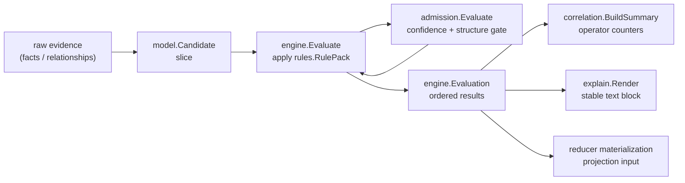

# Correlation

## Purpose

`correlation` aggregates the rule, engine, admission, model, and explain
sub-packages and exposes lightweight reporting helpers (`Summary`,
`BuildSummary`) that fold one engine.Evaluation into operator-facing
counters. The root package does not perform evaluation, admission, or
rendering; it depends on `correlation/engine` and `correlation/model` only to
derive deterministic summary counters and observability attributes from an
already-completed evaluation.

## Where this fits in the pipeline

The evaluation entry point is engine.Evaluate. This root package sits at the
reporting layer, not the orchestration layer.

## Ownership boundary

- Owns: `Summary` shape, `BuildSummary` reduction logic, and the observability
  attribute shape derived from those counters.
- Does not own: rule-pack contents (rules), evaluation logic (engine),
  admission gating (admission), explain rendering (explain), or candidate
  types (model).
- Does not write to the graph or queue. Callers in `go/internal/reducer`
  consume engine.Evaluation directly to feed projection input loaders.

## Exported surface

- `Summary` — counters for evaluated rules, admitted candidates, rejected
  candidates, conflict count, and low-confidence count.
- `BuildSummary(evaluation engine.Evaluation) Summary` — reduces one
  evaluation pass into the counters above. `ConflictCount` increments for
  each rejection reason `lost_tie_break`; `LowConfidenceCount` increments
  for each rejection reason `low_confidence`. `EvaluatedRules` is
  `len(evaluation.OrderedRuleNames)`, not the raw pack rule count.

See `doc.go` for the godoc contract.

## Dependencies

- `correlation/engine` — engine.Evaluation and engine.Result shapes.
- `correlation/model` — candidate state and rejection reason constants.

## Telemetry

None. `BuildSummary` returns plain Go data. Callers attach telemetry (e.g.,
reducer status surfaces, structured logs) around the summary they receive.

## Gotchas / invariants

- `Summary.EvaluatedRules` is derived from `engine.Evaluation.OrderedRuleNames`
  (`observability.go:20`), which reflects the sort-by-priority-then-name rule
  order, not the count of rules in the source rule pack.
- A single candidate can carry both rejection reasons `low_confidence` and
  `lost_tie_break`. `BuildSummary` walks all rejection reasons on every result,
  so one candidate can increment both `LowConfidenceCount` and `ConflictCount`.
- Candidates in state `provisional` are neither admitted nor rejected in the
  summary counters. The engine must not emit provisional candidates as final
  results; if one reaches `BuildSummary`, it is silently skipped.
- `BuildSummary` is a pure reduction over an already-completed evaluation.
  It does not validate the evaluation or re-order results.

## Related docs

- `go/internal/correlation/model/README.md` — shared types
- `go/internal/correlation/rules/README.md` — rule-pack schema and first-party packs
- `go/internal/correlation/engine/README.md` — evaluation entry point
- `go/internal/correlation/admission/README.md` — confidence and structural gate
- `go/internal/correlation/explain/README.md` — stable text rendering
- ADR: `docs/docs/adrs/2026-04-19-deployable-unit-correlation-and-materialization-framework.md`
- ADR: `docs/docs/adrs/2026-04-19-multi-source-correlation-dsl-and-collector-readiness.md`
