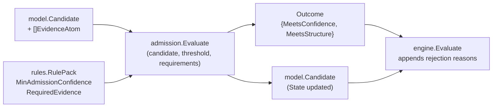

# Correlation Admission

## Purpose

`correlation/admission` is the confidence-and-structure gate that decides
whether one correlation candidate becomes admitted or rejected. It applies two
bounded checks against one candidate:

1. `candidate.Confidence >= threshold`
2. every evidence requirement is satisfied: at least `MinCount` evidence
   atoms that match all selectors in `MatchAll`

Both checks must pass for admission. An empty requirement set is structurally
satisfied. The `Outcome` returned communicates which checks passed so the
engine can attach the correct rejection reasons.

## Where this fits in the pipeline

## Ownership boundary

- Owns: the confidence threshold check, the structural evidence check, and the
  candidate state transition for one candidate.
- Does not own: rule ordering, tie-breaking among admitted candidates with the
  same correlation key, or explain rendering. Those live in
  `correlation/engine` and `correlation/explain`.
- Does not append rejection reasons. The engine owns that step after
  consulting the `Outcome`.

## Exported surface

- `Outcome{MeetsConfidence bool, MeetsStructure bool}` — which gates passed.
- `Evaluate(candidate model.Candidate, threshold float64, requiredEvidence []rules.EvidenceRequirement) (model.Candidate, Outcome, error)` —
  applies the gate. Returns a copy of the candidate with state updated;
  does not mutate the input. Returns an error if `threshold` is outside
  `[0, 1]`, `candidate.Validate()` fails, or any requirement fails
  `Validate()`.

See `doc.go` for the godoc contract.

## Dependencies

- `correlation/model` — candidate, evidence atom, candidate state.
- `correlation/rules` — evidence field, evidence requirement, evidence
  selector.

## Telemetry

None. Callers attach telemetry around `Evaluate`.

## Gotchas / invariants

- `threshold` must be in `[0, 1]`. Values outside this range return an error
  immediately (`admission.go:19`). Passing `0.0` as the threshold admits any
  candidate with `Confidence >= 0`, effectively disabling the confidence gate.
- Empty `requiredEvidence` slice always yields `MeetsStructure = true`
  (`admission.go:44`). The `satisfiesRequirements` loop has nothing to fail.
- Returned candidate is a copy. The function does not mutate the input
  candidate; callers must use the returned value.
- Rejection reasons are NOT modified here. The engine appends
  `low_confidence` and `structural_mismatch` after inspecting the `Outcome`.
- Selector matching is exact string comparison (`admission.go:61-64`).
  Whitespace, case, and prefix differences are not normalized.
- `evidenceFieldValue` returns an empty string for an unknown evidence field
  (`admission.go:68-79`). Selectors on unknown fields always fail to match,
  producing a structural mismatch rather than an error.
- `CandidateStateAdmitted` is set only when both `MeetsConfidence` and
  `MeetsStructure` are true. If either is false, the state is set to rejected.

## Related docs

- `go/internal/correlation/engine/README.md` — consumes `Outcome`; appends
  rejection reasons; orchestrates the full evaluation loop
- `go/internal/correlation/rules/README.md` — defines evidence requirements
  and selectors
- `go/internal/correlation/model/README.md` — candidate and evidence atom
  types
- ADR: `docs/docs/adrs/2026-04-19-deployable-unit-correlation-and-materialization-framework.md`
