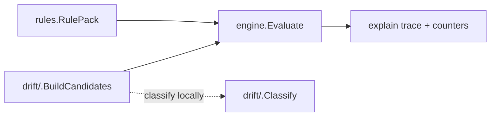

# drift

Container directory for drift-correlation helper packages. Each subdirectory
houses one drift pack's classifier helpers and fixture corpus. The rule-pack
declarations themselves live under
`go/internal/correlation/rules/` to avoid circular imports — `rules` is pure
metadata, and the helper packages import it to stamp `Candidate.Kind` and
satisfy structural admission requirements.

## Subdirectories

- `tfconfigstate/` — Terraform config-vs-state drift (chunk #43).
  Classifies the five drift kinds (`added_in_state`, `added_in_config`,
  `attribute_drift`, `removed_from_state`, `removed_from_config`),
  builds cross-scope correlation candidates, and exposes the per-resource-type
  attribute allowlist consulted during attribute_drift.

## Why this tree exists

Two pressures forced the split:

1. The correlation DSL (`go/internal/correlation/rules/`) does not include a
   "compare two evidence sets and emit a delta" primitive. Drift comparison
   must run in Go before `engine.Evaluate` is called.
2. The drift helpers must reference rule-pack name constants and rule names
   declared in `rules`, which already pulls in `correlation/model` and
   `correlation/admission`. Co-locating drift helpers under `rules` would
   create a recursive import path.

Keeping drift helpers under this container directory preserves
`rules` as pure metadata and gives each drift pack a dedicated, narrow surface
for fixture corpora and unit tests.

## Pipeline position

The reducer handler (`go/internal/reducer/terraform_config_state_drift.go`)
sits between the resolver (`go/internal/relationships/tfstatebackend/`) and
`engine.Evaluate`; it consults a drift helper package to classify and build
candidates.
