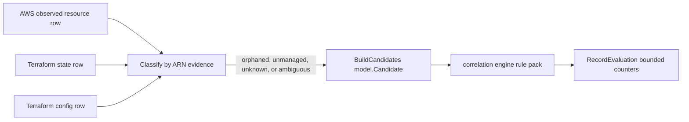

# cloudruntime

## Purpose

`cloudruntime` contains the helper Go for the `aws_cloud_runtime_drift` rule
pack. It classifies AWS-observed resources against Terraform state and
Terraform config views by ARN, then builds `model.Candidate` values for the
correlation engine.

## Drift classification flow

ARNs and raw tags stay in evidence atoms. Metrics only receive bounded pack and
rule labels.

## Ownership boundary

Owns the AWS runtime drift classifier, candidate evidence shape, and telemetry
helper for admitted orphaned and unmanaged findings. It does not query
Postgres, write Cypher, publish graph phase rows, or decide deployment truth.

## Exported surface

- `FindingKind` and its five values (four existence kinds plus
  `FindingKindImageVersionDrift`) in `classify.go`.
- `ResourceRow`, `Classify`, `ClassifyValueDrift`, `ClassifyContainerImageDrift`,
  and `DriftedAttribute` in `classify.go`.
- `ValueAttributeAllowlistFor` and `ValueAttributeAllowlistResourceTypes` in
  `value_attribute_allowlist.go`.
- `ExtractDeclaredContainerImages`, `ExtractObservedContainerImages`,
  `ContainerImageExtractionResult`, and `MaxContainerImagesPerResource` in
  `container_image_extract.go`.
- `AddressedRow`, `BuildCandidates`, and evidence constants (including
  `EvidenceTypeDeclaredValue`/`EvidenceTypeObservedValue`) in `candidate.go`.
- `Summary` and `RecordEvaluation` in `telemetry.go`.

See `doc.go` for the godoc contract.

## Value-drift classification (#5453)

Once `Classify` confirms cloud, state, and config all agree a resource is
Terraform-managed, `ClassifyValueDrift` compares a small, allowlisted set of
scalar attributes between the AWS-observed resource and the Terraform-declared
state resource:

| Terraform resource type | Compared attribute(s) | Observed source | Declared source |
| --- | --- | --- | --- |
| `aws_instance` | `ami` | `aws_resource.attributes.ami_id` (`aws_ec2_instance`) | `terraform_state_resource.attributes.ami` |
| `aws_lambda_function` | `image_uri`, `version` | `aws_resource.attributes.image_uri`/`version` (`lambda.function`) | `terraform_state_resource.attributes.image_uri`/`version` |
| `aws_ecs_task_definition` | `image` (via `ContainerImages`, not the scalar allowlist) | `aws_resource.attributes.containers[].image` (`ecs.task_definition`) | `terraform_state_resource.attributes.container_definitions[].image` |

Both sides normalize onto the SAME `ResourceRow.Attributes` map key even
though the AWS field name and the Terraform attribute name differ (AWS
returns `ami_id`, Terraform declares `ami`) -- see
`value_attribute_allowlist.go`. A value missing on either side is "no
signal", never a false-positive drift (mirrors
`tfconfigstate.classifyAttributeDrift`). Existence findings always take
precedence: value drift can only fire once cloud+state+config are already
known to converge.

### Lambda `version` accuracy note (gated on both sides present)

`aws_lambda_function.version` is a Terraform-computed, not user-declared,
attribute: it reflects whichever published version (or `$LATEST`) the state
file captured at the most recent `terraform apply`/`refresh`. AWS's live
observed `version` can legitimately move independently of Terraform -- for
example an operator or a separate CI pipeline calling
`lambda:PublishVersion` outside Terraform, or a `$LATEST` code update applied
through the console -- without that being a Terraform-config regression the
way a drifted `ami` or `image_uri` is. The comparison still only fires when
BOTH sides carry a concrete value (the same "no signal on either side missing"
rule as every other attribute above); this note is about interpreting a real
`version` mismatch once it fires, not about suppressing it. A caller
consuming `image_version_drift` findings should treat a `version`-only
mismatch (declared and observed `image_uri`/`ami` agreeing) as lower-priority
triage signal than an `image_uri`/`ami` mismatch, which always reflects an
actual deployed-artifact difference.

### ECS container-image extraction is security-bounded (#5453)

Terraform's `container_definitions` attribute is a JSON-encoded STRING that
can carry `environment` variables and `secrets` ARN/valueFrom references
alongside `image`; the AWS collector's own `ecs.task_definition` cloud fact
carries the same `environment`/`secrets` shape (see
`go/internal/collector/awscloud/services/ecs/scanner.go` `containerMaps`).
`ExtractDeclaredContainerImages` and `ExtractObservedContainerImages` are the
ONLY functions permitted to read either shape, and both decode into a
struct/read a map key that keeps ONLY `image` -- every other field is
discarded by `json.Unmarshal` itself or never read. Both are capped at
`MaxContainerImagesPerResource` (8) images; a source carrying more sets
`ContainerImageExtractionResult.Truncated`, which the postgres loaders
surface as the `container_images_truncated` warning flag rather than
silently dropping the excess. See
`container_image_extract_test.go`'s `TestExtract*NeverLeaksNonImageFields`
and `TestExtract*CapsAtBound` for the enforced proof.

### ECS essential-container ambiguity (documented bounded gap)

`ClassifyContainerImageDrift` only fires a deterministic result when EXACTLY
one observed image is known: it is either a member of the declared image set
(no drift -- covers both the single-container case and the
essential-container membership case for a multi-container task definition)
or not (drift). Any other shape -- either side empty, or more than one
observed image -- is ambiguous and reported as no drift. Eshu never guesses
which declared container an ambiguous multi-container observed set
corresponds to by position or name; a genuinely drifted non-essential
container in a multi-container task definition is under-reported rather than
risking a false positive. Promoting this to a name-keyed per-container
comparison is a follow-up, not part of #5453's scope.

### RDS/generic `engine_version` drift is a documented bounded gap

The AWS collector does not yet emit an observed `engine_version` on the
`aws_resource` cloud fact for `aws_db_instance` (or any other
generic-version resource type), so there is no observed-side value to
compare against Terraform's declared `engine_version`. Extending
`valueAttributeAllowlist` with `aws_db_instance` today would only ever see
the state side populated -- every comparison would be silently skipped as
"missing observed value", never real coverage. This is why
`valueAttributeAllowlist` has no `aws_db_instance` entry despite
`tfconfigstate.attributeAllowlist` carrying one for the config-vs-state
slice. Closing this gap needs a collector-side change (emit observed
`engine_version`) tracked as a follow-up under epic #5447, not a
correlation-package change.

## Dependencies

- `go/internal/correlation/model` for candidates and evidence atoms.
- `go/internal/correlation/engine` for telemetry over evaluated results.
- `go/internal/correlation/rules` for the AWS rule-pack name and rule names.
- `go/internal/telemetry` for bounded metric labels.

## Telemetry

`RecordEvaluation` emits:

- `eshu_dp_correlation_rule_matches_total{pack, rule}`
- `eshu_dp_correlation_orphan_detected_total{pack, rule}`
- `eshu_dp_correlation_unmanaged_detected_total{pack, rule}`

ARNs, Terraform addresses, and tag values stay out of metric labels. They live
only in evidence atoms for later explanation or structured logs.

## Gotchas / invariants

- ARN is the primary join key. `BuildCandidates` sorts by ARN so explain traces
  remain stable across reducer reruns.
- Classification is exclusive. Cloud-only resources are `orphaned_cloud_resource`;
  cloud plus state with no config is `unmanaged_cloud_resource`; unresolved
  collector/config coverage becomes `unknown_cloud_resource`; conflicting
  deterministic owner evidence becomes `ambiguous_cloud_resource`.
- Cloud plus state plus config produces no candidate UNLESS an allowlisted
  comparable value differs (#5453 `image_version_drift`); when every
  allowlisted attribute matches (or is missing on one side), the three
  source layers still converge and no candidate is built.
- Raw AWS tags become `aws_raw_tag` evidence with keys like `tag:Environment`.
  Collectors must not turn tag names into platform or environment truth.

## Related docs

- `go/internal/correlation/rules/README.md`
- `docs/public/reference/relationship-mapping.md`
- `docs/public/services/collector-aws-cloud.md`
