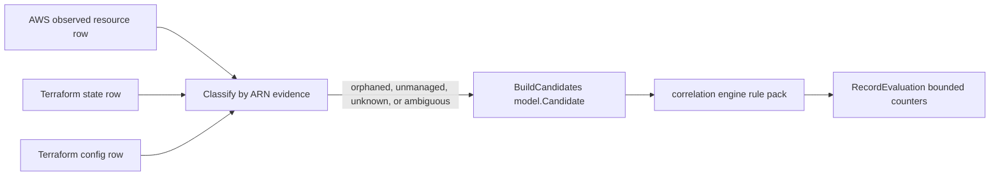

# cloudruntime

## Purpose

`cloudruntime` contains the helper Go for the `aws_cloud_runtime_drift` rule
pack. It classifies AWS-observed resources against Terraform state and
Terraform config views by ARN, then builds `model.Candidate` values for the
correlation engine.

## Drift classification flow

```mermaid
flowchart LR
    Cloud["AWS observed resource row"]
    State["Terraform state row"]
    Config["Terraform config row"]
    Classify["Classify by ARN evidence"]
    Candidate["BuildCandidates model.Candidate"]
    Engine["correlation engine rule pack"]
    Telemetry["RecordEvaluation bounded counters"]

    Cloud --> Classify
    State --> Classify
    Config --> Classify
    Classify -->|"orphaned, unmanaged, unknown, or ambiguous"| Candidate
    Candidate --> Engine
    Engine --> Telemetry
```

ARNs and raw tags stay in evidence atoms. Metrics only receive bounded pack and
rule labels.

## Ownership boundary

Owns the AWS runtime drift classifier, candidate evidence shape, and telemetry
helper for admitted orphaned and unmanaged findings. It does not query
Postgres, write Cypher, publish graph phase rows, or decide deployment truth.

## Exported surface

- `FindingKind` and its five values (four existence kinds plus
  `FindingKindImageVersionDrift`) in `classify.go`.
- `ResourceRow`, `Classify`, `ClassifyValueDrift`, `ClassifyContainerImageDrift`,
  and `DriftedAttribute` in `classify.go`.
- `ValueAttributeAllowlistFor` and `ValueAttributeAllowlistResourceTypes` in
  `value_attribute_allowlist.go`.
- `ExtractDeclaredContainerImages`, `ExtractObservedContainerImages`,
  `ContainerImageExtractionResult`, and `MaxContainerImagesPerResource` in
  `container_image_extract.go`.
- `AddressedRow`, `BuildCandidates`, and evidence constants (including
  `EvidenceTypeDeclaredValue`/`EvidenceTypeObservedValue`) in `candidate.go`.
- `Summary` and `RecordEvaluation` in `telemetry.go`.

See `doc.go` for the godoc contract.

## Value-drift classification (#5453)

Once `Classify` confirms cloud, state, and config all agree a resource is
Terraform-managed, `ClassifyValueDrift` compares a small, allowlisted set of
scalar attributes between the AWS-observed resource and the Terraform-declared
state resource:

| Terraform resource type | Compared attribute(s) | Observed source | Declared source |
| --- | --- | --- | --- |
| `aws_instance` | `ami` | `aws_resource.attributes.ami_id` (`aws_ec2_instance`) | `terraform_state_resource.attributes.ami` |
| `aws_lambda_function` | `image_uri`, `version` | `aws_resource.attributes.image_uri`/`version` (`lambda.function`) | `terraform_state_resource.attributes.image_uri`/`version` |
| `aws_ecs_task_definition` | `image` (via `ContainerImages`, not the scalar allowlist) | `aws_resource.attributes.containers[].image` (`ecs.task_definition`) | `terraform_state_resource.attributes.container_definitions[].image` |

Both sides normalize onto the SAME `ResourceRow.Attributes` map key even
though the AWS field name and the Terraform attribute name differ (AWS
returns `ami_id`, Terraform declares `ami`) -- see
`value_attribute_allowlist.go`. A value missing on either side is "no
signal", never a false-positive drift (mirrors
`tfconfigstate.classifyAttributeDrift`). Existence findings always take
precedence: value drift can only fire once cloud+state+config are already
known to converge.

### "No signal" is a finding, not silence (#5837)

`ClassifyValueComparison` is the authority behind all of this, and it reports
three things rather than one: which comparisons DRIFTED, which were actually
COMPARED, and which were UNCOMPARABLE. `Classify` needs the distinction because
the drifted list is empty both when every comparison agreed and when none could
be made, and those two must not produce the same answer.

An empty return from `Classify` means CONVERGENCE, and that is load-bearing
downstream: `BuildCandidates` drops the ARN, so the reducer's
generation-authoritative retire deletes whatever finding the ARN previously
held. So when a resource type value drift COVERS has zero successful
comparisons, `Classify` returns `value_comparison_inconclusive` instead --
a durable finding whose `management_status` is `unknown_management`, whose
`missing_evidence` names each uncomparable attribute as
`comparable_attribute:<key>`, and whose recommended action is
`expand_collector_coverage_or_permissions`.

That path is reachable, though the widest route into it is now closed. The
terraform-state collector fail-closed-redacts scalar attributes whenever
`schemaTrust` answers `SchemaUnknown`. #6017 removed the worst case: an empty
bundle no longer yields a nil resolver, because `LoadPackagedSchemaResolver`
rejects an empty attribute set with an error and the collector fails to start
rather than degrading every attribute of every resource
(`terraformstate/schema_resolver.go` rejects the empty set;
`cmd/collector-terraform-state/config.go` propagates that error out of
startup). What remains open is the PER-PROVIDER
case — a resolver that loads but does not cover one provider still answers
`SchemaUnknown` for that provider's attributes, and `parseSchemaInto` still
skips a corrupt bundle — which is the half of #5870 that is still an open
redaction-policy question.
The condition is sticky per deployment, so a replay repeats the deletion rather
than healing it. Reporting explicit uncertainty replaces the stale drift claim
instead of destroying it, and the finding self-heals into `image_version_drift`
-- or into nothing, on a real convergence -- the moment the evidence returns.

A resource type with no allowlist entry, and which is not the ECS task
definition, is NOT covered and never becomes inconclusive: it has nothing to
compare by design, so it still converges.

### Unreadable versus absent, and the partially comparable pair (#5861)

A covered two-attribute type is the hard case. If one comparable is unusable
while the other compares equal, the pass has one successful comparison — which,
read naively, is a verdict of "converged", and the retire then deletes a drift
that exists in reality.

Two things have to be true at once for that pair, and they pull in opposite
directions. The pass must not converge, or a real finding is destroyed. And the
comparison that DID run must keep its verdict, or a real drift is restated as
uncertainty and an operator querying `image_version_drift` sees nothing on a
demonstrably drifted resource.

Both are satisfied by making the distinction per attribute rather than per set:

1. **The loader decides readable versus unreadable**, at
   `go/internal/storage/postgres/aws_cloud_runtime_drift_value_attributes.go`,
   because only it can see the encodings — a `redact.Value` marker, or the
   `package_type` completeness contradiction below. An unreadable key is left
   out of `ResourceRow.Attributes` and named in `ResourceRow.DegradedAttributes`.
2. **`ClassifyValueComparison` counts them separately.** `Uncomparable` holds
   every key that went uncompared; `Degraded` holds the subset a side reported
   as unreadable. Absence lands in the first only.
3. **`Inconclusive()` keys on degradation, and drift outranks it.**
   `Compared == 0 || len(Degraded) > 0` declines convergence, so the retire can
   never delete on a partial pass — but `Classify` checks `Drifted` first, so a
   comparison that ran and disagreed is still reported as the drift it is, with
   its `declared_`/`observed_` evidence, plus a coverage-gap atom naming the
   attribute that could not be read.

The two unreadable signals the loader recognizes:

- **Redacted (#5859/#5904).** A redaction marker on an allowlisted comparable.
  The value never reaches `Attributes` as a string: `coerceJSONString` has no
  redaction concept and would render the marker map into a garbage string that
  compares unequal to everything.
- **Unobservable (#5861).** Absence alone must NOT count — `image_uri` is
  legitimately absent for every zip-packaged Lambda, and degrading on absence
  would put a finding on most functions in a corpus. `package_type`
  distinguishes the two: it is a real `aws_lambda_function` attribute that the
  AWS collector already emits, so `package_type == "Image"` with no `image_uri`
  is a side that did not carry the image, not a resource that has none.
  Zip-packaged functions are untouched by construction.

  The rule applies to the observed AND the declared decoder, because the
  destructive outcome does not care which side was unreadable. On the observed
  side the shape comes from the AWS client's defensive fallback to a
  `ListFunctions` configuration, which carries `PackageType` but no `Code`
  block. On the declared side, Terraform requires `image_uri` when
  `package_type` is `Image`, so a state row asserting `Image` with none is an
  incomplete read of that state.

`package_type` is read as a completeness signal only. It is deliberately NOT in
`valueAttributeAllowlist`: adding it would turn an out-of-band Image-to-Zip
repackaging into a real `image_version_drift` and needs its own accuracy review.

`ContainerImagesDegraded` feeds the same `Degraded` signal. It changes no ECS
verdict today — that type has no scalar comparable to pair the container-image
comparison with, so an unreadable `container_definitions` already leaves
`Compared == 0` — but keeping both degradation signals on one rule means adding
an ECS scalar to the allowlist later cannot silently reintroduce this shape.

**What this does NOT close.** An `absent` comparable that should have been
present, where no completeness signal exists to say so. Concretely: an absent
`version` alongside an `image_uri` that compares equal still gives
`Comparable=2, Compared=1, Degraded=0` and still converges. `package_type` tells
us whether an `image_uri` should exist; nothing in either payload says the same
about `version`. Both sources do carry it in practice — `GetFunction` and the
`ListFunctions` fallback both return `Version`, and Terraform writes it as a
computed attribute — so the shape is narrow, but "usually present" is not a
signal a decoder can act on.

### A redacted attribute is "no signal", not a comparable value (#5859)

`ResourceRow.Attributes` never carries a collector's redaction marker as a
string. When the terraform-state or AWS-cloud collector fail-closed-redacts
a scalar (unknown/unparseable provider schema, or a known-sensitive key),
the persisted attribute is a `{"marker","reason","source"}` object
(`go/internal/redact.Value`), not a plain string. The `postgres` package
loaders (`cloudObservedValueAttributes`/`stateDeclaredValueAttributes` in
`go/internal/storage/postgres/aws_cloud_runtime_drift_value_attributes.go`)
recognize that shape via `redact.IsRedactedValue` and omit the key from
`ResourceRow.Attributes` entirely, before `ClassifyValueDrift` ever runs --
so this package stays ignorant of the marker encoding. It is not silently
dropped, though: the key is named in `ResourceRow.DegradedAttributes`, which is
what separates it from a genuinely absent attribute (#5861, above).
Before this, a redacted attribute survived the decode as a
non-empty garbage string (the marker map rendered through `fmt.Sprint`),
which compared unequal to a real value on the other side and produced a
false `image_version_drift` whose "declared" or "observed" evidence was an
internal collector encoding, not real Terraform or AWS data.

This is the input half of the #5837 outcome above, and the two compose: the
loader turns the marker into an unreadable attribute, and
`ClassifyValueComparison` then counts that key as `Uncomparable` AND `Degraded`
rather than compared. For `aws_instance`, whose sole allowlisted attribute is
`ami`, the result is `Comparable=1, Compared=0` --
`value_comparison_inconclusive`, a durable row -- rather than either the old
false drift or a silent convergence the retire would read as permission to
delete. Distinguishing "genuinely missing" from "unreadable, so unknown" per
attribute, rather than folding both into the same uncomparable bucket, is what
#5861 added; the remaining uncovered shape (an absent comparable that should
have been present, with no signal saying so) is recorded above.
Whether the collector should
fail-closed-redact at all when `schemaTrust` answers `SchemaUnknown` for a
provider its bundle does not cover -- and whether identity anchors such as
`arn` should be exempt from that fail-closure -- is the upstream policy
question, tracked on #5870. (The nil-resolver trigger this sentence used to
name is gone; see the #6017 note above.)

### Lambda `version` accuracy note (gated on both sides present)

`aws_lambda_function.version` is a Terraform-computed, not user-declared,
attribute: it reflects whichever published version (or `$LATEST`) the state
file captured at the most recent `terraform apply`/`refresh`. AWS's live
observed `version` can legitimately move independently of Terraform -- for
example an operator or a separate CI pipeline calling
`lambda:PublishVersion` outside Terraform, or a `$LATEST` code update applied
through the console -- without that being a Terraform-config regression the
way a drifted `ami` or `image_uri` is. The comparison still only fires when
BOTH sides carry a concrete value (the same "no signal on either side missing"
rule as every other attribute above); this note is about interpreting a real
`version` mismatch once it fires, not about suppressing it. A caller
consuming `image_version_drift` findings should treat a `version`-only
mismatch (declared and observed `image_uri`/`ami` agreeing) as lower-priority
triage signal than an `image_uri`/`ami` mismatch, which always reflects an
actual deployed-artifact difference.

### ECS container-image extraction is security-bounded (#5453)

Terraform's `container_definitions` attribute is a JSON-encoded STRING that
can carry `environment` variables and `secrets` ARN/valueFrom references
alongside `image`; the AWS collector's own `ecs.task_definition` cloud fact
carries the same `environment`/`secrets` shape (see
`go/internal/collector/awscloud/services/ecs/scanner.go` `containerMaps`).
`ExtractDeclaredContainerImages` and `ExtractObservedContainerImages` are the
ONLY functions permitted to read either shape, and both decode into a
struct/read a map key that keeps ONLY `image` -- every other field is
discarded by `json.Unmarshal` itself or never read. Both are capped at
`MaxContainerImagesPerResource` (8) images; a source carrying more sets
`ContainerImageExtractionResult.Truncated`, which the postgres loaders
surface as the `container_images_truncated` warning flag rather than
silently dropping the excess.

A value that cannot be READ is separate from one that is absent. A non-string
`container_definitions` (the redaction marker is an OBJECT), a non-slice
observed `containers`, or a `container_definitions` string that fails to parse
all set `ContainerImageExtractionResult.Degraded`, which the loaders surface as
the `container_images_unreadable` warning flag (#5837). Both cases still yield
an empty image set, so the comparison is uncomparable either way -- but only the
degraded one tells an operator there is something to fix. See
`container_image_extract_test.go`'s `TestExtract*NeverLeaksNonImageFields`
and `TestExtract*CapsAtBound` for the enforced proof.

### ECS essential-container ambiguity (documented bounded gap)

`ClassifyContainerImageDrift` only fires a deterministic result when EXACTLY
one observed image is known: it is either a member of the declared image set
(no drift -- covers both the single-container case and the
essential-container membership case for a multi-container task definition)
or not (drift). Any other shape -- either side empty, or more than one
observed image -- is ambiguous and reported as no drift. Eshu never guesses
which declared container an ambiguous multi-container observed set
corresponds to by position or name; a genuinely drifted non-essential
container in a multi-container task definition is under-reported rather than
risking a false positive. Promoting this to a name-keyed per-container
comparison is a follow-up, not part of #5453's scope.

Since #5837 the two ambiguous shapes take DIFFERENT outcomes, and the line
between them is whether the gap can change from one pass to the next:

- **Either side empty** -- the images were unreadable (`Degraded`) or the
  collector never produced them. A healthier pass on the same ARN can carry
  images and reach a real verdict, so silence here would let the
  generation-authoritative retire delete the verdict that pass wrote. This
  counts as covered-but-uncomparable and classifies
  `value_comparison_inconclusive`.
- **More than one observed image** -- both sides carry images and only the
  pairing is undecidable. That is the task definition's own shape, identical
  on every pass, so no pass ever produced a finding here and none can lose
  one. It stays the bounded under-reporting gap described above: value drift
  simply does not cover the shape, and a healthy multi-container task
  definition produces no finding at all. Emitting inconclusive for it would
  put an un-actionable row on every sidecar task definition in a corpus,
  forever -- the same noise argument that keeps the #5861 lambda residual
  from being "fixed" the same wrong way.

### RDS/generic `engine_version` drift is a documented bounded gap

The AWS collector does not yet emit an observed `engine_version` on the
`aws_resource` cloud fact for `aws_db_instance` (or any other
generic-version resource type), so there is no observed-side value to
compare against Terraform's declared `engine_version`. Extending
`valueAttributeAllowlist` with `aws_db_instance` today would only ever see
the state side populated -- every comparison would be silently skipped as
"missing observed value", never real coverage. This is why
`valueAttributeAllowlist` has no `aws_db_instance` entry despite
`tfconfigstate.attributeAllowlist` carrying one for the config-vs-state
slice. Closing this gap needs a collector-side change (emit observed
`engine_version`) tracked as a follow-up under epic #5447, not a
correlation-package change.

## Dependencies

- `go/internal/correlation/model` for candidates and evidence atoms.
- `go/internal/correlation/engine` for telemetry over evaluated results.
- `go/internal/correlation/rules` for the AWS rule-pack name and rule names.
- `go/internal/telemetry` for bounded metric labels.

## Telemetry

`RecordEvaluation` emits:

- `eshu_dp_correlation_rule_matches_total{pack, rule}`
- `eshu_dp_correlation_orphan_detected_total{pack, rule}`
- `eshu_dp_correlation_unmanaged_detected_total{pack, rule}`

ARNs, Terraform addresses, and tag values stay out of metric labels. They live
only in evidence atoms for later explanation or structured logs.

## Gotchas / invariants

- ARN is the primary join key. `BuildCandidates` sorts by ARN so explain traces
  remain stable across reducer reruns.
- Classification is exclusive. Cloud-only resources are `orphaned_cloud_resource`;
  cloud plus state with no config is `unmanaged_cloud_resource`; unresolved
  collector/config coverage becomes `unknown_cloud_resource`; conflicting
  deterministic owner evidence becomes `ambiguous_cloud_resource`.
- Cloud plus state plus config produces no candidate UNLESS an allowlisted
  comparable value differs (#5453 `image_version_drift`); when every
  allowlisted attribute matches (or is missing on one side), the three
  source layers still converge and no candidate is built.
- Raw AWS tags become `aws_raw_tag` evidence with keys like `tag:Environment`.
  Collectors must not turn tag names into platform or environment truth.

## Related docs

- `go/internal/correlation/rules/README.md`
- `docs/public/reference/relationship-mapping.md`
- `docs/public/services/collector-aws-cloud.md`
