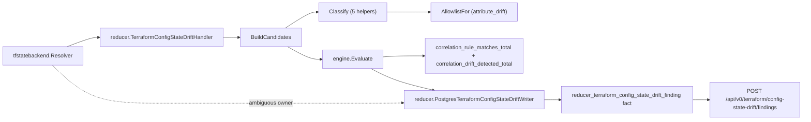
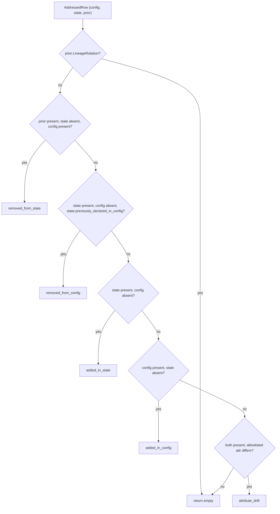

# tfconfigstate

Helper Go for the `terraform_config_state_drift` correlation rule pack.
Classifies one resource address against config-side, state-side, and
prior-state-side views; builds the cross-scope correlation candidate that
`engine.Evaluate(rules.TerraformConfigStateDriftRulePack(), ...)` admits.

Current design contract:
`docs/public/reference/relationship-mapping.md`

## Pipeline position



## Internal flow



## Exported surface

- `DriftKind` (`drift_kind.go:11`) — closed enum of five drift kinds plus
  the empty-string "no drift" sentinel.
- `AllDriftKinds` (`drift_kind.go:34`) — deterministic enumeration used in
  cardinality assertions.
- `DriftKind.Validate` (`drift_kind.go:48`) — rejects unknown values.
- `ResourceRow` (`classify.go:13`) — the normalized config/state/prior view
  fed to `Classify`.
- `Classify` (`classify.go:65`) — top-level dispatcher.
- `AddressedRow` (`candidate.go:51`) — joined per-address input.
- `BuildCandidates` (`candidate.go:73`) — emits one
  `model.Candidate` per drifted address with cross-scope `EvidenceAtom`s.
- `AllowlistFor` (`attribute_allowlist.go:43`),
  `AllowlistResourceTypes` (`attribute_allowlist.go:55`) — attribute allowlist
  surface.
- `EvidenceTypeDriftAddress`, `EvidenceTypeDriftKind`,
  `EvidenceTypeConfigResource`, `EvidenceTypeStateResource`,
  `EvidenceTypePriorStateResource`, `EvidenceKeyAddress`,
  `EvidenceKeyDriftKind` (`candidate.go:13`) — stable evidence type/key
  tokens read by the rule pack's structural gate and the explain trace.

## Dependencies

- `github.com/eshu-hq/eshu/go/internal/correlation/model` — `EvidenceAtom`,
  `Candidate`.
- `github.com/eshu-hq/eshu/go/internal/correlation/rules` — rule-pack name
  constant.
- `github.com/eshu-hq/eshu/go/internal/relationships/tfstatebackend` —
  `CommitAnchor` (config-side scope identity).

## Telemetry emitted

This package does not emit telemetry directly. The reducer handler that
consumes its output (`go/internal/reducer/terraform_config_state_drift.go`)
emits `eshu_dp_correlation_rule_matches_total{pack, rule}` and
`eshu_dp_correlation_drift_detected_total{pack, rule, drift_kind}`. Keep that
counter pair aligned with the current relationship-mapping reference.

The two counters carry distinct semantics:

- `eshu_dp_correlation_rule_matches_total` uses
  `engine.Result.MatchCounts` to label by the match-phase rule
  (`match-config-against-state` for the drift pack). It advances per
  admitted candidate by the match-count value.
- `eshu_dp_correlation_drift_detected_total` is always labeled with
  the admission-producing rule (`admit-drift-evidence`) and the
  classified `drift_kind`. It advances once per admitted candidate.

The pair lets operators relate match-phase activity (which rule did the
engine actually use to gate the candidate?) to admit-phase outcome
volume (how many admissions per drift kind?). Both counters keep
high-cardinality values (resource addresses, attribute paths, module
paths) out of label space — those live in `slog` log keys instead.

## Operational notes

- Computed/unknown config attribute values must be marked in
  `ResourceRow.UnknownAttributes` or `attribute_drift` will compare an HCL
  expression token against a concrete state value and emit a false positive.
- `removed_from_state` requires a prior-state row. If the resolver cannot
  reach the prior generation (Postgres retention or lineage rotation), the
  classifier returns empty — correct behavior, not a bug.
- The attribute allowlist is the v1 operator-meaningful policy. Promoting it to
  a versioned data file requires architecture-owner approval plus updated
  relationship-mapping and package docs.

## Extension points

- Add a new resource type: extend the `attributeAllowlist` map in
  `attribute_allowlist.go`. The fixture corpus does not need to grow
  unless the new type exposes a new attribute-comparison shape.
- Add a new drift kind: extend the `DriftKind` enum, add a classifier
  function, slot it into `Classify`, and add positive/negative/ambiguous
  fixtures under `testdata/<new_kind>/`.

## Gotchas

- The DSL does not compare evidence values; `engine.Evaluate` sorts and
  counts rules (`go/internal/correlation/engine/engine.go:25`). All drift
  comparison MUST run here, before `BuildCandidates` returns.
- `Candidate.Validate` (`go/internal/correlation/model/types.go:65`)
  iterates atoms but does not enforce uniform `ScopeID`; this package is
  the first first-party consumer of the cross-scope-candidate pattern.
- The classifier dispatch order is load-bearing — `removed_from_config`
  precedes `added_in_state` because the previously-declared-in-config
  signal is the strictly stronger evidence
  (`classify.go:65`).

## Known limitations (v1)

- Only the seven seed resource types in `attribute_allowlist.go` are
  covered for attribute_drift. Other types fall through silently.
- No graph projection of drift nodes until a current relationship-mapping
  contract and query surface exist.
- No state-to-cloud ARN joins (blocked by issue #48).

## Durability and outcome model (issue #5442)

Every admitted candidate this package builds and every ambiguous-owner
rejection the handler observes is now written as a durable
`reducer_terraform_config_state_drift_finding` Postgres fact
(`go/internal/reducer/terraform_config_state_drift_writer.go`), read back
through `POST /api/v0/terraform/config-state-drift/findings` and the
`list_terraform_config_state_drift_findings` MCP tool. Counters and structured
logs stay a parallel signal, not a replacement.

Every durable finding carries an `outcome`: `exact` for a per-address
classification, or `ambiguous` for a whole-scope backend-owner rejection with
no per-address classification. See `doc.go`'s "Outcome model" section for the
full reasoning on which of the design doc's six outcomes (exact, derived,
ambiguous, unresolved, stale, rejected) this domain reaches and why the rest
are either unreachable with today's evidence or intentionally not persisted.

### Performance evidence (issue #5442)

- **Write path — measured.** `BenchmarkWriteTerraformConfigStateDriftFindings`
  (`terraform_config_state_drift_writer_test.go`) measured 500 candidates
  through encode + marshal + one batched `ExecContext` call against a fake DB
  (no real Postgres I/O): 3.76ms/op, ~7.5µs/candidate CPU cost.
  `TestWriteTerraformConfigStateDriftFindingsBoundedExecCount` proves
  O(N/1000) round trips for N=1500, mirroring the AWS/multi-cloud runtime
  drift writers' bound. There is no prior baseline to compare against — the
  domain emitted no durable write before this issue — so this is the starting
  measurement, not a before/after delta.
- **Read path — measured with `EXPLAIN ANALYZE`, literal plans below.**
  Two live-Postgres passes (`docker compose`, torn down after each):
  `COMPOSE_PROJECT_NAME=eshu-explain-5442` (uniform seed) and
  `COMPOSE_PROJECT_NAME=eshu-explain-5442b` (uniform seed plus one hot
  scope, added per review — see cardinality-skew note below). Ran
  `EXPLAIN (ANALYZE, BUFFERS)` for the list, count, and `Scoped`
  (`scope_id = ANY(...)`) query shapes
  `buildTerraformConfigStateDriftFindingQuery` builds
  (`go/internal/storage/postgres/terraform_config_state_drift_findings.go`).
  Every plan below is an `Index Scan` — no `Seq Scan` appears anywhere.

  Second-pass seed: 260,768 `fact_records` rows total (300 uniform
  `state_snapshot` scopes at 20 rows each, plus one **hot scope** —
  `state_snapshot:s3:hotscope` — carrying 2,500 rows behind a single
  `scope_id` equality predicate, plus 250,000 unrelated rows of other fact
  kinds so the table is large enough that a sequential scan would be
  visibly costlier than an index scan if the planner chose one).

  List query, normal scope (20 rows behind the predicate):

  ```
   Limit  (cost=5.15..5.16 rows=1 width=122) (actual time=0.223..0.227 rows=20.00 loops=1)
     Buffers: shared hit=32
     ->  Sort  (cost=5.15..5.16 rows=1 width=122) (actual time=0.222..0.223 rows=20.00 loops=1)
           Sort Key: fact.observed_at DESC, fact.fact_id
           Sort Method: quicksort  Memory: 45kB
           Buffers: shared hit=32
           ->  Nested Loop  (cost=0.70..5.14 rows=1 width=122) (actual time=0.073..0.175 rows=20.00 loops=1)
                 Buffers: shared hit=26
                 ->  Index Scan using ingestion_scopes_pkey on ingestion_scopes scope  (cost=0.28..2.49 rows=1 width=52) (actual time=0.032..0.032 rows=1.00 loops=1)
                       Index Cond: (scope_id = 'state_snapshot:s3:synthetic150'::text)
                       Buffers: shared hit=3
                 ->  Index Scan using fact_records_scope_generation_idx on fact_records fact  (cost=0.42..2.64 rows=1 width=122) (actual time=0.038..0.136 rows=20.00 loops=1)
                       Index Cond: ((scope_id = 'state_snapshot:s3:synthetic150'::text) AND (generation_id = scope.active_generation_id) AND (fact_kind = 'reducer_terraform_config_state_drift_finding'::text))
                       Filter: (NOT is_tombstone)
                       Buffers: shared hit=23
   Planning Time: 6.770 ms
   Execution Time: 0.290 ms
  ```

  Count query, normal scope — same index, same shape, `Execution Time:
  0.047 ms`.

  `Scoped`/`ANY()` variant, normal scope — still an `Index Scan`, never a
  `Seq Scan`. **Hedged, not asserted as a stable contract:** in this
  measured pass, on this seed (`shared_buffers`/`work_mem` at the repo's
  `docker-compose.yaml` non-default settings, this exact row distribution
  and `ANALYZE` history), the planner picked
  `fact_records_collector_status_active_idx`
  (`scope_id, generation_id, source_system, fact_kind, observed_at DESC,
  ingested_at DESC WHERE is_tombstone = false`) rather than
  `fact_records_scope_generation_idx` for this one query shape. An
  independent review reproduced this exact query three ways (2-scope,
  ~300-scope/2-element array, ~300-scope/150-element array) against its
  own seed and got `fact_records_scope_generation_idx` every time — a
  different but plausible planner choice attributable to differing
  statistics and Postgres settings, not a fabricated result. Both indexes
  are real and both plans are `Index Scan`s; **which specific index the
  planner picks for this shape is not being asserted as a stable fact.**
  The invariant that IS stable across every run in both passes — index
  scan, never a sequential scan, on every query shape and both
  cardinalities — is the one worth relying on. `Execution Time: 0.102 ms`
  in this pass.

  ```
   Limit  (cost=6.69..6.70 rows=1 width=122) (actual time=0.084..0.087 rows=20.00 loops=1)
     Buffers: shared hit=86
     ->  Sort  (cost=6.69..6.70 rows=1 width=122) (actual time=0.084..0.085 rows=20.00 loops=1)
           Sort Key: fact.observed_at DESC, fact.fact_id
           Sort Method: quicksort  Memory: 45kB
           Buffers: shared hit=86
           ->  Nested Loop  (cost=0.70..6.68 rows=1 width=122) (actual time=0.034..0.076 rows=20.00 loops=1)
                 Join Filter: (scope.active_generation_id = fact.generation_id)
                 Buffers: shared hit=86
                 ->  Index Scan using fact_records_collector_status_active_idx on fact_records fact  (cost=0.42..4.17 rows=1 width=122) (actual time=0.028..0.041 rows=20.00 loops=1)
                       Index Cond: ((scope_id = ANY ('{state_snapshot:s3:synthetic150,state_snapshot:s3:synthetic151}'::text[])) AND (scope_id = 'state_snapshot:s3:synthetic150'::text) AND (fact_kind = 'reducer_terraform_config_state_drift_finding'::text))
                       Buffers: shared hit=26
                 ->  Index Scan using ingestion_scopes_pkey on ingestion_scopes scope  (cost=0.28..2.49 rows=1 width=52) (actual time=0.001..0.001 rows=1.00 loops=20)
                       Index Cond: (scope_id = 'state_snapshot:s3:synthetic150'::text)
                       Buffers: shared hit=60
   Planning Time: 0.419 ms
   Execution Time: 0.102 ms
  ```

  **Hot scope (2,500 rows behind one `scope_id`)** — cardinality-skew
  proof added per review (P2-2): the uniform 20-rows/scope seed alone only
  tests scope *count*, not per-scope *volume*, and nothing in
  `PostgresTerraformConfigStateDriftWriter` caps findings per scope or
  generation, so a real Terraform state with thousands of drifting
  resources in one generation is a real worst case, not a hypothetical
  one. List query (`LIMIT 100`) plan:

  ```
   Limit  (cost=5.15..5.16 rows=1 width=122) (actual time=1.547..1.559 rows=100.00 loops=1)
     Buffers: shared hit=315
     ->  Sort  (cost=5.15..5.16 rows=1 width=122) (actual time=1.547..1.552 rows=100.00 loops=1)
           Sort Key: fact.observed_at DESC, fact.fact_id
           Sort Method: top-N heapsort  Memory: 125kB
           Buffers: shared hit=315
           ->  Nested Loop  (cost=0.70..5.14 rows=1 width=122) (actual time=0.044..1.150 rows=2500.00 loops=1)
                 Buffers: shared hit=315
                 ->  Index Scan using ingestion_scopes_pkey on ingestion_scopes scope  (cost=0.28..2.49 rows=1 width=52) (actual time=0.015..0.016 rows=1.00 loops=1)
                       Index Cond: (scope_id = 'state_snapshot:s3:hotscope'::text)
                       Buffers: shared hit=3
                 ->  Index Scan using fact_records_scope_generation_idx on fact_records fact  (cost=0.42..2.64 rows=1 width=122) (actual time=0.027..0.917 rows=2500.00 loops=1)
                       Index Cond: ((scope_id = 'state_snapshot:s3:hotscope'::text) AND (generation_id = scope.active_generation_id) AND (fact_kind = 'reducer_terraform_config_state_drift_finding'::text))
                       Filter: (NOT is_tombstone)
                       Buffers: shared hit=312
   Planning Time: 0.417 ms
   Execution Time: 1.594 ms
  ```

  Count query, hot scope — same index, `Execution Time: 0.838 ms`. The
  index scan does not flip to a sequential scan at 2,500 rows behind one
  `scope_id`; `fact_records_scope_generation_idx` still wins, and both the
  planner's row estimate progression (`rows=1` cost estimate on the
  `Index Cond`, `rows=2500.00` actual — Postgres's known
  single-value-selectivity estimation quirk when the planner has no
  per-value MCV stats for a brand-new scope_id, not a plan-shape problem)
  and the `Buffers: shared hit` line (all cache hits, no disk reads) match
  the low-cardinality runs' shape, just scaled by row count.

  **Architectural bound on the worst case (stronger than any single
  measurement):** every call into this store's `ListActiveFindings` and
  `CountActiveFindings` passes through
  `validateTerraformConfigStateDriftFindingFilter`, which rejects an empty
  `ScopeID` and any `ScopeID` not prefixed `state_snapshot:` before a
  query is ever built. There is no code path through this store that
  issues the query without a `scope_id` equality predicate — the
  `fact_kind = $1 AND fact.scope_id = $2` shape (or the `Scoped` variant's
  additional `ANY()` predicate) is not just today's common case, it is the
  only shape reachable. A full-table scan of `fact_records` filtered by
  `fact_kind` alone, with no `scope_id`, cannot occur through this store.
- **Golden-corpus fixture coverage — measured, closed.** A first live
  `scripts/verify-golden-corpus-gate.sh` run found zero
  `list_terraform_config_state_drift_findings` results. Root-caused to two
  compounding gaps, not a handler defect:
  1. `testdata/cassettes/terraformstate/supply-chain-demo.json`'s scope_id
     was `terraform_state:s3:supply-chain-demo-tfstate:supply-chain-demo/
     terraform.tfstate` — cassette replay
     (`go/internal/replay/cassette/source.go`) uses a cassette's `scope_id`
     verbatim as the ingestion scope, and the Phase 3.5 drift-intent
     trigger (`go/internal/storage/postgres/drift_enqueue.go`) only scans
     `ingestion_scopes` rows matching `state_snapshot:%`, so this cassette's
     scope was never even considered — no drift intent was ever enqueued for
     it, independent of backend matching.
  2. The corpus's only Terraform config fixture
     (`tests/fixtures/ecosystems/terraform_comprehensive/main.tf`) declared
     a different S3 backend (bucket `my-terraform-state`, key
     `comprehensive/terraform.tfstate`) than the cassette (bucket
     `supply-chain-demo-tfstate`, key `supply-chain-demo/terraform.tfstate`),
     so even a correctly-scoped intent would have hit
     `tfstatebackend.ErrNoConfigRepoOwnsBackend` (the no-owner case is
     intentionally not durable — see the outcome model above).

  Fixed both, in the corpus itself rather than documenting the gap: gave
  the cassette the canonical `state_snapshot:s3:<sha256("s3://" + bucket +
  "/" + key)>` scope_id (`terraformstate.ScopeLocatorHash`, the same hash
  `tfstate_backend_canonical.go` recomputes from the config side at query
  time), and pointed `terraform_comprehensive`'s backend block at the same
  bucket/key the cassette already used. A second live gate run then showed
  `[PASS] mcp:list_terraform_config_state_drift_findings: "drift_findings"
  has 12 results` — real `added_in_config`/`added_in_state` drift, because
  none of the fixture's ~12 declared resource addresses overlap the
  cassette's 2 ECS state resources by design (deliberately the most robust
  drift kinds: presence/absence only, no attribute-allowlist dependency).
  Every other one of the gate's 439 assertions was diffed line-for-line
  between the before/after runs and was byte-identical except this one
  (`node_count_TerraformResource` stayed `12` in the pinned `[1,30]` range
  both times — no config resource nodes were added, only the backend
  pointer changed). `testdata/golden/e2e-20repo-snapshot.json`'s
  `list_terraform_config_state_drift_findings` shape now asserts
  `minimum_results: 1`, backed by that observed run.
