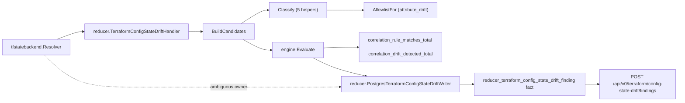
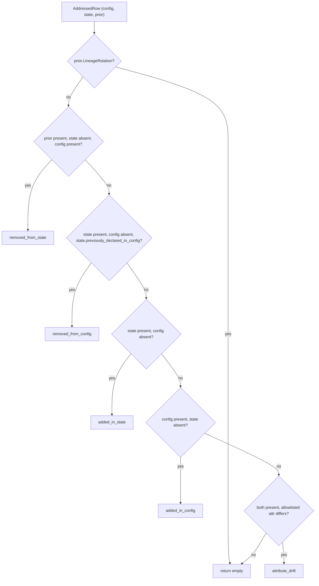

# tfconfigstate

Helper Go for the `terraform_config_state_drift` correlation rule pack.
Classifies one resource address against config-side, state-side, and
prior-state-side views; builds the cross-scope correlation candidate that
`engine.Evaluate(rules.TerraformConfigStateDriftRulePack(), ...)` admits.

Current design contract:
`docs/public/reference/relationship-mapping.md`

## Pipeline position

## Internal flow

## Exported surface

- `DriftKind` (`drift_kind.go:11`) — closed enum of five drift kinds plus
  the empty-string "no drift" sentinel.
- `AllDriftKinds` (`drift_kind.go:34`) — deterministic enumeration used in
  cardinality assertions.
- `DriftKind.Validate` (`drift_kind.go:48`) — rejects unknown values.
- `ResourceRow` (`classify.go:13`) — the normalized config/state/prior view
  fed to `Classify`.
- `Classify` (`classify.go:65`) — top-level dispatcher.
- `AddressedRow` (`candidate.go:51`) — joined per-address input.
- `BuildCandidates` (`candidate.go:73`) — emits one
  `model.Candidate` per drifted address with cross-scope `EvidenceAtom`s.
- `AllowlistFor` (`attribute_allowlist.go:43`),
  `AllowlistResourceTypes` (`attribute_allowlist.go:55`) — attribute allowlist
  surface.
- `EvidenceTypeDriftAddress`, `EvidenceTypeDriftKind`,
  `EvidenceTypeConfigResource`, `EvidenceTypeStateResource`,
  `EvidenceTypePriorStateResource`, `EvidenceKeyAddress`,
  `EvidenceKeyDriftKind` (`candidate.go:13`) — stable evidence type/key
  tokens read by the rule pack's structural gate and the explain trace.

## Dependencies

- `github.com/eshu-hq/eshu/go/internal/correlation/model` — `EvidenceAtom`,
  `Candidate`.
- `github.com/eshu-hq/eshu/go/internal/correlation/rules` — rule-pack name
  constant.
- `github.com/eshu-hq/eshu/go/internal/relationships/tfstatebackend` —
  `CommitAnchor` (config-side scope identity).

## Telemetry emitted

This package does not emit telemetry directly. The reducer handler that
consumes its output (`go/internal/reducer/terraform_config_state_drift.go`)
emits `eshu_dp_correlation_rule_matches_total{pack, rule}` and
`eshu_dp_correlation_drift_detected_total{pack, rule, drift_kind}`. Keep that
counter pair aligned with the current relationship-mapping reference.

The two counters carry distinct semantics:

- `eshu_dp_correlation_rule_matches_total` uses
  `engine.Result.MatchCounts` to label by the match-phase rule
  (`match-config-against-state` for the drift pack). It advances per
  admitted candidate by the match-count value.
- `eshu_dp_correlation_drift_detected_total` is always labeled with
  the admission-producing rule (`admit-drift-evidence`) and the
  classified `drift_kind`. It advances once per admitted candidate.

The pair lets operators relate match-phase activity (which rule did the
engine actually use to gate the candidate?) to admit-phase outcome
volume (how many admissions per drift kind?). Both counters keep
high-cardinality values (resource addresses, attribute paths, module
paths) out of label space — those live in `slog` log keys instead.

## Operational notes

- Computed/unknown config attribute values must be marked in
  `ResourceRow.UnknownAttributes` or `attribute_drift` will compare an HCL
  expression token against a concrete state value and emit a false positive.
- `removed_from_state` requires a prior-state row. If the resolver cannot
  reach the prior generation (Postgres retention or lineage rotation), the
  classifier returns empty — correct behavior, not a bug.
- The attribute allowlist is the v1 operator-meaningful policy. Promoting it to
  a versioned data file requires architecture-owner approval plus updated
  relationship-mapping and package docs.

## Extension points

- Add a new resource type: extend the `attributeAllowlist` map in
  `attribute_allowlist.go`. The fixture corpus does not need to grow
  unless the new type exposes a new attribute-comparison shape.
- Add a new drift kind: extend the `DriftKind` enum, add a classifier
  function, slot it into `Classify`, and add positive/negative/ambiguous
  fixtures under `testdata/<new_kind>/`.

## Gotchas

- The DSL does not compare evidence values; `engine.Evaluate` sorts and
  counts rules (`go/internal/correlation/engine/engine.go:25`). All drift
  comparison MUST run here, before `BuildCandidates` returns.
- `Candidate.Validate` (`go/internal/correlation/model/types.go:65`)
  iterates atoms but does not enforce uniform `ScopeID`; this package is
  the first first-party consumer of the cross-scope-candidate pattern.
- The classifier dispatch order is load-bearing — `removed_from_config`
  precedes `added_in_state` because the previously-declared-in-config
  signal is the strictly stronger evidence
  (`classify.go:65`).

## Known limitations (v1)

- Only the seven seed resource types in `attribute_allowlist.go` are
  covered for attribute_drift. Other types fall through silently.
- No graph projection of drift nodes until a current relationship-mapping
  contract and query surface exist.
- No state-to-cloud ARN joins (blocked by issue #48).

## Durability and outcome model (issue #5442)

Every admitted candidate this package builds and every ambiguous-owner
rejection the handler observes is now written as a durable
`reducer_terraform_config_state_drift_finding` Postgres fact
(`go/internal/reducer/terraform_config_state_drift_writer.go`), read back
through `POST /api/v0/terraform/config-state-drift/findings` and the
`list_terraform_config_state_drift_findings` MCP tool. Counters and structured
logs stay a parallel signal, not a replacement.

Every durable finding carries an `outcome`: `exact` for a per-address
classification, or `ambiguous` for a whole-scope backend-owner rejection with
no per-address classification. See `doc.go`'s "Outcome model" section for the
full reasoning on which of the design doc's six outcomes (exact, derived,
ambiguous, unresolved, stale, rejected) this domain reaches and why the rest
are either unreachable with today's evidence or intentionally not persisted.
