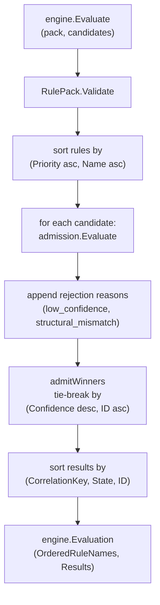

# Correlation Engine

## Purpose

`correlation/engine` applies a validated rule pack to a candidate slice and
emits deterministic, ordered admission results. It sorts rules by
`(Priority ascending, Name ascending)`, delegates confidence and structural
gating to `correlation/admission`, performs tie-breaking among admitted
candidates that share a correlation key by confidence then ID, and returns
results in a stable `(CorrelationKey, State, ID)` order.

## Where this fits in the pipeline

## Ownership boundary

- Owns: rule ordering, per-candidate evaluation loop, tie-breaking among
  admitted candidates that share a `CorrelationKey`, and result sort order.
- Delegates confidence and structural checks to `correlation/admission`.
- Does not own: rule definitions, explain rendering, or graph writes.

## Internal flow

`Evaluate` validates the pack, clones and sorts its rules by
`(Priority ascending, Name ascending)` using `slices.SortFunc`
(`engine.go:31`). It builds `orderedRuleNames` from the sorted list.

For each candidate it calls `admission.Evaluate` with the pack's
`MinAdmissionConfidence` and `RequiredEvidence`. If the candidate is rejected
and confidence was not met, rejection reason `low_confidence` is appended.
If structure was not met, rejection reason `structural_mismatch` is appended.
Both reasons can appear on the same candidate.

`MatchCounts` in each `Result` is populated only for `RuleKindMatch` rules.
The count is bounded by `MaxMatches` when `MaxMatches > 0`; if `MaxMatches <= 0`,
the count is the full evidence length.

After all candidates are evaluated, `admitWinners` (`engine.go:92`)
resolves ties among admitted candidates sharing the same `CorrelationKey`.
Higher `Confidence` wins; equal `Confidence` breaks by lower lexicographic
`ID`. The losing candidate's state is set to rejected and rejection reason
`lost_tie_break` is appended.

Results are then sorted by `(CorrelationKey ascending, admitted before
rejected, ID ascending)` with `slices.SortFunc` (`engine.go:71`).

## Exported surface

- `Result` — one candidate's evaluated state plus a `MatchCounts` map keyed
  by rule name. `MatchCounts` is populated only for `RuleKindMatch` rules.
- `Evaluation` — `OrderedRuleNames` (post-sort) and `Results` (post-sort).
- `Evaluate(pack rules.RulePack, candidates []model.Candidate) (Evaluation, error)` —
  the evaluation entry point. Returns an error if pack validation fails or
  if any candidate fails admission validation. Partial evaluations are not
  returned.

See `doc.go` for the godoc contract.

## Dependencies

- `correlation/admission` — confidence threshold and structural evidence gate.
- `correlation/model` — candidate, evidence atom, candidate state, rejection
  reason.
- `correlation/rules` — rule pack, rule, rule kind.
- Standard library: `cmp`, `slices`.

## Telemetry

None. `Evaluate` is a pure function. Callers attach telemetry (spans,
counters, structured logs) around it.

## Gotchas / invariants

- **DETERMINISM: rule sort** — rules are sorted by `(Priority ascending, Name
  ascending)` before evaluation (`engine.go:31`). Two rules with the same
  priority sort by name. `OrderedRuleNames` in the returned `Evaluation`
  reflects this ordering.
- **DETERMINISM: result sort** — final results are sorted by
  `(CorrelationKey, State, ID)` (`engine.go:71`). Within a `CorrelationKey`,
  admitted candidates sort before rejected; ties within a state sort by
  `ID` ascending.
- **DETERMINISM: tie-break** — `admitWinners` (`engine.go:92`) uses
  `compareCandidates` (`engine.go:115`): higher `Confidence` wins; equal
  `Confidence` breaks by lower lexicographic `ID`. The loser receives
  rejection reason `lost_tie_break`.
- **No partial results** — `Evaluate` returns `(Evaluation{}, err)` on the
  first validation error. There are no partial result returns on error.
- **MatchCounts only for RuleKindMatch** — non-match rule kinds do not add
  entries to `MatchCounts`. A key absent from the map means either the rule
  is not a match rule, or the pack has no match rule by that name.
- **Rejection reason order** — `low_confidence` is appended before
  `structural_mismatch` because the confidence check runs first
  (`engine.go:57-62`). Tests rely on this order.
- **Evidence slice is not re-sorted** — the engine does not reorder
  `candidate.Evidence`. The explain package sorts evidence independently
  before rendering.

## Related docs

- `go/internal/correlation/admission/README.md` — confidence and structural gate
- `go/internal/correlation/rules/README.md` — rule-pack schema and first-party packs
- `go/internal/correlation/explain/README.md` — stable text rendering
- `go/internal/correlation/model/README.md` — shared types
- ADR: `docs/docs/adrs/2026-04-19-deployable-unit-correlation-and-materialization-framework.md`
