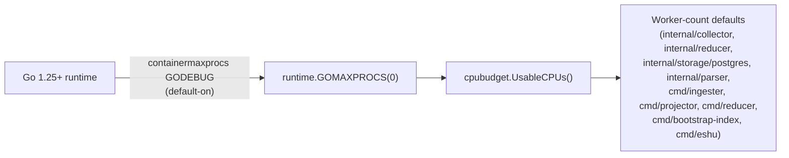

# cpubudget

## Purpose

`cpubudget` is the single source for the CPU count worker-pool defaults use
instead of `runtime.NumCPU()`. Inside a cgroup CPU-quota container
(Kubernetes `resources.limits.cpu`, Docker `--cpus`), `runtime.NumCPU()`
reports the HOST cpu count and overestimates usable CPU, causing worker
pools sized off it to over-spawn relative to what the container can
actually schedule.

The fix is not a reimplementation of cgroup reading: on Go 1.25+, the
runtime itself already sets `GOMAXPROCS` from the container cgroup CPU quota
(the `containermaxprocs` GODEBUG, default-on since Go 1.25). That means
`runtime.GOMAXPROCS(0)` is already the cgroup-aware usable-CPU count — the
only gap was that worker-count defaults across the codebase read
`runtime.NumCPU()` (always host-wide) instead. `cpubudget.UsableCPUs()` is a
one-line wrapper over `runtime.GOMAXPROCS(0)` (floored at 1); routing every
worker default through it is the entire fix.

## Where this fits

## Ownership boundary

Owns `UsableCPUs`. Every worker-count default in the codebase that
previously called `runtime.NumCPU()` directly now calls
`cpubudget.UsableCPUs()` instead, so there is exactly one place that decides
what "usable CPU" means for those call sites. `internal/parser`'s
`go_package_interface_prescan.go` worker-sizing site was on `runtime.NumCPU()`
(a deferred exception) and is routed as of #4759 — see "Formerly deferred:
internal/parser" below. `interproc/solve.go` intentionally stays on
`runtime.GOMAXPROCS(0)`: `interproc` is a standard-library-only package (its
`AGENTS.md` contract), and `GOMAXPROCS(0)` is already cgroup-aware under Go
1.25+ (which is exactly what `UsableCPUs()` wraps), so routing it would add a
dependency for no behavior change.

## Exported surface

- `UsableCPUs() int` — returns `runtime.GOMAXPROCS(0)`, floored at 1. Call
  this wherever a worker-count default previously called `runtime.NumCPU()`.
  There is no setup call required — the Go runtime configures
  `GOMAXPROCS` from the container cgroup automatically on Go 1.25+, before
  `main()` even starts.

See `doc.go` for the godoc contract.

## Dependencies

Standard library only (`runtime`). No internal packages — this is a
deliberate leaf package so any package in the module tree can import it
without risking an import cycle (see Gotchas below).

## No-Observability-Change:

There is no manual configuration step and no structured log line here —
`GOMAXPROCS` is set by the Go runtime itself before any Eshu code runs, the
same way it always has been. `UsableCPUs()` is a pure read with no
side effect to log. Operators who want to see the effective value can
already read it from the Go runtime's own metrics/expvar surfaces, or infer
it from worker-count env vars (`ESHU_SNAPSHOT_WORKERS`, etc.) if explicitly
set. This intentionally differs from `internal/runtime.ConfigureMemoryLimit`,
which does log, because `ConfigureMemoryLimit` performs an active
configuration step (`debug.SetMemoryLimit`) that has no Go-runtime-native
equivalent; `UsableCPUs` has nothing to configure.

## Formerly deferred: internal/parser

`internal/parser/go_package_interface_prescan.go` was a deliberate, temporary
exception (not an import-cycle blocker — `cpubudget` has zero internal
dependencies, so `internal/parser` could always import it safely). It was on
`runtime.NumCPU()` (host core count, not cgroup-aware). Any change under
`go/internal/parser/*.go` trips the parser-relationship-kit gate, which requires
a parser `*_test.go` change AND a language-support doc update in lockstep; that
gate is designed for language/query capability changes, and there was no honest
language-support doc to write for "this pool now reads GOMAXPROCS instead of
NumCPU." #4759 routes this site and satisfies the gate with a mechanical
worker-count regression test plus this doc note in lieu of a language-support
change, since no language/query capability changed.

`internal/parser/interproc/solve.go` is intentionally NOT routed: `interproc`
is a standard-library-only package (see its `AGENTS.md`), so importing
`cpubudget` would violate that scoped contract — and it was already on
`runtime.GOMAXPROCS(0)`, which is cgroup-aware under Go 1.25+ (exactly what
`UsableCPUs()` returns), so it needs no routing. It stays on the stdlib path.

## Gotchas / invariants

- **This package exists specifically to avoid an import cycle.** Worker
  defaults live in `internal/reducer` and `internal/collector`, neither of
  which can import `internal/runtime` (home of `ConfigureMemoryLimit`)
  without closing a cycle: `internal/runtime`'s own tests import
  `internal/coordinator` → `internal/collector/awscloud/awsruntime` →
  `internal/collector`, and `internal/runtime` also imports
  `internal/recovery` → `internal/projector` → `internal/reducer`.
  `cpubudget` has zero internal dependencies, so every package that needs
  the usable-CPU count can import it safely — `internal/parser` included
  (routed as of #4759).
- **This relies on the Go toolchain, not on this package, to read cgroups.**
  `TestGoDirectiveSupportsAutomaticGOMAXPROCS` in `cpubudget_test.go` asserts
  this module's `go.mod` `go` directive is `>= 1.25`. If that directive is
  ever downgraded below 1.25, the automatic-GOMAXPROCS backstop this package
  relies on disappears and `UsableCPUs()` silently reverts to reporting the
  host CPU count in a cgroup-limited container. That test failing is the
  signal to bring back a handwritten cgroup-quota reader.
- **`GOMAXPROCS` env var still wins.** If an operator sets `GOMAXPROCS`
  directly, the Go runtime applies it before any Eshu code runs, and
  `runtime.GOMAXPROCS(0)` reflects that override — `UsableCPUs()` requires no
  special-casing for this because it just reads the current value.
- On a dev machine or CI runner without a cgroup CPU quota (or a quota `>=`
  the host CPU count), `UsableCPUs()` returns the same value
  `runtime.NumCPU()` would have — this is a no-op path, not a behavior
  change, for every unconstrained environment.

## Related docs

- `go/internal/runtime/README.md` — `ConfigureMemoryLimit`, the memory-side
  sibling. Memory has no Go-runtime-native cgroup awareness, so it still
  needs its own handwritten cgroup-limit reader and an active configuration
  call; CPU does not.
- `go/internal/cpubudget/evidence-4456-cgroup-cpu-sizing.md` — no-regression
  evidence for the cgroup-CPU-sizing change and the full routing table.

## #4759 routing of the parser worker-sizing site

No-Regression Evidence: routing `internal/parser`'s `effectivePackagePrescanWorkers`
(`go_package_interface_prescan.go`) through `cpubudget.UsableCPUs()` — it
previously used `runtime.NumCPU()` (host core count, not cgroup-aware) — changes
the default from the host count to `runtime.GOMAXPROCS(0)` floored at 1
(cgroup-aware under Go 1.25+), preserving the existing `min(default, 8)` /
`NumCPU*2` override clamps exactly (verified by direct source diff and by
`TestEffectivePackagePrescanWorkers*`, which pin the worker count against
`runtime.GOMAXPROCS(0)`). Under an active cgroup CPU quota the count correctly
drops to the CPU budget instead of the host core count, preventing worker
over-subscription; it never becomes a fixed low constant, so this is not a
serialization workaround. No throughput regression on the parse path — worker
count is aligned to available CPU, not reduced below it. `interproc/solve.go`
is left on `runtime.GOMAXPROCS(0)` (already cgroup-aware, and `interproc` is
standard-library-only) — no change there.

No-Observability-Change: no new metric, span, log field, or runtime knob is
introduced; the parser worker count is not separately instrumented and
parse-stage timing remains visible through existing collector snapshot
telemetry.
