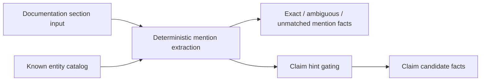

# Doc Truth

## Purpose

`doctruth` extracts entity mentions and non-authoritative claim candidates
from bounded documentation sections. It converts documentation collector facts
into follow-on evidence facts that a documentation updater can review without
treating free-form prose as operational truth.

## Ownership Boundary

This package owns deterministic extraction only. It does not call Confluence,
GitHub, databases, graph stores, or LLM APIs. Callers provide section text,
structured hints, links, known Eshu entities, and telemetry dependencies.
Claim candidates come from structured `ClaimHint` inputs; the extractor only
gates them on exact mention resolution and provenance.

## Flow

## Invariants

- Claim candidates are document evidence only; they never become operational
  truth in this package.
- Ambiguous or unmatched subject mentions suppress claim candidate emission.
- Every emitted claim candidate carries document, revision, section, and excerpt
  hash provenance.
- Metrics use bounded labels only; section IDs and claim IDs belong in logs or
  payloads, not metric attributes.
