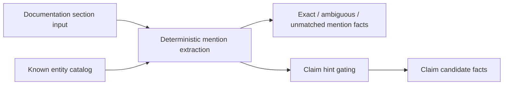

# Doc Truth

## Purpose

`doctruth` extracts entity mentions and non-authoritative claim candidates
from bounded documentation sections. It also verifies explicitly checkable
documentation claims against caller-supplied truth sources and emits durable
finding and evidence-packet facts. The package converts documentation collector
facts or local document inputs into follow-on evidence that an updater can
review without treating free-form prose as operational truth.

## Ownership Boundary

This package owns deterministic extraction and verification only. It does not
call Confluence, GitHub, databases, graph stores, or LLM APIs. Callers provide
section text, structured hints, links, known Eshu entities, command trees,
OpenAPI endpoint inventories, environment-variable inventories, and telemetry
dependencies. Claim candidates come from structured `ClaimHint` inputs or
bounded local-document claim extraction; the extractor and verifier only gate
them on exact deterministic evidence and provenance.

## Flow

`Verifier` is the active documentation claim checker used by
`eshu docs verify`. Its first implementation slice checks Markdown-family
documents for exact `eshu ...` command claims, HTTP endpoint claims, and
`ESHU_*` environment variable claims. It emits `documentation_finding` and
`documentation_evidence_packet` fact envelopes with explicit statuses:
`valid`, `contradicted`, `missing_evidence`, and
`unsupported_claim_type`.

## Invariants

- Claim candidates are document evidence only; they never become operational
  truth in this package.
- Ambiguous or unmatched subject mentions suppress claim candidate emission.
- Every emitted claim candidate carries document, revision, section, and excerpt
  hash provenance.
- Every verification finding carries document, section, normalized claim,
  status, permission, and packet identity. A parsed claim is not valid unless
  it matched a supplied truth source.
- Unsupported claim families remain `unsupported_claim_type`; they are not
  silently passed.
- Metrics use bounded labels only; section IDs and claim IDs belong in logs or
  payloads, not metric attributes.

## Drift Findings

`DeploymentDriftAnalyzer` compares `service_deployment` claim candidates with
current deployment truth supplied by the caller. The analyzer does not query the
graph or documentation source itself. It expects callers to pass exact mention
payloads, the candidate claim, and the current deployment refs already loaded
from Eshu truth.

The analyzer returns read-only `service_deployment_drift` findings with explicit
states: `match`, `conflict`, `ambiguous`, `unsupported`, `stale`, and
`building`. Documentation claims never override graph truth; stale, building,
missing, or ambiguous graph truth stays visible in the finding instead of being
collapsed into a confident conflict.
