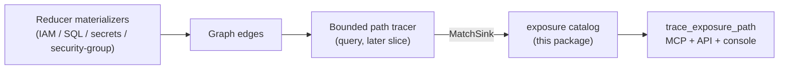

# Exposure

## Purpose

`exposure` is the declarative half of Eshu's **code-to-cloud reachability taint**
capability (epic [#2704](https://github.com/eshu-hq/eshu/issues/2704), Level 1).
It answers the differentiating question: *is untrusted input reaching a
cloud-exposed or privileged sink?*

The package holds curated, closed-vocabulary catalogs that name **what counts as
a sink** and **what counts as a taint source**, and — in a later slice — the
bounded path tracer that walks from an internet-exposed handler to a cloud sink.

It is a **pure analysis package**: it does not read the graph, run Cypher, or
write nodes. It declares the recognition rules that the query/MCP surface
consumes when it traces a path on read.

## Why a cloud sink is the differentiator

Code-only taint tools terminate a path on an AST node (a `.query`, a shell
`exec`). Their node taxonomy has no seam for a non-code sink. Eshu's sink can be
a **correlated cloud fact**: an IAM action a principal can perform, a secret a
node can read, an endpoint reachable from `0.0.0.0/0`. Modeling the sink as a
cloud fact is the capability competitors structurally cannot build.

## Cloud sink catalog (#2724)

The **cloud sink catalog** (`sink_catalog.go`): a closed set of `SinkKind` values,
each recognized by a declared graph relationship + target node label (plus
optional target-property predicates), modeled on
`reducer/iam_escalation_catalog.go`.

| SinkKind                    | Qualifying edge                                              | Severity | Graph-backed |
| --------------------------- | ----------------------------------------------------------- | -------- | ------------ |
| `iam_privileged_action`     | `CAN_PERFORM` / `CAN_ESCALATE_TO` / `CAN_ASSUME` → CloudResource | high / critical / high | yes |
| `secret_reference`          | `SECRETS_IAM_GRANTS_SECRET_READ` → SecretsIAMSecretMetadataPath | high | yes |
| `internet_exposed_endpoint` | `TO` → CidrBlock `{is_internet: true}`                       | high     | yes          |
| `sql_table`                 | `QUERIES_TABLE` → SqlTable                                    | medium   | yes          |
| `shell_exec`                | `EXECUTES_SHELL` → ShellCommand                              | critical | yes          |

Every graph-backed spec cites the reducer/graph file that authors its edge, so
the catalog stays auditable against the real materializers.

### Honesty contract

A sink kind without a materialized graph fact must stay non-graph-backed: it
names no relationship/target and `MatchSink` never returns it. Shell execution
is now graph-backed only through `Function-[:EXECUTES_SHELL]->ShellCommand`;
the materializer stores structural call-site metadata and omits command text,
arguments, and environment values. The bounded tracer still reports
`unresolved` when no declared sink edge is reachable rather than inventing a
match. This is the package's core invariant: never fabricate a path.

### Content-hash discipline

`SinkCatalogVersion()` returns a deterministic SHA-256 over the catalog. Any
field change produces a new value so cached reachability findings invalidate.
`sinkCatalogVersionGolden` pins the current value; the well-formedness test fails
on an undeliberate edit, forcing a conscious version bump (the
`taintModelVersion` discipline borrowed from GitNexus).

## Taint source catalog (#2725)

The **taint-source catalog** (`source_catalog.go`) promotes the parser's existing
dead-code root/handler detection (`dead_code_root_kinds` tokens) into a
first-class, closed `SourceKind` vocabulary. A taint source is an untrusted-input
entry point.

| SourceKind         | Example root-kind tokens                                   | Internet-exposable |
| ------------------ | ---------------------------------------------------------- | ------------------ |
| `http_handler`     | `go.net_http_handler_signature`, `python.fastapi_route_decorator`, `java.spring_request_mapping_method`, `ruby.rails_controller_action` | yes |
| `rpc_handler`      | `java.stapler_web_method`, `elixir.phoenix_liveview_callback` | yes |
| `lambda_handler`   | `python.aws_lambda_handler`                                | yes                |
| `message_consumer` | `python.celery_task_decorator`, `scala.akka_actor_receive` | no                 |
| `cli_command`      | `go.cobra_run_signature`, `python.click_command_decorator` | no                 |

The catalog is **conservative**: entrypoints (`go.main`), public API, lifecycle
callbacks, tests, and generated code are intentionally **not** sources — untrusted
input does not enter there. Every curated root-kind token is verified to be
emitted by a parser (`internal/parser/*/dead_code_roots.go`).

### Honest exposure ranking

`RankSourceExposure(spec, endpointReachesInternet)` ranks exposure without
over-claiming:

- `internet_exposed` — an internet-exposable source whose endpoint **provably**
  reaches `0.0.0.0/0`/`::/0` (the boolean the tracer derives from
  `reducer/security_group_reachability.go`).
- `network_reachable` — internet-exposable but internet reachability unproven
  (may sit behind a private LB). Not over-claimed.
- `internal` — not network-exposable (CLI, queue consumer).

The package never walks the graph itself; the reachability boolean is supplied by
the tracer (#2726). This keeps `exposure` a pure, graph-free leaf package.

## Exposure-path assembler (#2726)

The **path tracer** (`path_trace.go`) is the pure assembly logic behind the
`trace_exposure_path` tool (MCP + `/api/v0/impact/trace-exposure-path`). The query
handler runs the bounded `CALLS*0..n` graph traversal and the catalog sink
recognition, then feeds plain `PathCandidate` data to `BuildExposureFinding`,
which:

- labels every finding `derived` (`TruthLabelDerived`) — Level 1 reachability is
  symbol-level, never value-flow;
- assigns each path a `TraversalState` from the conservative vocabulary
  (`exact` / `partial` / `ambiguous` / `unresolved`);
- computes severity via `CombinePathSeverity`, capping by exposure rank so a
  network-reachable (unproven-internet) or internal source is never over-claimed
  as critical, while an internet-exposed handler reaching a privileged IAM action
  is critical with an honest reason;
- returns `unresolved` with a recorded reason — never a fabricated path — when the
  traversal finds no reachable sink (the production reality until the code-to-cloud
  bridge edges materialize).

The assembler takes plain data, not a graph, so it is fully unit-tested without a
backend; the package stays graph-free.

## Public surface

- `SinkKind`, `Severity`, `SinkPredicate`, `SinkSpec` — the sink vocabulary.
- `SinkCatalog()` / `GraphBackedSinkSpecs()` — defensive copies of sink specs.
- `MatchSink(rel, targetLabel, targetProps)` — sink recognizer used by the tracer.
- `SinkCatalogVersion()` — content hash of the sink catalog.
- `SourceKind`, `SourceSpec`, `ExposureRank` — the source vocabulary.
- `SourceCatalog()` — defensive copy of all source specs.
- `ClassifySource(rootKinds)` — classify a function's root-kind tokens.
- `RankSourceExposure(spec, reachesInternet)` — honest exposure ranking.
- `SourceCatalogVersion()` — content hash of the source catalog.

## Where this fits in the pipeline



## Invariants

- **Closed vocabulary** — a sink is exactly one of the `SinkKind` values.
- **Recognition is declarative** — only a declared (relationship, target,
  predicates) tuple matches; no heuristic string matching.
- **Conservative predicates** — a missing target property fails the predicate, so
  a non-internet or unlabeled CIDR block never qualifies as an internet sink.
- **No fabrication** — non-graph-backed kinds are never matched.
- **Deterministic** — `SinkCatalogVersion` is order-independent and stable.
- **No graph access** — this package never runs Cypher or imports storage.

## Verification

```bash
cd go && go test ./internal/exposure -count=1
cd go && golangci-lint run ./internal/exposure/...
```
