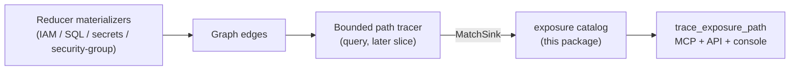

# Exposure

## Purpose

`exposure` is the declarative half of Eshu's **code-to-cloud reachability taint**
capability (epic [#2704](https://github.com/eshu-hq/eshu/issues/2704), Level 1).
It answers the differentiating question: *is untrusted input reaching a
cloud-exposed or privileged sink?*

The package holds curated, closed-vocabulary catalogs that name **what counts as
a sink** (this slice) and — in later slices — taint sources and the bounded path
tracer that walks from an internet-exposed handler to a cloud sink.

It is a **pure analysis package**: it does not read the graph, run Cypher, or
write nodes. It declares the recognition rules that the query/MCP surface
consumes when it traces a path on read.

## Why a cloud sink is the differentiator

Code-only taint tools terminate a path on an AST node (a `.query`, a shell
`exec`). Their node taxonomy has no seam for a non-code sink. Eshu's sink can be
a **correlated cloud fact**: an IAM action a principal can perform, a secret a
node can read, an endpoint reachable from `0.0.0.0/0`. Modeling the sink as a
cloud fact is the capability competitors structurally cannot build.

## What this slice ships (#2724)

The **cloud sink catalog** (`sink_catalog.go`): a closed set of `SinkKind` values,
each recognized by a declared graph relationship + target node label (plus
optional target-property predicates), modeled on
`reducer/iam_escalation_catalog.go`.

| SinkKind                    | Qualifying edge                                              | Severity | Graph-backed |
| --------------------------- | ----------------------------------------------------------- | -------- | ------------ |
| `iam_privileged_action`     | `CAN_PERFORM` / `CAN_ESCALATE_TO` / `CAN_ASSUME` → CloudResource | high / critical / high | yes |
| `secret_reference`          | `SECRETS_IAM_GRANTS_SECRET_READ` → SecretsIAMSecretMetadataPath | high | yes |
| `internet_exposed_endpoint` | `TO` → CidrBlock `{is_internet: true}`                       | high     | yes          |
| `sql_table`                 | *(none yet — `QUERIES_TABLE` unmaterialized, [#2799](https://github.com/eshu-hq/eshu/issues/2799))* | medium | **no** |
| `shell_exec`                | *(none yet — no command-exec fact, [#2800](https://github.com/eshu-hq/eshu/issues/2800))*           | critical | **no** |

Every graph-backed spec cites the reducer/graph file that authors its edge, so
the catalog stays auditable against the real materializers.

### Honesty contract

Two sink kinds are part of the closed vocabulary but have **no materialized graph
fact** today and are declared non-graph-backed:

- `sql_table` — `Function-[:QUERIES_TABLE]->SqlTable` is only a MATCH clause in
  `query/impact.go` with no edge writer; tracked by
  [#2799](https://github.com/eshu-hq/eshu/issues/2799).
- `shell_exec` — no command/shell-execution graph fact exists; tracked by
  [#2800](https://github.com/eshu-hq/eshu/issues/2800).

A non-graph-backed spec names no relationship/target and `MatchSink` never
returns it. The bounded tracer reports such a sink `unresolved` rather than
inventing a match. This is the package's core invariant — **never fabricate a
path**. When a follow-up materializes the edge, flip the spec to graph-backed
and re-pin the version golden.

### Content-hash discipline

`SinkCatalogVersion()` returns a deterministic SHA-256 over the catalog. Any
field change produces a new value so cached reachability findings invalidate.
`sinkCatalogVersionGolden` pins the current value; the well-formedness test fails
on an undeliberate edit, forcing a conscious version bump (the
`taintModelVersion` discipline borrowed from GitNexus).

## Public surface

- `SinkKind`, `Severity`, `SinkPredicate`, `SinkSpec` — the catalog vocabulary.
- `SinkCatalog()` — defensive copy of all specs.
- `GraphBackedSinkSpecs()` — only specs that recognize a materialized edge.
- `MatchSink(rel, targetLabel, targetProps)` — recognizer used by the tracer.
- `SinkCatalogVersion()` — content hash of the catalog.

## Where this fits in the pipeline



## Invariants

- **Closed vocabulary** — a sink is exactly one of the `SinkKind` values.
- **Recognition is declarative** — only a declared (relationship, target,
  predicates) tuple matches; no heuristic string matching.
- **Conservative predicates** — a missing target property fails the predicate, so
  a non-internet or unlabeled CIDR block never qualifies as an internet sink.
- **No fabrication** — non-graph-backed kinds are never matched.
- **Deterministic** — `SinkCatalogVersion` is order-independent and stable.
- **No graph access** — this package never runs Cypher or imports storage.

## Verification

```bash
cd go && go test ./internal/exposure -count=1
cd go && golangci-lint run ./internal/exposure/...
```
