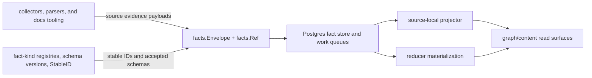

# Facts

## Purpose

`facts` defines the durable Go representations that Eshu writes before graph
projection. An `Envelope` carries one parsed observation from a collector or
parser through the queue, into the projector, and on to the reducer. A `Ref`
identifies the source-local record that produced the fact. These types are the
contract between collection, queueing, projection, and reducer-owned
materialization.

## Where this fits

The package defines durable evidence shapes. Projectors and reducers decide how
that evidence becomes graph, content, or query truth.

## Ownership boundary

Owns the durable fact value types and the stable-ID function. Per the ownership
table in `CLAUDE.md`: `go/internal/facts/` — durable fact models and queue
contracts.

This package does not own queue row logic (`internal/queue`), scope identity
(`internal/scope`), graph writes, or Postgres persistence. Those packages
consume these types as their input or storage shape.

## Exported surface

- `Envelope` — the interchange unit that travels from collector to projector.
  Fields: `FactID`, `ScopeID`, `GenerationID`, `FactKind`, `StableFactKey`,
  `SchemaVersion`, `CollectorKind`, `FencingToken`, `SourceConfidence`,
  `ObservedAt`, `Payload`, `IsTombstone`, `SourceRef`.
- `Ref` — the source-local provenance record embedded in `Envelope.SourceRef`.
  Fields: `SourceSystem`, `ScopeID`, `GenerationID`, `FactKey`, `SourceURI`,
  `SourceRecordID`.
- `Envelope.ScopeGenerationKey()` — returns the durable `scopeID:generationID`
  boundary string used by callers to group envelopes by scope generation.
- `Ref.ScopeGenerationKey()` — same boundary string on the ref side.
- `Envelope.Clone()` — deep-copies the envelope including nested `Payload` maps
  and slices; safe to pass to replay pipelines that must not share mutable
  state.
- `StableID(factType, identity)` — deterministic SHA-256 hex ID derived from
  `factType` and the normalized `identity` map; used to assign a stable fact
  key that survives re-ingestion of the same source record.
- `CoreFactKinds()` and `IsCoreFactKind(kind)` — the generated aggregate
  registry of core-owned fact kinds used by optional component validation to
  reject extension namespace collisions.
- `FactKindRegistry()`, `FactKindRegistryEntryFor(kind)`, and
  `ValidateFactKindRegistry(entries)` — the generated fact-kind contract that
  records schema version, lifecycle owner, reducer domain, projection hook,
  admission hook, read surface, truth profile, optional semantic policy gate,
  and no-provider posture for each core fact kind. Registry v1.1 adds three
  optional per-kind fields: `PayloadSchema` (repo-relative path to a checked-in
  JSON Schema artifact under `sdk/go/factschema/schema/`), `DeprecatedIn`, and
  `RemovedIn` (semver deprecation markers). They stay blank on entries that
  have not adopted a typed schema or a deprecation plan. See
  [Fact Schema Versioning](../../../docs/public/reference/fact-schema-versioning.md).
- Documentation fact payloads — source-neutral payload structs and stable-ID
  helpers for documentation sources, documents, sections, links, entity
  mentions, non-authoritative claim candidates, owner references, ACL
  summaries, and evidence references.
- Semantic evidence payloads — provenance-rich documentation observations and
  code hints emitted by optional semantic extraction. These facts carry source,
  chunk, provider-profile, prompt-version, redaction, policy, confidence,
  freshness, and admission/corroboration state; they are not canonical graph
  truth by themselves.
- Semantic validation helpers — `ValidateSemanticDocumentationObservationPayload`
  and `ValidateSemanticCodeHintPayload` reject missing replay provenance and
  direct model-to-canonical promotion states before a caller persists semantic
  output.
- Fact-family registries — each source family exposes `<Family>FactKinds()` and
  `<Family>SchemaVersion(kind)` helpers. Use them instead of copying literals
  when constructing envelopes or validating component ownership.
- Central schema-version registry — `SchemaVersion(kind)`,
  `SupportedSchemaVersions()`, `ClassifySchemaVersion(kind, candidate)`, and
  `ValidateSchemaVersion(kind, candidate)` dispatch over every per-family schema
  version so reducers, projectors, component activation, and API/MCP/CLI
  diagnostics classify a collector's fact version identically. `Compatibility`
  is `supported`, `unsupported_major`, `unsupported_minor`, or `unknown_kind`;
  unsupported majors are rejected with no silent fallback. See
  [Fact Schema Versioning](../../../docs/public/reference/fact-schema-versioning.md).

The generated fact-kind contract source is
`specs/fact-kind-registry.v1.yaml`; it emits
[`fact_kind_registry.generated.go`](fact_kind_registry.generated.go) and
[`FACT_KIND_REGISTRIES.md`](FACT_KIND_REGISTRIES.md). Public operator-facing
descriptions live in
`docs/public/reference/fact-envelope-reference.md`. See `doc.go` for the full
godoc contract.

## Dependencies

No internal package imports. `internal/facts` is a leaf contract package. It
depends only on the Go standard library.

## Telemetry

This package emits no metrics, spans, or logs. Telemetry around fact loading
and processing lives in `internal/projector` and `internal/storage/postgres`.

## Gotchas / invariants

- `Envelope` fields and their types are frozen on-disk contracts. New fields
  must be additive; removing or renaming a field breaks stored rows. The
  `doc.go` contract states this explicitly.
- `CollectorKind` and `SourceConfidence` are part of the durable collector
  contract. `CollectorKind` says which collector family emitted the fact.
  `SourceConfidence` says how Eshu learned it: direct observation, external
  report, inference, or derived materialization. New collector code should set
  both fields explicitly instead of relying on storage defaults.
- `Envelope.Payload` is a `map[string]any`. Callers must not mutate the map
  after passing the envelope to a downstream stage. Use `Clone` when branching
  or replaying.
- Documentation claim candidates are evidence about what documentation says.
  They are not operational truth and must not override source-code, deployment,
  runtime, or graph truth.
- Semantic documentation observations and code hints follow the same evidence
  rule. They are optional semantic output with replay provenance; reducers and
  query surfaces must not promote model output into service, deployment,
  runtime, vulnerability, or infrastructure truth without deterministic
  corroboration.
- Documentation ACL and owner fields are source-reported context. They help
  explain provenance and visibility, but they do not become authorization
  policy inside the facts package.
- `DocumentationACLSummary.SourceACLState` is an optional, bounded source-ACL
  observation using the `allowed|denied|partial|missing|stale` vocabulary shared
  with `semanticpolicy` (see the `SourceACLState*` constants). It is additive and
  backward-compatible: collectors set it only when they observe a real
  access-posture signal at the origin and omit it entirely otherwise — absence
  means "no ACL claim". A denied, partial, missing, or stale observation is never
  upgraded to allowed, and the field carries no raw principals, identities, or
  private URLs. Choosing a conservative default for unobserved sources is a
  disclosure decision reserved for security review and the reducer/query
  surfaces, not the facts package.
- The optional `ACLSummary` on the derived documentation evidence payloads
  (`DocumentationEntityMentionPayload`, `DocumentationClaimCandidatePayload`, and
  `SemanticDocumentationObservationPayload`) carries the same bounded posture
  propagated verbatim from the source/document the evidence was extracted from
  (`BoundedSourceACLState`). A mention, claim, or observation inherits its
  document's observed `source_acl_state` so the docs-evidence projection and
  readbacks carry the posture end-to-end. It is omitted when the document
  asserted no bounded ACL claim. This is factual propagation of an observed
  posture, never a disclosure or enforcement decision.
- Documentation section payloads can carry source-native body content for
  downstream diff generation. Callers must treat that content as sensitive
  source data: persist it only through the fact store and never add it to logs,
  metrics, or stable-ID identity maps.
- `StableID` panics if `json.Marshal` fails on the identity map. Callers must
  not pass identity maps containing non-serializable values.
- `IsTombstone` is set by the collector to signal deletion. Projectors and
  reducers must check this flag before writing graph nodes.

## Related docs

- `docs/public/architecture.md` — pipeline and ownership table
- `docs/public/deployment/service-runtimes.md` — ingester and projector runtime
  lanes
