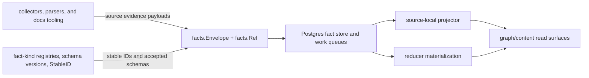

# Facts

## Purpose

`facts` defines the durable Go representations that Eshu writes before graph
projection. An `Envelope` carries one parsed observation from a collector or
parser through the queue, into the projector, and on to the reducer. A `Ref`
identifies the source-local record that produced the fact. These types are the
contract between collection, queueing, projection, and reducer-owned
materialization.

## Where this fits

The package defines durable evidence shapes. Projectors and reducers decide how
that evidence becomes graph, content, or query truth.

## Ownership boundary

Owns the durable fact value types and the stable-ID function. Per the ownership
table in `CLAUDE.md`: `go/internal/facts/` — durable fact models and queue
contracts.

This package does not own queue row logic (`internal/queue`), scope identity
(`internal/scope`), graph writes, or Postgres persistence. Those packages
consume these types as their input or storage shape.

## Exported surface

- `Envelope` — the interchange unit that travels from collector to projector.
  Fields: `FactID`, `ScopeID`, `GenerationID`, `FactKind`, `StableFactKey`,
  `SchemaVersion`, `CollectorKind`, `FencingToken`, `SourceConfidence`,
  `ObservedAt`, `Payload`, `IsTombstone`, `SourceRef`.
- `Ref` — the source-local provenance record embedded in `Envelope.SourceRef`.
  Fields: `SourceSystem`, `ScopeID`, `GenerationID`, `FactKey`, `SourceURI`,
  `SourceRecordID`.
- `Envelope.ScopeGenerationKey()` — returns the durable `scopeID:generationID`
  boundary string used by callers to group envelopes by scope generation.
- `Ref.ScopeGenerationKey()` — same boundary string on the ref side.
- `Envelope.Clone()` — deep-copies the envelope including nested `Payload` maps
  and slices; safe to pass to replay pipelines that must not share mutable
  state.
- `StableID(factType, identity)` — deterministic SHA-256 hex ID derived from
  `factType` and the normalized `identity` map; used to assign a stable fact
  key that survives re-ingestion of the same source record.
- Documentation fact payloads — source-neutral payload structs and stable-ID
  helpers for documentation sources, documents, sections, links, entity
  mentions, non-authoritative claim candidates, owner references, ACL
  summaries, and evidence references.

Documentation fact kinds use these schema versions:

- `documentation_source` — `1.0.0`
- `documentation_document` — `1.0.0`
- `documentation_section` — `1.1.0`
- `documentation_link` — `1.0.0`
- `documentation_entity_mention` — `1.0.0`
- `documentation_claim_candidate` — `1.0.0`

`documentation_section` uses schema version `1.1.0` and may include
source-native `content` and `content_format` fields for updater diffing.

Terraform state fact kinds also use schema version `1.0.0` for the first
collector contract:

- `terraform_state_candidate`
- `terraform_state_snapshot`
- `terraform_state_resource`
- `terraform_state_output`
- `terraform_state_module`
- `terraform_state_provider_binding`
- `terraform_state_tag_observation`
- `terraform_state_warning`

Use `TerraformStateFactKinds` when callers need the full accepted set, and
`TerraformStateSchemaVersion` when building envelopes. That keeps reader code
from copying string literals.

`terraform_state_candidate` is emitted by the Git collector, not by the
Terraform-state reader. It is metadata-only evidence for repo-local `.tfstate`
files and must not contain raw state content or an absolute local path.

Package registry fact kinds use schema version `1.0.0` for the first collector
contract:

- `package_registry.package`
- `package_registry.package_version`
- `package_registry.package_dependency`
- `package_registry.package_artifact`
- `package_registry.source_hint`
- `package_registry.vulnerability_hint`
- `package_registry.registry_event`
- `package_registry.repository_hosting`
- `package_registry.warning`

Use `PackageRegistryFactKinds` when callers need the full accepted set, and
`PackageRegistrySchemaVersion` when building package-registry envelopes. These
facts are reported registry evidence. Reducers must corroborate ownership,
publication, and consumption before graph promotion.

OCI registry fact kinds use schema version `1.0.0` for the first collector
contract:

- `oci_registry.repository`
- `oci_registry.image_tag_observation`
- `oci_registry.image_manifest`
- `oci_registry.image_index`
- `oci_registry.image_descriptor`
- `oci_registry.image_referrer`
- `oci_registry.warning`

Use `OCIRegistryFactKinds` when callers need the full accepted set, and
`OCIRegistrySchemaVersion` when building OCI registry envelopes. These facts are
reported OCI evidence. Tags are mutable observations; digest-addressed
descriptors, manifests, indexes, and referrers carry the stronger identity.

SBOM and attestation fact kinds use schema version `1.0.0` for the first
collector contract:

- `sbom.document`
- `sbom.component`
- `sbom.dependency_relationship`
- `sbom.external_reference`
- `attestation.statement`
- `attestation.slsa_provenance`
- `attestation.signature_verification`
- `sbom.warning`

Use `SBOMAttestationFactKinds` when callers need the full accepted set, and
`SBOMAttestationSchemaVersion` when building SBOM/attestation envelopes. These
facts are sensitive evidence. Reducers must keep document parse status,
subject attachment status, and signature verification status separate.

Vulnerability intelligence fact kinds use schema version `1.0.0` for the first
collector contract:

- `vulnerability.source_snapshot`
- `vulnerability.cve`
- `vulnerability.affected_product`
- `vulnerability.affected_package`
- `vulnerability.os_package`
- `vulnerability.epss_score`
- `vulnerability.known_exploited`
- `vulnerability.reference`
- `vulnerability.warning`
- `vulnerability.go_module_evidence`
- `vulnerability.go_call_reachability`

Use `VulnerabilityIntelligenceFactKinds` when callers need the full accepted
set, and `VulnerabilityIntelligenceSchemaVersion` when building
vulnerability-intelligence envelopes. These facts are source truth only:
reducers must decide package, image, workload, deployment, and fixed-version
impact. `vulnerability.source_snapshot` may carry advisory source-cache
metadata such as cache artifact version, snapshot digest, update time,
expiration, freshness, and cache mode; those fields describe source lifecycle
only and must not be promoted into impact truth. `vulnerability.os_package`
preserves installed Alpine apk or Debian dpkg package evidence for reducer-owned
vendor-advisory matching; collectors and scanner workers leave
`fixed_version_source` empty until a reducer joins matching advisory evidence.

Provider security alert fact kinds use schema version `1.0.0` for the first
collector contract:

- `security_alert.repository_alert`

Use `SecurityAlertFactKinds` when callers need the accepted provider alert
source fact set, and `SecurityAlertSchemaVersion` when building provider alert
envelopes. These facts preserve provider-reported repository alert state,
dependency coordinates, advisory IDs, severity, timestamps, and source URLs.
They are source evidence only: reducers must reconcile them with Eshu-owned
package consumption and vulnerability impact facts before any user-facing
impact state is reported.

Incident-context fact kinds use schema version `1.0.0` for the first collector
contract:

- `incident.record`
- `incident.lifecycle_event`
- `change.record`

Use `IncidentContextFactKinds` when callers need the accepted incident-context
source fact set, and `IncidentContextSchemaVersion` when building incident
context envelopes. These facts preserve provider-reported incident state,
incident timeline events, and related change events. They are source evidence
only: reducers and read models must correlate them with runtime, image, commit,
pull-request, and work-item evidence before presenting an incident context
path.

Incident-routing fact kinds use schema version `1.0.0` for the first source
contract:

- `incident_routing.applied_pagerduty_resource`
- `incident_routing.applied_alert_route`
- `incident_routing.coverage_warning`

Use `IncidentRoutingFactKinds` when callers need the accepted
incident-routing source fact set, and `IncidentRoutingSchemaVersion` when
building incident-routing envelopes. These facts preserve applied
Terraform-state evidence for PagerDuty resources and alert-routing resources.
They are source evidence only: reducers and read models must compare them with
declared source evidence and live provider evidence before presenting incident
routing coverage, drift, or context paths.

Work-item fact kinds use schema version `1.0.0` for the first Jira collector
contract:

- `work_item.record`
- `work_item.transition`
- `work_item.external_link`

Use `WorkItemFactKinds` when callers need the accepted work-item source fact
set, and `WorkItemSchemaVersion` when building work-item envelopes. These facts
preserve Jira issue state, changelog IDs, and remote links as source evidence
only. Reducers and query surfaces must prove incident, deployment, code, or PR
relationships before presenting those paths as Eshu truth.

Vulnerability suppression fact kinds use schema version `1.0.0` for the
first VEX and operator-policy contract:

- `vulnerability.suppression`

Use `VulnerabilitySuppressionFactKinds` when callers need the accepted set
and `VulnerabilitySuppressionSchemaVersion` when building suppression
envelopes. Suppression facts are first-class evidence: every record carries
the source (`vex_statement`, `eshu_policy`, or `provider_dismissal`), a
VEX-style justification (`not_affected`, `accepted_risk`,
`false_positive`, `ignored`, or `provider_dismissed`), an author, an
authored timestamp, an optional expiration, a free-text reason, a bounded
scope (`cve_id`, `advisory_id`, `package_id`, `purl`, `repository_id`,
`subject_digest`, `evidence_path`), and an `evidence_ref` pointing at the
originating fact or document. Provider dismissals stay evidence: the
reducer surfaces them as `provider_dismissed` and never auto-hides the
finding. The reducer applies operator suppressions only when scope matches
the finding identity and evidence path; expired suppressions and
scope-mismatched suppressions remain visible so operators can audit drift.

Scanner-worker fact kinds use schema version `1.0.0` for the first isolated
analyzer contract:

- `scanner_worker.analysis`
- `scanner_worker.warning`

Use `ScannerWorkerFactKinds` when callers need the accepted scanner-worker
source fact set, and `ScannerWorkerSchemaVersion` when building source fact
envelopes. Scanner-worker facts are source evidence only. Reducers must admit
security findings, coverage, priority, and remediation truth from those facts.
Image analyzer `scanner_worker.analysis` facts mark completed coverage without
asserting impact, while `scanner_worker.warning` facts mark unsupported or
unconfigured analyzer coverage as `analysis_status=not_scanned` and
`coverage_status=unsupported`.

Service catalog fact kinds use schema version `1.0.0` for the first collector
contract:

- `service_catalog.entity`
- `service_catalog.ownership`
- `service_catalog.repository_link`
- `service_catalog.dependency`
- `service_catalog.api_link`
- `service_catalog.operational_link`
- `service_catalog.scorecard_definition`
- `service_catalog.scorecard_result`
- `service_catalog.warning`

Use `ServiceCatalogFactKinds` when callers need the full accepted set, and
`ServiceCatalogSchemaVersion` when building service-catalog envelopes. These
facts are organizational declarations and source context. Reducers must
corroborate ownership, dependency, workload, API, and drift truth before
promotion.

AWS cloud fact kinds use schema version `1.0.0` for the first collector
contract:

- `aws_resource`
- `aws_relationship`
- `aws_tag_observation`
- `aws_dns_record`
- `aws_image_reference`
- `aws_security_group_rule`
- `aws_iam_permission`
- `aws_warning`

`aws_security_group_rule` is a derived posture fact: one normalized EC2
security-group ingress/egress rule carrying the reachability tuple (group,
direction, protocol, port range, normalized source) plus metadata-only derived
booleans. It is distinct from the raw `aws_resource` security-group-rule
observation; the reducer projects it into network-reachability edges.

`aws_iam_permission` is the derived, metadata-only projection of one IAM policy
statement attached to a principal: effect, normalized action set,
resource pattern, and a condition-key summary. It never carries the raw policy
JSON body or condition values. PR1 emits this fact; the reducer graph
projection that consumes it ships separately under principal review (issue
#1134).

Use `AWSFactKinds` when callers need the full accepted set, and
`AWSSchemaVersion` when building AWS cloud envelopes. These facts are reported
AWS evidence. Reducers must corroborate workload, deployment, ownership, and
environment truth before graph promotion.

The S3 bucket posture fact kind uses schema version `1.0.0` for the first
collector contract:

- `s3_bucket_posture`

Use `S3BucketPostureFactKinds` and `S3BucketPostureSchemaVersion` for the
accepted set and version. This is a derived, metadata-only posture fact emitted
per bucket by the AWS collector: block-public-access flags, default-encryption
detail (SSE-KMS key ARN and bucket-key state), versioning and MFA-delete state,
object-ownership / ACL-disabled state, access-logging target, replication
presence, and booleans DERIVED from the bucket policy document (public grant,
cross-account principal). It never carries the raw bucket policy JSON, ACL
grants, or object data. It is source evidence only; reducer graph projection of
this posture is a separate consumer.
RDS posture fact kinds use schema version `1.0.0` for the first metadata-only
posture contract:

- `rds_instance_posture`

Use `RDSPostureFactKinds` when callers need the accepted set, and
`RDSPostureSchemaVersion` when building RDS posture envelopes. The RDS scanner
derives one `rds_instance_posture` fact per DB instance and Aurora DB cluster
from the existing describe pass: public exposure, encryption and KMS key, IAM
database authentication, backup retention, multi-AZ, deletion protection,
Performance Insights configuration (enabled, retention, PI-KMS key),
parameter/option-group identity, a curated set of security-relevant
parameters, and the CA certificate identifier. These facts are metadata-only
control-plane evidence: they never carry database contents, master usernames,
connection secrets, snapshot payloads, log bodies, or Performance Insights
samples. They emit no graph edges; reducers own KMS, parameter/option-group,
and internet-exposure projection from this evidence.

EC2 instance posture fact kinds use schema version `1.0.0` for the first
metadata-only posture contract:

- `ec2_instance_posture`

Use `EC2InstancePostureFactKinds` when callers need the accepted set, and
`EC2InstancePostureSchemaVersion` when building EC2 instance posture envelopes.
The EC2 scanner derives one `ec2_instance_posture` fact per instance from the
existing DescribeInstances pass: IMDS settings (IMDSv2-required, hop limit,
endpoint state), user-data PRESENCE (a boolean only), detailed monitoring, EBS
optimization, public-IP association, the attached instance-profile ARN,
per-volume block-device metadata, and tenancy / Nitro-enclave state. These facts
are metadata-only control-plane evidence: they never carry the user-data content
(which can embed secrets), instance console output, environment variables, or any
other instance payload. They emit no graph edges and no `aws_resource` inventory
fact for the instance; reducers own the USES_PROFILE join to the IAM instance
profile (#1134), the block-device to KMS join, and the derived internet-exposed
flag (#1135). Per-volume encryption is not reported by DescribeInstances, so each
block device's `encrypted` stays unset; reducers resolve it from volume evidence
without per-instance API fan-out at scan time.

See `doc.go` for the full godoc contract.

## Dependencies

No internal package imports. `internal/facts` is a leaf contract package. It
depends only on the Go standard library.

## Telemetry

This package emits no metrics, spans, or logs. Telemetry around fact loading
and processing lives in `internal/projector` and `internal/storage/postgres`.

## Gotchas / invariants

- `Envelope` fields and their types are frozen on-disk contracts. New fields
  must be additive; removing or renaming a field breaks stored rows. The
  `doc.go` contract states this explicitly.
- `CollectorKind` and `SourceConfidence` are part of the durable collector
  contract. `CollectorKind` says which collector family emitted the fact.
  `SourceConfidence` says how Eshu learned it: direct observation, external
  report, inference, or derived materialization. New collector code should set
  both fields explicitly instead of relying on storage defaults.
- `Envelope.Payload` is a `map[string]any`. Callers must not mutate the map
  after passing the envelope to a downstream stage. Use `Clone` when branching
  or replaying.
- Documentation claim candidates are evidence about what documentation says.
  They are not operational truth and must not override source-code, deployment,
  runtime, or graph truth.
- Documentation ACL and owner fields are source-reported context. They help
  explain provenance and visibility, but they do not become authorization
  policy inside the facts package.
- Documentation section payloads can carry source-native body content for
  downstream diff generation. Callers must treat that content as sensitive
  source data: persist it only through the fact store and never add it to logs,
  metrics, or stable-ID identity maps.
- `StableID` panics if `json.Marshal` fails on the identity map. Callers must
  not pass identity maps containing non-serializable values.
- `IsTombstone` is set by the collector to signal deletion. Projectors and
  reducers must check this flag before writing graph nodes.

## Related docs

- `docs/public/architecture.md` — pipeline and ownership table
- `docs/public/deployment/service-runtimes.md` — ingester and projector runtime
  lanes
