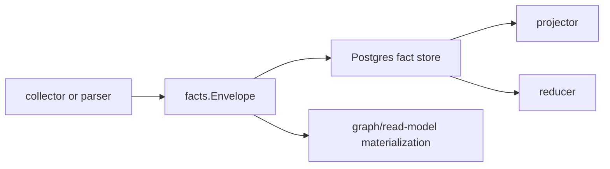

# Facts

## Purpose

`facts` defines the durable Go data-plane records that Eshu writes before graph
projection. `Envelope` carries one source observation through collection,
queueing, projection, reducer materialization, replay, and repair. `Ref`
preserves the source-local provenance for that observation.

## Ownership Boundary

This package owns durable fact value types, source-confidence values, fact-kind
registries, schema-version helpers, and stable-ID helpers. It does not own queue
rows, scope assignment, graph writes, Postgres storage, or reducer admission.

## Core Flow

Every downstream package treats fact IDs, stable keys, schema versions, source
confidence, fencing tokens, and payload shape as persisted contract data.

## Exported Surface

See `doc.go` and `go doc ./internal/facts` for the full contract. The main
surface is:

- base types: `Envelope`, `Ref`
- identity helpers: `StableID`, `Envelope.ScopeGenerationKey`,
  `Ref.ScopeGenerationKey`, `Envelope.Clone`
- source-confidence helpers: `ValidateSourceConfidence` and
  `SourceConfidence*` constants
- fact-kind registries and schema-version helpers for documentation,
  Terraform state, package registry, OCI registry, SBOM/attestation,
  vulnerability intelligence, service catalog, AWS cloud, and CI/CD run
  evidence
- payload and stable-ID helpers for documentation facts

The README should not duplicate every fact-kind constant. Use the focused
`*_test.go` files and `go doc` when changing a family.

## Dependencies

`facts` is a leaf contract package. It imports only the Go standard library.

## Telemetry

This package emits no metrics, spans, or logs. Runtime telemetry around fact
commit, queueing, loading, and processing lives in the packages that perform
that work.

## Gotchas / Invariants

- `Envelope` fields are on-disk contracts. Remove or rename only with a storage
  compatibility plan.
- New fact fields must be additive and backward-compatible.
- `Payload` is mutable Go data. Use `Clone` before branching, replaying, or
  passing an envelope to code that might mutate nested maps or slices.
- `StableID` expects JSON-serializable identity maps. Do not include source
  body content, raw credentials, or high-cardinality mutable values in identity
  maps.
- `FencingToken` travels in the envelope so stale workers cannot overwrite newer
  generation data.
- `terraform_state_candidate` is metadata-only evidence from the Git collector;
  raw state bytes belong on the Terraform-state collector path.
- Registry, cloud, SBOM, vulnerability, service catalog, documentation, and
  CI/CD facts are reported evidence. Reducers decide which parts become graph
  truth.

## Focused Tests

- `go test ./internal/facts -run TestFactEnvelope -count=1`
- `go test ./internal/facts -run TestValidateSourceConfidence -count=1`
- `go test ./internal/facts -run Test.*FactKind -count=1`
- `go test ./internal/facts -run TestDocumentation -count=1`
- `go test ./internal/facts -run Test.*SchemaVersion -count=1`

## Related Docs

- `docs/public/architecture.md`
- `docs/public/deployment/service-runtimes.md`
- `docs/public/reference/fact-envelope-reference.md`
- `docs/public/guides/collector-authoring.md`
