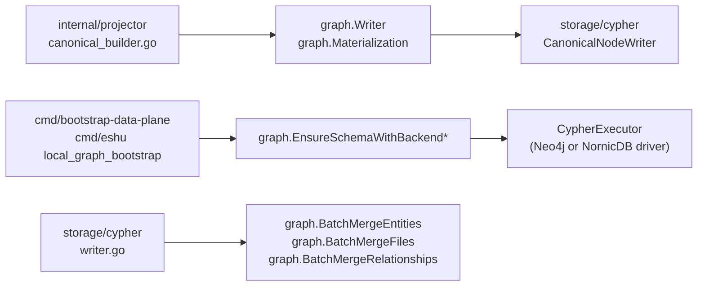

# Graph

## Purpose

`graph` owns the source-local graph write contract and the Cypher builders
used by backend adapters and schema bootstrap. It defines the `Writer` port,
the `Materialization` and `Record` input types, canonical entity merge
builders, batched UNWIND helpers, file and repository deletion mutations, and
the `EnsureSchema` constraint and index contract for both Neo4j and NornicDB
dialects.

`CypherStatement` and `CypherExecutor` live here rather than in
`internal/storage/cypher` to avoid an import cycle between the two packages.

## Where this fits



## Internal structure

```
graph/
  writer.go      — Writer, Materialization, Record, Result, MemoryWriter
  cypher.go      — CypherStatement, CypherExecutor
  entity.go      — EntityProps, BuildEntityMergeStatement, MergeEntity, validators
  batch.go       — BatchEntityRow, BatchFileRow, BatchRelationshipRow, batch helpers
  mutations.go   — DeleteFileFromGraph, DeleteRepositoryFromGraph, ResetRepositorySubtreeInGraph
  schema.go      — SchemaBackend, EnsureSchema, EnsureSchemaWithBackend
                   and EnsureSchemaWithBackendStrict
  schema_application.go — schema fingerprint and compatibility policy helpers
  schema_execution.go — schema DDL progress logging and context-budget handling
  schema_statements.go — ordered schema statement inspection helpers
  schema_labels.go — schema label naming helpers
```

## Ownership boundary

`graph` owns the write contract, entity merge builders, UNWIND helpers,
deletion mutations, and the schema DDL contract. It does not own backend
drivers, connection pooling, or telemetry instrumentation. Those live in
`internal/storage/cypher`, `internal/storage/neo4j`, and their NornicDB
equivalents. Backend dialect differences belong only in the schema dialect
helpers (`schemaDialectForBackend`, `nornicDBSchemaConstraint`).

## Exported surface

### Write contract

- `Writer` — narrow interface: `Write(context.Context, Materialization) (Result, error)`.
- `Materialization` — source-local write payload: `ScopeID`, `GenerationID`,
  `SourceSystem`, `Records`. `Materialization.ScopeGenerationKey()` returns a
  durable boundary string.
- `Record` — one write candidate: `RecordID`, `Kind`, `Attributes`, `Deleted`.
  `Record.Clone()` and `Materialization.Clone()` produce copy-safe values.
- `Result` — write summary: `ScopeID`, `GenerationID`, `RecordCount`,
  `DeletedCount`.
- `MemoryWriter` — in-memory `Writer` for tests and adapters.

### Cypher seam

- `CypherStatement` — one executable statement: `Cypher` string,
  `Parameters map[string]any`.
- `CypherExecutor` — interface: `ExecuteCypher(context.Context, CypherStatement) error`.

### Entity merges

- `EntityProps` — merge inputs: `Label`, `FilePath`, `Name`, `LineNumber`,
  `UID`, `Extra`.
- `ValidateCypherLabel(label string) error` — rejects labels outside the
  safe pattern.
- `ValidateCypherPropertyKeys(keys []string) error` — rejects keys with
  unsafe characters.
- `BuildEntityMergeStatement(props EntityProps) (CypherStatement, error)` —
  builds a MERGE by `uid` when `UID` is set, otherwise by
  `(name, path, line_number)`.
- `MergeEntity(ctx, executor, props)` — executes one entity merge.

### Batch UNWIND

- `DefaultBatchSize` = 500.
- `BatchEntityRow`, `BatchFileRow`, `BatchRelationshipRow` — row types for
  batch writes.
- `BatchMergeEntities(ctx, executor, label, rows, batchSize)` — splits rows
  into UID-identity and name-identity groups and merges each group in
  `batchSize`-row chunks.
- `BatchMergeFiles(ctx, executor, rows, batchSize)` — batch-merges
  `File` nodes.
- `BatchMergeRelationships(ctx, executor, rows, batchSize)` — batch-merges
  relationships. All rows must share source label, target label, and
  relationship type.

### Mutations

- `DeleteFileFromGraph(ctx, executor, filePath)` — deletes a file node and
  its contained entities; prunes orphaned parent directories in a second
  statement.
- `DeleteRepositoryFromGraph(ctx, executor, repoIdentifier) (bool, error)` —
  removes the `Repository` node and its entire owned subtree.
- `ResetRepositorySubtreeInGraph(ctx, executor, repoIdentifier) (bool, error)` —
  deletes the owned subtree while preserving the `Repository` node itself.

### Schema

- `SchemaBackend` — string enum: `SchemaBackendNeo4j`, `SchemaBackendNornicDB`.
- `SchemaStatements() []string` — returns the ordered Neo4j DDL statements
  without executing them; useful for inspection.
- `SchemaStatementsForBackend(backend SchemaBackend) ([]string, error)` —
  returns the dialect-specific ordered DDL statements.
- `SchemaApplicationForBackend(backend SchemaBackend) (SchemaApplication, error)` —
  returns the backend fingerprint, statement count, and explicit compatible
  fingerprints that graph-writing runtimes check before startup.
- `SchemaApplication` — durable schema marker payload written after successful
  bootstrap.
- NornicDB receives `nornicdb_function_legacy_id_lookup` on `Function.id` so
  relationship stories can resolve a legacy-ID-only Function without scanning
  the full Function label.
- `EnsureSchema(ctx, executor, logger)` — creates constraints and indexes for
  the Neo4j backend. Individual failures are logged as warnings and do not
  abort the remaining statements.
- `EnsureSchemaWithBackend(ctx, executor, logger, backend)` — same, but
  routes through the selected backend dialect.
- `EnsureSchemaWithBackendStrict(ctx, executor, logger, backend)` — same
  backend dialect routing, but returns an error when any non-context DDL
  statement fails. Deployment schema bootstrap uses this variant before writing
  the durable graph schema marker.
- `SourceLocalRecord` receives a `(scope_id, generation_id, record_id)`
  uniqueness constraint during schema setup; canonical source-local MERGE
  statements rely on it to avoid full label scans on large repositories.
- `File` receives both the legacy `path` identity constraint and a `uid`
  uniqueness constraint. Canonical file writes still MERGE by `path`, while
  shared code-call projection reads file endpoints by repo-scoped `uid`.
- OCI registry projection labels (`OciRegistryRepository`, `ContainerImage`,
  `ContainerImageIndex`, `ContainerImageDescriptor`, and
  `ContainerImageTagObservation`) receive `uid` constraints, and digest/tag-ref
  indexes keep deployment trace enrichment anchored on immutable image identity
  or explicit mutable tag observations.
- Package-registry projection labels (`Package`, `PackageVersion`,
  `PackageDependency`, `PackageRegistryPackage`,
  `PackageRegistryPackageVersion`, and `PackageRegistryPackageDependency`)
  receive `uid` constraints. Secondary indexes on package ecosystem, package
  normalized name, package-version parent ID, dependency package ID, and
  dependency version ID keep bounded package query surfaces from falling back to
  label scans.
- `IncidentRoutingEvidence` receives a `uid` constraint and the matching
  NornicDB lookup index. Reducer-owned PagerDuty routing graph writes match
  incident and routing evidence nodes by deterministic UID and never use this
  label for service, runtime, image, commit, pull-request, Jira, or root-cause
  truth.
- `ExternalPrincipal` receives a `uid` constraint and the matching NornicDB
  lookup index. Reducer-owned S3 external-principal grant writes key the node by
  bounded principal kind/value and connect existing S3 `CloudResource` nodes to
  those identities through `GRANTS_ACCESS_TO` edges.
- `KubernetesNamespace` receives a `uid` constraint and the matching NornicDB
  lookup index (issue #5651), plus `kubernetes_namespace_cluster_id` and
  `kubernetes_namespace_namespace` secondary indexes in
  `schema_tables_indexes.go`. The label already existed (the #5434 reducer
  writes it via `kubernetes_namespace_node_writer.go`'s `MERGE (n:
  KubernetesNamespace {uid: row.uid})`), but had no backing index of any
  kind before this change — every write MERGE and every future
  cluster/namespace-scoped read fell back to a `KubernetesNamespace` label
  scan. NornicDB rejects the composite `(cluster_id, namespace)`
  *constraint* syntax, and composite *index* support has not been
  separately verified, so — conservatively following the established
  composite-constraint limitation — the two properties get separate
  single-property indexes, mirroring the `KubernetesWorkload.cluster_id` /
  `KubernetesWorkload.namespace` pair immediately above them in
  `schema_tables_indexes.go`.

See `doc.go` for the godoc contract.

## Dependencies

Standard library (`context`, `crypto/sha256`, `encoding/hex`, `fmt`,
`log/slog`, `regexp`, `strings`). No internal-package imports.
`CypherStatement` and `CypherExecutor` duplicate their `storage/cypher`
counterparts by design to avoid a cycle.

## Telemetry

`EnsureSchema`, `EnsureSchemaWithBackend`, and
`EnsureSchemaWithBackendStrict` log every DDL statement before and after
execution via `slog`. Each log includes `graph_backend`, `schema_phase`,
`statement_index`, `statement_total`, `schema_statement`, and `duration_ms` on
completion. Generic DDL failures still log as warnings and continue for
non-strict callers so idempotent already-exists or optional full-text behavior
does not block startup. Strict callers return an error after the ordered schema
attempt completes if any non-context statement failed. Context deadline or
cancellation errors fail fast because the caller has already lost its execution
budget. No metrics or span instruments are registered here; backend executors
own those.

No-Regression Evidence: focused schema tests keep the prior non-deadline warning
behavior while adding a deadline regression that proves context budget
exhaustion is returned after the first failed statement.

Observability Evidence: structured schema statement logs expose backend, phase,
ordinal, total, duration, bounded statement summary, and failure class so a
Kubernetes bootstrap job no longer appears hung after Postgres schema completes.

No-Regression Evidence: #2902 adds
`TestSchemaApplicationsDeclareCompatibilityDecision`, which pins the
current Neo4j fingerprint
`556d133c15610ecaaf773af2200717062e5d91d0edd2709fa7f6a83072a11c53`
(227 statements) and NornicDB fingerprint
`cfff663a3a7cae4e7c36823e0304b25f7f046eed2e139951e8a9bf8121b9ba69`
(290 statements). The latest NornicDB-only DDL bump adds the Function legacy-ID
lookup used by relationship-story fallback. It is additive, so the
immediately preceding NornicDB fingerprint remains writer-compatible.

No-Observability-Change: graph schema compatibility remains a Postgres marker
read/write contract through `graphschemacompat`; this update changes only the
compiled compatibility list returned with the current schema application. Schema
DDL execution still emits the existing structured statement logs, and runtime
startup refusal/acceptance continues through the existing caller logs and
Postgres query instrumentation.

No-Regression Evidence: #5651 adds `KubernetesNamespace` to
`uidConstraintLabels` plus the `kubernetes_namespace_cluster_id` /
`kubernetes_namespace_namespace` performance indexes, bumping the current
Neo4j fingerprint to `b54c586015a30b929b103723c5549e424d800d1159253e8f4745d90af24ba94b`
(242 statements) and NornicDB fingerprint to
`ddaa10e5b634a4c42796ba01d2f8dd88181f93a4c0a73655d4cae6233f4e0a2e`
(318 statements). The bump is additive: `KubernetesNamespace` nodes already
exist in production (written by the #5434 reducer with no backing index), and
their reducer-derived `uid` values are already unique per
`(cluster_id, namespace)`, so an older writer's rows never violate the new
constraint and the immediately preceding fingerprint
(`graphSchemaNeo4jPreKubernetesNamespaceIndexesFingerprint` /
`graphSchemaNornicDBPreKubernetesNamespaceIndexesFingerprint`) stays
writer-compatible.

Performance Evidence (#5651): the pinned NornicDB build (`eshu-nornicdb-pr261:
149245885258`, v1.1.11) returns no `PROFILE`/`EXPLAIN` plan metadata over its
Bolt-HTTP `tx/commit` transport (reproduced directly: `PROFILE RETURN 1 AS x`
returns the same body as a plain `RETURN 1 AS x`, no `stats`/`plan` field),
matching the documented limitation this package's `kustomize_overlay_repo_id`
index evidence above already cites, so warm wall-clock timing on a
discriminating query shape is the available proof, not a plan-tree db-hit
count. Proof ladder: an isolated, throwaway NornicDB container (same pinned
image, ports 17474/17687, no shared state with any Compose stack) was seeded
with 200,000 `KubernetesNamespace` nodes (8,000 synthetic clusters x 25
namespaces each, unique `uid`/`cluster_id`/`namespace` triples) via batched
`UNWIND ... CREATE` — representative of the reducer's own row shape
(`kubernetes_namespace_node_writer.go`). Each shape below is `time.perf_counter`
wall time over the Bolt-HTTP `tx/commit` endpoint, 2 warm-up + 7 measured
requests, reporting the median:

| Query shape | OLD (no index) | NEW (indexed) | Rows OLD vs NEW |
| --- | ---: | ---: | --- |
| `MATCH (n:KubernetesNamespace {uid: $uid}) RETURN ...` (found, last-inserted) | 1.827ms | 1.653ms | identical (1 row) |
| `MATCH (n:KubernetesNamespace {uid: $uid}) RETURN ...` (not found, forces full scan) | 1.852ms | 1.828ms | identical (0 rows) |
| `MATCH (n:KubernetesNamespace {cluster_id: $c, namespace: $n}) RETURN n.environment_state` (found, last-inserted) | 2.639ms | 1.657ms | identical (1 row) |
| `MATCH (n:KubernetesNamespace {cluster_id: $c, namespace: $n}) RETURN n.environment_state` (not found) | 2.035ms | 2.172ms | identical (0 rows) |

The `cluster_id`+`namespace` found-case shows the clearest win (~37% median
wall-clock reduction) because the OLD shape scans the label and evaluates two
unindexed property comparisons per candidate node, while NEW seeks the
`kubernetes_namespace_cluster_id` index directly. The `uid` found-case shows a
smaller (~10%) reduction at this node count; both are directionally consistent
with, and the same order of magnitude as, this package's existing
`kustomize_overlay_repo_id` evidence (280.7us -> 241.7us, ~14%, at 100,000
nodes) — this pinned NornicDB build's in-memory label scan is already fast at
sub-500K-node single-tenant scale, so the wall-clock win is real but modest;
the constraint's primary value is upstream of query latency, matching the
"Correctness win" classification: it turns
`MERGE (n:KubernetesNamespace {uid: row.uid})` from an implicit,
unenforced-uniqueness label scan into a uniqueness-constrained, index-seeking
MERGE, and it caught a real synthetic duplicate-`uid` seeding bug during this
same proof (a `CREATE CONSTRAINT ... IS UNIQUE` correctly rejected 50,000
accidental duplicate rows introduced by an early, discarded seeding pass).
Exactness: OLD and NEW returned byte-identical row sets for every shape above
(same `uid`/`cluster_id`/`namespace`/`environment_state` values, same 0-row
absence for the not-found shapes) — this is a pure index/constraint addition,
output-preserving by construction. Idempotency/concurrency: the exact
generated DDL strings (the `uid` constraint, the NornicDB `uid` lookup index,
and both `cluster_id`/`namespace` indexes) were applied twice against the same
live container; the second application returned zero errors, `SHOW INDEXES`
stayed at `ONLINE`/100% with no duplicate entries, `SHOW CONSTRAINTS` stayed
at one `UNIQUE` row, and the node count was unchanged — proving
`CREATE ... IF NOT EXISTS` DDL re-application is a no-op on this backend, the
same idempotency contract `EnsureSchema`'s non-strict statement loop already
relies on for every other label in `uidConstraintLabels`.

No-Observability-Change: the two new indexes and the new `uidConstraintLabels`
entry ride the existing generic schema-statement logging (`graph_backend`,
`schema_phase`, `statement_index`/`statement_total`, `schema_statement`,
`duration_ms`) documented above; no new metric, span, log line, or runtime
knob was added.

## Gotchas / invariants

- `cypherSafePattern` (`entity.go:12`) accepts `[a-zA-Z_][a-zA-Z0-9_]*` only.
  Callers passing dynamic label or property-key strings must call
  `ValidateCypherLabel` or `ValidateCypherPropertyKeys` before building a
  statement; the builders return errors if validation fails.
- `BatchMergeEntities` splits rows into UID-identity and name-identity groups
  (`batch.go:102`) so each MERGE clause can hit a graph index directly. All
  rows in a single call must share the same `Label`.
- `BatchMergeRelationships` reads `SourceLabel`, `TargetLabel`, and `RelType`
  from the first row (`batch.go:208`) and requires every subsequent row to
  match. Mixed-type rows must be split into separate calls.
- `Module` nodes use `CREATE INDEX` not a uniqueness constraint (`schema.go:57`)
  because canonical import-graph writes MERGE on the globally shared `name`
  property while semantic entity writes MERGE on the per-repo `uid`. A global
  name uniqueness constraint causes `ConstraintValidationFailed` when multiple
  repositories share module names like `consts` or `index`.
- `NornicDB` composite `IS UNIQUE` constraints are dropped by
  `nornicDBSchemaConstraint` because NornicDB's parser rejects the
  multi-property form. For code-entity identities such as `Function` and
  `Class`, the projector derives `uid` from the same `(repo, path, type, name,
  line)` tuple before graph write, and NornicDB enforces the generated `uid`
  constraint plus lookup index. Neo4j keeps the direct composite constraint.
- `DeleteFileFromGraph` runs two sequential `ExecuteCypher` calls
  (`mutations.go:29`, `:41`). If the second call fails, orphaned directories
  may remain until the next deletion or schema repair.
- `ResetRepositorySubtreeInGraph` preserves the `Repository` node;
  `DeleteRepositoryFromGraph` removes it. Choosing the wrong one during
  re-ingestion will leave a stale or missing root node.
- The schema contract is the checked-in Go-owned truth for node labels,
  constraints, performance indexes, and full-text indexes. Changes here must
  update the active ADR chunk status row.
- Additive rolling-upgrade compatibility is explicit: a newer
  `SchemaApplication` may list older writer fingerprints as compatible. A
  destructive schema change, or an additive schema change coupled to a new
  reducer domain older workers cannot parse, must leave the compatibility list
  empty so stale graph writers refuse before they write. Any schema fingerprint
  change must update `TestSchemaApplicationsDeclareCompatibilityDecision`
  and either add safe predecessor fingerprints or deliberately leave
  compatibility empty with a documented atomic-rollout reason.
- Terraform schema labels include resource/config entities plus backend,
  import, moved, removed, check, and lockfile-provider evidence. Keep that list
  aligned with `internal/content/shape` and `internal/storage/cypher`.

## Related docs

- `docs/public/architecture.md` — ownership table
- `docs/public/reference/backend-conformance.md` — NornicDB
  compatibility dialect evidence
- `go/internal/storage/cypher/README.md` — canonical write adapters that
  implement `Writer` and use the batch/mutation helpers
