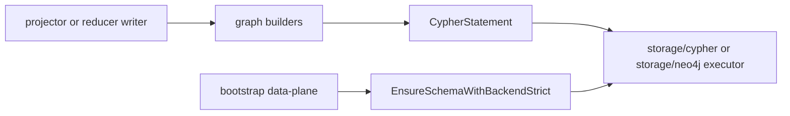

# Graph

## Purpose

`graph` owns Eshu's source-local graph write contract, Cypher statement types,
batch write builders, graph deletion mutations, and graph schema bootstrap
statements. It is the narrow package that lets projectors and storage adapters
agree on what graph writes look like without importing each other.

## Ownership Boundary

This package owns:

- `Writer`, `Materialization`, `Record`, `Result`, and `MemoryWriter`
- `CypherStatement` and `CypherExecutor`
- entity, file, and relationship batch MERGE helpers
- file and repository deletion mutations
- `EnsureSchema*` and `SchemaStatements*` for Neo4j and NornicDB schema setup

It does not own backend drivers, connection pooling, retry classification, or
write telemetry. Those belong in `internal/storage/cypher`,
`internal/storage/neo4j`, and the runtime packages that call them. Backend
dialect differences should stay inside schema statement helpers and label
translation, not leak into callers.

## Core Flow

Callers build source-local writes as `Materialization` values or use the batch
helpers directly. Schema bootstrap asks this package for the ordered schema DDL
for the selected backend and executes it through the same `CypherExecutor`
interface.

## Exported Surface

See `doc.go` and `go doc ./internal/graph` for the full contract. The durable
surface is:

- write contract: `Writer`, `Materialization`, `Record`, `Result`
- Cypher seam: `CypherStatement`, `CypherExecutor`
- merge helpers: `BuildEntityMergeStatement`, `MergeEntity`,
  `BatchMergeEntities`, `BatchMergeFiles`, `BatchMergeRelationships`
- mutation helpers: `DeleteFileFromGraph`, `DeleteRepositoryFromGraph`,
  `ResetRepositorySubtreeInGraph`
- schema helpers: `SchemaStatements`, `SchemaStatementsForBackend`,
  `EnsureSchema`, `EnsureSchemaWithBackend`, `EnsureSchemaWithBackendStrict`

## Dependencies

`graph` imports only the Go standard library. `CypherStatement` and
`CypherExecutor` live here to avoid an import cycle with `internal/storage/cypher`.

## Telemetry

This package does not register metrics or spans. Schema execution emits
structured `slog` progress records with backend, phase, statement ordinal,
statement total, duration, bounded statement summary, and failure class. Backend
executors own query duration/error metrics and trace spans.

## Gotchas / Invariants

- Dynamic labels and property keys must pass the safe identifier checks before
  they enter generated Cypher.
- `BatchMergeEntities` splits UID-identity rows from name/path/line identity
  rows so each MERGE shape can use the intended indexes.
- `BatchMergeRelationships` requires all rows in one call to share source
  label, target label, and relationship type.
- NornicDB does not receive Neo4j-style composite uniqueness constraints from
  this package; source-local and shared writers rely on supported UID and lookup
  indexes instead.
- OCI registry and package-registry projection labels need UID and lookup
  indexes so deployment trace and package query reads stay anchored instead of
  falling back to label scans.
- `EnsureSchemaWithBackendStrict` is the deployment bootstrap path. It reports
  non-context DDL failures after the ordered attempt and fails fast on context
  cancellation or deadline exhaustion.
- `ResetRepositorySubtreeInGraph` preserves the `Repository` node;
  `DeleteRepositoryFromGraph` removes it.

## Focused Tests

- `go test ./internal/graph -run TestSchemaStatements -count=1`
- `go test ./internal/graph -run TestEnsureSchema -count=1`
- `go test ./internal/graph -run TestBatchMerge -count=1`
- `go test ./internal/graph -run TestBuildEntityMergeStatement -count=1`

## Related Docs

- `docs/public/architecture.md`
- `docs/public/reference/graph-backend-operations.md`
- `docs/public/reference/nornicdb-tuning.md`
- `go/internal/storage/cypher/README.md`
