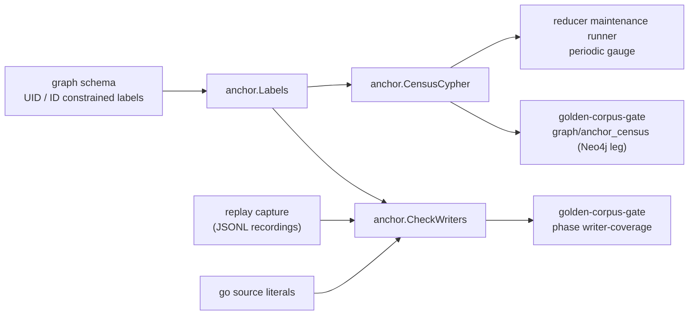

# Anchor

`anchor` states which id-bearing graph nodes the labeled Neo4j entity-context
anchor can reach, and the two checks that keep that set closed. Issue #7212.

## Where this fits



## The definition

A node is reachable when it has an `id` and either sits on an id-constrained
label, or sits on a uid-constrained label with `uid = id`. A node counts once.
`Classify` is that definition in Go; `CensusCypher` is the same definition as
one AllNodesScan, and `census_live_test.go` (tag `live_nornicdb_answer_truth`)
holds the two together on a real Neo4j.

## Files

```text
anchor/
  doc.go               package contract
  labels.go            UIDLabels, IDLabels, Labels (schema-derived)
  writers.go           Statement, Finding, Report, CheckWriters
  parse.go             Cypher scan: clauses, node patterns, SET items
  proof.go             parameter proof that a dynamic map has no id key
  census.go            Classify, CensusCypher, Census, EvaluateCensus
  reader.go            ReaderCensus: the census over a single-row graph read port
  sweep_test.go        static sweep of go/ literals plus a planted violation
  census_live_test.go  live Neo4j proof of the census Cypher
```

## What CheckWriters does and does not see

It reads Cypher text. Over a replay recording it sees what ran, including
labels chosen at run time. Over Go source (`sweep_test.go`) it sees string
literals and constant `+` concatenations only, so a statement whose label is
built from a variable is invisible to the static sweep and is covered by the
replay half. A statement the replay never executes is covered by the static
sweep if it is a literal, and by neither if it is both dynamic and unexecuted.
That gap is why the census gate and the census gauge exist as well.

## Operational notes

- `CensusCypher` is one AllNodesScan. On 2026-10-08, image sha-57167b0, it took
  about 1.95 s over 1,130,424 nodes (898,874 with an id). Run it on an interval
  with a timeout, never on a request or scrape path.
- The census is one read transaction, not a point in time. A node written
  during the scan may or may not be counted.
- `coalesce(n.uid = n.id, false)` is load-bearing. Without it, a null uid makes
  `NOT (null AND ...)` null, and the node drops out of the residual.

## Telemetry

None here. The periodic gauge and its log line live in
`go/internal/reducer/maintenance` and `go/cmd/reducer`.
