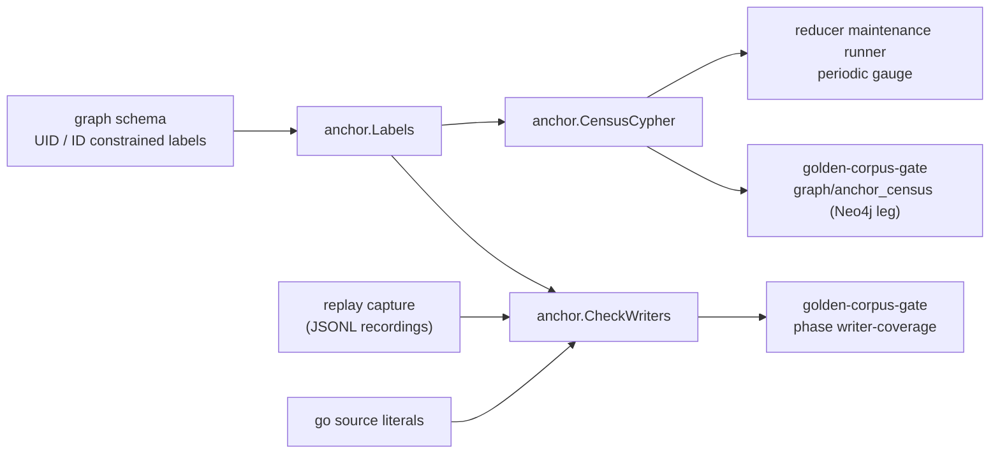

# Anchor

`anchor` states which id-bearing graph nodes the labeled Neo4j entity-context
anchor can reach, and the two checks that keep that set closed. Issue #7212.

## Where this fits



## The definition

A node is reachable when it has an `id` and either sits on an id-constrained
label, or sits on a uid-constrained label with `uid = id`. A node counts once.
`Classify` is that definition in Go; `CensusCypher` is the same definition as
one AllNodesScan, and `census_live_test.go` (tag `live_nornicdb_answer_truth`)
holds the two together on a real Neo4j.

## Files

```text
anchor/
  doc.go               package contract
  labels.go            UIDLabels, IDLabels, Labels (schema-derived)
  writers.go           Statement, Finding, Report, CheckWriters
  parse.go             Cypher scan: clauses, node patterns, SET items
  scan.go              text helpers: bracket depth, literal blanking, masking
  proof.go             parameter proof that a dynamic map has no id key
  census.go            Classify, CensusCypher, Census, EvaluateCensus
  reader.go            ReaderCensus: the census over a single-row graph read port
  sweep_test.go        static sweep of go/ Cypher literals, planted violations
  sweep_literals_test.go  which literals the sweep admits and how it folds them
  sweep_markers_test.go  the dynamic-label writer marker check and its planted cases
  census_live_test.go  live Neo4j proof of the census Cypher
```

## What CheckWriters does and does not see

It reads Cypher text. Over a replay recording it sees what ran, including
labels chosen at run time.

Over Go source the static sweep admits a string literal, or a `+` chain of
literals, named string constants of the same package, and other operands (an
operand it cannot resolve reads as `%s`, like a fmt verb). The text needs a write
keyword (`MERGE`, `CREATE`, `SET`) and either an `id` token or a `+=` map write
with a node pattern, or a parameter property map (`CREATE (n:L $props)`). The node
pattern is labeled (`(n:Label`), unlabeled with an `id` key in its map
(`(n {id: ...})`), or has a placeholder label (`(n:%s`, `(n:%[1]s`). DDL
(`CREATE CONSTRAINT/INDEX ... FOR (n:%s)`) is skipped. Static labels go through
`CheckWriters`.

A placeholder-label writer cannot be decided statically. Each one carries a marker
beside it, in the file that owns it:

```go
// anchor-census: dynamic-label writer; label set bounded by TestSomething
```

`TestSomething` must be a real test that proves the labels are anchor labels. The
sweep fails on a template with no marker within 10 lines above it, on a marker
naming no test, and on a marker with no template below it. The 13 marked writers
are the canonical and semantic entity upsert templates (proved by
`TestEntityUpsertTemplateLabelsAreAnchorLabels` and
`TestSemanticEntityUpsertLabelsAreAnchorLabels` in `internal/storage/cypher`), the
`internal/graph` entity merge helpers (proved by
`TestEntityMergeHelpersHaveNoProductionCaller`), and the read-API latency seed tool
(proved by `TestSeedLabelsAreAnchorLabels`).

The sweep does not see a writer, static or dynamic, that is assembled outside an
admitted literal or `+` chain: a `strings.Builder` or other runtime assembly, a
`fmt.Sprintf` whose verb supplies the `id` key rather than a label, or a
statement that is only a bare constant name passed along. Those rest on the replay
half of the gate and on the census.

Known blind spots, each backed by the census check and gauge only: a procedure
call that writes a node outside the `apoc.create/merge/cypher/do/periodic/refactor`
families the parser names; an UNWIND alias rebound by a form other than `AS name`,
a comprehension variable, or a FOREACH variable; and any Cypher feature the scan
does not model (quantified path patterns, for example). A node whose label arrives
only through a `WHERE n:Label` predicate or `SET n:Label` reads as unlabeled and is
reported, which is a false positive by design.

## Operational notes

- `CensusCypher` is one AllNodesScan. On 2026-10-08, image sha-57167b0, it took
  about 1.95 s over 1,130,424 nodes (898,874 with an id). Run it on an interval
  with a timeout, never on a request or scrape path.
- The census is one read transaction, not a point in time. A node written
  during the scan may or may not be counted.
- `coalesce(n.uid = n.id, false)` is load-bearing. Without it, a null uid makes
  `NOT (null AND ...)` null, and the node drops out of the residual.

## Telemetry

None here. The periodic gauge and its log line live in
`go/internal/reducer/maintenance` and `go/cmd/reducer`.
