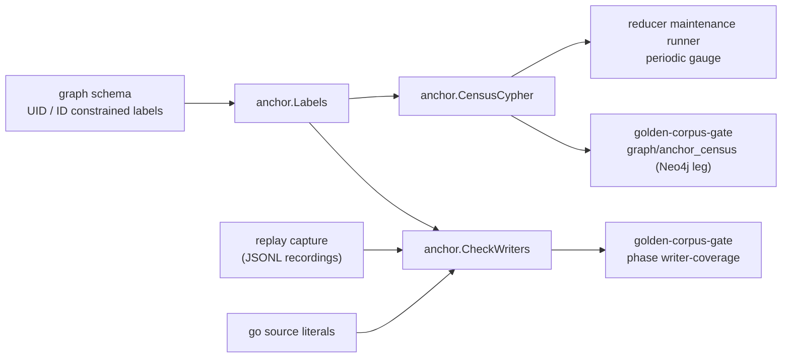

# Anchor

`anchor` states which id-bearing graph nodes the labeled Neo4j entity-context
anchor can reach, a census that counts the ones it cannot, and a heuristic
pre-filter over Cypher text that looks for the writers that would produce them.
Issue #7212.

## Where this fits



## The definition

A node is reachable when it has an `id` and either sits on an id-constrained
label, or sits on a uid-constrained label with `uid = id`. A node counts once.
`Classify` is that definition in Go; `CensusCypher` is the same definition as
one AllNodesScan, and `census_live_test.go` (tag `live_nornicdb_answer_truth`)
holds the two together on a real Neo4j.

## Files

```text
anchor/
  doc.go               package contract
  labels.go            UIDLabels, IDLabels, Labels (schema-derived)
  writers.go           Statement, Finding, Report, CheckWriters
  parse.go             Cypher scan: clauses, node patterns, SET items
  scan.go              text helpers: bracket depth, literal blanking, masking
  proof.go             parameter proof that a dynamic map has no id key
  census.go            Classify, CensusCypher, Census, EvaluateCensus
  reader.go            ReaderCensus: the census over a single-row graph read port
  sweep_test.go        static sweep of go/ Cypher literals, planted violations
  sweep_literals_test.go  which literals the sweep admits and how it folds them
  sweep_markers_test.go  the dynamic-label writer marker check and its planted cases
  writers_test.go, writers_scope_test.go  the analyzer test tables
  blind_spots_test.go  rows that record the known blind spots
  census_live_test.go  live Neo4j proof of the census Cypher
```

## Authority and pre-filter

The authority that no unanchored id-bearing node ships is the census: the
required `graph/anchor_census` check on the Neo4j legs after the golden-corpus
replay, and the reducer gauge on each deployment. `CheckWriters` and the static
sweep are a heuristic pre-filter over Cypher text. They are there to name the
writer early; they do not decide.

## What the analyzer reports

`CheckWriters` reports a node-id write whose node carries no anchor label for the
shapes below, each with the test function and row family that prove it. A row at
the head is the only source for a claim in this list.

| Shape | Test |
| --- | --- |
| id key in a MERGE or CREATE map, `SET n.id`, `ON CREATE SET`, label conjunction and multi-label cover, MATCH and relationship ids are not writes, literal text ignored, dynamic `SET n += map` with and without a parameter proof | `TestCheckWriters` |
| a WHERE or EXISTS inside a SET item, list literals and indexes, a label disjunction, a dynamic property key, a nested property map, a pattern the scan cannot place | `TestCheckWritersUnparsedShapes` |
| a keyword inside an earlier pattern's map, a parameter property map, a backtick or expression `.id` target, a node rebound to another label, an UNWIND alias rebound by `AS` or a comprehension, backtick labels, `apoc.create`/`apoc.merge` calls | `TestCheckWritersPatternContextShapes` |
| rebinding by `WITH ... AS`, `[n][0].id` and `head([n]).id` targets, a label add before the id, a whole-map replace, `apoc.create.setProperty` and `apoc.cypher.doIt`, an UNWIND alias or FOREACH variable used as the node | `TestCheckWritersRebindingAndProcedureShapes` |
| a relationship name reused as a node after `WITH` or `UNION`, a backtick, non-ASCII, or bracketed-key SET target in the `=`, `+=` and `[k] =` forms, `REMOVE n:L` of an anchor label on a node whose id the statement writes, an unlabeled re-declaration after a top-level `WITH` that drops the name or after `UNION`, a clause keyword inside a backtick identifier | `TestCheckWritersScopeTargetAndRemovalShapes` |
| the same families on covered labels stay clean, including the tfstate label swap shape and a relationship id write | `TestCheckWritersStricterParserKeepsCoveredWritesClean`, `TestCheckWritersPatternContextKeepsCoveredWritesClean`, `TestCheckWritersScopeTargetAndRemovalKeepProductionClean` |

## What the sweep reads

The static sweep reads the non-test Go files under `go/`. It admits a string
literal, or a `+` chain whose node pattern sits in a literal or a same-package
constant it can resolve. An operand it cannot resolve reads as `%s`, like a fmt
verb. The text needs a write keyword (`MERGE`, `CREATE`, `SET`) and either an `id`
token or a `+=` map write with a node pattern, or a parameter property map
(`CREATE (n:L $props)`), or a `REMOVE n:Label`. The node pattern is labeled
(`(n:Label` or `(n IS Label`), unlabeled with an `id` key in its map
(`(n {id: ...})`), or has a placeholder label (`(n:%s`, `(n:%[1]s`). DDL
(`CREATE CONSTRAINT/INDEX ... FOR (n:%s)`) is skipped. Static labels go through
`CheckWriters`. Planted-source tests: `TestStaticSweepFailsOnAPlantedUnconstrainedIDWriter`,
`TestSweepSeesTheShapesItWasTaught`, `TestSweepAdmitsTheUnlabeledAndDynamicMapShapes`.
On the final tree the production sweep reads 92 sites: 79 with a static label and
13 with a placeholder label (`TestEveryProductionIDWriterNamesAnAnchorLabel`).

A placeholder-label writer cannot be decided statically. Each one carries a marker
beside it, in the file that owns it:

```go
// anchor-census: dynamic-label writer; label set bounded by TestSomething
```

The marker pairs 1:1 with the nearest template below it, within 10 lines, and
`TestSomething` is a test defined in a `_test.go` file in the marker's own
directory that proves the labels are anchor labels. The sweep reports a template
with no marker of its own, a marker naming no test in its directory, and a marker
with no template of its own under it (`TestEveryDynamicLabelWriterIsMarkedWithAProof`,
`TestDynamicLabelWriterWithoutAMarkerFails`, `TestMarkerNamingNoExistingTestFails`,
`TestMarkerBesideNoDynamicWriterFails`, `TestOneMarkerExcusesOnlyTheNearestWriter`,
`TestMarkerProofMustLiveInTheMarkersDirectory`). The 13 marked writers are the
canonical and semantic entity upsert templates (proved by
`TestEntityUpsertTemplateLabelsAreAnchorLabels` and
`TestSemanticEntityUpsertLabelsAreAnchorLabels` in `internal/storage/cypher`), the
`internal/graph` entity merge helpers (proved by
`TestEntityMergeHelpersHaveNoProductionCaller`), and the read-API latency seed tool
(proved by `TestSeedLabelsAreAnchorLabels`).

## Known blind spots (not exhaustive)

For each, the census check after the replay and the reducer gauge are the
backstop. `TestCheckWritersKnownBlindSpots` and `TestSweepKnownBlindSpots` hold a
row for the ones with a concrete example, so an improvement flips the row and
forces this list to change.

Analyzer:

- Scope loss through a `CALL` subquery: an unlabeled re-declaration of an outer
  name inside the subquery inherits the earlier label. (A top-level `WITH` or
  `UNION` is read; a nested one is not.)
- Procedure writers outside the `apoc.create/merge/cypher/do/periodic/refactor`
  families, such as `db.create.setNodeVectorProperty` and `apoc.atomic.add`.
- An UNWIND alias rebound by a form other than `AS name`, a comprehension
  variable, or a FOREACH variable (a `YIELD` column of the same name, for
  example), and comprehension or FOREACH variables used as nodes in shapes not
  listed above.
- Cypher the scan does not model.
- A node whose label arrives only through a `WHERE n:Label` predicate or
  `SET n:Label` reads as unlabeled; that is reported, a false positive by design.

Sweep:

- A `+` chain whose node pattern sits in an operand it cannot resolve: a package
  `var`, a cross-package constant, or a function call.
- `strings.Builder` or other runtime assembly, and a `fmt.Sprintf` verb that
  supplies the `id` key.
- A statement reached only through a bare constant name whose text is a fragment.

Residuals the census itself cannot close, in plain words, are in the evidence note
under "What only CI exercises".

## Operational notes

- `CensusCypher` is one AllNodesScan. On 2026-10-08, image sha-57167b0, it took
  about 1.95 s over 1,130,424 nodes (898,874 with an id). Run it on an interval
  with a timeout, never on a request or scrape path.
- The census is one read transaction, not a point in time. A node written
  during the scan may or may not be counted.
- `coalesce(n.uid = n.id, false)` is load-bearing. Without it, a null uid makes
  `NOT (null AND ...)` null, and the node drops out of the residual.

## Telemetry

None here. The periodic gauge and its log line live in
`go/internal/reducer/maintenance` and `go/cmd/reducer`.
