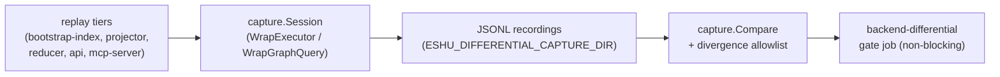

# Graph capture

`capture` persists and diffs the differential statement recordings for issue
#6782: every production Cypher statement a golden-corpus replay executes
must return the same rows on NornicDB and Neo4j.

## Where this fits



Capture is env-gated (`ESHU_DIFFERENTIAL_CAPTURE=1` plus
`ESHU_DIFFERENTIAL_CAPTURE_DIR`): without the flag every decorator is a
passthrough, so normal runs pay one env read at startup and nothing per
statement. A set flag without a directory fails closed at startup instead
of running a replay that records nothing.

## Internal structure

```text
capture/
  doc.go                  — package contract
  sink.go                 — JSONL sink plus directory loader, grouped by backend
  allowlist.go            — divergence allowlist parse, excuse, and validation
  diff.go                 — Compare: diff two recording directories with a
                            bounded report
  decorate.go             — Session: env-gated recorder plus sink binding for
                            the read and write seams
  differential_live_test.go — live capture-to-diff proof on both backends
                            (skips without ESHU_DIFFERENTIAL_LIVE=1)
```

## Ownership boundary

`capture` owns recording persistence, the diff driver, and the allowlist
contract. It does not own statement fingerprinting, row digests, comparison
kinds, or the seam decorators — those live in `backendconformance`
(`differential.go`, `differential_kinds.go`)
— and it does not own the replay, the gate phases, or the CI job, which
live in `cmd/golden-corpus-gate`, `scripts/verify-golden-corpus-gate.sh`,
and `.github/workflows/golden-corpus-gate.yml`.

## Exported surface

- `Session` — `Open(getenv, binary)` starts a session (nil when off);
  `Reader`/`Writer` decorate the seams; `Close` flushes to the sink.
- `Compare(left, right string, allow *Allowlist, w io.Writer) error` —
  diffs two recording directories, excusing allowlisted divergences.
- `ParseAllowlist` — parses `specs/backend-divergence-allowlist.v1.yaml`;
  missing reason, missing/unknown tier, missing/non-issue upstream, and
  stale entries fail. The tier scopes each entry to one divergence kind
  (`missing`, `results`, `failures`) or to the whole
  statement. There is no `executions` or `rowcount` tier: execution-count
  and row-total divergences with agreeing results are advisory at the gate
  (`backendconformance.AdvisoryKind`, #6782), `Compare` prints them as
  advisory lines and returns nil for them, and the parser rejects both
  tiers so retired entries cannot linger. Beside entries, a
  `transient_reads` section registers transient-state reads (guarded by a
  transient-state marker in the statement); `ExcludeTransient` holds their
  observed-noise divergences out of the required set without stale
  checking, and `Compare` prints them as transient lines.
- `OpenDir` / `LoadDir` — JSONL sink and loader; unknown backends fail on
  both sides.
- `MaxReportedDiffs` — the per-report line cap (20) shared by `Compare`
  and the gate's quorum per-pairing dump; the recordings artifact keeps
  the unbounded list.

## Telemetry

None. Capture adds no metrics, spans, or logs of its own: recording must
be observable-neutral so the replay under test behaves exactly as it does
without capture. Gate outcomes surface through the existing B-7 gate
reporting, not through this package.
