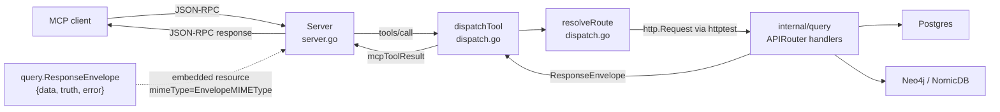
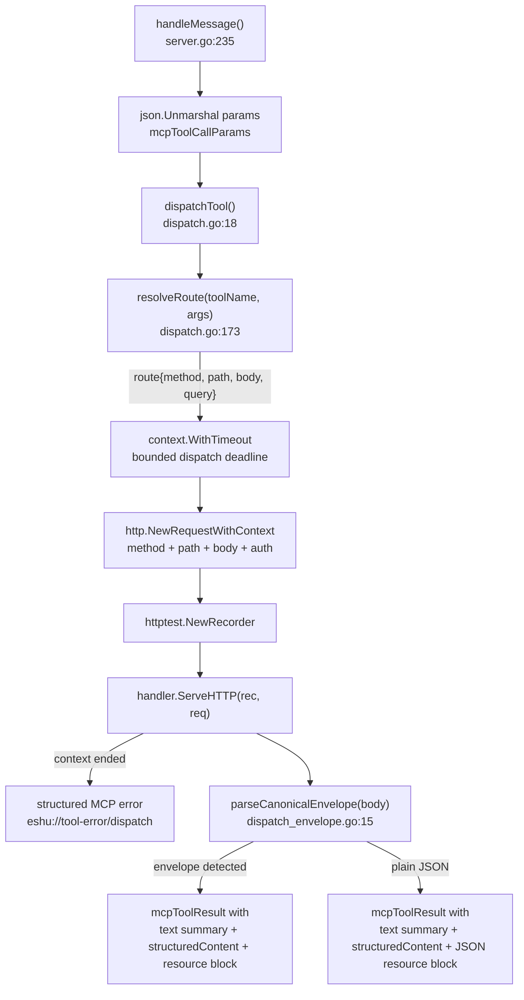

# internal/mcp

`mcp` owns the Model Context Protocol tool surface for Eshu. It implements the
MCP server, the JSON-RPC dispatcher, the SSE session model, the HTTP transport
authentication (issue #5168), and the 159 read-only tool definitions. Tool
dispatch calls into the same `http.Handler` chain the HTTP API uses, so a tool
response and the corresponding HTTP query response share the same truth. Dispatch wraps each handler request in a
bounded context with a deterministic 30s default, so MCP calls cannot run
without a deadline; handlers remain responsible for honoring `r.Context()`
cancellation. Deadline and parent cancellation failures return an MCP error
result with structured content and an `eshu://tool-error/dispatch` JSON
resource.
`get_capability_catalog` is transport-only over `/api/v0/capabilities`; its
structured response preserves the top-level built-in role/grant/data-class
catalog and each capability's matched permission family, action, scope levels,
default roles, and sensitive-data marker.
`get_surface_inventory` is transport-only over `/api/v0/surface-inventory`; its
structured response preserves collector `collector_contract` provenance, so MCP
callers can trace fact kinds to projection/read consumers, proof gates, fixture
refs, and deterministic/provider-gated/optional-semantic truth profiles.

## Where this fits in the pipeline

## Internal flow — one tool invocation

## Dispatch deadline evidence

No-Regression Evidence: issue #2469 adds a context-only MCP dispatch deadline
with no new graph, storage, queue, or HTTP query work. Baseline behavior was
the existing `dispatchTool` path calling `handler.ServeHTTP` with the caller
context and no dispatch deadline. After measurement on Go 1.26 covered
`go test ./cmd/mcp-server ./internal/query ./internal/mcp -count=1` and
`golangci-lint run ./...`; input shape was `list_indexed_repositories` routed
through the shared HTTP handler with a test override of 20ms and a parent
deadline case. Terminal row counts and queue counts are unchanged because the
patch does not query Postgres, NornicDB, Neo4j, or reducer queues. The change is
safe because success responses keep the same handler envelope, while timeout
and parent-cancellation paths stop before response parsing and return structured
MCP error content.

Observability Evidence: dispatch timeout and cancellation failures emit
`mcp tool dispatch context ended` with `tool`, `timeout`, and `err` fields. The
success path has No-Observability-Change: it preserves the existing
`dispatch tool` debug log and does not add spans, metrics, or extra per-row
logging.

## Dispatch response-size budget

Issue #3498 adds a tool-agnostic response-size budget at the dispatch boundary
(`dispatch_budget.go`). Every tool response passes through `dispatchTool`, so the
budget is enforced there once instead of per route. `applyResponseBudget`
measures the serialized size of the canonical envelope (or plain value) and, when
it exceeds `defaultToolResponseByteBudget` (256 KiB, ~64k tokens at the repo's
conservative ~4-bytes-per-token heuristic), replaces the oversized payload with a
small bounded canonical envelope (`error.code=mcp_response_over_budget`) carrying
`response_bytes`, `budget_bytes`, `estimated_tokens`, the tool name, and narrowing
guidance. The original payload is dropped and never reaches the client, so a
single heavy graph-returning tool (a large subgraph, a wide story, a deep
visualization packet) cannot blow the model context budget. Per-route token
budgets such as the relationship-story `token_budget` still apply first; this is
the outer, tool-agnostic guard, the response-size sibling of the dispatch
deadline guard.

No-Regression Evidence: the budget is a pure post-dispatch in-process size check
over the already-serialized response — no new graph, storage, queue, or HTTP work.
`go test ./internal/mcp -run 'TestDispatchToolResponse|TestDispatchToolZeroBudget|TestDefaultDispatchAppliesResponseBudget' -count=1`
covers over-budget replacement, within-budget pass-through, the disabled-budget
(`budget<=0`) path, and that the default `dispatchTool` entrypoint enforces the
budget. The full `go test ./internal/query ./internal/mcp ./cmd/api ./cmd/mcp-server -count=1`
(3929 tests) stays green, proving no existing tool fixture trips the 256 KiB
budget — the budget is sized above every honestly bounded read.

Observability Evidence: every budget hit emits the structured log event
`mcp tool response over budget` with `tool`, `response_bytes`, and `budget_bytes`
fields (3 AM operable), mirroring the dispatch-deadline `mcp tool dispatch context
ended` precedent. The budget accounting is also returned in-band in the
`error.details` block, so callers see why a response was refused and how to narrow
it. This package declares no metric instruments, consistent with the existing MCP
dispatch observability surface.

## Tool groups

`ReadOnlyTools` assembles 160 tools from the tool definition files.
`ReadOnlyTools()` (and the `Verify ReadOnlyTools count` gate) is the authoritative
count; the per-group table below lists the major static groups for orientation
and is not an exhaustive enumeration (some groups — e.g. reachability and ask —
are assembled dynamically and are not broken out here).

| Group | Count | Source file |
|---|---|---|
| `codebaseTools` | 31 | `tools_codebase.go`, `tools_code_topic.go`, `tools_dead_code.go`, `tools_import_dependencies.go`, `tools_call_graph_metrics.go`, `tools_route_to_caller.go`, `tools_security.go`, `tools_structural_inventory.go`, `tools_iac.go` |
| `codeFlowTools` | 4 | `tools_code_flow.go` |
| `repositoryLanguageTools` | 3 | `tools_repository_language.go` |
| `ecosystemTools` | 23 | `tools_ecosystem.go`, `tools_graph_summary_packet.go`, `tools_prechange_impact.go`, `tools_contract_impact.go` |
| `infraResourceAggregateTools` | 2 | `tools_infra_resource_aggregates.go` |
| `cloudInventoryTools` | 1 | `tools_cloud_inventory.go` |
| `cloudRuntimeDriftTools` | 1 | `tools_cloud_runtime_drift.go` |
| `packageRegistryTools` | 2 | `tools_package_registry.go` |
| `admissionDecisionTools` | 1 | `tools_admission_decisions.go` |
| `packageRegistryAggregateTools` | 2 | `tools_package_registry_aggregates.go` |
| `cicdTools` | 1 | `tools_cicd.go` |
| `cicdRunCorrelationAggregateTools` | 2 | `tools_cicd_aggregates.go` |
| `serviceCatalogTools` | 1 | `tools_service_catalog.go` |
| `codeownersTools` | 1 | `tools_codeowners.go` |
| `kubernetesTools` | 1 | `tools_kubernetes.go` |
| `secretsIAMTools` | 5 | `tools_secrets_iam.go` |
| `observabilityCoverageTools` | 1 | `tools_observability_coverage.go` |
| `supplyChainTools` | 7 | `tools_supply_chain.go` |
| `supplyChainImpactAggregateTools` | 2 | `tools_supply_chain_aggregates.go` |
| `securityAlertReconciliationAggregateTools` | 2 | `tools_security_alert_aggregates.go` |
| `containerImageIdentityAggregateTools` | 2 | `tools_container_image_aggregates.go` |
| `sbomAttestationAttachmentAggregateTools` | 2 | `tools_sbom_attachment_aggregates.go` |
| `incidentContextTools` | 1 | `tools_incident_context.go` |
| `workItemTools` | 1 | `tools_work_item.go` |
| `visualizationTools` | 1 | `tools_visualization.go` |
| `freshnessTools` | 3 | `tools_freshness.go` |
| `contextTools` | 7 | `tools_context.go` |
| `contentTools` | 6 | `tools_content.go` |
| `documentationTools` | 4 | `tools_documentation.go` |
| `queryPlaybookTools` | 2 | `tools_query_playbooks.go` |
| `investigationWorkflowTools` | 2 | `tools_investigation_workflows.go` |
| `investigationPacketTools` | 3 | `tools_investigation_packets.go` |
| `semanticEvidenceTools` | 2 | `tools_semantic_evidence.go` |
| `semanticSearchTools` | 1 | `tools_semantic_search.go` |
| `documentationFindingAggregateTools` | 2 | `tools_documentation_aggregates.go` |
| `componentExtensionTools` | 2 | `tools_component_extensions.go` |
| `collectorExtractionReadinessTools` | 2 | `tools_collector_extraction_readiness.go` |
| `runtimeTools` | 8 | `tools_runtime.go` |
| relationship-edges + repository-files (inline, #4007) | 2 | `tools_relationship_edges.go`, `tools_repository_files.go` |

Representative tool-to-route mappings from `resolveRoute` (`dispatch.go:173`):

| Tool | HTTP method | Path |
|---|---|---|
| `find_code` | POST | `/api/v0/code/search` — case-sensitive entity-name lookup; global substring calls require at least three Unicode characters, while `exact=true` permits shorter complete names |
| `find_symbol` | POST | `/api/v0/code/symbols/search` |
| `inspect_code_inventory` | POST | `/api/v0/code/structure/inventory` |
| `investigate_import_dependencies` | POST | `/api/v0/code/imports/investigate` |
| `inspect_call_graph_metrics` | POST | `/api/v0/code/call-graph/metrics` |
| `investigate_code_topic` | POST | `/api/v0/code/topics/investigate` |
| `investigate_hardcoded_secrets` | POST | `/api/v0/code/security/secrets/investigate` |
| `investigate_dead_code` | POST | `/api/v0/code/dead-code/investigate` |
| `get_code_relationship_story` | POST | `/api/v0/code/relationships/story` |
| `analyze_code_relationships` | POST | `/api/v0/code/relationships/story` for callers/callees/importers/class hierarchy/overrides, including explicit `find_cross_repo_*` variants; `/api/v0/code/call-chain` for call chains with optional exact entity selectors and `cross_repo` endpoint repository selectors; `/api/v0/code/relationships` for unresolved compatibility fallbacks |
| `find_dead_iac` | POST | `/api/v0/iac/dead` |
| `find_unmanaged_resources` | POST | `/api/v0/iac/unmanaged-resources` |
| `get_iac_management_status` | POST | `/api/v0/iac/management-status` |
| `explain_iac_management_status` | POST | `/api/v0/iac/management-status/explain` |
| `propose_terraform_import_plan` | POST | `/api/v0/iac/terraform-import-plan/candidates` |
| `list_aws_runtime_drift_findings` | POST | `/api/v0/aws/runtime-drift/findings` |
| `get_replatforming_rollups` | POST | `/api/v0/replatforming/rollups` |
| `find_unmanaged_resource_owners` | POST | `/api/v0/replatforming/ownership-packets` |
| `calculate_cyclomatic_complexity` | POST | `/api/v0/code/complexity` |
| `get_relationship_evidence` | GET | `/api/v0/evidence/relationships/{resolved_id}` |
| `list_admission_decisions` | GET | `/api/v0/evidence/admission-decisions` |
| `export_deployable_unit_packet` | GET | `/api/v0/investigations/deployable-unit/packet` |
| `build_evidence_citation_packet` | POST | `/api/v0/evidence/citations` |
| `list_package_registry_packages` | GET | `/api/v0/package-registry/packages` |
| `list_package_registry_versions` | GET | `/api/v0/package-registry/versions` |
| `list_package_registry_dependencies` | GET | `/api/v0/package-registry/dependencies` |
| `list_package_registry_correlations` | GET | `/api/v0/package-registry/correlations` |
| `list_ci_cd_run_correlations` | GET | `/api/v0/ci-cd/run-correlations` |
| `list_service_catalog_correlations` | GET | `/api/v0/service-catalog/correlations` |
| `list_codeowners_ownership` | GET | `/api/v0/codeowners/ownership` |
| `list_kubernetes_correlations` | GET | `/api/v0/kubernetes/correlations` |
| `list_secrets_iam_identity_trust_chains` | GET | `/api/v0/secrets-iam/identity-trust-chains` |
| `list_secrets_iam_privilege_posture_observations` | GET | `/api/v0/secrets-iam/privilege-posture-observations` |
| `list_secrets_iam_secret_access_paths` | GET | `/api/v0/secrets-iam/secret-access-paths` |
| `list_secrets_iam_posture_gaps` | GET | `/api/v0/secrets-iam/posture-gaps` |
| `count_secrets_iam_posture` | GET | `/api/v0/secrets-iam/posture-summary` |
| `get_incident_context` | GET | `/api/v0/incidents/{incident_id}/context` |
| `list_work_item_evidence` | GET | `/api/v0/work-items/evidence` |
| `derive_visualization_packet` | POST | `/api/v0/visualizations/derive` |
| `get_generation_lifecycle` | GET | `/api/v0/freshness/generations` |
| `get_changed_since` | GET | `/api/v0/freshness/changed-since` (repository-scope delta diffing a prior generation against the current active generation by `stable_fact_key`; per-category added/updated/unchanged/retired/superseded counts plus bounded sample handles; unknown scope returns not-found, no current active generation returns an explicit unavailable diff, and retention-pruned baselines return `unavailable_reason=retention_expired` with `get_generation_lifecycle` as the bounded next check) |
| `get_service_changed_since` | GET | `/api/v0/freshness/services/changed-since` (service-scope delta diffing a prior service materialization generation against the current active generation by generation-independent `service_evidence_key`; reports the ownership, deployment, runtime, dependencies, docs, incidents, and vulnerabilities families; per-family added/updated/unchanged/retired/superseded counts plus bounded sample handles; unknown service returns service-not-found, no current active generation returns an explicit unavailable diff) |
| `get_vulnerability_scanner_read_contract` | GET | `/api/v0/supply-chain/vulnerability-scanner/contract` |
| `list_supply_chain_impact_findings` | GET | `/api/v0/supply-chain/impact/findings` (accepts repository ids or human repository selectors plus scanner filters such as `advisory_id`, `image_ref`, `ecosystem`, `service_id`, `workload_id`, `environment`, `severity`, `profile`, `include_suppressed`, and `suppression_state`; precise rows require supported exact-version evidence such as npm, Maven, Cargo, Pub `pubspec.lock`, NuGet, or Swift `Package.resolved`, and each row carries a `suppression` block with state, source, justification, author, timestamps, reason, and VEX provenance) |
| `list_sbom_attestation_attachments` | GET | `/api/v0/supply-chain/sbom-attestations/attachments` (use `subject_digest`/`digest`, `document_id`, `document_digest`, repository `repository_id` or selector, `workload_id`, or `service_id` for SBOM proof; scoped repository/workload/service reads return explicit missing image or image-to-SBOM evidence instead of silently flattening empty pages) |
| `list_advisory_evidence` | GET | `/api/v0/supply-chain/advisories/evidence` |
| `explain_supply_chain_impact` | GET | `/api/v0/supply-chain/impact/explain` |
| `export_supply_chain_impact_packet` | GET | `/api/v0/investigations/supply-chain/impact/packet` |
| `export_cloud_runtime_drift_packet` | GET | `/api/v0/investigations/drift/packet` |
| `list_security_alert_reconciliations` | GET | `/api/v0/supply-chain/security-alerts/reconciliations` (accepts repository ids or human repository selectors; rows include Eshu-owned `eshu_package.observed_version` when installed-version evidence exists) |
| `count_repositories_by_language` | GET | `/api/v0/repositories/by-language?limit=0` |
| `list_repositories_by_language` | GET | `/api/v0/repositories/by-language` |
| `get_repository_language_inventory` | GET | `/api/v0/repositories/language-inventory` |
| `get_repository_stats` | GET | `/api/v0/repositories/{repo_id}/stats` |
| `get_repo_summary` | GET | `/api/v0/repositories/{repo_id}/stats` — lightweight identity and coverage summary (file count, languages, entity count, entity types, indexing coverage state); use before `get_repo_context` for a quick overview. Requires exactly one of `repo_id` (preferred) or the legacy `repo_name` alias; neither is forced in the schema (so a `repo_name`-only call validates), and dispatch returns a clear error when both are absent |
| `get_repo_context` | GET | `/api/v0/repositories/{repo_id}/context` — full enriched context including entry points, infrastructure, relationships, API surface, and deployment evidence |
| `get_repo_story` | GET | `/api/v0/repositories/{repo_id}/story` |
| `investigate_contract_impact` | POST | `/api/v0/impact/contracts` |
| `investigate_change_surface` | POST | `/api/v0/impact/change-surface/investigate` |
| `analyze_pre_change_impact` | POST | `/api/v0/impact/pre-change` |
| `plan_developer_change` | POST | `/api/v0/impact/developer-change-plan` |
| `investigate_resource` | POST | `/api/v0/impact/resource-investigation` |
| `resolve_entity` | POST | `/api/v0/entities/resolve` — exact case-sensitive lookup; global calls require one supported `type`, except canonical `content-entity:` handles and workload resolution |
| `get_service_story` | GET | `/api/v0/services/{service_selector}/story` (canonical `workload:*` inputs also pass `service_id`; `service_name` plus `repo`/`repository_id`/`repo_id` forwards repository-scoped story selection to HTTP) |
| `investigate_service` | GET | `/api/v0/investigations/services/{service_name}` |
| `get_file_content` | POST | `/api/v0/content/files/read` |
| `list_documentation_findings` | GET | `/api/v0/documentation/findings` with scope, repo, target, and service filters |
| `list_documentation_facts` | GET | `/api/v0/documentation/facts` with scope, repo, target, service, source, document, section, and search filters |
| `list_semantic_documentation_observations` | GET | `/api/v0/semantic/documentation-observations` with scope, source, provider, prompt, freshness, policy, and admission filters |
| `list_semantic_code_hints` | GET | `/api/v0/semantic/code-hints` with repo, path, entity, provider, prompt, freshness, policy, and corroboration filters |
| `search_semantic_context` | POST | `/api/v0/search/semantic` with repository id, query, mode, limit, timeout, optional service/workload/environment anchors, and source-kind filters |
| `get_documentation_evidence_packet` | GET | `/api/v0/documentation/findings/{finding_id}/evidence-packet` |
| `check_documentation_evidence_packet_freshness` | GET | `/api/v0/documentation/evidence-packets/{packet_id}/freshness` |
| `list_query_playbooks` | GET | `/api/v0/query-playbooks` |
| `resolve_query_playbook` | POST | `/api/v0/query-playbooks/resolve` |
| `list_investigation_workflows` | GET | `/api/v0/investigation-workflows` |
| `resolve_investigation_workflow` | POST | `/api/v0/investigation-workflows/resolve` |
| `list_component_extensions` | GET | `/api/v0/component-extensions` with defaulted `limit` |
| `get_component_extension_diagnostics` | GET | `/api/v0/component-extensions/{component_id}/diagnostics` |
| `list_collector_extraction_readiness` | GET | `/api/v0/collector-extraction-readiness` with defaulted `limit` |
| `get_collector_extraction_readiness` | GET | `/api/v0/collector-extraction-readiness/{family}` |
| `list_collectors` | GET | `/api/v0/status/collectors` |
| `list_ingesters` | GET | `/api/v0/status/ingesters` |
| `get_hosted_readiness` | GET | `/api/v0/status/hosted-readiness` with fail-closed queue, collector, projection, and API/MCP query-readback checks |
| `get_collector_readiness` | GET | `/api/v0/status/collector-readiness` with per-collector-family promotion state, reducer readback, evidence counts, last proof time, blockers, and recommended next action; redacted |
| `get_hosted_governance_status` | GET | `/api/v0/status/governance` with redacted governance mode, policy state, readiness booleans, aggregate counts, and low-cardinality reasons |
| `get_semantic_capability_status` | GET | `/api/v0/status/semantic-extraction` with redacted provider profile, semantic queue, budget, and audit status when configured |
| `get_answer_narration_status` | GET | `/api/v0/status/answer-narration` with disabled-by-default narration posture, deterministic fallback state, retention posture, and validator reason codes |
| `trace_deployment_chain` | POST | `/api/v0/impact/trace-deployment-chain` |
| `investigate_deployment_config` | POST | `/api/v0/impact/deployment-config-influence` |

`get_repo_context`, `get_relationship_evidence`, `get_code_relationship_story`,
and the direct relationship fallback for `analyze_code_relationships` forward
HTTP relationship confidence metadata unchanged. Correlation relationship rows
carry `confidence_basis` (`evidence_constant`, `evidence_aggregate`, or
`assertion_override`) alongside `confidence`, `resolution_source`,
`evidence_type`, and `evidence_kinds`; code relationship tools keep using
`resolution_method`.
Relationship-story rows preserve the HTTP `provenance` block in
`structuredContent` with confidence state, method/source family, reason, truth
state, and derived/heuristic/unsupported flags.
`get_code_relationship_story` and the relationship-story routes behind
`analyze_code_relationships` accept `min_confidence` as the transport field for
the HTTP/MCP confidence-floor contract. Omitted means no floor; accepted values
are numbers from `0` through `1`; filtering applies only to returned rows and
never changes canonical graph truth or relationship evidence drilldowns.
No-Regression Evidence: `go test ./internal/mcp -run
'TestResolveRouteMaps(RelationshipStoryMinConfidence|AnalyzeCallersMinConfidence)|TestRelationshipToolsAdvertiseMinConfidence|TestRelationshipStoryToolsAdvertiseProvenanceOutput'
-count=1` covers MCP schema advertisement and dispatch forwarding.

`investigate_import_dependencies` passes paging and scope arguments directly to
the HTTP handler. The handler rejects negative bounds, accepts `target_file`
only for cycle and cross-module queries, and returns exactly one canonical row
key for each `query_type`: `dependencies`, `modules`, `cycles`, or
`cross_module_calls`. Internal candidate scans stop at 25,000 rows and return
HTTP 422 with an instruction to narrow scope rather than raising the timeout.

`inspect_call_graph_metrics` keeps MCP as transport for recursive and
hub-function prompts. Dispatch forwards `repo_id`, `language`, `metric_type`,
`limit`, and `offset` to the HTTP handler; the query layer owns graph bounds,
truth metadata, source handles, and the canonical `functions` row key.

`build_evidence_citation_packet` keeps MCP as transport only: dispatch forwards
the caller's bounded handle array to the HTTP evidence route. The advertised
schema caps input at 500 handles and the query handler hydrates at most 50
citations per packet. `derive_visualization_packet` follows the same
transport-only pattern for visualization packets: MCP forwards the caller's
already-authorized source response and optional source truth to
`POST /api/v0/visualizations/derive`, preserving the returned canonical
envelope as structured content and as the envelope resource.

Package-registry tools keep MCP as transport too. Ownership candidates,
package-version publication evidence, and manifest-backed consumption all come
from the query handler; `dispatch_package_registry.go` owns the bounded route
builders while MCP only maps arguments and preserves the envelope.

Repository-language tools keep MCP as transport only. The HTTP query layer owns
the content-index aggregate, language-family aliases, paging, truncation, and
truth metadata so MCP clients do not have to fan out through every repository
coverage response to answer inventory questions.

`get_repository_stats` also stays transport-only. The HTTP query layer resolves
human repository selectors to a canonical repository id, performs only a bounded
repository identity lookup in the graph, and reads file/entity/language/type
counts from content-store coverage when that read model is available. The HTTP
route owns the 2s stats read budget; coverage timeouts return explicit
`coverage.partial_results`, `coverage.truncated`, `coverage.timeout`, and
`coverage.missing_evidence` metadata instead of MCP inventing totals or retrying
a whole-graph traversal.

`analyze_pre_change_impact` stays transport-only. MCP forwards base/head
provenance, changed paths, structured file changes, optional target/topic
scope, and bounds to `/api/v0/impact/pre-change`. The HTTP query layer owns
path validation, change-surface evidence resolution, missing-evidence reasons,
truth labels, truncation, and AnswerPacket metadata.

`plan_developer_change` follows the same transport-only boundary. MCP forwards
the caller-derived changed files, optional base/head provenance, optional
developer intent, target/topic scope, and bounds to
`/api/v0/impact/developer-change-plan`. The HTTP query layer owns the read-only
`developer_change_plan.v1` action list, patch guidance, missing-evidence
blocking, recommended tests, bounded next calls, truth labels, truncation, and
AnswerPacket metadata.

`investigate_contract_impact` is transport-only. MCP forwards family, provider
repository, consumer repository, route, topic, gRPC service name, HTTP method,
and bounds to `/api/v0/impact/contracts`. The HTTP query layer owns the
deterministic evidence boundary, capability gating, graph reads, unsupported
topic/gRPC family states, truncation, and truth envelope.

No-Regression Evidence: pre-change MCP schema and dispatch parity are covered
by `go test ./internal/mcp -run 'TestPreChangeImpact|TestDeveloperChangePlan|TestContractImpact|TestResolveRouteMaps(PreChange|DeveloperChangePlan|ContractImpact)|TestReadOnlyTools' -count=1`.

No-Observability-Change: pre-change, developer-change-plan, and contract-impact
MCP dispatch add no runtime span, metric, datastore access, graph traversal, or
retry loop. They preserve the existing MCP `dispatch tool` debug log and
canonical HTTP envelope.

Supply-chain tools keep the same transport-only contract. The impact explain
tool forwards one `finding_id` or advisory/CVE plus package, repository, or
image-digest scope to the HTTP route; MCP does not hydrate evidence or infer
reachability itself. The SBOM/attestation tool forwards repository IDs or human
repository selectors to the HTTP route, which resolves them before its bounded
attachment read. Its schema accepts only the reducer-owned attachment statuses,
including `ambiguous_subject`, so multi-subject attestations stay visible
without becoming canonical image attachments.
`list_advisory_evidence` forwards repository, service, and workload scope to
HTTP so the query layer can derive advisory anchors from reducer-owned impact
findings before reading source-only advisory facts. MCP must not synthesize
advisory evidence from provider alert fields or fetch impact findings itself.
Provider security alert reconciliation stays transport-only as well. MCP maps
repository ids or human repository selectors, provider, package, CVE, or GHSA
anchors plus optional state/status filters to the HTTP read model and preserves
the response shape that keeps provider alert state separate from Eshu-owned
package and impact state. List rows carry Eshu dependency evidence under
`eshu_package`; MCP must not copy provider payload fields into
`observed_version`. Count and list responses include the same provider-source
coverage summary as HTTP, so a truncated open-alert provider read is visible as
`target_incomplete`.

IaC management tools also keep MCP as transport only. The HTTP query layer adds
`safety_gate`, `safety_summary`, import-plan candidate shaping, and
sensitive-value redaction before the envelope reaches MCP, so tool callers see
the same review-required and refused Terraform import-plan actions as HTTP
callers.

Documentation tools keep the same transport-only contract. Target-scoped
finding and fact reads forward `repo`, `target_kind`, `target_id`, and
`service_id` to HTTP so MCP callers see the same `coverage`, `related_facts`,
and `missing_evidence` metadata as API clients when raw target documentation
facts exist without admissible findings. Source-only external documentation
facts are also preserved from HTTP as aggregate `coverage.source_only_count`,
`coverage.source_only_fact_kinds`, and `target_link_not_modeled` missing
evidence; MCP does not infer target documentation from Confluence names or
generic mentions. Documentation fact list calls also preserve the HTTP
bounded-list metadata: `count`, `limit`, `truncated`, `missing_evidence`,
`states`, and `next_cursor` when a scoped fact page has more rows.

Semantic evidence tools are transport-only as well. They forward filters to the
HTTP semantic evidence routes and preserve the canonical envelope so callers
can read `truth.basis`, `truth.freshness`, provider profile, prompt version,
redaction version, policy state, admission state, and corroboration state
without raw prompt payloads, credentials, or provider responses. Code hints are
listed only by `list_semantic_code_hints`; deterministic code and relationship
tools do not mix them into graph-truth answers.

Component extension tools stay transport-only too. They forward inventory and
diagnostic requests to the HTTP component-extension routes, which read the
runtime's configured component registry and trust policy. Inventory forwards a
bounded `limit` and returns `count`, `total_count`, `limit`, and `truncated`.
The response carries component ID, version, manifest digest, lifecycle states,
activation `config_handle` values, and policy diagnostics; MCP never exposes
local manifest paths, activation config paths, or treats community index
membership as trust.

## Exported surface

| Identifier | File | Notes |
|---|---|---|
| `Server` | `server.go:93` | MCP server struct; fields `handler`, `tools`, `logger`, `sessions`, `transportAuth` |
| `NewServer` | `server.go:112` | constructs `Server`; calls `ReadOnlyTools()`; accepts `...ServerOption` (e.g. `WithTransportAuth`) |
| `ServerOption` / `WithTransportAuth` | `transport_auth.go:24,28` | option that wraps the HTTP transport (`GET /sse`, `POST /mcp/message`) with a credential chain (#5168) |
| `Server.Run` (`Run`) | `server.go:190` | stdio transport; reads stdin, writes stdout; never authenticated (process/filesystem trust boundary) |
| `Server.RunHTTP` (`RunHTTP`) | `server.go:137` | HTTP+SSE transport; listens on `addr` |
| `ToolDefinition` | `types.go:4` | `Name`, `Description`, `InputSchema` |
| `ReadOnlyTools` | `types.go:11` | returns all 159 tool definitions |

## SSE session model

The SSE transport lives in `server_sse.go`. `handleSSE` (`server_sse.go:70`)
creates an `sseSession` with a 64-element channel, sends an `endpoint` event
with the POST URL, then loops on the session channel and a 30-second keepalive
ticker. `handleHTTPMessage` (`server_sse.go:147`) routes responses to the
session channel when a `sessionId` query param is present and returns HTTP 202;
otherwise it returns the response directly with HTTP 200.

The session channel lifecycle is mutex-guarded (`sseSession.send` /
`sseSession.shutdown`, `server_sse.go:39,57`). `handleHTTPMessage` captures the
session pointer before dispatch (to run the principal check) and reuses it to
deliver after a potentially slow `tools/call`; if the SSE client disconnects in
that window, `handleSSE`'s teardown calls `shutdown` (close-once under the
lock), and a later `send` observes `closed` and drops the message instead of
panicking on a closed channel. `send`/`shutdown` share the session mutex so the
closed-check and the channel op are atomic with respect to close.

## Transport authentication (#5168)

Before #5168 the HTTP transport leaked before auth ever ran: `GET /sse` and
`POST /mcp/message` were mounted with no middleware, so `initialize`,
`tools/list`, and `ping` enumerated the tool catalog and server metadata with
no credential (only `tools/call` was checked, and only incidentally, through
its internal `/api/v0` re-dispatch). `transport_auth.go` wraps the transport
routes with the credential middleware instead.

`NewServer` accepts `WithTransportAuth(middleware)`. The wiring
(`cmd/mcp-server/wiring.go`) passes the SAME credential chain that protects
`/api/v0/*` — shared token (`ESHU_API_KEY`), scoped token
(`ESHU_SCOPED_TOKENS_FILE`), and IdP bearer (`ESHU_AUTH_RESOURCE_URI`).
`authenticatedTransportHandler` (`transport_auth.go:94`) wraps both transport
routes. When a shared token (`ESHU_API_KEY`) is set, a credential-less request
gets a bare 401 with no catalog or server-info disclosure. A scoped-token-file
(`ESHU_SCOPED_TOKENS_FILE`) or OIDC-bearer (`ESHU_AUTH_RESOURCE_URI`)
deployment with the shared token unset is treated the same: `wireAPI`
(`cmd/mcp-server/wiring.go`) builds `transportAuth` with the SAME
enforcement-aware middleware and the SAME `authSourceConfigured` predicate as
the `/api/v0/*` handler, so the dev-mode-open branch of
`authMiddlewareWithRoutePolicy` (`internal/query/auth.go:210`, the
`if !authEnforcementConfigured` guard) is closed and a headerless request is
denied 401 rather than served open. Earlier this per-request gap was open for
scoped-only/OIDC-only deployments (only startup was gated); the
auth-headerless-bypass hardening (under #5161) closed it, and this transport
path now inherits that closure. When `transportAuth` is nil the wrap is a
pass-through, so the stdio path and any unauthenticated (demo/dev) deployment
are unchanged.

SSE sessions are bound to the credential that opened them:
`authPrincipalKey` (`transport_auth.go:182`) derives a stable per-credential
key from the request `AuthContext`, `handleSSE` stores it on the session, and
`handleHTTPMessage` rejects a `POST /mcp/message?sessionId=...` whose credential
resolves to a different principal with 403. An empty principal (transport auth
not configured) is never bound.

`peekMCPMethod` (`transport_auth.go`) buffers at most `mcpMethodPeekLimit`
(4 KiB) leading bytes to label the denial metric by JSON-RPC method before auth
runs, then reconstructs the full body for the authenticated handler — the
pre-auth buffer is bounded so an unauthenticated caller cannot amplify memory
with a giant body.

## Dependencies

Internal packages: `internal/buildinfo` (version string for `mcpInitializeResult`),
`internal/query` (`query.ResponseEnvelope`, `query.EnvelopeMIMEType`,
`query.AuthContextFromContext`, `query.AuthMode*`, the mounted `http.Handler`),
and `internal/telemetry` (`transport_auth_metrics.go` registers one counter
through the global meter). No direct dependency on storage drivers or facts.

## Telemetry

This package declares one metric: `eshu_dp_mcp_transport_auth_denied_total`,
a counter labeled by `mcp_method` (`initialize`, `tools/list`, `tools/call`,
`ping`, `sse`, `mcp_message`, `other`, `unknown`) and `reason`
(`unauthenticated`, `session_principal_mismatch`), registered through the
global meter in `transport_auth_metrics.go` (the same self-contained pattern
`internal/query/request_metrics.go` uses). It lets an operator see
catalog-enumeration and session-hijack attempts. Everything else — tool
dispatch spans and per-route latency/error metrics — is emitted by the
`internal/query` handlers that `dispatchTool` calls into. Structured log events:
`"mcp server started"` (with `transport` and `tools` count, `server.go`),
`"sse session started"`, `"sse session closed"`, and `"sse session buffer full
or closed"` (`server_sse.go`). `dispatchTool` logs at debug level with tool
name, HTTP method, and path (`dispatch.go:26`).

## Operational notes

The `Accept: application/eshu.envelope+json` header is always set on internal
dispatch requests (`dispatch.go:42`). Handlers that check this header will
return the canonical envelope shape.

`normalizeQualifiedIdentifier` strips the `workload:` prefix from service
identifiers before building path segments. If a new service tool is added,
apply this helper when the input may include a type qualifier.
`get_service_story` and `investigate_service` also forward canonical
`workload:*` inputs as the `service_id` query parameter so target-story and
investigation MCP readbacks do not fall back to name-only service matching.
When a caller starts from repository context, it can send `service_name` with
`repo`, `repository_id`, or `repo_id`; MCP forwards the repository selector as
the HTTP `repo` query parameter so the query handler owns the same
disambiguation path as API callers.

`get_service_context` requires the MCP `workload_id` argument. The value is
mapped into the HTTP service selector path after qualified identifier
normalization, so callers can pass either a canonical workload ID or a service
name as the `workload_id` value. A `service_name` argument remains scoped to
`get_service_story` and `investigate_service`; service context rejects that
unsupported selector shape before dispatch to avoid ServeMux redirects.

`contentSearchBody` normalises `repo_ids` to a single `repo_id` when only one
element is present. The function uses `firstString` to extract the first
element and sets `repo_id` rather than `repo_ids`.

## Extension points

- **Add a tool**: add a `ToolDefinition` to the matching `tools_*.go` file,
  add a route in `resolveRoute` or a route helper, and add a test in
  `tools_test.go` and `dispatch_test.go`. The `ReadOnlyTools` count test and
  the dispatch route test will both catch missing or mismatched entries.
- **Add an argument helper**: add to `dispatch.go` near `str`, `intOr`,
  and `boolOr`, or to `dispatch_args.go` near `stringSlice` for shared slice or
  identifier helpers. Keep the helpers side-effect-free.

## Gotchas / invariants

- Every tool name returned by `ReadOnlyTools` must have a matching route in
  `resolveRoute` or a route helper. A test in `tools_test.go` calls
  `resolveRoute` for every tool and fails if any returns an error.

- `parseCanonicalEnvelope` (`dispatch_envelope.go:15`) requires all three keys `data`,
  `truth`, and `error` to be present in the response JSON. A partial envelope
  falls back to the plain JSON path.

- Changing `ToolDefinition.Name` or `ReadOnlyTools` output is a breaking change
  for any MCP client that has cached tool names. Coordinate with the MCP guide
  and a version bump.

- The `Envelope` field of `dispatchResult` is populated by
  `parseCanonicalEnvelope` and consumed in `handleMessage` (`server.go:276`,
  `if result.Envelope != nil`). When it is non-nil, the response is returned as
  `structuredContent` plus a two-block `mcpToolResult`. Do not substitute the
  `query.EnvelopeMIMEType` string literal; use the constant.

- Plain JSON handler payloads are not canonical envelopes, but they still carry
  evidence. MCP returns those payloads in `structuredContent` and as an
  `application/json` resource at `eshu://tool-result/payload`. Do not collapse
  them back to text-only summaries; that breaks API/MCP parity for handlers
  that have not adopted the canonical envelope shape yet.

## Text summaries

`summaries.go` and `summaries_families.go` build the human-readable text block
of `mcpToolResult`. `summarizeToolText` (envelope path) and
`summarizePlainToolText` (plain JSON path) route by tool name to a deterministic,
bounded summarizer for story, investigation, citation, and status/readiness
families, and fall back to the generic `summarizeEnvelope` /
`summarizePlainPayload` helpers for every other tool.

Rules these summarizers must hold:

- Read only from the already-parsed envelope/payload; never issue a new query.
- Be pure and deterministic given the input (no maps iterated for output, no
  time, no randomness).
- Stay within `maxSummaryLength`; clamp every embedded field with `clampField`.
- Lead with truth level + freshness when present; surface the error code +
  reason for errors and the truncation + missing/ambiguous counts for partial
  results.
- Never mutate the structured content. The text block is a convenience layer;
  `structuredContent` and the resource block stay byte-identical to the
  canonical envelope. `summaries_structured_invariance_test.go` asserts this.

## Related docs

- `docs/public/guides/mcp-guide.md` — client setup, tool usage, and story-first
  orchestration patterns
- `docs/public/reference/http-api.md` — underlying HTTP routes that every tool
  dispatches into
- `docs/public/architecture.md` — service boundary for the MCP runtime
- `go/cmd/mcp-server/README.md` — binary wiring, transport selection, and
  admin surface
