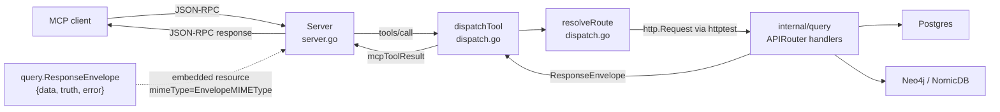
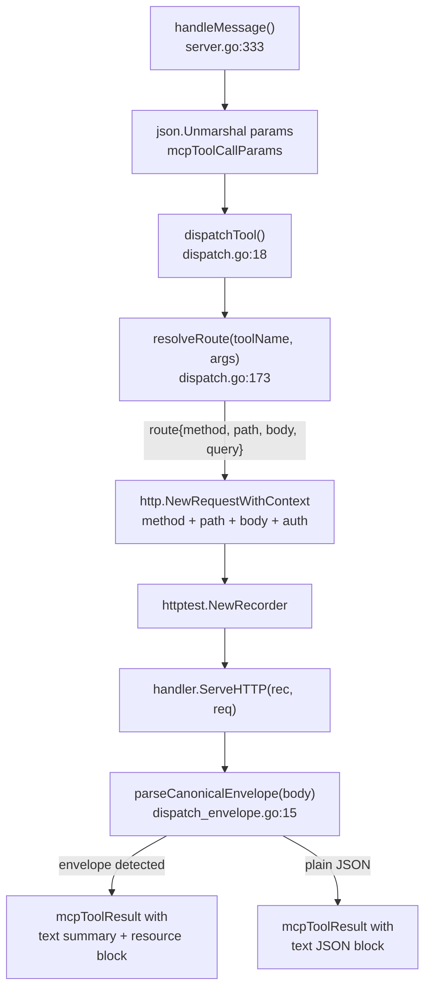

# internal/mcp

`mcp` owns the Model Context Protocol tool surface for Eshu. It implements the
MCP server, the JSON-RPC dispatcher, the SSE session model, and the 66
read-only tool definitions. Tool dispatch calls into the same `http.Handler`
chain the HTTP API uses, so a tool response and the corresponding HTTP query
response share the same truth.

## Where this fits in the pipeline

## Internal flow — one tool invocation

## Tool groups

`ReadOnlyTools` assembles 66 tools from the tool definition files.

| Group | Count | Source file |
|---|---|---|
| `codebaseTools` | 27 | `tools_codebase.go`, `tools_code_topic.go`, `tools_dead_code.go`, `tools_import_dependencies.go`, `tools_call_graph_metrics.go`, `tools_security.go`, `tools_structural_inventory.go`, `tools_iac.go` |
| `ecosystemTools` | 19 | `tools_ecosystem.go` |
| `packageRegistryTools` | 2 | `tools_package_registry.go` |
| `cicdTools` | 1 | `tools_cicd.go` |
| `supplyChainTools` | 1 | `tools_supply_chain.go` |
| `contextTools` | 7 | `tools_context.go` |
| `contentTools` | 6 | `tools_content.go` |
| `runtimeTools` | 3 | `tools_runtime.go` |

Representative tool-to-route mappings from `resolveRoute` (`dispatch.go:173`):

| Tool | HTTP method | Path |
|---|---|---|
| `find_code` | POST | `/api/v0/code/search` |
| `find_symbol` | POST | `/api/v0/code/symbols/search` |
| `inspect_code_inventory` | POST | `/api/v0/code/structure/inventory` |
| `investigate_import_dependencies` | POST | `/api/v0/code/imports/investigate` |
| `inspect_call_graph_metrics` | POST | `/api/v0/code/call-graph/metrics` |
| `investigate_code_topic` | POST | `/api/v0/code/topics/investigate` |
| `investigate_hardcoded_secrets` | POST | `/api/v0/code/security/secrets/investigate` |
| `investigate_dead_code` | POST | `/api/v0/code/dead-code/investigate` |
| `get_code_relationship_story` | POST | `/api/v0/code/relationships/story` |
| `analyze_code_relationships` | POST | `/api/v0/code/relationships/story` for callers/callees/importers/class hierarchy/overrides; `/api/v0/code/relationships` for unresolved compatibility fallbacks |
| `find_dead_iac` | POST | `/api/v0/iac/dead` |
| `find_unmanaged_resources` | POST | `/api/v0/iac/unmanaged-resources` |
| `get_iac_management_status` | POST | `/api/v0/iac/management-status` |
| `explain_iac_management_status` | POST | `/api/v0/iac/management-status/explain` |
| `propose_terraform_import_plan` | POST | `/api/v0/iac/terraform-import-plan/candidates` |
| `list_aws_runtime_drift_findings` | POST | `/api/v0/aws/runtime-drift/findings` |
| `get_relationship_evidence` | GET | `/api/v0/evidence/relationships/{resolved_id}` |
| `build_evidence_citation_packet` | POST | `/api/v0/evidence/citations` |
| `list_package_registry_packages` | GET | `/api/v0/package-registry/packages` |
| `list_package_registry_versions` | GET | `/api/v0/package-registry/versions` |
| `list_package_registry_dependencies` | GET | `/api/v0/package-registry/dependencies` |
| `list_package_registry_correlations` | GET | `/api/v0/package-registry/correlations` |
| `list_ci_cd_run_correlations` | GET | `/api/v0/ci-cd/run-correlations` |
| `list_sbom_attestation_attachments` | GET | `/api/v0/supply-chain/sbom-attestations/attachments` |
| `investigate_change_surface` | POST | `/api/v0/impact/change-surface/investigate` |
| `investigate_resource` | POST | `/api/v0/impact/resource-investigation` |
| `resolve_entity` | POST | `/api/v0/entities/resolve` |
| `get_service_story` | GET | `/api/v0/services/{service_name}/story` |
| `investigate_service` | GET | `/api/v0/investigations/services/{service_name}` |
| `get_file_content` | POST | `/api/v0/content/files/read` |
| `list_ingesters` | GET | `/api/v0/status/ingesters` |
| `trace_deployment_chain` | POST | `/api/v0/impact/trace-deployment-chain` |
| `investigate_deployment_config` | POST | `/api/v0/impact/deployment-config-influence` |

`investigate_import_dependencies` passes paging and scope arguments directly to
the HTTP handler. The handler rejects negative bounds and returns exactly one
canonical row key for each `query_type`: `dependencies`, `modules`, `cycles`, or
`cross_module_calls`.

`inspect_call_graph_metrics` keeps MCP as transport for recursive and
hub-function prompts. Dispatch forwards `repo_id`, `language`, `metric_type`,
`limit`, and `offset` to the HTTP handler; the query layer owns graph bounds,
truth metadata, source handles, and the canonical `functions` row key.

`build_evidence_citation_packet` keeps MCP as transport only: dispatch forwards
the caller's bounded handle array to the HTTP evidence route. The advertised
schema caps input at 500 handles and the query handler hydrates at most 50
citations per packet.

Package-registry tools keep MCP as transport too. Ownership candidates,
package-version publication evidence, and manifest-backed consumption all come
from the query handler; `dispatch_package_registry.go` owns the bounded route
builders while MCP only maps arguments and preserves the envelope.

IaC management tools also keep MCP as transport only. The HTTP query layer adds
`safety_gate`, `safety_summary`, import-plan candidate shaping, and
sensitive-value redaction before the envelope reaches MCP, so tool callers see
the same review-required and refused Terraform import-plan actions as HTTP
callers.

## Exported surface

| Identifier | File | Notes |
|---|---|---|
| `Server` | `server.go:94` | MCP server struct; fields `handler`, `tools`, `logger`, `sessions` |
| `NewServer` | `server.go:107` | constructs `Server`; calls `ReadOnlyTools()` to populate `tools` |
| `Server.Run` (`Run`) | `server.go:288` | stdio transport; reads stdin, writes stdout |
| `Server.RunHTTP` (`RunHTTP`) | `server.go:128` | HTTP+SSE transport; listens on `addr` |
| `ToolDefinition` | `types.go:4` | `Name`, `Description`, `InputSchema` |
| `ReadOnlyTools` | `types.go:11` | returns all 66 tool definitions |

## SSE session model

`handleSSE` (`server.go:181`) creates an `sseSession` with a 64-element
channel. It sends an `endpoint` event with the POST URL, then loops on the
session channel and a 30-second keepalive ticker. `handleHTTPMessage`
(`server.go:241`) routes responses to the session channel when a `sessionId`
query param is present and returns HTTP 202; otherwise it returns the response
directly with HTTP 200.

## Dependencies

Internal packages: `internal/buildinfo` (version string for `mcpInitializeResult`),
`internal/query` (`query.ResponseEnvelope`, `query.EnvelopeMIMEType`, the
mounted `http.Handler`). No direct dependency on storage drivers, facts, or
telemetry metric instruments.

## Telemetry

This package does not declare its own metrics or spans. Spans and metrics are
emitted by the `internal/query` handlers that `dispatchTool` calls into.
Structured log events in `server.go`: `"mcp server started"` (with `transport`
and `tools` count), `"sse session started"`, `"sse session closed"`, and
`"sse session buffer full"`. `dispatchTool` logs at debug level with tool name,
HTTP method, and path (`dispatch.go:26`).

## Operational notes

The `Accept: application/eshu.envelope+json` header is always set on internal
dispatch requests (`dispatch.go:42`). Handlers that check this header will
return the canonical envelope shape.

`normalizeQualifiedIdentifier` strips the `workload:` prefix from service
identifiers before building path segments. If a new service tool is added,
apply this helper when the input may include a type qualifier.

`contentSearchBody` normalises `repo_ids` to a single `repo_id` when only one
element is present. The function uses `firstString` to extract the first
element and sets `repo_id` rather than `repo_ids`.

## Extension points

- **Add a tool**: add a `ToolDefinition` to the matching `tools_*.go` file,
  add a `case` in `resolveRoute` in `dispatch.go`, and add a test in
  `tools_test.go` and `dispatch_test.go`. The `ReadOnlyTools` count test and
  the dispatch route test will both catch missing or mismatched entries.
- **Add an argument helper**: add to `dispatch.go` near `str`, `intOr`,
  and `boolOr`, or to `dispatch_args.go` near `stringSlice` for shared slice or
  identifier helpers. Keep the helpers side-effect-free.

## Gotchas / invariants

- Every tool name returned by `ReadOnlyTools` must have a matching `case` in
  `resolveRoute` (`dispatch.go:173`). A test in `tools_test.go` calls
  `resolveRoute` for every tool and fails if any returns an error.

- `parseCanonicalEnvelope` (`dispatch_envelope.go:15`) requires all three keys `data`,
  `truth`, and `error` to be present in the response JSON. A partial envelope
  falls back to the plain JSON path.

- Changing `ToolDefinition.Name` or `ReadOnlyTools` output is a breaking change
  for any MCP client that has cached tool names. Coordinate with the MCP guide
  and a version bump.

- The `Envelope` field of `dispatchResult` is populated by
  `parseCanonicalEnvelope` (`server.go:377`). When it is non-nil, the response
  is returned as a two-block `mcpToolResult`. Do not substitute the
  `query.EnvelopeMIMEType` string literal; use the constant.

## Related docs

- `docs/docs/guides/mcp-guide.md` — client setup, tool usage, and story-first
  orchestration patterns
- `docs/docs/reference/http-api.md` — underlying HTTP routes that every tool
  dispatches into
- `docs/docs/architecture.md` — service boundary for the MCP runtime
- `go/cmd/mcp-server/README.md` — binary wiring, transport selection, and
  admin surface
