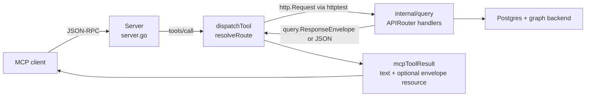

# internal/mcp

`mcp` owns the Model Context Protocol tool surface for Eshu. It implements the
MCP server, JSON-RPC message handling, SSE sessions, and the 73 read-only tool
definitions. Tool dispatch calls the same `http.Handler` chain used by the HTTP
API, so MCP and HTTP responses share the same query truth, envelopes, auth
checks, and backend behavior.

## Purpose

This package translates MCP protocol messages into bounded internal HTTP
requests. It does not query Postgres, Neo4j, or NornicDB directly; data access
belongs to `internal/query` and the storage adapters behind that package.

## Ownership Boundary

`mcp` owns:

- `initialize`, `tools/list`, `tools/call`, and `ping` JSON-RPC handling
- stdio transport through `Server.Run`
- HTTP/SSE transport through `Server.RunHTTP`, `GET /sse`, and
  `POST /mcp/message`
- the `ReadOnlyTools` registry and per-tool input schemas
- tool-name to HTTP-route mapping in `resolveRoute`
- canonical envelope detection and MCP result shaping

`mcp` does not own query planning, graph reads, content-store reads, result
truth, pagination semantics, or route-level authorization. Those stay in
`internal/query`; this package forwards requests to that handler.

## Invocation Flow

`dispatchTool` always sets `Accept: application/eshu.envelope+json`. If the
original MCP HTTP request includes `Authorization`, dispatch forwards that
header to the internal query handler. `parseCanonicalEnvelope` treats a response
as the canonical Eshu envelope only when `data`, `truth`, and `error` are all
present.

## Tool Groups

`ReadOnlyTools` assembles 73 tools from the tool definition files.

| Group | Count | Source file |
|---|---:|---|
| Codebase and code analysis | 27 | `tools_codebase.go`, `tools_code_topic.go`, `tools_dead_code.go`, `tools_import_dependencies.go`, `tools_call_graph_metrics.go`, `tools_security.go`, `tools_structural_inventory.go`, `tools_iac.go` |
| Ecosystem, deployment, impact, repositories | 19 | `tools_ecosystem.go` |
| Package registry | 2 | `tools_package_registry.go` |
| CI/CD | 1 | `tools_cicd.go` |
| Service catalog | 1 | `tools_service_catalog.go` |
| Supply chain | 3 | `tools_supply_chain.go` |
| Context | 7 | `tools_context.go` |
| Content and citations | 6 | `tools_content.go` |
| Documentation | 4 | `tools_documentation.go` |
| Runtime status | 3 | `tools_runtime.go` |

The main route families are:

| Tool family | HTTP route owner |
|---|---|
| Code search, symbols, relationships, call graph, quality, dead code, language query, diagnostic Cypher | `/api/v0/code/*` handlers in `internal/query` |
| Repository and ecosystem stories | `/api/v0/repositories/*`, `/api/v0/ecosystem/*` |
| Entity, workload, and service context or stories | `/api/v0/entities/*`, `/api/v0/workloads/*`, `/api/v0/services/*`, `/api/v0/investigations/*` |
| File/entity content and citation hydration | `/api/v0/content/*`, `/api/v0/evidence/*` |
| IaC, infrastructure, deployment, impact, environment comparison | `/api/v0/iac/*`, `/api/v0/infra/*`, `/api/v0/impact/*`, `/api/v0/compare/*` |
| Package registry, CI/CD, supply chain, documentation, runtime status | their matching `/api/v0/*` query route families, including container-image identity reads |

Keep this table at the family level. Exact argument shaping belongs in
`resolveRoute`, the matching `tools_*.go` schema, and the dispatch tests.

## Exported Surface

| Identifier | File | Notes |
|---|---|---|
| `Server` | `server.go` | MCP server with query handler, tools, logger, and SSE sessions |
| `NewServer` | `server.go` | constructs a server and populates tools with `ReadOnlyTools()` |
| `Server.Run` | `server.go` | stdio JSON-RPC transport |
| `Server.RunHTTP` | `server.go` | HTTP+SSE transport; mounts `/sse`, `/mcp/message`, `/health`, and `/api/` |
| `ToolDefinition` | `types.go` | advertised MCP tool name, description, and input schema |
| `ReadOnlyTools` | `types.go` | returns all 73 read-only tool definitions |

## Dependencies

Internal packages:

- `internal/buildinfo` for the initialize response version string
- `internal/query` for `ResponseEnvelope`, `EnvelopeMIMEType`, and the mounted
  HTTP handler

This package has no direct dependency on storage drivers, facts, or telemetry
metric instruments.

## Telemetry

This package does not declare its own metrics or spans. Spans and metrics are
emitted by the `internal/query` handlers that `dispatchTool` calls.

Structured log events in `server.go`:

- `"mcp server started"` with transport and tool count
- `"sse session started"`
- `"sse session closed"`
- `"sse session buffer full"`

`dispatchTool` logs the tool name, HTTP method, and path at debug level.

## Gotchas / Invariants

- Every tool returned by `ReadOnlyTools` must have a matching `resolveRoute`
  case or helper route. `TestEveryRegisteredToolHasDispatchRoute` enforces this.
- MCP dispatch must stay transport-only. Add query behavior in `internal/query`
  and route to it from this package.
- The canonical MCP result has two content blocks when the HTTP response is an
  Eshu envelope: a text summary and a resource block with
  `query.EnvelopeMIMEType`.
- Do not replace `query.EnvelopeMIMEType` with a string literal.
- Changing `ToolDefinition.Name`, required schema fields, or `ReadOnlyTools`
  output is a client-facing breaking change. Coordinate public docs and version
  handling.
- `normalizeQualifiedIdentifier` strips prefixes such as `workload:` before
  service paths are built.
- `contentSearchBody` accepts `repo_id` or `repo_ids`; a single `repo_ids`
  value is normalized to `repo_id` for the query handler.
- SSE sessions use a 64-element response channel and a 30-second keepalive
  ticker. Channel overflow is non-fatal: the server logs a warning and drops
  the response.

## Extension Points

- Add a tool by updating the matching `tools_*.go` file, adding a route mapping
  in `resolveRoute`, and adding dispatch and registry tests.
- Change an argument mapping by updating the advertised `InputSchema`,
  `resolveRoute`, and tests together.
- Change SSE behavior in `handleSSE`; preserve the endpoint event format unless
  client compatibility has been handled.
- Change protocol version only after checking MCP client compatibility.

## Related Docs

- `docs/public/guides/mcp-guide.md` - client usage, envelopes, and bounded-call
  guidance
- `docs/public/reference/mcp-reference.md` - full MCP tool list
- `docs/public/reference/mcp-tool-contract-matrix.md` - prompt-readiness bounds
  and envelope status
- `docs/public/reference/http-api.md` - HTTP route families behind MCP dispatch
- `docs/public/concepts/how-it-works.md` - service boundary for the MCP runtime
- `go/cmd/mcp-server/README.md` - binary wiring, transport selection, and admin
  surface
