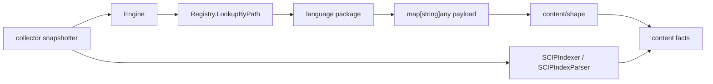

# internal/parser

`internal/parser` owns Eshu's parser dispatch layer: language registry lookup,
tree-sitter runtime caching, native parser wrappers, repository pre-scan, and
optional SCIP index parsing. Language packages own the syntax details.

Parser output is fact input. When a parser adds or changes an entity,
relationship, metadata key, or dead-code root kind, the matching fixtures,
content shaping, fact contracts, and downstream docs must move with it.

## Runtime Flow



## Core Responsibilities

- Dispatch files to parser definitions by extension, exact name, or prefix
  name.
- Cache tree-sitter grammar handles through `Runtime`.
- Run full-file parses through language adapter wrappers.
- Run repository pre-scans for import maps and cross-file context.
- Run Go package semantic pre-scan for same-package and imported-package root
  evidence.
- Preserve deterministic output order for retries and repair runs.
- Convert parser options into shared adapter options without making child
  packages import the parent dispatcher.
- Parse optional SCIP protobuf indexes into supplemental facts.

## Package Boundaries

| Area | Owns |
| --- | --- |
| `internal/parser` | Dispatch, registry, runtime cache, pre-scan orchestration, SCIP wrapper, compatibility helpers. |
| `internal/parser/shared` | Shared tree-sitter helpers, payload helpers, and adapter option bridging. |
| Language subpackages | Parse and pre-scan behavior for their language. |
| `internal/content/shape` | Conversion from parser payload keys into content file/entity snapshots. |
| `internal/facts` | Durable fact kinds and payload contracts. |
| Collector | Parse timing, parse-stage logs, and fact streaming. |

The parser package must not import collector, projector, reducer, storage,
query, or telemetry packages.

## Registered Languages

| Parser key | Inputs |
| --- | --- |
| `c`, `cpp`, `c_sharp` | C/C++/C# source and headers. |
| `go` | Go source, embedded SQL metadata, package semantic roots. |
| `java`, `java_metadata` | Java source plus ServiceLoader and Spring metadata files. |
| `javascript`, `typescript`, `tsx` | JavaScript-family source, package roots, re-export metadata, tsconfig metadata. |
| `python` | Python source and notebooks. |
| `rust`, `scala`, `kotlin`, `swift`, `dart`, `ruby`, `perl`, `haskell`, `elixir`, `php`, `groovy` | Language-specific source adapters. |
| `hcl` | Terraform, Terragrunt, tfvars, and HCL metadata. |
| `yaml`, `json`, `cloudformation`, `dbtsql`, `sql`, `dockerfile` | Structured config, IaC, data, and runtime metadata. |
| `raw_text` | Template and config text files that need content facts without language entities. |

Use `DefaultRegistry().Definitions()` when you need the exact current mapping.
Do not duplicate extension lists in new docs.

## Parse And Pre-Scan Contracts

`Engine.ParsePath` resolves the repository root and file path, looks up the
parser definition, calls the language adapter, attaches inferred content
metadata, and returns a `map[string]any` payload.

`Engine.PreScanRepositoryPathsWithWorkers` runs a lighter concurrent pass over
repository files, then merges results in input order. The final sort is part of
the determinism contract.

`Engine.PreScanGoPackageSemanticRoots` adds Go-specific package context that
the collector passes back into full-file parser options. That path must remain
bounded; do not reintroduce full-tree walks per call site.

## Dead-Code Root Metadata

`dead_code_root_kinds` is conservative reachability evidence, not a cleanup
verdict. Parser adapters should add it only when source text or bounded config
proves an entrypoint, callback, public package surface, framework hook, or
language runtime hook.

Examples include Go entrypoints and interface escapes, Java `main` and
framework callbacks, Python route/task/CLI/Lambda roots, JavaScript package
exports and route handlers, Rust test and public API roots, and C/C++ callback
or header-declared roots. Query policy decides how to present candidates.

## SCIP Support

SCIP supplements native parser output for supported languages. It does not
replace tree-sitter output.

1. `DetectSCIPProjectLanguage` picks the dominant SCIP-capable language.
2. `SCIPIndexer.Run` executes the configured `scip-*` binary.
3. `SCIPIndexParser.Parse` parses the protobuf index.
4. The collector combines SCIP-derived facts with native parser facts.

SCIP is opt-in through `SCIP_INDEXER=true`; `SCIP_LANGUAGES` narrows allowed
languages.

## Telemetry

The parser package emits no metrics or spans directly. Collector snapshotting
records parse duration with `eshu_dp_file_parse_duration_seconds` and logs
parse-stage failures under `collector snapshot stage completed`.

## Safety Rules

- Keep parser output deterministic for the same source bytes.
- Keep payload keys stable unless `content/shape`, facts, reducers, and docs
  are updated in the same change.
- Do not treat ambiguous or dynamic language constructs as proven roots.
- Do not let child language packages import the parent dispatcher.
- Do not create package-global tree-sitter runtimes per file; share `Runtime`.
- Keep high-cardinality source details out of metrics; collector logs own
  operator diagnosis.
- SCIP and native parser facts may overlap; callers must not assume SCIP
  supersedes native output.

## Change Checklist

- Add a language by registering a unique `Definition`, adding the adapter
  dispatch case, adding pre-scan support when imports need it, adding fixtures,
  updating `internal/content/shape` for new entity buckets, and documenting the
  language table.
- Add an entity key by updating the adapter output, collector snapshot bucket
  handling, `shape.Materialize`, fixture assertions, and projector label
  mapping when the entity needs a graph node.
- Add SCIP support by updating the language config, priority list, expected
  binary name, and SCIP fixture tests.
- Change pre-scan behavior with deterministic ordering tests. Sort before
  returning from any pre-scan path that collects map or set data.

## Verification

```bash
go test ./internal/parser/... -count=1
go run ./cmd/eshu docs verify ../go/internal/parser --limit 1000 \
  --fail-on contradicted,missing_evidence
```

Run the relevant language package tests when touching a language adapter. Run
collector tests when parser output shape or parser options change.

## Related Docs

- [Architecture](../../../docs/public/architecture.md)
- [Language Support](../../../docs/public/languages/feature-matrix.md)
- [Contributing Language Support](../../../docs/public/contributing-language-support.md)
- [Collector Package](../collector/README.md)
- [Content Shape](../content/shape/README.md)
