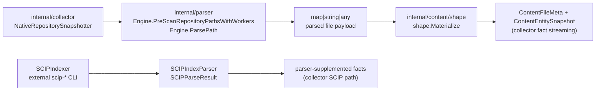
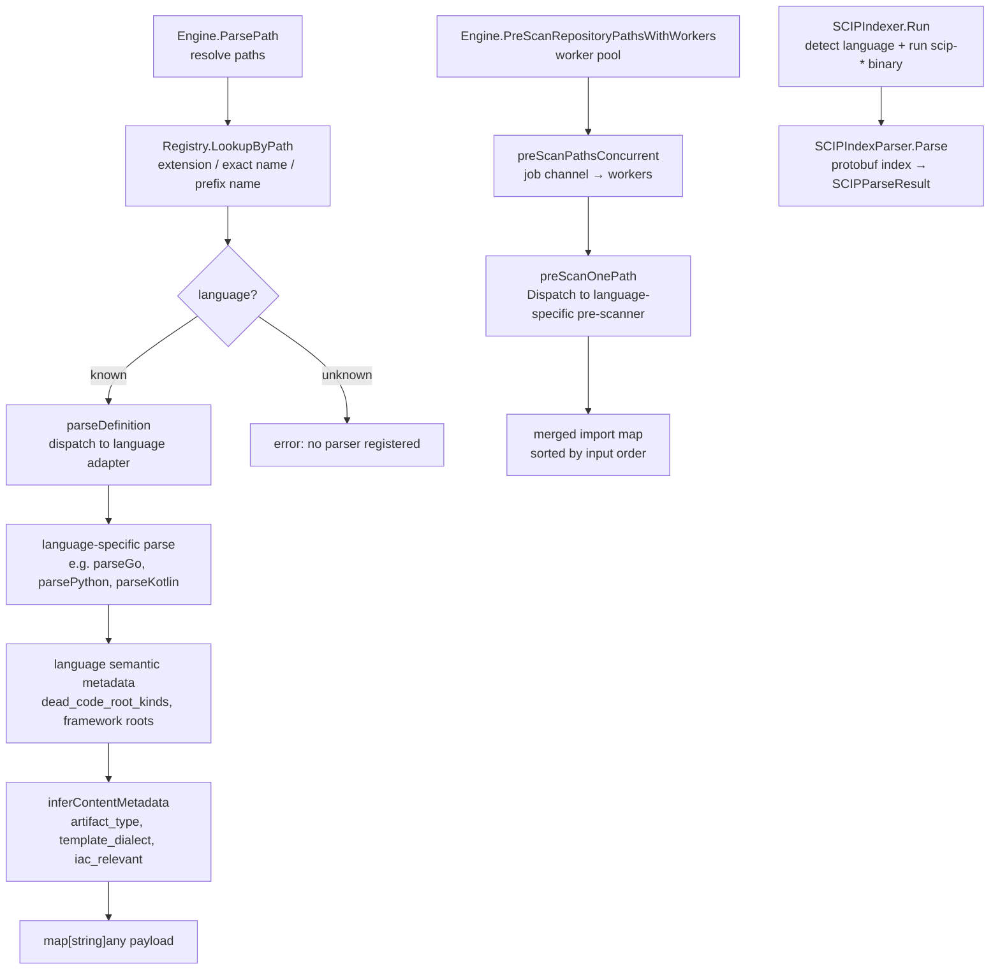

# Parser

## Purpose

`internal/parser` owns the native Go parser registry, language adapters,
import, re-export, and constructor receiver metadata, dead-code root metadata,
and SCIP reduction support used to extract source-level entities and metadata.
Parser changes must preserve fact truth: when a parser emits a new
entity, relationship, or metadata field, the relevant fixtures, fact contracts
in `internal/facts`, and downstream docs must move in lockstep. Parsers must
be deterministic given the same source bytes so retries and repair runs
converge.

`Options.EmitDataflow` is the opt-in value-flow gate. When enabled, capable
adapters may emit `dataflow_functions`, `taint_findings`,
`interproc_findings`, and, only with stable repository and package identity,
`dataflow_summaries`. The gate is off by default; direct parser callers without
durable identity must not emit summary rows with malformed FunctionIDs.

## Where this fits in the pipeline

## Internal flow

## Lifecycle / workflow

`Engine` is the single dispatch point for both parse and pre-scan operations.
`DefaultEngine()` constructs an engine from `DefaultRegistry()` and
`NewRuntime()`. `NewRuntime` allocates a thread-safe cache of tree-sitter
language handles; grammars are loaded on first use and reused across calls.

`Engine.ParsePath` resolves both `repoRoot` and `path` to absolute form, calls
`Registry.LookupByPath` to identify the language, then dispatches to the
registered `LanguageProvider` when present before falling back to legacy
built-in wrappers. The wrapper keeps the parent parser signature stable while
language-owned packages hold adapter logic that no longer needs parent
internals. Language adapters may attach semantic metadata
such as
`dead_code_root_kinds` when syntax or bounded config proves an entrypoint,
framework callback, function-value callback, Python route/task/CLI decorator,
Python AWS Lambda handler, JavaScript package export, CommonJS default export,
CommonJS mixin method export, configured Hapi handler or exported route-array
handler reference, Next.js app or route export,
Express/Koa/Fastify/NestJS callback root, Fastify route-object handler,
constructor-passed function-value reference, Node migration export, TypeScript
module-contract export, TypeScript public method on a class that declares
`implements`, or TypeScript package public API surface proven through a
nearest-package `exports` or `types` target and bounded static re-export
barrels. C adapters mark `main`, functions declared by directly included local
headers, signal-handler arguments, callback argument targets, and direct
function-pointer initializer targets without scanning every repository header.
C++ adapters mark `main`, functions and class methods declared by directly
included local headers, virtual and override methods, callback argument targets,
direct function-pointer initializer targets, and Node native-addon entrypoints
without recursing through include graphs or resolving build targets.
Java adapters mark `main` methods, constructors, `@Override` methods, public
Ant `Task` setters, Gradle plugin `apply` methods, Gradle task actions and
properties, Gradle task setters and task-interface methods, public Gradle DSL
methods, and same-class method-reference targets as dead-code roots so query
policy does not report JVM entrypoints, dispatch callbacks, or framework-injected
task properties as cleanup candidates. Java method and constructor metadata
captures parameter counts and parameter types. Serialization and
Externalizable hook signatures are also roots because the JVM can invoke
methods such as `readObject` and `writeExternal` outside ordinary source calls.
Java call metadata captures method references such as `this::configureTask`,
bounded literal reflection calls such as Class.forName class names and
getDeclaredMethod method names, argument counts,
and bounded argument types from parameters, fields, inline constructors, and
class-literal typed lambdas, so the reducer can distinguish overloaded methods
when local receiver evidence points at a type. Receiver inference builds a local
index of parameters, variables, enhanced-for loop variables, fields, and typed
lambda parameters and same-class method return types for each parsed file
before call extraction, so large classes do not repeat a full tree walk for
every method invocation. Method-call arguments such as helper calls can then
carry bounded return-type metadata when resolving overloads. Unqualified Java
calls inside nested classes carry a nearest-to-outermost
`enclosing_class_contexts` chain, which lets the reducer match inner-class
helpers first and then enclosing class methods without broad same-name fallback.
Explicit outer-this field receivers in Java's named-outer-instance field form
reuse the field type index for the named enclosing class, so nested callback
bodies can still produce typed receiver evidence.
Record declarations use the same class-style context for nested method parsing,
which keeps Java record helper methods addressable by the reducer.
Java metadata files under META-INF/services, Spring Boot
AutoConfiguration.imports, and `spring.factories` parse as `java_metadata`
payloads. The parent parser keeps the wrapper and payload shape, while the Java
helper subpackage extracts bounded class-reference evidence for provider and
auto-configuration classes without scanning the repository from each Java
source file.
Python adapters also preserve method `class_context`, constructor call
metadata, class receiver references, dataclass/property roots, dunder protocol
roots, inheritance base names, same-module `__all__` public API roots, package
`__init__.py` reexport roots, public base classes inherited by those
parser-proven public classes, public methods on those classes, and simple
local constructor or `self` receiver metadata. The public API helper walks
bounded package evidence instead of treating every non-underscore symbol as
live, so reducer call materialization can connect class, constructor, and
instance method calls without broad guessing.
Exported TypeScript object registries also mark same-file function values as
`typescript.static_registry_member`; private registries do not create roots.
JavaScript-family adapters also preserve import alias metadata, CommonJS
`module.exports` self-aliases, JSONC tsconfig `baseUrl` and `paths`
`resolved_source` metadata through the JavaScript helper subpackage even when
the config uses comments or trailing commas, returned and constructor-argument
function-value references, static relative re-export metadata, constructor
calls, and local receiver type metadata from `const value = new Type()` and
typed parameters so reducer call materialization can resolve bounded cross-file
calls.
JSON parsing now lives in the JSON helper subpackage. The parent parser keeps
the wrapper and dbt SQL lineage callback, while the child package owns
ordered-object metadata, dependency manifests, npm/Composer/NuGet/SwiftPM
lockfile rows, `.jsonc` config files, TypeScript config rows,
CloudFormation/SAM JSON attachment, dbt manifest payload construction, and
data-intelligence replay documents. NuGet `.csproj` files route through the
`nuget_project` parser to emit PackageReference dependency rows without mixing
project XML parsing into the C# syntax adapter.

Package-level roots are resolved from the nearest owning `package.json`, so
nested workspaces can expose
their own entrypoints, `bin` targets, and package exports without depending on
the repository root manifest. That nearest-package evidence now lives in the
JavaScript helper subpackage, while the parent parser decides which parsed
functions or types receive root metadata. Hapi handler roots search from the owning
service/package root before falling back to repository-root conventions, and
route arrays recognize both `config.handler` and `options.handler` as mounted
handler references. After
the language adapter returns,
`inferContentMetadata` sets `artifact_type`, `template_dialect`, and
`iac_relevant` on the payload. The final payload also carries `repo_path`.

Go embedded SQL extraction lives in the Go helper subpackage while the parent
parser keeps the `embedded_sql_queries` payload contract. The Go helper also
emits direct-method-call roots, imported-package direct-method-call roots,
package-level generic and chained receiver roots, qualified same-repo package
interface roots, and, when module identity is available, stable `scip-go gomod`
symbols on definitions plus matching imported-call symbol keys. Generic receiver
type names are normalized to their base type before payload emission so methods
declared on receivers such as `Map[K, V]` can meet call evidence for `Map`
instances.
Go composite literals also emit `function_calls` rows with
`call_kind=go.composite_literal_type_reference`. The reducer materializes them
as deduplicated REFERENCES edges, not canonical CALLS edges, so sibling files
can keep local structs out of dead-code candidate lists without claiming type
references are invocations.
Java method-reference, literal-reflection, ServiceLoader provider, and Spring
auto-configuration rows follow the same rule: they prove reachability roots but
do not claim an invocation happened.

Full Go, Java, Python, and JavaScript/TypeScript/TSX adapters now live in their
language helper subpackages behind thin parent wrappers. Parent-owned runtime
grammar caching, registry dispatch, raw-text payload construction, SCIP payload
assembly, and dbt SQL lineage callbacks remain in this package. The
`shared_bridge.go` wrapper converts parent `Options` into shared adapter
options so child adapters do not import the dispatcher.

dbt SQL lineage extraction now lives in the dbt SQL helper subpackage. The
parent parser keeps `ColumnLineage`, `CompiledModelLineage`, and the
`extractCompiledModelLineage` compatibility wrapper because JSON dbt manifest
parsing receives lineage through a parent-supplied callback.

`Engine.PreScanRepositoryPathsWithWorkers` runs a pre-scan pass that extracts
import names, package-level interface references, type references, and
referenced symbol names from each file. Results are merged across workers and
sorted by input order to produce a deterministic import map. The Go semantic
pre-scan also reads `go.mod` when present, qualifies exported local-package
interface-parameter contracts by import path, routes imported receiver method
calls back to the package that defines those methods, combines package-local
generic constraint interfaces with package method declarations, and combines
local interface return signatures with chained calls in sibling files. The
pre-scan is a lighter parse used to build cross-file import context before the
full parse pass. Java
pre-scan includes records alongside classes, interfaces, annotations, enums,
methods, and constructors so record helper methods participate in the same
downstream name map as class methods.

Python `.ipynb` files use the Python helper subpackage to extract executable
code cells, then the parent parser writes that source view to a temporary
Python file before tree-sitter parsing. The temporary file is removed after
parse. The notebook path shares the same payload contract as `.py` files.

Groovy/Jenkins pipeline metadata extraction, lexical class/function/call
entities, payload assembly, and pre-scan name extraction live in the Groovy
helper subpackage. The parent parser keeps the
`ExtractGroovyPipelineMetadata` compatibility wrapper used by query and
relationship code.

Dockerfile runtime metadata extraction lives in the Dockerfile helper
subpackage. The parent parser keeps file I/O, registry dispatch, and the
`ExtractDockerfileRuntimeMetadata` compatibility wrapper used by query and
relationship code.

CloudFormation and SAM template evidence now lives in the CloudFormation helper
subpackage so JSON and YAML adapters share the same template classification,
condition evaluation, and bucket construction contract.

YAML parsing now lives in the YAML helper subpackage. The parent parser keeps
the wrapper, while the child package owns YAML decoding, Kubernetes and
Crossplane resource rows, Argo CD rows, Kustomize rows, Helm chart/value rows,
and YAML-side CloudFormation/SAM attachment.

First-wave language package moves also cover C, C++, Rust, C#, Scala, Elixir,
Swift, Dart, Ruby, Perl, Haskell, SQL, and HCL/Terraform adapters. Those
packages own parse and pre-scan behavior behind thin parent wrappers. Shared
payload, tree-sitter, and value helpers live in the shared parser helper
subpackage so child packages do not import the parent dispatcher.
The Ruby package also owns Bundler `Gemfile` and `Gemfile.lock` dependency
evidence so RubyGems manifest and lockfile rows use the same parser payload
path as `.rb` source files.

**SCIP path**: when `SCIP_INDEXER=1`, `true`, `yes`, or `on`, the collector
snapshotter groups selected files from the configured SCIP-capable list by
language and
package/workspace root, verifies the matching `scip-*` binary is on `PATH`,
runs it via `SCIPIndexer.Run`, and parses the resulting protobuf index via
`SCIPIndexParser.Parse`. The SCIP result supplements the native tree-sitter
parse for supported languages (Go, Python, TypeScript, JavaScript, Rust, Java,
C, C++), and files omitted from an index still complete through the native
parser path.

## Exported surface

- `Engine` — dispatch hub; constructed via `DefaultEngine()` or `NewEngine(registry, runtime)`
- `DefaultEngine()` — builds an engine from the built-in registry and a fresh
  tree-sitter runtime
- `NewEngine(registry, runtime)` — constructs an engine from provided `Registry`
  and `Runtime`
- `Engine.ParsePath(repoRoot, path, isDependency, options)` — parse one file;
  returns `map[string]any`
- `Engine.PreScanPaths(paths)` — import-map contract for collector prescan
- `Engine.PreScanRepositoryPaths(repoRoot, paths)` — repo-bounded prescan
- `Engine.PreScanRepositoryPathsWithWorkers(repoRoot, paths, workers)` — concurrent prescan
- `Engine.PreScanGoPackageSemanticRoots(repoRoot, paths)` — Go package semantic
  root contract for collector parser options
- `Registry` — immutable parser catalog
- `NewRegistry(definitions)` — builds an immutable registry; panics in
  `DefaultRegistry()` if the built-in definitions are invalid
- `DefaultRegistry()` — built-in catalog for this wave of supported languages
- `Registry.LookupByPath(path)` — extension / exact name / prefix name lookup;
  `.tfvars.json` routes to the `hcl` definition, and Java metadata files under
  META-INF/services, META-INF/spring, and META-INF/spring.factories
  route to `java_metadata`
- `Registry.LookupByExtension(extension)` — direct extension lookup
- `Registry.LookupByParserKey(parserKey)` — direct key lookup
- `Registry.Definitions()` — cloned definitions in deterministic parser-key order
- `Registry.ParserKeys()` — registered keys in deterministic order
- `Registry.Extensions()` — registered extensions in sorted order
- `Definition` — `ParserKey`, `Language`, `Extensions`, `ExactNames`,
  `PrefixNames`, and optional `LanguageProvider`
- `LanguageProvider` — language-owned parse, pre-scan, and capability contract
- `Runtime` — tree-sitter language handle cache; `Language(name)` returns a
  cached `*tree_sitter.Language`
- `NewRuntime()` — constructs a fresh tree-sitter runtime
- `Options` — `IndexSource bool`, `VariableScope string`
- `SCIPIndexer` — runs an external `scip-*` CLI; fields: `LookPath`,
  `RunCommand`, `Timeout`
- `SCIPIndexParser` — parses a SCIP protobuf index into `SCIPParseResult`
- `SCIPParseResult` — parsed SCIP output for downstream fact emission
- `DetectSCIPProjectLanguage(paths, allowed)` — dominant SCIP-capable language
  by file extension count, filtered to the allowed set
- `ExtractDockerfileRuntimeMetadata(sourceText)` — exported utility for
  Dockerfile runtime metadata extraction
- `ExtractGroovyPipelineMetadata(sourceText)` — exported utility for Groovy
  pipeline metadata extraction
- `ColumnLineage`, `CompiledModelLineage` — dbt/SQL lineage records

## Registered languages and tree-sitter support

| Language | Parser key | Extensions | Tree-sitter native |
| --- | --- | --- | --- |
| C | `c` | `.c` | yes |
| C# | `c_sharp` | `.cs`, `.csx` | yes |
| C++ | `cpp` | `.cc`, `.cpp`, `.cxx`, `.h`, `.hh`, `.hpp` | yes |
| Dart | `dart` | `.dart` | yes |
| Dockerfile | `__dockerfile__` | `Dockerfile`, `Dockerfile.*` | — |
| Elixir | `elixir` | `.ex`, `.exs`, `mix.lock` | yes |
| Go | `go` | `.go` | yes |
| Go modules | `gomod` | `go.mod`, `go.sum` (exact filenames) | — |
| Groovy/Jenkinsfile | `groovy`, `__jenkinsfile__` | `.groovy`, `Jenkinsfile` | yes (metadata scanners remain bounded) |
| Haskell | `haskell` | `.hs` | yes |
| HCL/Terraform | `hcl` | `.hcl`, `.tf`, `.tfvars`, `.tfvars.json` | — |
| Java | `java` | `.java` | yes |
| Java metadata | `java_metadata` | META-INF/services/*, AutoConfiguration.imports, spring.factories | — |
| JavaScript | `javascript` | `.cjs`, `.js`, `.jsx`, `.mjs` | yes |
| JSON | `json` | `.json`, `.jsonc` | — |
| Kotlin | `kotlin` | `.kt` | yes |
| NuGet project | `nuget_project` | `.csproj` | — |
| Perl | `perl` | `.pl`, `.pm` | yes |
| PHP | `php` | `.php` | yes |
| Python | `python` | `.ipynb`, `.py`, `.pyw` | yes |
| Raw text | `raw_text` | `.cnf`, `.cfg`, `.conf`, `.j2`, `.jinja`, `.jinja2`, `.tpl`, `.tftpl` | — |
| Ruby | `ruby` | `.rb`, `Gemfile`, `Gemfile.lock` | yes for `.rb`; Bundler manifests scanned |
| Rust | `rust` | `.rs` | yes |
| Scala | `scala` | `.sc`, `.scala` | yes |
| SQL | `sql` | `.sql` | yes |
| Swift | `swift` | `.swift` | yes (tree-sitter AST walk) |
| TSX | `tsx` | `.tsx` | yes (TypeScript grammar) |
| TypeScript | `typescript` | `.cts`, `.mts`, `.ts` | yes |
| YAML | `yaml` | `.yaml`, `.yml` | — |

`—` is not a permanent-exception marker. Treat a parser or helper as a
permanent no-tree-sitter exception only when it appears in the "Permanent
parser exceptions (no tree-sitter migration)" section of `AGENTS.md`: YAML,
JSON, HCL/Terraform/Terragrunt, Go modules, node lockfiles, Python dependency
manifests, Maven, NuGet, Gradle DSL, CloudFormation/SAM, `dbtsql`,
`templated_detection`, raw text, SCIP, Dockerfile, and Java metadata. All other
`—` rows need design or migration follow-up; do not use the dash to exempt a
source-language adapter that has a runtime tree-sitter loader or language-owned
AST package.

### Kotlin and Swift symbol extraction

Kotlin uses a hybrid adapter: a line-oriented declaration scan emits the symbol
set, and a tree-sitter syntax index (`kotlin/tree_sitter_syntax.go`) supplements
it with end-of-declaration lines, multiline `class_context`, constructor
parameter property types, function arguments, and inheritance bases. Swift now
uses a single tree-sitter AST walk (`swift/ast_extract.go`) with no line scan.
Both adapters emit functions, classes, calls, and imports; the golden gates
`TestKotlinComprehensiveSymbolExtractionGate` and
`TestSwiftComprehensiveSymbolExtractionGate` pin the comprehensive-fixture
symbol set so a regression to empty extraction fails CI.

Kotlin emits `classes` (including `data`, `sealed`, `abstract`, `object`,
`companion object`, and `enum class`), `interfaces`, `functions` (with
`class_context`, `extension_receiver`, and `suspend`), secondary `constructor`
functions, `variables`, `imports`, and `function_calls`. Call extraction covers
receiver-qualified calls, chained calls, `this.` calls, constructor calls, and
unqualified bare calls (same-scope, top-level, and imported function calls).

Swift extraction (#3589) walks the tree-sitter AST once and emits `classes`
(including `actor`), `structs`, `enums`, `protocols`, `functions` (with `args`,
`class_context`, and `init`), `variables` (with `type`), `imports`, and
`function_calls` (with `inferred_obj_type`) directly from node ranges. Only
genuine `call_expression` nodes produce call rows, so the prior line-scan
false positives (enum case declarations, `mutating`/`override` declaration lines,
`private(set)` modifiers, and string interpolation) are gone, and real subscript,
initializer, and chained-method calls the scanner missed are now captured.
Members declared inside an `extension` block are attributed to the extended type:
the Swift grammar models `extension Foo { ... }` as a `class_declaration` whose
extended type is a `user_type` child, so the AST walk resolves the extended type
name and pushes an `extension` scope without emitting a duplicate type entity.
The Vapor `use:` route hint has no symbol-node form, so it is read as framework
evidence from call argument labels (documented permanent exception in `AGENTS.md`).

The Kotlin adapter does not retain a whole-function AST node at the symbol-append
site, so it stays on the cyclomatic-complexity pending list below until its
function bodies route through a tree-sitter node with a `shared.BranchNodeSet`.

## SCIP support

SCIP provides higher-fidelity cross-file symbol resolution for languages where
tree-sitter alone cannot reliably produce type-qualified call graphs. The SCIP
path in Eshu:

1. `DetectSCIPProjectLanguage` scans file extensions to find the dominant
   SCIP-capable language (priority: Python, TypeScript, JavaScript, Go, Rust,
   Java, C++, C).
2. `SCIPIndexer.Run` invokes the external binary (`scip-go`, `scip-python`,
   `scip-typescript`, `scip-rust`, `scip-java`, `scip-clang`) and returns the
   generated index path.
3. `SCIPIndexParser.Parse` reads the protobuf index and returns `SCIPParseResult`
   for downstream fact emission.
4. SCIP definition payloads preserve the source `scip_symbol` on emitted
   functions, classes, and variables so reducers can build generation-stable
   symbol indexes without reconstructing monikers from names and paths.
5. SCIP results supplement — not replace — native tree-sitter output for the
   same repository.

SCIP defaults off. Set `SCIP_INDEXER=1`, `true`, `yes`, or `on` to enable
SCIP for `python,typescript,javascript,go,rust,java,cpp,c` when the required
external binary is available. Unset, unrecognized, `false`, `0`, `no`, and
`off` values keep native-only parsing. `SCIP_LANGUAGES` narrows the allowlist;
it does not remove native parser coverage for selected files outside the SCIP
index.

## Cyclomatic complexity coverage

Function entities carry a `cyclomatic_complexity` field consumed by the
`find_most_complex_functions` and `calculate_cyclomatic_complexity` query tools.
Real McCabe complexity is computed from the tree-sitter AST by the shared walker
`shared.CyclomaticComplexity`, driven by per-language `shared.BranchNodeSet`
tables. Complexity is `1` plus one for every decision point: each
`if`/`elif`, loop, `switch`/`match` case arm, exception handler (`catch`/`except`),
conditional (ternary) expression, and short-circuit boolean operator (`&&`, `||`,
and the language-specific `and`/`or`). The walk stops at nested function, lambda,
and type definitions so an inner closure does not inflate the enclosing function.

The catch-all arm is the implicit else, not a decision, so it is excluded: a
`switch` `default`, a Rust/Scala/Python bare wildcard `_` arm, and a switch or
match whose only arm is the catch-all all leave complexity at the base value.
The `BranchNodeSet` `defaultCaseKinds` field names the node kinds that double as
a `default`/wildcard arm (for example Java `switch_label`, C# `switch_section`,
C/C++ `case_statement`, Rust `match_arm`, Scala/Python `case_clause`); the walker
counts those nodes only for real case arms. A guarded wildcard (`_ if cond`)
still tests a condition, so it stays counted. Go needs no entry because its
grammar emits a distinct `default_case` node that is simply left out of the
branch kinds.

| Language | Complexity source | Status |
| --- | --- | --- |
| Go | AST walk (`golang.cyclomaticComplexity`) | real |
| Python | AST walk (`python.cyclomaticComplexity`) | real |
| C | AST walk (`c.cyclomaticComplexity`) | real |
| C++ | AST walk (`cpp.cyclomaticComplexity`) | real |
| Java | AST walk (`java.cyclomaticComplexity`) | real |
| C# | AST walk (`csharp.cyclomaticComplexity`) | real |
| Rust | AST walk (`rust.cyclomaticComplexity`) | real |
| Scala | AST walk (`scala.cyclomaticComplexity`) | real |
| Kotlin | `BranchNodeSet` table (`kotlin.kotlinCyclomaticComplexity`) | real |
| Ruby | `BranchNodeSet` table (`ruby.rubyCyclomaticComplexity`) | real |
| PHP | `BranchNodeSet` table (`php.phpCyclomaticComplexity`) | real |
| Swift | `BranchNodeSet` table (`swift.swiftCyclomaticComplexity`) | real |
| Perl | `BranchNodeSet` table (`perl.perlCyclomaticComplexity`) | real |
| Dart | `BranchNodeSet` table (`dart.dartCyclomaticComplexity`) | real |
| Groovy | `BranchNodeSet` table (`groovy.groovyCyclomaticComplexity`) | real |
| Elixir | macro-aware pass (`elixir.elixirCyclomaticComplexity`) | real |
| Haskell | per-equation pass (`haskell.haskellEquationDecisions`) | real |
| SQL | line/lexical adapter — no whole-function AST node | pending |
| JSON (`scripts`) | constant `1` | not source code (npm script strings) |
| SCIP definitions | `0` (unknown) | SCIP carries no statement AST; native parse supplies the real value |

Issue #3524 routed the nine lexical-adapter languages above (Kotlin, Ruby, PHP,
Swift, Perl, Dart, Groovy, Elixir, Haskell) through real McCabe scoring. Seven
use the shared `BranchNodeSet` table directly; Elixir and Haskell express control
flow as macro calls and pattern-match equations rather than dedicated grammar
nodes, so they carry a small dedicated pass instead of a table. Each language is
guarded by the #3488 golden-gate fixture in
`engine_cyclomatic_complexity_test.go` (straight-line = 1, branchy =
hand-counted).

SQL stays **pending** by design: its adapter is a bounded lexical/lineage scanner
that never retains a whole-function declaration subtree, and SQL routines (stored
procedures, functions) are not modeled as scorable function rows here, so there
is no AST node to feed `shared.CyclomaticComplexity`. Per issue #3524 the
decision is documented rather than faked — SQL emits no `cyclomatic_complexity`
field instead of a fabricated constant.

Languages marked **pending** emit no `cyclomatic_complexity` field, so they
resolve to `0` and are excluded by the ranking filter
(`WHERE coalesce(e.cyclomatic_complexity, 0) > 0`) rather than shown with a
misleading constant `1`. Adding a new tree-sitter language to the real set is one
`BranchNodeSet` table plus one call to `shared.CyclomaticComplexity` at the
function-append site.

## Dependencies

- `github.com/tree-sitter/go-tree-sitter` — `Runtime` and grammar dispatch
- Tree-sitter grammar bindings: C, C#, C++, Elixir, Go, Haskell, Java, JavaScript, Kotlin, PHP, Python, Rust, Scala, TypeScript
- Elixir grammar packaging replaces `github.com/tree-sitter/tree-sitter-elixir` with the official `github.com/elixir-lang/tree-sitter-elixir v0.3.5` tag.
- PHP grammar packaging uses the official
  `github.com/tree-sitter/tree-sitter-php v0.24.2` module via its
  `bindings/go` `LanguagePHP` loader. Refresh by running
  `go get github.com/tree-sitter/tree-sitter-php@<version>` from `go/`, then
  `go test ./internal/parser -run TestDefaultEngineParsePathPHP -count=1`.
  No-Regression Evidence: the parent PHP parity tests and the
  `TestDefaultEngineParsePathPHPFixtures` golden gate pass unchanged after the
  line-scanner-to-AST migration; this adds one lazy grammar loader without
  changing existing cache keys. No-Observability-Change: no metric, span, log,
  status, env var, queue, graph query, or runtime knob changes.
- Kotlin grammar packaging uses
  `github.com/tree-sitter-grammars/tree-sitter-kotlin v1.1.0`, an MIT-licensed
  module with generated `bindings/go` sources and checked-in `src/parser.c` and
  `src/scanner.c`. Refresh by running
  `go get github.com/tree-sitter-grammars/tree-sitter-kotlin@<version>` from
  `go/`, then `go test ./internal/parser -run TestRuntimeParserLoadsKotlinGrammar -count=1`.
  No-Regression Evidence: `TestRuntimeParserLoadsKotlinGrammar` failed before
  wiring and passes with the binding package test against module v1.1.0; this
  adds one lazy loader without changing existing cache keys. No-Observability-Change:
  no metric, span, log, status, env var, queue, graph query, or runtime knob changes.
- `internal/parser/java` — typed Java metadata evidence extracted before parent
  payload assembly
- `internal/parser/javascript` — tsconfig import resolution and package.json
  root evidence used before parent payload annotation
- `internal/parser/python` — notebook source extraction before parent
  temporary-file parsing
- `internal/parser/golang` — embedded SQL evidence before parent payload
  assembly
- `internal/parser/groovy` — Jenkins/Groovy delivery metadata and lexical
  entity extraction before parent payload assembly
- `internal/parser/dockerfile` — Dockerfile stage and runtime metadata before
  parent payload assembly
- `internal/terraformschema` — provider schema assets consumed by the HCL adapter
- Standard library only for non-tree-sitter adapters

The parser package does not import `internal/projector`, `internal/reducer`,
`internal/storage`, `internal/query`, or `internal/collector`.

## Telemetry

The parser package does not emit metrics or spans directly. Parse timing is
recorded by the collector snapshotter via the `telemetry.FileParseDuration`
instrument (metric: `eshu_dp_file_parse_duration_seconds`). Parse
errors are surfaced in `collector snapshot stage completed` logs with
`stage=parse`.

## Single physical read per `ParsePath` call

`Engine.ParsePath` used to read one file's bytes twice: once inside the
dispatched language parser (`parseDefinition` → `shared.ReadSource`, or the
engine-local `readSource` for `nuget_project`/`raw_text`), then again for
`inferContentMetadata`. `ParsePath` now reads the file once up front and primes
a call-scoped cache (`shared.PrimeSource`/`shared.ClearSource`, keyed by
absolute path) that both `shared.ReadSource` and the engine-local `readSource`
consult before touching disk; the cache entry is cleared via `defer` before
`ParsePath` returns so it never leaks into a later parse of the same path. No
sub-package `Parse` signature changed, so every language's payload is served
the identical bytes it would have read itself — just from the cache instead of
a second `os.ReadFile`. If the priming read fails, nothing is cached and both
call sites fall back to their normal independent read-and-fail behavior, so
error handling is unchanged.

Benchmark Evidence: `go test -run '^$' -bench BenchmarkParse -benchmem
./internal/parser` on the same machine (darwin/arm64, Apple M5 Max), before
(origin/main) vs after, `-count=5` on `c`, `go`, and `sql` (representative of
tree-sitter, heaviest-payload, and lexical-adapter parse shapes): `c` B/op
26.94Mi → 26.73Mi (-0.79%, p=0.008), `go` B/op 587.9Mi → 587.7Mi (-0.03%,
p=0.008), `sql` B/op 21.49Mi → 21.23Mi (-1.24%, p=0.008); `sec/op` for `c`
147.9ms → 142.8ms (-3.44%, p=0.016). The B/op reduction is small in percentage
because tree-sitter parse allocations dominate a ~10K-LOC input, but it is
statistically significant (`benchstat`, n=5) and consistent with removing one
duplicate ~200-280KB file read per `ParsePath` call; `allocs/op` did not move
measurably because `os.ReadFile` contributes a handful of allocations against
hundreds of thousands from tree-sitter parsing. `raw_text` and `nuget_project`
(no tree-sitter parse) are the languages where the eliminated read is
proportionally largest; both dropped from reading the same file's bytes via
`readSource` twice to once per `ParsePath` call, confirmed by
`TestParsePathReadsRawTextSourceExactlyOnce` and
`TestParsePathReadsNuGetProjectSourceExactlyOnce`.

No-Observability-Change: this adds no metric, span, structured log, status
field, queue, graph write, worker, lease, batch, or runtime knob. Operators
still diagnose parse behavior through the existing collector
`telemetry.FileParseDuration` instrument and `collector snapshot stage
completed` logs; the read-count change is internal to `ParsePath` and does not
alter what those signals report.

## Gated content-metadata inference

`inferContentMetadata` (`templated_detection.go`) runs several regex scans (a
Go template line-control scan, a Terraform `templatefile()` scan, and the
marker scans described in [Hoisted marker scan](#hoisted-marker-scan) below)
to populate `artifact_type`, `template_dialect`, and `iac_relevant` after every
parse. Profiling a full-corpus run (issue #4768) showed this call costing
roughly 7.5ms on a large PHP/JS file, about 5% of `ParsePath` wall time across
the corpus, even though most files carry no IaC/template signal at all and
always resolve to the zero `contentMetadata{}`.

`shouldSkipContentMetadata` (`content_metadata_gate.go`) gates the call in
`Engine.ParsePath`: it returns `true` (skip, use the zero value) only when
none of `inferContentMetadata`'s own trigger conditions can apply --- derived
directly from a full line-by-line audit of every branch in
`templated_detection.go`:

- no suffix returned by `splitSuffixes` (i.e. every dot-segment in the
  basename, not just the last one) is in `{.yaml, .yml, .hcl, .tf, .tfvars,
  .tpl, .tftpl, .jinja, .jinja2, .j2, .conf, .cfg, .cnf, .kcl}`
  (`isYAMLSuffix`, `isHCLSuffix`, `isJinjaSuffix`, `isTerraformTemplateSuffix`,
  `isRawConfigSuffix`, and the `.kcl` special case). Checking every suffix
  (mirroring `anySuffix`'s semantics in `inferArtifactType`/`inferRootFamily`),
  not only the last one, matters for multi-dot names like `vars.tf.json`
  (suffixes `.tf`, `.json`), which is real `terraform_hcl` via its `.tf`
  suffix even though `.json` is last.
- no path segment in `{roles, playbooks, handlers, tasks, group_vars,
  host_vars, inventory, inventories, dagster, assets, data_quality,
  data_lakehouse, chart, templates, argocd, iac}` (`inferRootFamily`,
  `ansibleArtifactType`, and `isIACRelevant`'s bare-`iac` fallback)
- no `.github` + `workflows` path pair (`github_actions_workflow` artifact
  type)
- basename is not `chart.yaml`, does not start with `values.`, is not
  `dockerfile`/`dockerfile.*`, and is not a Docker Compose filename
- content contains none of the path-independent Ansible-playbook markers
  (`isAnsiblePlaybookContent`: a line starting with `hosts:`, `roles:`,
  `vars_files:`, or `import_playbook:`)

This is deliberately conservative: a `.py`, `.js`, or `.php` file under
`roles/`, `playbooks/`, `dagster/`, `chart/templates/`, or `argocd/` is
legitimately reclassified by path alone (for example `ansible_role` or
`iac_relevant=true`) and is never skipped; content-based Ansible-playbook
detection is checked regardless of extension or path; and a `.conf`/`.cfg`/
`.cnf`/`.kcl` file, or a multi-dot name carrying a gated suffix anywhere
(not just last), is never skipped either. See
`docs/public/contributing-language-support.md#content-metadata-sniffing-is-skipped-for-non-iac-signal-source-files`
for the full contributor-facing description and
`content_metadata_gate_test.go` for the proof: a hand-picked-case equivalence
test plus the mandatory generative differential
(`TestShouldSkipContentMetadataGeneratedEquivalence`), which enumerates a
cartesian product of extensions (including multi-dot shapes), directory
contexts, and content signals and asserts the implication `shouldSkip==true
=> inferContentMetadata(path, content) == contentMetadata{}` holds for every
generated combination -- plus two red-without-the-fix regressions
(`TestShouldSkipContentMetadataTooWideIsCaught` and
`TestShouldSkipContentMetadataGeneratedEquivalenceFailsOnUnfixedGate`) proving
the differential is not a tautology and actually distinguishes a too-narrow
gate from a correct one. An earlier version of this gate shipped without the
generative differential and missed three real trigger classes (`.conf`/
`.cfg`/`.cnf` entirely absent from the extension set, last-suffix-only
matching instead of `anySuffix` over every suffix, and `.kcl` absent); a
hostile `eshu-code-review` caught all three live through
`DefaultEngine().ParsePath` before merge, and this section and the gate code
were corrected in response.

Performance Evidence: `go test -run '^$' -bench
'BenchmarkInferContentMetadataUnconditional|BenchmarkContentMetadataGated'
-benchmem -benchtime 2s -count=3 ./internal/parser` on darwin/arm64 (Apple M5
Max), a synthetic 400-method PHP file with no IaC/template signal in its path
or content (unaffected by the extension-set/anySuffix fix, since `.php` was
never a gated extension and carries no multi-dot suffix):
`BenchmarkInferContentMetadataUnconditional` (before, unconditional
`inferContentMetadata` call) ranged 3.13ms-3.64ms/op, 117.3-117.7KB/op, 25
allocs/op across 3 runs; `BenchmarkContentMetadataGated` (after, gate check
plus skip) ranged 0.163ms-0.181ms/op, 57.7KB/op, 9 allocs/op -- roughly an
18-20x reduction and ~3ms saved per gated file on this synthetic input,
consistent with the corpus profile's ~7.5ms figure on bigger real files.
`BenchmarkContentMetadataGatedRawConfigCorrectlyNotSkipped` measures the
corrected behavior for the class the review caught: a large synthetic
`.conf` file (nginx-shaped content, real IaC signal) that the pre-fix gate
incorrectly skipped now correctly runs the real inference, ranging
2.58ms-3.01ms/op, 860-947B/op, 18 allocs/op -- this is the expected cost of
no longer silently corrupting `artifact_type`/`iac_relevant` for that file
class. `BenchmarkParsePathLargeGatedPHP` proves the same gated PHP file parses
correctly end to end through the real `ParsePath` entrypoint with the gate
wired in (81.5ms-91.6ms/op total parse cost, dominated by the tree-sitter PHP
parse itself, confirming no crash or behavior change on the gated call-site).

No-Observability-Change: this adds no metric, span, structured log, status
field, queue, graph write, worker, lease, batch, or runtime knob. Operators
still diagnose parse behavior through the existing collector
`telemetry.FileParseDuration` instrument; `shouldSkipContentMetadata` is a pure
function with no side effects and does not change what `artifact_type`,
`template_dialect`, or `iac_relevant` is persisted for any file that clears
the gate (proven by the hand-picked equivalence test and the generative
differential over the cartesian product described above), so no read surface
can observe a difference beyond wall-clock time.

### Hoisted marker scan

The gate above only helps files with no IaC/template signal at all. For a file
that legitimately runs the full `inferContentMetadata` inference (real
Terraform/Helm/Ansible/GitHub-Actions content, or anything else
`shouldSkipContentMetadata` correctly declines to skip), issue #4805 found that
`inferContentMetadata` called `inferRootFamily`, which internally re-scanned
the same five marker regexes (`goExpressionRE`, `jinjaStatementRE`,
`tfInterpolationRE`, `tfDirectiveRE`, `tfTemplatefileRE`) that
`inferContentMetadata` itself scans again a few lines later via
`filteredMatches`/`countUnprefixedMatches`. `inferRootFamily` has exactly one
call site (`inferContentMetadata`), so this was pure duplicated work on every
un-gated call.

The fix hoists the marker scans to run once in `inferContentMetadata` and
passes the results down to `inferRootFamily` through a `contentMarkers`
struct, instead of `inferRootFamily` re-invoking `MatchString` on the same
regexes.

A follow-up review caught a second-order regression in that first hoist: it
made `inferContentMetadata` scan all five marker regexes *eagerly*, even for
files that `inferRootFamily` resolves through a path-only branch before ever
consulting a marker (for example `anySuffix(suffixes, isHCLSuffix)`, which
returns `"terraform"` immediately for any `.tf`/`.hcl`/`.tfvars` file, marker
signal or not). That reintroduced hot-path regex cost for the common
large-marker-free-`.tf`-file shape -- the opposite of the intended win. The
fix makes the three TF-marker probes (`tfInterpolationRE`, `tfDirectiveRE`,
`tfTemplatefileRE`) lazy: `contentMarkers.hasTFMarkers` is a
`*lazyTFMarkerCheck` that runs its three `MatchString` probes and caches the
result on first call to `.has()`, not when the struct is built.
`inferRootFamily`'s first case never calls `.has()`, so a path-only family
still triggers zero marker-regex scans; a branch that does need the TF-marker
signal (`inferRootFamily`'s second case) still triggers exactly one scan per
regex, preserving the original hoist's single-scan invariant for the
marker-consulting path. `goExpressionRE`/`jinjaStatementRE` stay eager because
`inferContentMetadata` needs both unconditionally for its own logic
(`hasCurlyExpressions`/`explicitJinja`), regardless of which `inferRootFamily`
branch runs.

`inferRootFamily`'s original five marker checks used *unfiltered*
`MatchString` (matching, for example, a bare `{{ ... }}` even inside a
GitHub-Actions-shaped `${{ ... }}`, and an escaped `$${`/`%%{` sequence that
the filtered `filteredMatches`/`countUnprefixedMatches` variants used
elsewhere in `inferContentMetadata` intentionally exclude), so the hoist
preserves that exact unfiltered semantics: `hasAnyGoExpression` and
`hasAnyJinjaStatement` stay as eager locals in `inferContentMetadata`, and the
three TF-marker probes run inside `lazyTFMarkerCheck.has()` with the same
unfiltered `MatchString` calls, rather than reusing the filtered values
computed for `inferContentMetadata`'s own bucket logic.
`MatchString` short-circuits at the first match, so keeping it alongside the
filtered `FindAll`-based scans does not reintroduce a second full-content
scan; the fix removes the *second* full scan that `inferRootFamily` used to
perform, not the first.

Performance Evidence: `go test -run '^$' -bench
'BenchmarkInferContentMetadataTFTemplateBeforeHoist|BenchmarkInferRootFamilyAloneTFTemplate'
-benchmem -benchtime 2000x -count=3 ./internal/parser` on darwin/arm64 (Apple
M5 Max), a synthetic 400-block `.tftpl` file carrying real Terraform
interpolation (`${...}`) and directive (`%{...}`) markers on every line (large
enough, and shaped so `inferRootFamily`'s marker-scanning branch actually
executes, unlike a plain `.tf` file which resolves through the
`anySuffix(isHCLSuffix)` fast path before ever consulting a marker):
`inferRootFamily` alone (isolating the eliminated duplicate scan) dropped from
roughly 85.6us/op (368B/op, 6 allocs/op; measured pre-hoist as a throwaway
shim, not committed) to 236-243ns/op (344B/op, 6 allocs/op) post-hoist -- about
a 350x reduction in `inferRootFamily`'s own cost for a marker-consulting path,
since the only regex work left on that path is the lazy TF-marker check's
single pass (only suffix/path-segment comparisons plus one memoized
`lazyTFMarkerCheck.has()` call otherwise). The full `inferContentMetadata`
call for this file shape dropped from roughly 1.56ms/op (pre-hoist, same shim)
to 1.29-1.62ms/op post-hoist across repeated runs (188-189KB/op, 1636
allocs/op in both, unchanged -- the hoist removes CPU-bound regex matching,
not allocations, since `inferRootFamily`'s removed calls were boolean
`MatchString` probes that never allocated). Allocation count is a more stable
signal here than wall time on this machine (visible some-run-to-run variance
from system noise); allocs/op is identical before and after, and
`inferRootFamily`'s isolated ns/op collapsed by two orders of magnitude,
confirming the duplicate scan is gone.

Lazy-fix Performance Evidence:
`BenchmarkInferContentMetadataPathOnlyTFNoMarkers` in
`templated_detection_hoist_test.go` measures the regression case directly: a
synthetic 400-block, marker-free `.tf` file through the full
`inferContentMetadata` entrypoint. On the same machine, the eager (regressed)
implementation ran roughly 1.133-1.137ms/op (measured via a throwaway `git
worktree` checkout of the pre-fix commit, not committed); after making
`contentMarkers.hasTFMarkers` a lazy, memoized-on-first-call accessor
(`lazyTFMarkerCheck`) instead of a precomputed bool, the same benchmark runs
0.867-0.881ms/op -- roughly a 22-24% reduction, consistent with eliminating
the three now-unneeded `MatchString` scans for this shape.
`TestLazyTFMarkerCheckNotConsultedForHCLSuffix` is the deterministic companion
proof: it asserts `lazyTFMarkerCheck.done` is still `false` (the scan never
ran) after `inferRootFamily` resolves an `isHCLSuffix` path through its first
case.

Classification: **Handler win** (removes duplicated regex-matching CPU work
from every un-gated `inferContentMetadata` call, and the follow-up lazy fix
restores zero-marker-scan behavior for path-only families; the query/graph-
visible output is unchanged in both steps, so this does not change `ParsePath`
correctness, only its cost on the subset of files that legitimately run full
inference).

Equivalence proof (output-preserving, 0/0):
`TestInferContentMetadataHoistEquivalence` in
`templated_detection_hoist_test.go` asserts `inferContentMetadata` returns a
byte-identical `contentMetadata{}` across 18 cases spanning every branch that
reads a marker signal: plain Go/Python source with no markers, Terraform HCL
with each marker kind (interpolation/directive/`templatefile()`) and with no
markers, a `.tftpl` terraform-template-suffix file, a raw `.conf` file with and
without go-template markers, an Ansible playbook path, an Ansible role path
with jinja markers, a Helm `values.yaml` and a Helm chart template with
go-template markers, a GitHub Actions workflow (including the `${{ }}` shape
that specifically exercises the unfiltered-vs-filtered marker distinction), a
plain YAML file carrying only a `${{ }}`-shaped expression outside a workflows
directory, a Dagster asset path with jinja markers, a Docker Compose overlay,
and a `.kcl` file with go-template markers. Every expected value in that table
was independently verified against the pre-hoist implementation on `origin/main`
(commit `c2c477f48`) by running the identical input battery through a
throwaway probe built from that commit, confirming the hoist changed no
observable output for any case; this same suite stays green, unmodified, after
the follow-up lazy-marker fix, since laziness only changes when the TF-marker
regexes run, never the resulting `contentMetadata{}` value. This table --
plus `TestLazyTFMarkerCheckNotConsultedForHCLSuffix` for the zero-scan
invariant on path-only families -- is this package's proof for the hoist's
core invariant, independent of any downstream bucket/artifact-type branching.
The full existing `TestInferContentMetadata` and
`TestShouldSkipContentMetadataGeneratedEquivalence` suites (the latter
enumerating a cartesian product of extensions, directory signals, and content
signals) also stay green, unmodified, after both the hoist and the lazy fix.

No-Observability-Change: this adds no metric, span, structured log, status
field, queue, graph write, worker, lease, batch, or runtime knob; it is a
pure-function internal refactor with the same inputs/outputs as before.

## Operational notes

- `DefaultRegistry()` panics if the built-in `defaultDefinitions()` list
  contains a duplicate parser key, extension, or filename. This is a
  programming error, not an operational condition, and surfaces immediately on
  process start.
- `Runtime.Language(name)` caches tree-sitter grammar handles under a mutex.
  The first call per grammar loads the native grammar; subsequent calls return
  the cached handle. Do not call `NewRuntime()` per file — share one runtime
  across all parse calls.
- The SCIP binaries (`scip-go`, `scip-python`, etc.) must be on PATH for SCIP
  supplementation to run. `SCIPIndexer.IsAvailable` checks the selected
  language binary first; if the binary is absent or the indexer/parser fails,
  the collector keeps the native parser output as the complete payload.

## Extension points

- `NewRegistry(definitions)` — build a custom registry for test suites or
  plugin-supplied language definitions; pass it to `NewEngine`
- `SCIPIndexer.LookPath` and `SCIPIndexer.RunCommand` — injectable seams for
  testing the SCIP path without external binaries
- `Registry.LookupByPath` — the discovery package's file matcher predicate
  is built from this lookup, so a custom registry produces a custom file
  matcher automatically
- `LanguageProvider` — custom registries can add parse/pre-scan behavior without
  editing the shared engine dispatch switches
- `internal/parser/goldenaudit` — helper package for source-authored golden
  graph fixtures. Use it when language-depth work needs to compare expected
  code graph nodes and edges against observed parser/reducer output without
  copying Eshu output into the expected fixture.

## Gotchas / invariants

- Parser output is a `map[string]any` keyed by convention (e.g. `functions`,
  `classes`, `imports`). There is no compile-time schema; callers in
  the collector's `buildParsedRepositoryFiles` and
  `shape.Materialize` consume keys by string. Adding a new key to a language
  adapter's output requires corresponding updates in `content/shape` and
  downstream fact contracts.
- `dead_code_root_kinds` is conservative evidence, not a cleanup verdict.
  Go roots currently cover entrypoints, selected framework registrations,
  function-valued parameters, local interface references, imported receiver
  method calls, concrete methods that flow into local or imported
  interface-typed seams, and struct types referenced by composite literals.
  JavaScript-family roots cover Node package
  entrypoints, package `bin` targets, package public exports from the nearest
  owning package manifest, exported functions under Hapi-style handler
  directories, Hapi plugin `register` methods, Hapi exported route arrays with
  direct, `config`, or `options` handlers, Next.js app and route exports,
  Node migration `up`/`down` exports, methods on CommonJS default-exported
  classes, TypeScript module-contract exports, and TypeScript public methods on
  classes that declare `implements` when bounded local evidence proves the root.
  TypeScript public surface roots also cover
  package `exports` or `types` targets that statically re-export same-repo
  declarations through bounded multi-hop barrels, including declaration-only
  `*.d.ts` barrels and `tsconfig.json` `paths` aliases that resolve to local
  files. Java dead-code roots cover `main`, constructors, `@Override`,
  JavaBean-style
  public Ant `Task` setters, Gradle plugin `apply` methods, Gradle task
  actions and properties, public Gradle DSL methods, Spring component and
  configuration-property classes, Spring request/bean/event/scheduled methods,
  Java lifecycle callbacks, JUnit test and lifecycle methods, Jenkins extension
  and symbol classes, Jenkins initializer/data-bound setter methods, and Stapler
  web methods. Rust dead-code roots cover Cargo-shaped `main` functions,
  `build.rs` build scripts, `#[test]`, `#[tokio::test]`, and `#[tokio::main]`
  functions, exact `pub` items, benchmark functions, and methods inside direct
  trait impl blocks. Rust exact-name dispatch also parses `Cargo.toml` and
  `Cargo.lock` into dependency rows for supply-chain evidence: manifests
  preserve ranges, scopes, workspace inheritance, target sections, and renamed
  packages; lockfiles preserve exact crate versions and only emit dependency
  paths when the lock graph proves reachability. Rust module rows also carry bounded
  `module_resolution_status` metadata when `Engine.ParsePath` can probe direct
  current-file candidates inside the repo root; existing files outside that
  root are not reported as resolved modules. Java call
  metadata also preserves local receiver types from
  parameters, variables, fields, inline constructor receivers, typed method
  references such as `processor::process`, unqualified same-class calls, and
  call/function arity so the reducer can connect bounded method calls without
  treating every same-named overload as live.
  C dead-code roots cover `main`, directly included public headers, signal
  handlers, callback arguments, and direct function-pointer initializers. C++
  roots cover `main`, directly included public headers, virtual and override
  methods, callback arguments, direct function-pointer initializers, and Node
  native-addon entrypoints.
  JavaScript-family import metadata preserves namespace aliases, JSONC
  tsconfig `baseUrl` and `paths` resolved sources with comments and trailing
  commas accepted, and static relative re-exports used by reducer call
  materialization. Dynamic reflection, build-tag-specific reachability,
  package-manager resolution, and computed dispatch still need query-side
  ambiguity handling.
- `Engine.ParsePath` resolves both `repoRoot` and `path` to absolute form.
  Passing a relative path produces an absolute resolved path in the payload's
  `repo_path` field; this is correct behavior but callers should pass absolute
  paths to avoid ambiguity.
- `preScanPathsConcurrent` sorts results by input index before merging to
  preserve deterministic output. Do not remove this sort; out-of-order merging
  makes import maps non-deterministic across runs.
- SCIP and tree-sitter parse results for the same file may overlap; the
  collector combines both and SCIP output does not supersede tree-sitter.
- `scip_symbol` is a source symbol identity, not a storage identity; keep it
  independent of fact, generation, and content entity IDs.
- Swift grammar uses `github.com/indigo-net/Brf.it` v0.21.0; update by bumping
  the module and rerunning the Swift runtime parser load test.
  No-Regression Evidence: it builds with `go-tree-sitter` v0.25.0 and parses a Swift struct. No-Observability-Change: existing collector parse timing and parse errors still diagnose this cached grammar loader.

## Related docs
- `docs/public/architecture.md`, local testing, telemetry, collector README, and `go/internal/facts/`.
