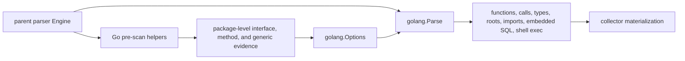

# Go Parser

## Purpose

This package owns Go source parsing for the parent parser dispatcher. It turns
one Go source file into the payload buckets used by collector materialization,
and it provides the lighter pre-scan contracts that let same-package interface
evidence flow into later parse calls.

## Parser flow

Pre-scan stays cheap and file-local. The parent engine combines package-level
evidence before full parsing so Go dead-code roots remain bounded and
deterministic.

## Ownership boundary

This package is responsible for Go tree-sitter parsing, Go payload assembly,
Go dead-code root evidence, import alias tracking, receiver and call metadata,
function and method return-type metadata, composite-literal type references,
package interface pre-scan rows, embedded SQL extraction, and command-execution
call-site extraction.

The parent parser package still owns registry lookup, path normalization,
content metadata inference, runtime parser allocation, and the compatibility
methods on `Engine`. Shared payload and tree helpers come from
`internal/parser/shared`; this package must not import the parent parser
package.

## Exported surface

The godoc contract is in `doc.go`.

- `Parse` builds the full Go file payload.
- `PreScan` returns deterministic Go symbol names for import-map pre-scans.
- `ImportedInterfaceParamMethods` extracts imported-interface parameter
  contracts from one file for same-package dead-code evidence.
- `ExportedInterfaceParamMethods` extracts exported same-repo package functions
  whose parameters accept local interfaces, so callers in other packages can
  preserve concrete methods that escape through those interfaces. It emits the
  package interface method set instead of an unbounded exported-method fallback.
- `ImportedDirectMethodCallRoots` extracts qualified method roots for calls made
  through imported package receiver types, so the parent pre-scan can mark the
  defining package's methods as reachable.
- `ImportedDirectMethodCallRootsWithInterfaceReturns` extracts the same roots
  when package-level interface return metadata is needed to resolve a chained
  receiver call in another file.
- `LocalInterfaceImportedMethodReturns`, `LocalInterfaceMethods`,
  `GenericConstraintInterfaceNames`, and `MethodDeclarationKeys` expose the
  file-local rows that the parent package pre-scan combines into package-level
  Go semantic roots.
- `EmbeddedSQLQueries` returns typed SQL table evidence from recognized Go
  database call sites.
- `EmbeddedShellCommands` returns structural `os/exec.Command` and
  `os/exec.CommandContext` call-site evidence without retaining command text,
  arguments, or environment values.
- The `dataflow_functions` bucket (opt-in via `Options.EmitDataflow`) carries
  per-function control-flow graphs and reaching-definition def->use edges, built
  by `cfg_lower.go`/`cfg_bindings.go`/`cfg_access_paths.go`/`cfg_emit.go` over the
  `internal/parser/cfg` engine. Selector reads and writes keep field-sensitive
  access paths such as `payload.SQL`, and straight-line pointer aliases to local
  structs are normalized before edges are emitted. Deep access paths are capped
  by `cfg.DefaultLimits().MaxAccessPathParts` and counted in the row `overflow`
  payload when truncated. Indexed container elements use an explicit `[*]`
  whole-container approximation, and invoked function literals contribute
  captured-variable uses. Off by default and byte-identical when off.
- The `taint_findings` bucket (same opt-in gate) carries intraprocedural
  source-to-sink taint findings with confidence and provenance, built by
  `cfg_taint_facts.go` (the Go source/sink/sanitizer catalog) over the
  `internal/parser/taint` engine.
- The `interproc_findings` bucket (same opt-in gate) carries cross-function
  taint findings within the file: `cfg_effects.go` derives each function's
  value-flow summary (`internal/parser/valueflow`) and `cfg_interproc.go`
  composes them into an interprocedural port graph solved by
  `internal/parser/interproc`. Call resolution is intra-file; cross-file and
  cross-repo composition is the reducer's job.
- The `dataflow_summaries` bucket (same opt-in gate, only when `RepositoryID`
  and `GoPackageImportPath` are present) carries each function's durable
  `summary.Effects` row for reducer persistence and cross-repo composition.
  Direct parser callers without stable repository and package identity still get
  the local dataflow/finding buckets but do not emit malformed durable
  FunctionIDs.
- `EmbeddedSQLQuery`, `EmbeddedShellCommand`, `Options`,
  `GoImportedInterfaceParamMethods`, and `GoDirectMethodCallRoots` carry the
  typed contracts used by those functions.

## Dependencies

This package imports `go/internal/parser/shared` for payload helpers,
tree-sitter node helpers, source reads, and parser options. It imports
`github.com/tree-sitter/go-tree-sitter` for the parser and node contracts.

It must not import collector, query, projector, reducer, storage, telemetry, or
the parent parser package.

## Telemetry

This package emits no metrics, spans, or logs. Parse timing and error
observation remain owned by the parent engine and collector runtime path.

## Gotchas / invariants

Payload bucket ordering is part of the fact-input contract. `Parse` sorts
functions, structs, interfaces, variables, imports, and function calls before
returning.

Function and method rows may carry `package_import_path` and `scip_symbol` when
the parent parser passes `GoPackageImportPath`; blank package identity is
omitted so direct parser callers without module context keep the previous
payload shape. Native Go symbols use the same stable `scip-go gomod` string
shape consumed by reducer symbol resolution: top-level functions use
`<import-path> <name>().`, and methods include the normalized receiver context
as `<import-path> <receiver>#<name>().`. Package-qualified imported calls carry a
matching `stable_symbol_key` when the selector receiver resolves to a concrete
import path. Function and method rows may also carry `return_type` when
tree-sitter exposes a single named, pointer, selector, generic, or qualified
result type. The return value is normalized to the terminal type name, so
pointers, slices, arrays, imported selectors, and generic instantiations keep
only the element or terminal type name. Reducer code-call materialization uses
that evidence for Go method chains only when call metadata proves the chain
receiver type with `chain_receiver_obj_type` and `chain_receiver_method`.

Method receiver class context is normalized to the base receiver type before
payload emission. A receiver such as Map[K, V], *Set[T], or
pkg.Graph[T] is emitted as Map, Set, or Graph, so reducer call
materialization does not need to match every generic instantiation spelling.

Import rows may carry `alias` for explicit Go package aliases. Blank and dot
imports stay out of alias metadata because they do not provide a package
qualifier for call materialization.

Receiver inference is lexical, not whole-function. Constructor-assigned
variables use the nearest block, loop, switch case, or if statement as their
scope; typed parameters on declarations, methods, and function literals use the
function body. Range variables over locally known map values inherit the map
value type for calls such as `controllerDesc.BuildController`. A shadowed
variable in an inner block must not change calls that happen after that block.
Method-return chain metadata requires concrete local receiver proof. A concrete
typed parameter or a single concrete local assignment such as
`var ctx EvalContext = &BuiltinEvalContext{}` can emit
`chain_receiver_obj_type`; an interface-typed parameter, nil assignment, or
multiple concrete receiver candidates must stay unresolved.
Direct method root evidence uses the call site's scoped receiver type. If the
receiver type is unknown, the parser does not fall back to a same-method-name
match. Bounded field selector calls such as `s.config.serverAnnouncement` can
root the target method only when the enclosing receiver and struct field type
prove the receiver type.

Function-value reference rows are emitted only for identifiers in value
positions that are not locally bound at that source line. That includes call
arguments such as builder callbacks, composite literal fields, and returned
method values such as `runFuncSlice(rx).Run`. Package-level function literals
passed directly as callback arguments, and function literals stored in composite
literal registries, also mark same-file helper calls as
`go.function_literal_reachable_call` when the callee name is not shadowed inside
the literal. Local closures that are merely assigned do not create root evidence
until a later, bounded flow proves they escape.

Cyclomatic complexity counts Go control-flow branches once. The helper layer
counts a `for range` statement through the enclosing `for_statement`, not again
through its `range_clause`; this preserves the parent parser fixture contract.

Go dataflow binding extraction is field-sensitive for selector expressions. A
write such as `payload.SQL = input` defines `payload.SQL`, while a sibling read
such as `payload.Display` does not consume that definition. The lowerer also
tracks simple straight-line aliases such as `alias := &payload` and normalizes
`alias.SQL` back to `payload.SQL`, including chains over an existing pointer
alias. Plain struct value copies are not treated as mutation aliases. Aliases
introduced only inside one branch or loop body do not leak past that control-flow
boundary. Selector uses still include their base binding as compatibility
evidence for existing receiver and source-parameter summary logic. Deep selector
paths are truncated deterministically with a `.*` suffix and a counted
`overflow.access_paths` value rather than being emitted unbounded.

Container element flow is conservative by design. Indexed map, slice, and array
reads and writes lower to `container[*]`, which makes the over-approximation
visible in emitted def-use and taint bindings instead of silently treating one
key as exact. Function-literal capture flow is limited to invoked literals and
callback arguments seen at a call site; storing a closure value does not claim
the closure executes. Names declared inside the literal shadow outer bindings
for capture purposes.

Per-file amortization is required for variable-type lookups. The helpers that
collect dead-code roots and imported-method-call roots query variable types
once per call_expression, var_spec, composite_literal, and return_statement —
so a naive implementation that re-walks the full tree per query becomes
O(call_sites × tree_size) per file. `goParentLookup` builds the child-to-parent
map once per parse; `goVariableTypeIndex` and `goImportedVariableTypeIndex`
scan package-scope imported variable declarations without descending into
function bodies, build per-scope binding lists lazily on first use, and answer
position-filtered queries in pure Go map and slice work. The scope walkers stop
at nested
function_declaration / method_declaration / func_literal subtrees so a
binding declared inside an inner closure does not leak into the outer
function's binding table. Imported direct-method pre-scans skip
`goImportedVariableTypeIndex.ForCall` for bare function calls because only
selector calls can produce imported receiver roots or fmt Stringer roots. Do
not re-introduce per-call full-tree walks in `dead_code_semantic_roots.go` or
`package_interface_prescan.go`.

Before the amortization landed (#161), `engine.PreScanGoPackageSemanticRoots`
saturated CPU for 80+ minutes on Terraform's 1927-file checkout without
emitting any fact_records. After: the same checkout's snapshot pipeline
(discovery + per-language pre_scan + parse + materialize) completes in ~20s
and produces 100,016 fact_records. The proof tests in
`go/internal/parser/go_terraform_dogfood_test.go` gate per-file parse cost
and the package-prescan path against TF_DOGFOOD_REPO.

Dead-code evidence is conservative. Handler signatures, Cobra run signatures,
controller-runtime reconciler signatures, registration calls, direct method
calls, imported receiver method calls, function-value references,
function-literal reachable calls, interface implementations, generic constraint
methods, fmt Stringer methods, and dependency-injection callbacks add
`dead_code_root_kinds` only when local syntax, same-package pre-scan evidence,
or a qualified same-repo package contract proves the root.

`ImportedInterfaceParamMethods` is file-local by design. The parent `Engine`
groups those rows by package directory before passing them back through
`Options`. `ExportedInterfaceParamMethods` is also file-local; the parent
`Engine` qualifies its rows with the module import path from `go.mod` so
selector calls such as `bolt.NewWithDatabaseManager(...)` do not collide with
same-named functions in other packages. `ImportedDirectMethodCallRoots` follows
the same split: the Go package emits only qualified call evidence from one file,
and the parent engine decides which package directory receives that root. The
same pre-scan path also carries imported fmt Stringer roots when a formatted
value has a qualified same-repo receiver type; writer and format-string
arguments are not treated as formatted values.

Generic constraint and chained receiver evidence is package-level by design.
The Go package emits file-local interface definitions, constraint identifiers,
method declaration keys, and local interface imported return signatures. The
parent parser combines those rows by package directory before routing roots to
the defining package.

Embedded SQL evidence only records recognized database/sql and sqlx call sites
where a string literal contains an obvious table reference. Line numbers refer
to the original Go source.

No-Regression Evidence: `go test ./internal/parser -run
'TestGo(FunctionRowsCarryPackageImportPathWhenKnown|FunctionRowsOmitBlankPackageImportPath|MethodRowsCarryReceiverScopedSCIPSymbolWhenPackageKnown|PackageQualifiedCallsCarryStableSymbolKey)'
-count=1` failed before native Go function rows emitted `scip_symbol` and
package-qualified imported calls emitted `stable_symbol_key`, then passed after
symbol emission was tied only to stable package import paths. `go test
./internal/reducer -run
'TestExtractCodeCallRows(PrefersNativeGoSCIPSymbolForCrossRepoCall|NativeGoSCIPSymbolIdentityStableAcrossGenerations|ResolvesCrossRepoSCIPEdgeBySymbol)'
-count=1` proves the existing reducer symbol index resolves those native Go
symbols at SCIP provenance and remains generation-stable.

No-Observability-Change: native Go symbol emission adds deterministic string
fields to existing parser payload rows. It adds no parser stage, queue,
worker, graph write, metric, span, status field, runtime knob, or external
SCIP invocation; operators still diagnose parser behavior through existing
collector parse-stage logs and `eshu_dp_file_parse_duration_seconds`, and
code-call materialization through existing reducer execution counters and
code-call completion logs.

## Related docs

- `docs/public/languages/support-maturity.md`
- `go/internal/parser/README.md`
- `go/internal/parser/shared/README.md`
