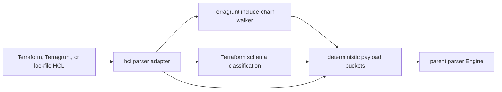

# HCL Parser

## Purpose

This package owns Terraform and Terragrunt HCL parsing for the parser engine.
It reads HCL source, extracts Terraform blocks, resources, variables, outputs,
modules, providers, data sources, locals, backends, imports, moved blocks,
removed blocks, checks, lockfile providers, declared PagerDuty
module/tfvars evidence, declared Grafana Terraform resource metadata,
Terragrunt configs, dependencies, inputs, local config asset paths, and
Terragrunt `remote_state` blocks (including blocks inherited via the include
chain), then returns the parser payload shape.

## HCL parse flow

The package emits parser evidence only. Discovery, fact storage, and graph
projection stay with the parent parser, collector, and reducer paths.

## Ownership boundary

The package is responsible for HCL syntax parsing and language-specific payload
rows. The parent `internal/parser` package still owns registry dispatch, engine
path parsing, repo path normalization, parse timing, and final content metadata
inference.

## Exported surface

The godoc contract is in `doc.go`. Current export:

- `Parse` reads one HCL file and returns the Terraform/Terragrunt payload
  buckets used by the parent parser.

## Dependencies

This package imports `internal/parser/shared` for shared parser options, source
reading, base payload construction, bucket appends, and deterministic bucket
sorting. It imports `internal/terraformschema` only for Terraform resource type
classification. It must not import the parent `internal/parser` package.

## Telemetry

File parse timing is owned by the parent parser engine through
`eshu_dp_file_parse_duration_seconds`. The walker emits one debug-level slog
record per duplicate multi-element repeated nested block at
`terraform_resource_attributes.go:132` — the
`drift parser walk truncated multi-element repeated block` message, with the
frozen log keys `LogKeyDriftMultiElementPrefix` and
`LogKeyDriftMultiElementSource` (value `"parser_walk"`). The log uses
`slog.Default()` because the parser has no logger plumbing; operators turn
debug on to surface dropped first-wins signal when a multi-element allowlist
entry lands.

## Gotchas / invariants

`terragrunt.hcl` is treated as Terragrunt. `.terraform.lock.hcl` is treated as
a provider lockfile, so its `provider` blocks produce `terraform_lock_providers`
instead of `terraform_providers`. Other HCL files use the Terraform block path.

Terragrunt local config asset extraction is intentionally bounded to static
string, join, lookup, file, templatefile, and local interpolation shapes already
covered by HCL-focused parser tests.

Terragrunt include-chain walking is bounded by depth, cycle detection, a
regular-file check (`include_chain.go:96` rejects symlinks, devices, FIFOs),
and a per-file size cap (`terragruntIncludeMaxFileBytes` at
`include_chain.go:25`, 1 MiB). Each rejection emits a row in the
`terragrunt_include_warnings` payload bucket so downstream consumers can
observe walker failures rather than infer them from missing rows.

Terragrunt `remote_state` rows store the parser-side source file path under
`source_path`, kept distinct from the local backend's `path` attribute so
neither value silently overwrites the other (`terragrunt_remote_state.go:54`).

Terraform resource attribute extraction (`terraform_resource_attributes.go`)
uses cty-value evaluation via `hclsyntax.Expression.Value(nil)` rather than
byte-level source reads to produce the `attributes` and
`unknown_attributes` fields on each `terraform_resources` row. This correctly handles heredoc strings (which
evaluate to the unindented body content) and escaped-quote strings (which
evaluate to the unescaped character). The encoding must stay in lockstep with
the state-side flattener in `tfstate_drift_evidence_state_row.go` — see
`literalAttributeValue` and `ctyValueToDriftString` in
`terraform_resource_attributes.go`.

PagerDuty declaration extraction (`pagerduty_declarations.go`) is declared
source evidence only. It recognizes supported PagerDuty service modules and
tfvars service objects, preserves repo path, environment/workspace, module
source fingerprint, module name, bounded input values, resolution state,
redaction state, and duplicate/malformed/unsupported outcomes. It never runs
Terraform, evaluates arbitrary expressions, calls PagerDuty, or stores endpoint,
token, key, URL, or secret-bearing values.

Grafana declaration extraction (`grafana_declarations.go`) is declared source
evidence only. It recognizes Terraform resources for Grafana folders,
dashboards, datasources, and rule groups, preserves repo path,
environment/workspace, resource identity, folder UID/title fingerprint,
dashboard UID/title fingerprint, datasource refs, datasource UID/type,
rule-group identity, redaction state, and unsupported datasource outcomes. It
never evaluates Terraform, calls Grafana, stores dashboard JSON, folder titles,
datasource URLs, alert model bodies, PromQL, LogQL, TraceQL, contact routes,
tokens, passwords, or secret-bearing values.

Payload buckets must stay deterministic. Rows are sorted before `Parse`
returns so ingestion retries and repair runs converge on the same facts.

## Related docs

- `go/internal/parser/README.md`
- `docs/public/architecture.md`
- `docs/public/reference/local-testing.md`
