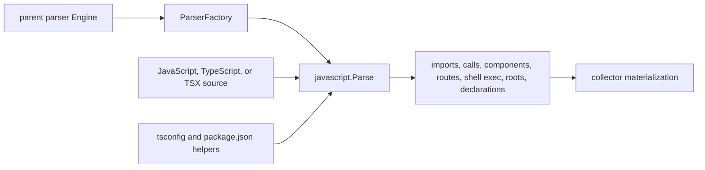

# JavaScript Parser

## Purpose

This package owns the JavaScript-family parser adapter for JavaScript,
TypeScript, and TSX. It reads source files through a caller-provided
`ParserFactory`, builds the legacy parser payload buckets, annotates imports
with tsconfig `resolved_source` evidence, and marks parser-proven dead-code
roots from package, framework, module-contract, route, public API, and
child_process shell-exec evidence.

## JavaScript-family parse flow

Repository-bounded tsconfig and package metadata add evidence to the payload.
They do not give this child package ownership of parent parser dispatch.

## Ownership boundary

The package is responsible for JavaScript-family tree-sitter traversal,
payload assembly, import and re-export extraction, call metadata, component
evidence, TypeScript declaration rows, package.json roots, tsconfig alias
resolution, Hapi route evidence, framework callback roots, and deterministic
bucket sorting.

The parent `internal/parser` package owns registry dispatch, runtime grammar
caching, Engine.ParsePath, Engine.PreScanRepositoryPathsWithWorkers, and the
thin JavaScript wrapper that converts parent options into shared parser
options. This package must not import the parent parser package.

## Exported surface

The godoc contract is in `doc.go`. Current exports are `ParserFactory`,
`Parse`, `PreScan`, `TSConfigImportResolver`,
`NewTSConfigImportResolver`, `TSConfigImportResolver.ResolveSource`,
`TSConfigSourceCandidates`, `PackageFileRootKinds`, `NearestPackageRoot`, and
`PackagePublicSourcePaths`, and `ExpressServerSymbols`.

The `embedded_shell_commands` payload bucket records import-backed
`child_process` calls with function, line, API, and language metadata only. It
does not retain command strings, arguments, or environment values.

## Dependencies

This package imports tree-sitter, the Go standard library, and
`internal/parser/shared` for payload, source, tree, path, and option helpers.
The local alias file only exposes helper names with package-local callers. It
must not import the parent parser package, collector packages, graph storage,
or reducer code.

## AST extraction and retained within-string regexes

Symbol, edge, and framework-metadata extraction is tree-sitter AST node-walking.
Method getter/setter/async/generator kinds, `child_process` embedded-shell
commands, Hapi route objects, Express routes, Next.js route verbs / metadata /
runtime directives, JSX-return component detection, AWS/GCP service imports, and
the TypeScript public-API re-export / import / declaration surface (including
sibling files parsed through the `ParserFactory`) are all derived from AST
nodes, not from regular expressions over raw source.

A small set of regular expressions is retained deliberately. Each runs only
against the value of a string literal or an identifier token, never as a
source scanner, and each is a documented within-string-content exception:

- `javaScriptStaticComputedMemberNameRe` (`javascript_names.go`) validates that
  an already-unquoted computed-property string value looks like a static member
  path or numeric literal. It checks within-string content, not source layout.
- `javaScriptAWSClientServiceRe` / `javaScriptGCPServiceRe`
  (`javascript_semantics_ast.go`) extract the service slug from an
  `@aws-sdk/client-*` or `@google-cloud/*` package specifier. The specifier
  string is isolated from the AST `import_statement`/`require` node first; the
  regex only parses the trailing slug inside that isolated string.

### Intentional parity narrowings (prior regex bug fixes)

The AST conversion deliberately reports a stricter, more accurate set than the
old raw-source regexes in two framework-semantics buckets. The previous regexes
scanned the whole file, so they matched code-shaped tokens inside comments,
string literals, imports, and type annotations. The AST walk only visits real
syntax nodes, so those non-code matches are no longer reported:

- `react.hooks_used` collects hook calls from `call_expression` callees only,
  covering both bare `useState(...)` and member-call `React.useState(...)`
  forms. The legitimate member-call match the old regex produced is preserved;
  the hook-shaped tokens it also matched inside comments and strings are dropped.
- `aws`/`gcp` `client_symbols` collects only `XxxClient` names actually
  constructed with `new`. Import bindings, type annotations, and comment
  mentions of an `XxxClient` token are no longer counted, because the file does
  not instantiate them there.

Both narrowings have engine-level regression tests in
`engine_javascript_ast_conversion_test.go`
(`TestDefaultEngineParsePathReactHookMemberCallParity`,
`TestDefaultEngineParsePathAWSClientSymbolConstructorOnly`).

## Performance Evidence

The dead-code, export-surface, and semantic helpers recover ancestor context
(is-exported, enclosing class, enclosing function, CommonJS export, Hapi route
object, NestJS controller) by walking `Node.Parent()`. Tree-sitter's
`Node.Parent()` does not consult a stored pointer; the binding re-walks from the
root and every call crosses cgo into `ts_node_parent`. The regex-to-AST
migration (#3539 family) wired these helpers to walk bottom-up per declaration
node, so the pattern scaled as O(n_declarations * depth) cgo crossings per file.
A full-corpus CPU profile on JavaScript/TypeScript parsing (#3586) showed
`runtime.cgocall`, driven by `ts_node_parent`, at roughly 48% of all parse CPU.

`javaScriptParentLookup` (`parent_lookup.go`) removes those per-node crossings.
`Parse` builds one child-to-parent map per tree in a single O(n) pass (the only
cgo it costs is the one-time `Node.Child` walk over the tree the parser already
built), then every helper consults the Go map via `parent(node)` instead of
calling `node.Parent()`. The map keys on `Node.Id()`, a pure Go field read, so
lookups never re-enter cgo. The mechanism is output-identical: `parent(x)`
returns the exact node `x.Parent()` returns, so every helper's boolean and
string results are unchanged. This is a mechanism optimization, not a behavior
change.

Benchmark Evidence: `go test ./internal/parser
-run 'TestJavaScriptParentLookupEliminatesCgoCrossings' -count=1 -v` proves the
old cgo-Parent walk and the Go-lookup walk return identical is-exported results
for every declaration node, and that the lookup makes 0 cgo `Parent()` crossings
where the old mechanism made 720 over 240 method nodes (Apple M5 Max, commit on
branch `perf/3586-js-parser-cgo-parent`). `go test ./internal/parser -bench
'BenchmarkParsePathTypeScriptExportHeavy' -benchmem -count=5` over a synthetic
heavy TS file dropped allocations from 2,722,954 to 2,476,010 per parse (~9%
fewer) by eliminating the `*Node` the cgo binding allocates per `ts_node_parent`
call; wall time on this M-series shape is roughly flat (the synthetic fixture's
shallow ancestor depth and its per-method `strings.Contains` import scan dominate
its wall clock, so the cgo-crossing count is the decisive hardware-independent
signal). The cgo-isolation benchmarks `BenchmarkJavaScriptIsExportedCgoParent`
and `BenchmarkJavaScriptIsExportedParentLookup` keep the two mechanisms
side by side for future profiling. Classification: handler win and diagnostic
win on this hardware; the wall-clock win is expected to land on the x86
full-corpus shape that produced the #3586 profile, where cgo crossing volume,
not Go-side string work, dominates.

## No-Regression Evidence

The AST conversion replaces multi-pass regex/full-source scans with single-pass
tree-sitter node walks over a tree the parser already builds for core symbols.
No new full-source pass is added; sibling dead-code files are parsed once per
`Parse` call and cached, mirroring the previous one-time `os.ReadFile` reads and
only invoking tree-sitter when a non-empty sibling file exists. The payload is
identical for valid code: every `engine_javascript_*`, `engine_typescript_*`,
`engine_tsx_*` test and the js/ts/tsx comprehensive golden fixtures pass
unchanged (`go test ./internal/parser/...`). The only behavioral differences are
the intentional bug-fix narrowings described under "Intentional parity
narrowings" above, where the prior regexes over-reported tokens inside comments,
strings, imports, and type annotations. The change is a net reduction in
per-file scanning work, not a regression.

## No-Observability-Change

This package emits no telemetry by design, and the conversion preserves that.
No spans, metrics, or logs were added or removed. Parse timing remains owned by
the parent parser engine and runtime instrumentation.

## Telemetry

This package emits no telemetry. Parse timing remains owned by the parent
parser engine and runtime instrumentation.

## Gotchas / invariants

`Parse` accepts a `ParserFactory` instead of a parent Engine so the child
package cannot depend on `internal/parser`.

TypeScript config files use JSONC, so comments and trailing commas are accepted
before unmarshalling.

Resolution is repository-bounded. Absolute `baseUrl` values, absolute path
targets, and candidates outside the repository root return no result.

TSConfigSourceCandidates returns candidates in a stable order: the base path,
then supported JavaScript/TypeScript declaration and runtime extensions, then
index files with the same extension order.

Package helpers use the closest package.json between the source file and
repoRoot. Workspace root manifests must not claim files owned by a nested
package manifest. A `types` target ending in `.d.ts` is treated as a declaration
artifact path, so `lib/index.d.ts` can map back to authored sources such as
`src/index.ts` when generated declaration files are not checked in.

Dead-code roots are evidence rows, not guesses. Package entrypoints, CommonJS
exports, methods on CommonJS default-exported classes, Hapi handlers, Next.js
route exports, Fastify route-object handlers, framework callbacks, TypeScript
interface implementation methods, module-contract exports, and public API
re-exports must remain grounded in syntax or bounded repository files.
Receiver type metadata is likewise bounded to local syntax: constructor
assignments, typed fields, typed parameters, and simple typed function returns.
Function values passed as call or constructor arguments are emitted as
reference evidence so worker processors and route-handler callbacks do not
look unused only because the framework owns invocation. CommonJS default-export
class method roots apply only to the exported class expression, not helper
classes nested inside another exported expression. Declaration public-surface
walking follows repo-bounded static re-export barrels with a small cycle-safe
depth cap so package `types` surfaces such as
`index.d.ts -> types/index.d.ts -> plugin.d.ts` stay rooted without whole-repo
inference. It also follows declaration entrypoints that import symbols and
export them through local `export type { ... }` clauses, including public
generic defaults that reference imported declaration types.

## Related docs

- docs/public/languages/support-maturity.md
