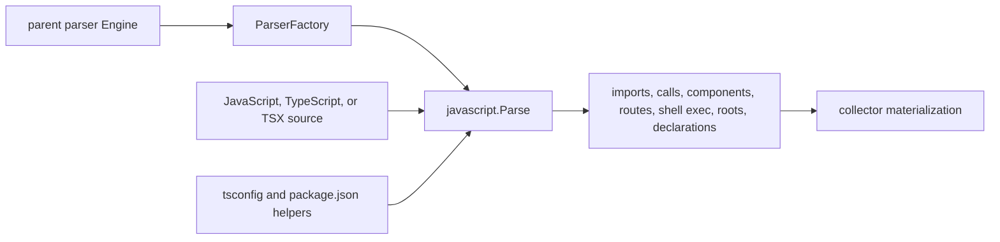

# JavaScript Parser

## Purpose

This package owns the JavaScript-family parser adapter for JavaScript,
TypeScript, and TSX. It reads source files through a caller-provided
`ParserFactory`, builds the legacy parser payload buckets, annotates imports
with tsconfig `resolved_source` evidence, and marks parser-proven dead-code
roots from package, framework, module-contract, route, public API, and
child_process shell-exec evidence.

## JavaScript-family parse flow

```mermaid
flowchart LR
    Parent["parent parser Engine"]
    Factory["ParserFactory"]
    Source["JavaScript, TypeScript, or TSX source"]
    Resolver["tsconfig and package.json helpers"]
    Adapter["javascript.Parse"]
    Payload["imports, calls, components, routes, shell exec, roots, declarations"]
    Collector["collector materialization"]

    Parent --> Factory
    Factory --> Adapter
    Source --> Adapter
    Resolver --> Adapter
    Adapter --> Payload
    Payload --> Collector
```

Repository-bounded tsconfig and package metadata add evidence to the payload.
They do not give this child package ownership of parent parser dispatch.

## Ownership boundary

The package is responsible for JavaScript-family tree-sitter traversal,
payload assembly, import and re-export extraction, call metadata, component
evidence, TypeScript declaration rows, package.json roots, tsconfig alias
resolution, Hapi route evidence, framework callback roots, and deterministic
bucket sorting.

The parent `internal/parser` package owns registry dispatch, runtime grammar
caching, Engine.ParsePath, Engine.PreScanRepositoryPathsWithWorkers, and the
thin JavaScript wrapper that converts parent options into shared parser
options. Production files in this package must not import the parent parser
package. External black-box tests may import it to exercise the public engine
without giving child production code a reverse dependency.

## Exported surface

The godoc contract is in `doc.go`. Current exports are `ParserFactory`,
`Parse`, `PreScan`, `TSConfigImportResolver`,
`NewTSConfigImportResolver`, `TSConfigImportResolver.ResolveSource`,
`TSConfigSourceCandidates`, `PackageFileRootKinds`, `NearestPackageRoot`, and
`PackagePublicSourcePaths`, and `ExpressServerSymbols`.

The `embedded_shell_commands` payload bucket records import-backed
`child_process` calls with function, line, API, and language metadata only. It
does not retain command strings, arguments, or environment values.

`PreScan` uses a declaration-only AST walk for functions, classes, interfaces,
function-valued variables, and function-valued object pairs. It intentionally
skips tsconfig/package resolution, framework semantics, shell evidence,
dead-code roots, call rows, variables, and sibling-file parsing because the
collector runs full parse immediately afterward.

## Dependencies

This package imports tree-sitter, the Go standard library, and
`internal/parser/shared` for payload, source, tree, path, and option helpers.
The local alias file only exposes helper names with package-local callers.
Production code must not import the parent parser package, collector packages,
graph storage, or reducer code. `fastify_threading_bench_test.go` and the
TypeScript implemented-interface regression are external-package tests; both
import the parent parser to exercise the public `Engine.ParsePath` path. The
separate `fastify_threading_characterization_test.go` stays in `package
javascript` and exercises package-local helpers without importing the parent.

## AST extraction and retained within-string regexes

Symbol, edge, and framework-metadata extraction is tree-sitter AST node-walking.
Method getter/setter/async/generator kinds, `child_process` embedded-shell
commands, Hapi route objects, Express routes, Next.js route verbs / metadata /
runtime directives, JSX-return component detection, AWS/GCP service imports, and
the TypeScript public-API re-export / import / declaration surface (including
sibling files parsed through the `ParserFactory`) are all derived from AST
nodes, not from regular expressions over raw source.

A small set of regular expressions is retained deliberately. Each runs only
against the value of a string literal or an identifier token, never as a
source scanner, and each is a documented within-string-content exception:

- `javaScriptStaticComputedMemberNameRe` (`javascript_names.go`) validates that
  an already-unquoted computed-property string value looks like a static member
  path or numeric literal. It checks within-string content, not source layout.
- `javaScriptAWSClientServiceRe` / `javaScriptGCPServiceRe`
  (`javascript_semantics_ast.go`) extract the service slug from an
  `@aws-sdk/client-*` or `@google-cloud/*` package specifier. The specifier
  string is isolated from the AST `import_statement`/`require` node first; the
  regex only parses the trailing slug inside that isolated string.

### Intentional parity narrowings (prior regex bug fixes)

The AST conversion deliberately reports a stricter, more accurate set than the
old raw-source regexes in two framework-semantics buckets. The previous regexes
scanned the whole file, so they matched code-shaped tokens inside comments,
string literals, imports, and type annotations. The AST walk only visits real
syntax nodes, so those non-code matches are no longer reported:

- `react.hooks_used` collects hook calls from `call_expression` callees only,
  covering both bare `useState(...)` and member-call `React.useState(...)`
  forms. The legitimate member-call match the old regex produced is preserved;
  the hook-shaped tokens it also matched inside comments and strings are dropped.
- `aws`/`gcp` `client_symbols` collects only `XxxClient` names actually
  constructed with `new`. Import bindings, type annotations, and comment
  mentions of an `XxxClient` token are no longer counted, because the file does
  not instantiate them there.

Both narrowings have engine-level regression tests in
`engine_javascript_ast_conversion_test.go`
(`TestDefaultEngineParsePathReactHookMemberCallParity`,
`TestDefaultEngineParsePathAWSClientSymbolConstructorOnly`).

## Performance Evidence

The dead-code, export-surface, and semantic helpers recover ancestor context
(is-exported, enclosing class, enclosing function, CommonJS export, Hapi route
object, NestJS controller) by walking `Node.Parent()`. Tree-sitter's
`Node.Parent()` does not consult a stored pointer; the binding re-walks from the
root and every call crosses cgo into `ts_node_parent`. The regex-to-AST
migration (#3539 family) wired these helpers to walk bottom-up per declaration
node, so the pattern scaled as O(n_declarations * depth) cgo crossings per file.
A full-corpus CPU profile on JavaScript/TypeScript parsing (#3586) showed
`runtime.cgocall`, driven by `ts_node_parent`, at roughly 48% of all parse CPU.

`javaScriptParentLookup` (`parent_lookup.go`) removes those per-node crossings.
`Parse` builds one child-to-parent map per tree in a single O(n) pass (the only
cgo it costs is the one-time `Node.Child` walk over the tree the parser already
built), then every helper consults the Go map via `parent(node)` instead of
calling `node.Parent()`. The map keys on `Node.Id()`, a pure Go field read, so
lookups never re-enter cgo. The mechanism is output-identical: `parent(x)`
returns the exact node `x.Parent()` returns, so every helper's boolean and
string results are unchanged. This is a mechanism optimization, not a behavior
change.

Benchmark Evidence: `go test ./internal/parser/javascript
-run 'TestJavaScriptParentLookupEliminatesCgoCrossings' -count=1 -v` proves the
old cgo-Parent walk and the Go-lookup walk return identical is-exported results
for every declaration node, and that the lookup makes 0 cgo `Parent()` crossings
where the old mechanism made 720 over 240 method nodes (Apple M5 Max, commit on
branch `perf/3586-js-parser-cgo-parent`). Both commands target
`./internal/parser/javascript`, not the parent `./internal/parser`: the
regression test has lived in this package since before issue #6062, and the
benchmark relocated here as part of #6062's `js_parent_lookup_bench_test.go`
move. Pointing either filter at the parent is what goes wrong: the parent
package still runs its own remaining tests, so `go test ./internal/parser` is
not empty, but `-run 'TestJavaScriptParentLookupEliminatesCgoCrossings'` there
matches zero tests and `-bench 'BenchmarkParsePathTypeScriptExportHeavy'`
matches zero benchmarks -- each exits 0, the "no tests to run" false green
documented in docs/internal/agent-guide.md#test-filters-fail-silently. `go test
./internal/parser/javascript -bench 'BenchmarkParsePathTypeScriptExportHeavy'
-benchmem -count=5` over a synthetic
heavy TS file dropped allocations from 2,722,954 to 2,476,010 per parse (~9%
fewer) by eliminating the `*Node` the cgo binding allocates per `ts_node_parent`
call; wall time on this M-series shape is roughly flat (the synthetic fixture's
shallow ancestor depth and its per-method `strings.Contains` import scan dominate
its wall clock, so the cgo-crossing count is the decisive hardware-independent
signal). The cgo-isolation benchmarks `BenchmarkJavaScriptIsExportedCgoParent`
and `BenchmarkJavaScriptIsExportedParentLookup` keep the two mechanisms
side by side for future profiling. Classification: handler win and diagnostic
win on this hardware; the wall-clock win is expected to land on the x86
full-corpus shape that produced the #3586 profile, where cgo crossing volume,
not Go-side string work, dominates.

Performance Evidence: `go test ./internal/parser -run '^$' -bench
BenchmarkPreScanSelectedLanguages -benchmem -benchtime=1x -count=1` measured
the JavaScript 10K LOC pre-scan fixture at `632644917 ns/op`, `800322576 B/op`,
and `2450522 allocs/op` before the declaration-only pre-scan, versus
`47006667 ns/op`, `4705528 B/op`, and `152855 allocs/op` after. The TypeScript
fixture moved from `599210708 ns/op`, `678622440 B/op`, and `2972914 allocs/op`
to `44396500 ns/op`, `4635872 B/op`, and `148424 allocs/op`. Compatibility is
guarded by `TestPreScanMatchesParseDeclarationNames`.

### Per-repository config-scope cache (issue #4515 P2a)

`NewTSConfigImportResolver` and the package.json helpers
(`PackageFileRootKinds`, `NearestPackageRoot`, `PackagePublicSourcePaths`) each
walk up from a source file's own directory to find its nearest
`tsconfig.json`/`package.json`, then read and parse that file. Before this
cache, every `Parse` call repeated the read and parse independently, even
though every file under one package/tsconfig scope resolves to the identical
config file. `config_scope_cache.go` memoizes the parsed content keyed by the
resolved config file's absolute path (NOT by repo root, since a monorepo can
have several distinct tsconfig.json/package.json files each owning a different
subtree — keying by repo root would incorrectly collapse those and leak one
package's config into a sibling package's files). A cache hit re-`os.Stat`s the
config file and only reuses the parsed value when `(mtime, size)` still match
what was cached, so a repository re-scanned after its config changed on disk
recomputes rather than serving stale evidence across scan generations.

The generic `configScopeCache[V]` type backs both memoizers. Single-flight
coalescing keys the in-flight computation by the FULL `(path, stat)` tuple, not
by path alone: an earlier revision keyed the map only by path, so a second
goroutine observing a NEWER generation for the same path (the file changed
mid-scan) installed a fresh in-flight entry that overwrote the first
goroutine's still-in-flight slot, and whichever goroutine finished last
clobbered the map entry — a waiter blocked on the OTHER goroutine's
`WaitGroup` could wake up and read back the wrong generation's value (a GitHub
Copilot PR review finding on #4669). Keying the entry by `(path, stat)` makes
that impossible: a changed generation is a distinct key/slot, never an
overwrite of an in-flight one. The cache is also a bounded LRU
(`configScopeCacheCapacity` = 4096 keys): it is process-global and used by a
long-running ingester scanning many repositories over its lifetime, so an
unbounded map would grow without bound (a second #4669 review finding);
evicting the least-recently-used key only means the next file under it
recomputes, which never affects correctness.

Performance Evidence: `go test ./internal/parser -run '^$' -bench
BenchmarkParsePathTypeScriptRepoSharedConfig -benchmem -count=10` over a
50-file TypeScript fixture sharing one tsconfig.json and one package.json
(Apple M5 Max) moved from `202.06m` to `41.72m` sec/op (`benchstat`:
`-79.35%`, `p=0.000, n=10`), `3.143Mi` to `2.935Mi` B/op (`-6.60%`), and
`72.87k` to `70.81k` allocs/op (`-2.82%`); a follow-up run after the
single-flight/LRU rework measured `~30ms/op`, confirming the fix did not
regress the win. `TestNearestTSConfigOptionsComputedOnceForSharedConfig`,
`TestNearestPackageManifestComputedOnceForSharedManifest`, and the
`internal/parser`-level `TestEngineParsePathComputesRepoConfigMetadataOnceForSharedManifests`
assert the config read+parse happens exactly once across many files sharing
one config, not once per file. `TestConfigScopeCacheDoesNotCollapseDistinctMonorepoManifests`
guards the multi-package monorepo case, `TestConfigScopeCacheInvalidatesOnManifestChange`
guards the stale-generation case, and `TestConfigScopeCacheConcurrentAccessIsRaceFree`
plus the `internal/parser`-level
`TestEngineParsePathConcurrentJavaScriptFilesShareConfigComputationOnce` prove
`-race`-clean concurrent access with single-flight coalescing (not just a
racy double-compute that happens to be safe).
`TestConfigScopeCacheSingleFlightSurvivesConcurrentGenerationChange` and
`TestConfigScopeCacheDistinctPathsNeverShareSingleFlightWaitGroup` reproduce
and guard the path-only-keying overwrite defect directly against
`configScopeCache[V].get` (failed before the `(path, stat)` key existed:
reverting the key to path-only reintroduces either the wrong-generation value
or a cross-generation deadlock, both observed while diagnosing this fix).
`TestConfigScopeCacheEvictsLeastRecentlyUsedAtCapacity` guards the bounded-LRU
fix, asserting cache size never exceeds `configScopeCacheCapacity` and that an
evicted key correctly recomputes on its next access.

No-Regression Evidence: this is a caching/memoization change only. No
`Parse` signature changed and no payload field changed; every js/ts/tsx
fixture and golden-corpus assertion in `go test ./internal/parser/...` stays
byte-identical before and after (`go test ./internal/parser/... -race
-count=1`: 1499 passed, 41 packages).

No-Observability-Change: this adds no metric, span, structured log, status
field, queue, graph write, worker, lease, batch, or runtime knob. Operators
still diagnose parse behavior through the existing collector
`telemetry.FileParseDuration` instrument and `collector snapshot stage
completed` logs.

## No-Regression Evidence

The AST conversion replaces multi-pass regex/full-source scans with single-pass
tree-sitter node walks over a tree the parser already builds for core symbols.
No new full-source pass is added; sibling dead-code files are parsed once per
`Parse` call and cached, mirroring the previous one-time `os.ReadFile` reads and
only invoking tree-sitter when a non-empty sibling file exists. The payload is
identical for valid code: every `engine_javascript_*`, `engine_typescript_*`,
`engine_tsx_*` test and the js/ts/tsx comprehensive golden fixtures pass
unchanged (`go test ./internal/parser/...`). The only behavioral differences are
the intentional bug-fix narrowings described under "Intentional parity
narrowings" above, where the prior regexes over-reported tokens inside comments,
strings, imports, and type annotations. The change is a net reduction in
per-file scanning work, not a regression.

## No-Observability-Change

This package emits no telemetry by design, and the conversion preserves that.
No spans, metrics, or logs were added or removed. Parse timing remains owned by
the parent parser engine and runtime instrumentation.

## Telemetry

This package emits no telemetry. Parse timing remains owned by the parent
parser engine and runtime instrumentation.

## Gotchas / invariants

`Parse` accepts a `ParserFactory` instead of a parent Engine so the child
package cannot depend on `internal/parser`.

`fastify_threading_bench_test.go` and
`engine_typescript_implements_test.go` use the external `javascript_test`
package. They may import `internal/parser` because Go compiles them only for
tests; production files remain parent-independent. Keep that exception limited
to black-box tests of the public parent engine. The separate
`fastify_threading_characterization_test.go` uses `package javascript` to
compare package-local Fastify computations and does not import the parent.

TypeScript config files use JSONC, so comments and trailing commas are accepted
before unmarshalling.

Resolution is repository-bounded. Absolute `baseUrl` values, absolute path
targets, and candidates outside the repository root return no result.

TSConfigSourceCandidates returns candidates in a stable order: the base path,
then supported JavaScript/TypeScript declaration and runtime extensions, then
index files with the same extension order.

Package helpers use the closest package.json between the source file and
repoRoot. Workspace root manifests must not claim files owned by a nested
package manifest. A `types` target ending in `.d.ts` is treated as a declaration
artifact path, so `lib/index.d.ts` can map back to authored sources such as
`src/index.ts` when generated declaration files are not checked in.

Dead-code roots and route entries are evidence rows, not guesses. Package
entrypoints, CommonJS exports, methods on CommonJS default-exported classes,
Hapi handlers, exact Next.js app-router route handler exports, named Next.js
`pages/api` default handlers, Fastify route-object handlers, framework
callbacks, TypeScript interface implementation methods, module-contract exports,
and public API re-exports must remain grounded in syntax or bounded repository
files.
Receiver type metadata is likewise bounded to local syntax: constructor
assignments, typed fields, typed parameters, and simple typed function returns.
Function values passed as call or constructor arguments are emitted as
reference evidence so worker processors and route-handler callbacks do not
look unused only because the framework owns invocation. CommonJS default-export
class method roots apply only to the exported class expression, not helper
classes nested inside another exported expression. Declaration public-surface
walking follows repo-bounded static re-export barrels with a small cycle-safe
depth cap so package `types` surfaces such as
`index.d.ts -> types/index.d.ts -> plugin.d.ts` stay rooted without whole-repo
inference. It also follows declaration entrypoints that import symbols and
export them through local `export type { ... }` clauses, including public
generic defaults that reference imported declaration types.

## Tests

`config_scope_cache_test.go`, `tsconfig_test.go`, `package_json_test.go`,
`parent_lookup_regression_test.go`, `walk_count_test.go`,
`fastify_threading_characterization_test.go`, and
`javascript_residual_regex_characterization_test.go` run in-package
(`package javascript`) and cover package-local helpers directly.

The Engine-level regressions that used to live in `internal/parser` as
`engine_javascript_*_test.go` now run as external black-box tests in `package
javascript_test`, so they exercise JavaScript/TypeScript/TSX extraction the way
callers reach it — through `parser.DefaultEngine().ParsePath` — rather than
through package internals: `engine_javascript_ast_conversion_test.go`,
`engine_javascript_call_metadata_test.go`,
`engine_javascript_computed_property_test.go`, `engine_javascript_handler_test.go`,
`engine_javascript_koa_fastify_nestjs_route_entries_test.go`,
`engine_javascript_koa_router_require_route_entries_test.go`,
`engine_javascript_nextjs_route_entries_test.go`,
`engine_javascript_package_surface_cache_test.go`,
`engine_javascript_reexports_test.go`,
`engine_javascript_repo_config_cache_bench_test.go`,
`engine_javascript_repo_config_cache_test.go`, `engine_javascript_require_test.go`,
`engine_javascript_route_handler_test.go`, `engine_javascript_semantics_test.go`,
`engine_javascript_tsconfig_baseurl_test.go`, and
`engine_javascript_type_parameters_test.go`. `fastify_threading_bench_test.go`
and `engine_typescript_implements_test.go` were already external `javascript_test`
regressions before this relocation.

`engine_javascript_test_helpers_test.go` carries the helpers `parsertest` does
not have (`writeTestFile`, `assertStringFieldValue`,
`assertBucketItemByFieldValue`, `assertFunctionByName`,
`assertNoFrameworkOrNoRoutes`, and others) for the relocated suites; the
parent package keeps its own copies of the handful still used by tests that
stay at root (`engine_test.go`, `engine_framework_test_helpers_test.go`).

A second relocation under the same issue moved the parent-level dead-code,
value-flow, and parent-lookup benchmark suites the same way:
`javascript_cfg_dataflow_test.go`, `javascript_compat_test.go`,
`javascript_dead_code_commonjs_class_test.go`,
`javascript_dead_code_framework_routes_test.go`,
`javascript_dead_code_hapi_alias_test.go`,
`javascript_dead_code_hapi_typescript_test.go`,
`javascript_dead_code_node_entrypoints_test.go`,
`javascript_dead_code_node_roots_test.go`,
`javascript_dead_code_node_typescript_fixture_test.go`,
`javascript_dead_code_package_scripts_test.go`,
`javascript_dead_code_roots_test.go`,
`javascript_dead_code_typescript_surface_test.go`, and
`js_parent_lookup_bench_test.go`. `javascript_dead_code_roots_test.go` split
into two files at the 500-line cap
(`javascript_dead_code_roots_nextjs_migration_test.go` carries the Next.js
app-router and TypeScript migration/module-contract cases). The relocated
parent file `javascript_dead_code_typescript_import_exports_test.go` collided
with a pre-existing subdirectory file of the same name (which parses TypeScript
re-export clauses directly against the AST in `package javascript`), so it was
renamed to `engine_javascript_dead_code_typescript_import_exports_test.go`.
`engine_javascript_test_helpers_test.go` gained `assertFunctionByNameAndClass`,
`assertParserStringSliceFieldValue`, and `repoFixturePath` to cover these
suites; `javascript_compat_test.go` keeps its parent-package name for
`javaScriptExpressServerSymbols`, a thin wrapper over the exported
`ExpressServerSymbols` that `javascript_dead_code_roots_test.go` calls, even
though the wrapper could now call `ExpressServerSymbols` directly since both
files sit in the same package.

The external test package may import `internal/parser`; the non-test package
must not. Go compiles `javascript_test` separately, so this keeps the
black-box coverage without making the package depend on the parent dispatcher.

## Related docs

- docs/public/languages/support-maturity.md
