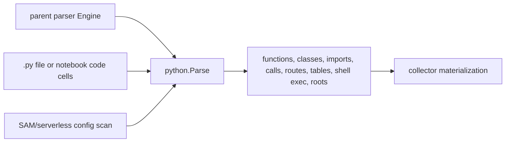

# Python Parser

## Purpose

This package owns the Python language adapter used by the parent parser engine.
It turns Python source and notebook code cells into parser payload buckets for
functions, classes, modules, variables, imports, calls, annotations, framework
metadata, ORM table mappings, shell-exec call-site evidence, and dead-code root
evidence.

## Python parse flow

Notebook extraction and config scans produce parser evidence only. Runtime
ownership, fact storage, and graph writes remain outside this package.

## Ownership boundary

The package is responsible for Python-specific parsing and evidence shaping.
That includes .py input, .ipynb code-cell extraction, import source metadata,
FastAPI, Flask, Django, DRF, aiohttp, and Tornado route summaries, SQLAlchemy
and Django table hints, Lambda handler roots from SAM and serverless config,
generator flags, metaclass data, public API roots, and Python call receiver
inference.

The parent parser package still owns registry dispatch, absolute path
resolution, content metadata, and Engine method signatures. The child package
must not import the parent parser package; shared payload and tree helpers come
from the shared parser package.

## Exported surface

The godoc contract is in doc.go.

- Parse reads one Python or notebook path with a caller-owned tree-sitter parser
  and returns the parser payload. When `Options.EmitDataflow` is set it also emits
  the opt-in `dataflow_functions`, `taint_findings`, and `interproc_findings`
  buckets (see `cfg_emit.go`); the gate is off by default and the payload is
  byte-identical when off.
- PreScan reuses Parse for collector import-map discovery.
- NotebookSource extracts executable Python code cells from notebook JSON.
- The `embedded_shell_commands` bucket records import-backed `subprocess` and
  `os.system` call sites with function, line, API, and language metadata only.
  It does not retain command strings, arguments, or environment values.

## Dependencies

The package imports the shared parser helper package for Options, BasePayload,
ReadSource, WalkNamed, node text helpers, and bucket helpers. The value-flow
emission (`cfg_emit.go`) imports the `python/pydataflow` lowering, the shared
`internal/parser/dataflowemit` renderer, and the `internal/parser/cfg`/`taint`
engines. It imports the YAML parser child package only to decode SAM and
serverless config candidates when marking Python Lambda handlers.

It does not import the parent parser package, collector packages, storage
packages, graph query code, or reducer code.

## Telemetry

This package emits no telemetry directly. Parser timing and parse failure
context remain owned by the ingester and collector runtime paths that call the
parent Engine.

## Gotchas / invariants

NotebookSource returns an empty string for notebooks without code cells. Invalid
JSON returns an error so a caller fails the file instead of indexing partial
source.

Parse accepts a caller-owned tree-sitter parser. The caller opens and closes the
parser so the parent Engine can preserve its runtime lifecycle.

Lambda handler detection scans template.yaml, template.yml, serverless.yaml, and
serverless.yml from the source directory up to the repository root. It only
marks handlers when the runtime is Python.

Script-main guard detection walks parsed if statements and accepts both
`__name__ == "__main__"` and `"__main__" == __name__` forms. Only calls inside
the guard statement become `python.script_main_guard` roots.

Property root detection covers `@property`, `@cached_property`, and
`@functools.cached_property`, including decorators with inline type-checker
comments. Dunder protocol roots cover recognized class protocol methods, module
`__getattr__` and `__dir__` hooks, and nested dunder functions only when source
assignment evidence in the same enclosing function or module installs them onto
a protocol attribute.

The adapter keeps module-scope variables by default. Set the shared
VariableScope option to all when a caller needs local assignment payloads too.

## Related docs

- docs/public/architecture.md
- docs/public/reference/local-testing.md
- docs/public/languages/support-maturity.md

## Evidence notes

No-Regression Evidence: bounded Django and DRF route extraction is parser-only
and no-provider deterministic. `go test ./internal/parser/python -run
'TestBuildPythonFrameworkSemanticsDjango|TestBuildPythonFrameworkSemanticsDRF'
-count=1` failed before the parser emitted `framework_semantics.django` and
`framework_semantics.drf` `route_entries`, then passed after literal
`path(...)` under `urlpatterns`, same-file function identifiers, same-file
class-view methods, literal DRF `ViewSet.as_view({...})` maps, router
registrations with literal URLconf mounts or `urlpatterns = router.urls`, and
literal `@action` routes emitted exact method/path rows with handlers only when
the target is exact.
Django route literals preserve their trailing slash shape, while DRF router
entries apply DRF's trailing slash convention after any literal mount prefix.
`go test ./internal/parser -run
TestDefaultEngineParsePathPythonDjangoDRFExactRouteEntries -count=1` proves the
parent `DefaultEngine.ParsePath` payload carries those rows into the emitted
file fact shape. `go test ./internal/reducer -run
TestBuildHandlesRouteIntentRowsResolvesClassMethodHandler -count=1` proves the
existing `HANDLES_ROUTE` projection resolves `Class.method` handler strings to
the exact Function entity when the parser can prove the class method. Dynamic
`include()`, generated URLconf, shadowed `path` helpers, nonliteral route
strings, dynamic DRF router prefixes or mounts, nonliteral action maps, and
imported Django bare names or attributes stay unclaimed for handler projection
while still preserving exact method/path evidence when the route literal is
static.

No-Regression Evidence: bounded aiohttp and Tornado route extraction is
parser-only and no-provider deterministic. `go test ./internal/parser/python
-run 'TestBuildPythonFrameworkSemantics(AioHTTP|Tornado)' -count=1` failed
before the parser emitted `framework_semantics.aiohttp` and
`framework_semantics.tornado` `route_entries`, then passed after literal
aiohttp `RouteTableDef` decorators, `app.router.add_*`,
`app.router.add_route(...)`, `app.add_routes([web.*(...)])`, and Tornado
`Application` URL specs emitted exact method/path rows with handlers only when
the target was exact. `go test ./internal/parser -run
TestDefaultEngineParsePathPythonAioHTTPTornadoExactRouteEntries -count=1`
proves the parent `DefaultEngine.ParsePath` payload carries those rows into the
emitted file fact shape. `go test ./internal/reducer -run
TestBuildHandlesRouteIntentRowsEmitsAioHTTPTornadoFrameworkRoutes -count=1`
proves the existing `HANDLES_ROUTE` projection resolves aiohttp function
handlers and Tornado `Class.method` handler strings to exact Function entities.
Nonliteral aiohttp path/method/handler values, dynamic route lists, app factory
indirection, imported Tornado handler attributes, generated URL specs, plugin
loading, and runtime-discovered routes stay unclaimed.

No-Observability-Change: this change only adds deterministic rows to the
existing `framework_semantics.route_entries` payload consumed by existing
endpoint extraction and `HANDLES_ROUTE` shared projection. It adds no metric
instrument, metric label, span, log key, status field, env var, queue domain,
worker, lease, batch, runtime knob, graph query, or graph writer. Operators
continue to diagnose parsing through collector parse-stage logs and
`eshu_dp_file_parse_duration_seconds`, and route projection through existing
reducer run spans, shared-projection intent rows, execution counters, and
`HANDLES_ROUTE` projection logs.
