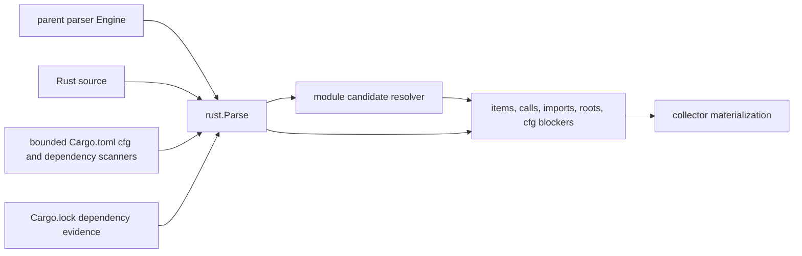

# Rust Parser Adapter

## Purpose

This package owns Rust-specific tree-sitter payload extraction for functions,
types, modules, traits, impl blocks, imports, macro definitions and invocations,
calls, constants, statics, type aliases, root metadata, attributes, derives, and
generic parameter metadata, conditional derive evidence, nested field and enum
variant attributes, structured where-clause evidence, and Cargo dependency
evidence for `Cargo.toml` and `Cargo.lock`.

## Rust parse flow

The adapter records syntactic Rust evidence, bounded module candidates, direct
Cargo manifest dependency rows, and exact lockfile dependency rows. It does not
expand macros, solve Cargo features, or infer transitive dependency paths unless
`Cargo.lock` proves the path from a workspace root package.

## Ownership Boundary

The package receives a caller-owned tree-sitter parser from the parent parser
engine. It owns Rust syntax walking and payload assembly, while the parent
package keeps registry dispatch, runtime parser construction, and compatibility
method signatures.

## Exported Surface

The package exposes `Parse` for full payload extraction, `PreScan` for
dependency symbol discovery, `IsCargoDependencyFile` and
`ParseCargoDependencyFile` for parent exact-name dispatch of Cargo dependency
files, and `ResolveModuleRowFileCandidates` with `ModuleResolution` for
filesystem candidate calculation from parser-emitted module rows. `doc.go`
carries the godoc contract for callers.

## Dependencies

This package imports the shared parser helper package and tree-sitter types. It
must not import the parent parser package.

## Telemetry

This package emits no telemetry directly. Parser timing and runtime observability
remain owned by the parent engine.

## Gotchas / Invariants

Brace imports are expanded into one `imports` row per syntactic import while
preserving the raw `full_import_name` on every row. Module declarations and
inline modules emit `modules` rows with `module_kind`. Lifetime names are
structured when they appear in signatures and impl headers; type and const
generic parameter names are emitted as conservative name lists without merging
`where` bounds. Impl block `target` metadata stops before a multiline or
same-line `where` clause so downstream consumers get the syntactic receiver.
Where predicates are still preserved separately as parser evidence, with
associated-type constraints and higher-ranked trait-bound predicates broken out
when the syntax is direct.

Functions carry async, unsafe, visibility, attribute, impl-context, trait
declaration context, direct parameter receiver type evidence, and selected
`dead_code_root_kinds` metadata. Bare `fn main` roots are limited to
Cargo-shaped entrypoint paths such as `src/main.rs`, `build.rs`, `src/bin`, and
`examples`; a `#[tokio::main]` attribute is direct root evidence. `#[test]` and
`#[tokio::test]` are test roots, whether the attribute is on its own line or
directly before `fn` on the same line. Exact `pub` visibility marks functions,
classes, traits, and type aliases with `rust.public_api_item`; scoped
visibility such as `pub(crate)` does not. Methods declared inside traits carry
`trait_context`; methods inside `impl Trait for Type` or `unsafe impl Trait for
Type` blocks carry `impl_kind=trait_impl`, `trait_context`, and
`rust.trait_impl_method` root evidence so cleanup analysis does not delete
runtime-dispatched trait methods by local inbound-edge shape alone. Direct
method calls on function parameters may carry `inferred_obj_type`; local
variables, fields, expressions, and macro-expanded receivers stay untyped.
Criterion-style `criterion_group!` targets and direct `#[bench]` /
`#[divan::bench]`-style attributes mark file-local benchmark functions with
`rust.benchmark_function`; target extraction accepts identifier targets and
leaves generated or expression-based targets unclaimed. Const and static items
are emitted through the `variables` bucket with `variable_kind`, `type` items
through `type_aliases`, and `macro_rules!` definitions through `macros`.

Direct `#[derive(...)]` attributes emit `derives`; conditional derives inside
`cfg_attr` emit `conditional_derives` so consumers do not mistake them for
unconditional type behavior. Direct item attributes may be multiline or share
the item line. Field-level and enum-variant attributes emit `annotations` rows
with `owner`, `target`, and `target_kind` metadata instead of leaking onto the
parent type. Module declaration rows include `declared_path_candidates` such as
`api.rs` and `api/mod.rs`, relative to the current file directory; explicit
`#[path = "..."]` attributes replace those candidates with the declared path and
mark `module_path_source=path_attribute`. Literal `mod ...;` and `use ...;`
declarations inside macro invocation bodies are modeled with
`module_origin=macro_invocation` or `import_origin=macro_invocation`.
Items gated by `cfg` or `cfg_attr` carry `exactness_blockers=cfg_unresolved`;
macro-origin module and import rows carry
`exactness_blockers=macro_expansion_unavailable`.

`parseCargoCfgManifest` is an intentionally bounded Cargo.toml scanner for the
signals future cfg resolution needs: package name, workspace members, feature
names, default feature members, and target cfg dependency sections. Cargo
dependency parsing is separate: `Cargo.toml` emits direct dependency rows for
normal, dev, build, target-specific, workspace-inherited, and renamed package
dependencies, while `Cargo.lock` emits exact resolved crate versions. Lockfile
dependency paths are emitted only when a source-empty root package proves the
reachable chain and each dependency edge resolves uniquely by name, version, and
source when Cargo provides a parenthesized source qualifier. Unsupported or
ambiguous Cargo dependency shapes are skipped instead of guessed.
`ResolveModuleRowFileCandidates` does not probe the filesystem; it returns
Rust's candidate paths for direct module declarations, honors explicit
`#[path = "..."]` rows, and leaves macro-origin rows blocked. The parent parser
engine uses that helper during ParsePath to annotate module rows with
repo-bounded
`resolved_path_candidates`, `resolved_path`, and `module_resolution_status`
when the current repo root is available. Existing files outside the repo root do
not become resolved module evidence.

Arbitrary macro expansion, Cargo feature selection, cfg evaluation, workspace
feature solving, manifest-to-lockfile feature resolution, and cross-crate
semantic module resolution are still not modeled. Add package-local tests before
widening either claim.

### Regex disposition (issue #3540)

Every retained Rust regex operates on the text of an already-located AST node or
validates a token; none performs primary symbol extraction by scanning raw
source, so all are documented within-AST exceptions rather than conversions:

- `rustLifetimePattern` (`parser.go`) extracts lifetime tokens (`'a`) from a
  signature header string that is itself the text of a `function_item`,
  `impl_item`, or `trait_item` node.
- `rustWhereClausePattern` and `rustIdentifierPattern` (`helpers.go`) split a
  node-text signature header on ` where ` and validate that a token is a bare
  identifier; the leading-attribute `strings.Split` recovers `#[...]` attributes
  from the bounded source slice immediately before an already-located node.
- `rustMacroRulesPattern` (`helpers.go`) is a fallback name read over a
  `macro_definition` node's own text when descent finds no `identifier` child.
- `rustMacroModDeclarationPattern` and `rustMacroUseDeclarationPattern`
  (`macro_declarations.go`) read `mod`/`use` declarations from the body of a
  `macro_invocation` node. Tree-sitter leaves a macro invocation body as an
  unparsed `token_tree` (the macro is not expanded), so there are no structured
  child nodes to walk; the resulting rows are tagged
  `macro_expansion_unavailable`.

## Related Docs

See `docs/public/reference/mcp-reference.md` for the dead-code query surface that
consumes parser root evidence.
