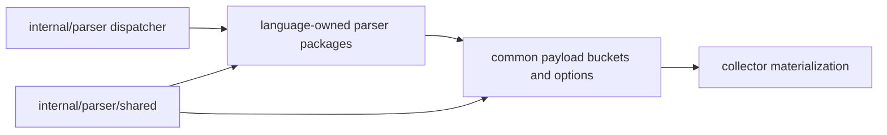

# Shared Parser Helpers

## Purpose

`internal/parser/shared` holds the small contracts language-owned parser
packages need without importing the parent `internal/parser` dispatcher. It
contains common payload bucket helpers, source reads, tree-sitter node helpers,
string utilities, integer coercion, and parser options shared by adapter
packages. Parser options include the `EmitDataflow` gate and the stable
repository identity used by value-flow FunctionIDs. The shared Go semantic-root
options also carry the empty-method-list convention used when an imported
package can reach exported methods through an escaped interface value and the
qualified roots for imported receiver method calls.

## Dependency boundary

Child parser packages may depend on shared helpers. Shared helpers must stay
language-neutral and must not depend on the parent dispatcher.

## Ownership boundary

This package owns dependency-safe helper contracts for child parser packages.
It does not own registry dispatch, language selection, content metadata
inference, parser runtime caching, or language-specific semantics.

## Exported surface

The godoc contract is in `doc.go` and `shared.go`. Current exports are
`Options`, `GoImportedInterfaceParamMethods`, `GoDirectMethodCallRoots`,
`GoPackageSemanticRoots`, `GoPackageSemanticRootOptions`, `BasePayload`, `ReadSource`,
`WalkNamed`, `NodeText`, `NodeLine`, `NodeEndLine`, `CloneNode`,
`AppendBucket`, `SortNamedBucket`, `SortNamedMaps`, `CollectBucketNames`,
`IntValue`, `LastPathSegment`, `DedupeNonEmptyStrings`, `BranchNodeSet`,
`NewBranchNodeSet`, and `CyclomaticComplexity`.

`CyclomaticComplexity` is the shared McCabe walker. Each tree-sitter language
adapter passes a `BranchNodeSet` (built with `NewBranchNodeSet`) that names the
node kinds and boolean operator tokens counted as decision points, so adding
complexity for a language is a data table, not new traversal code.

## Dependencies

This package imports the Go standard library and
`github.com/tree-sitter/go-tree-sitter` for node helper signatures. It must not
import the parent `internal/parser` package or any collector, query, storage,
projector, or reducer package.

## Telemetry

This package emits no metrics, spans, or logs. Parser timing remains owned by
the collector snapshot path.

## Performance and observability evidence

- No-Regression Evidence: `Options.RepositoryID` is an immutable string copied
  through existing parser option structs; it adds no traversal, graph write,
  queue operation, database query, lock, goroutine, or worker coordination.
  Focused verification is `go test ./internal/parser ./internal/collector
  ./internal/storage/postgres -run
  'Test(SnapshotParserOptionsThreadsRepositoryID|GoInterprocFunctionIDsIncludeRepositoryID|JSInterprocFunctionIDsIncludeRepositoryID|PythonInterprocFunctionIDsIncludeRepositoryID|FunctionSummary|BootstrapDefinitionsIncludeFunctionSummaries)'
  -count=1`.
- No-Observability-Change: this package remains telemetry-free; parser timing,
  parse failures, and collector stage metrics stay on the existing collector
  runtime path, unchanged by the repository identity field.
- No-Regression Evidence (issue #3488): `CyclomaticComplexity` is a pure
  function of one already-parsed function subtree. It performs one bounded
  extra named+anonymous walk per function and adds no graph write, queue
  operation, Cypher, lock, goroutine, or worker coordination. Focused
  verification is `go test ./internal/parser/shared -run
  TestCyclomaticComplexity -count=1` plus
  `go test ./internal/parser -run TestCyclomaticComplexityPerLanguage -count=1`.
- No-Observability-Change (issue #3488): the walker writes only the existing
  `cyclomatic_complexity` function-entity field; it adds no metric, span, log,
  status field, env var, or graph query.

## Gotchas / invariants

Child parser packages depend on this package to avoid import cycles. Keep it
small and language-neutral; a helper that only one adapter needs belongs in
that adapter package.

`BasePayload`, bucket sorting, and name collection are fact-input contracts.
Changing their shape or ordering changes downstream materialization behavior.

`GoImportedInterfaceParamMethods` uses an empty method list intentionally. It
means the concrete value crossed into another package through an interface
parameter without a known method set, so exported methods on that concrete type
may be valid runtime hooks. Same-repository package contracts should carry
explicit method names from package interface declarations.

`GoDirectMethodCallRoots` uses lower-case qualified import-path receiver keys.
The parent parser decides which package directory receives those roots; child
packages should only carry the typed option.

`Options.EmitDataflow` controls opt-in `dataflow_functions`, `taint_findings`,
`interproc_findings`, and durable `dataflow_summaries` buckets. The gate is off
by default so normal parser payloads remain byte-identical.

`Options.RepositoryID` must be generation-independent and must not contain local
checkout paths, hostnames, IPs, credentials, or commit SHAs. Value-flow-capable
adapters use it with stable language package identity when `EmitDataflow` is
enabled; durable `dataflow_summaries` must be omitted when either identity
component is absent.

`SortNamedMaps` sorts by `line_number` first and `name` second. That preserves
the parent parser ordering contract used before language packages were split.

Utility helpers such as `IntValue`, `LastPathSegment`, and
`DedupeNonEmptyStrings` are intentionally small. Keep language-specific parsing
rules out of this package so shared does not become a second parser package.

`WalkNamed` uses one tree-sitter cursor per traversal and visits only named
direct children recursively. That preserves source-order parser behavior while
avoiding per-node `NamedChildren` slice allocation in repo-scale Go pre-scans.

## Related docs

- `docs/public/languages/support-maturity.md`
