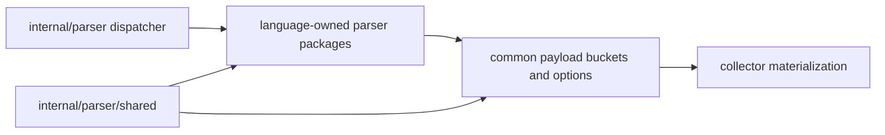

# Shared Parser Helpers

## Purpose

`internal/parser/shared` holds the small contracts language-owned parser
packages need without importing the parent `internal/parser` dispatcher. It
contains common payload bucket helpers, source reads, tree-sitter node helpers,
string utilities, integer coercion, and parser options shared by adapter
packages. Parser options include the `EmitDataflow` gate and the stable
repository identity used by value-flow FunctionIDs. The shared Go semantic-root
options also carry the empty-method-list convention used when an imported
package can reach exported methods through an escaped interface value and the
qualified roots for imported receiver method calls.

## Dependency boundary

```mermaid
flowchart LR
    Parent["internal/parser dispatcher"]
    Shared["internal/parser/shared"]
    Child["language-owned parser packages"]
    Payload["common payload buckets and options"]
    Collector["collector materialization"]

    Parent --> Child
    Shared --> Child
    Shared --> Payload
    Child --> Payload
    Payload --> Collector
```

Child parser packages may depend on shared helpers. Shared helpers must stay
language-neutral and must not depend on the parent dispatcher.

## Ownership boundary

This package owns dependency-safe helper contracts for child parser packages.
It does not own registry dispatch, language selection, content metadata
inference, parser runtime caching, or language-specific semantics.

## Exported surface

The godoc contract is in `doc.go` and `shared.go`. Current exports are
`Options`, `GoImportedInterfaceParamMethods`, `GoDirectMethodCallRoots`,
`GoPackageSemanticRoots`, `GoPackageSemanticRootOptions`, `BasePayload`, `ReadSource`,
`NormalizeLineEndings`, `PrimeSource`, `ClearSource`, `SetReadSourceHookForTest`,
`WalkNamed`, `NodeText`, `NodeLine`, `NodeEndLine`, `CloneNode`,
`AppendBucket`, `SortNamedBucket`, `SortNamedMaps`, `CollectBucketNames`,
`IntValue`, `LastPathSegment`, `DedupeNonEmptyStrings`, `BranchNodeSet`,
`NewBranchNodeSet`, and `CyclomaticComplexity`.

`NormalizeLineEndings` rewrites every carriage return to `\n`, but only in a
source that contains no `\n` at all. Any source with a newline in it comes
back untouched, as the caller's own slice. `ReadSource` applies it to every
buffer it returns, on the cached path as well as the disk path, so no language
parser in this tree ever sees a classic-Mac line ending (#6306). Without it
tree-sitter reports row 0 for every node in such a file and each hand-rolled
`\n` scanner treats the whole file as one line, silently.

The rule is deliberately about the FILE, not the byte. A `\r` means nothing on
its own: the same byte terminates a line in a classic-Mac file and carries
payload inside a Go raw string, a regex, or a wire-format constant. The
absence of `\n` is the only honest signal available -- a file with a newline
already has a working line convention, so its `\r` bytes are data or half a
CRLF pair, while a file without one has no other candidate terminator. Two
things this cannot do, stated plainly:

- A MIXED file (LF or CRLF lines plus a `\r` the author meant as a separator)
  keeps that `\r` and keeps the merged line it produces. That shape is
  byte-for-byte identical to a data `\r` in an LF file, and leaving one line
  of a malformed file merged is a smaller loss than corrupting a literal in a
  healthy one.
- A classic-Mac file that embeds a data `\r` inside a literal has that byte
  rewritten with the separators around it. Such a file parses as a single line
  today, so there is no working behavior to protect.

The rewrite is length-preserving, which is what keeps downstream byte offsets
(the JSONC offset translator, SQL entity spans, `IndexSource` snippets) valid
against the file on disk, and it never mutates its input, which is what keeps
the git collector's content digest stable. A parser that reads a SECOND file
with its own `os.ReadFile` -- a C/C++ header, a sibling module, a tsconfig, a
Terragrunt include -- does not go through `ReadSource` and must call
`NormalizeLineEndings` itself.

`PrimeSource`/`ClearSource` back the single-physical-read cache
`Engine.ParsePath` uses so the language parser and the engine's
content-metadata inference share one disk read; see the parent package
README's "Single physical read per `ParsePath` call" section for the full
contract. `SetReadSourceHookForTest` is test-only instrumentation for counting
physical `ReadSource` reads without changing its signature; production code
never calls it.

`CyclomaticComplexity` is the shared McCabe walker. Each tree-sitter language
adapter passes a `BranchNodeSet` (built with `NewBranchNodeSet`) that names the
node kinds and boolean operator tokens counted as decision points, so adding
complexity for a language is a data table, not new traversal code. The
`defaultCaseKinds` argument names branch kinds that double as a switch `default`
or bare wildcard `_` arm; the walker excludes those catch-all arms because the
implicit else is not a decision point under McCabe.

## Dependencies

This package imports the Go standard library and
`github.com/tree-sitter/go-tree-sitter` for node helper signatures. It must not
import the parent `internal/parser` package or any collector, query, storage,
projector, or reducer package.

## Telemetry

This package emits no metrics, spans, or logs. Parser timing remains owned by
the collector snapshot path.

## Performance and observability evidence

- No-Regression Evidence: `Options.RepositoryID` is an immutable string copied
  through existing parser option structs; it adds no traversal, graph write,
  queue operation, database query, lock, goroutine, or worker coordination.
  Focused verification is `go test ./internal/parser ./internal/collector
  ./internal/storage/postgres -run
  'Test(SnapshotParserOptionsThreadsRepositoryID|GoInterprocFunctionIDsIncludeRepositoryID|JSInterprocFunctionIDsIncludeRepositoryID|PythonInterprocFunctionIDsIncludeRepositoryID|FunctionSummary|BootstrapDefinitionsIncludeFunctionSummaries)'
  -count=1`.
- No-Observability-Change: this package remains telemetry-free; parser timing,
  parse failures, and collector stage metrics stay on the existing collector
  runtime path, unchanged by the repository identity field.
- No-Regression Evidence (issue #3488): `CyclomaticComplexity` is a pure
  function of one already-parsed function subtree. It performs one bounded
  extra named+anonymous walk per function and adds no graph write, queue
  operation, Cypher, lock, goroutine, or worker coordination. Focused
  verification is `go test ./internal/parser/shared -run
  TestCyclomaticComplexity -count=1` plus
  `go test ./internal/parser -run TestCyclomaticComplexityPerLanguage -count=1`.
- No-Observability-Change (issue #3488): the walker writes only the existing
  `cyclomatic_complexity` function-entity field; it adds no metric, span, log,
  status field, env var, or graph query.
- Benchmark Evidence (issue #6306): `NormalizeLineEndings` runs on every
  `ReadSource` return, so it sits on the per-file parse hot path. Its rule is
  file-scoped -- a source containing any `\n` is returned untouched -- so it
  probes for `\n` before `\r`, and on real-world input that probe stops
  inside the first line instead of scanning the whole file for a `\r` that is
  not there. Measured with `go test ./internal/parser/shared -run '^$' -bench
  BenchmarkNormalizeLineEndings -benchtime 2000x -count=5` on a 64 KiB body
  (large for a parser input; the median repository source file is well under
  8 KiB), darwin/arm64 Apple M4 Pro, go1.26.6, 12 usable CPUs, worktree
  GOCACHE. The byte-scoped predecessor and the file-scoped rule were run
  interleaved in the same session (old, new, old, new) so the pair shares one
  machine state; best of five per shape, both rounds agreeing:

  | source shape | before | after | allocs |
  | --- | --- | --- | --- |
  | LF | 1117 ns/op | 5.65 ns/op | 0 -> 0 |
  | CRLF | 7227 ns/op | 5.60 ns/op | 0 -> 0 |
  | bare CR (classic-Mac) | 24.0 us/op | 38.3 us/op | 1 (73728 B) -> 1 (73728 B) |
  | no terminator anywhere | 619 ns/op | 1261 ns/op | 0 -> 0 |

  LF and CRLF -- which is essentially all real input -- get about 200x and
  1300x cheaper, because neither shape is scanned end to end any more. The two
  regressions are both shapes with no `\n` in the file, which must be scanned
  to the end to prove that: a classic-Mac file pays a failed `\n` scan before
  its copy (1.6x), and a file with no line terminator at all pays two failed
  scans instead of one (2.0x, still under 1.3 us). Neither shape parsed
  correctly before this change existed. Compare against the parse it precedes,
  from `go test ./internal/parser -run '^$' -bench
  'BenchmarkParsePathPHPRouteHeavy|BenchmarkParsePathGoIdentifierHeavy'
  -benchtime 30x -count=5` on the same machine and session: 9.61 ms/op for the
  PHP route-heavy file and 238 ms/op for the Go identifier-heavy one.
  `ReadSource` is called about twice per `ParsePath`, so the added cost is
  roughly 11 ns against a >=9.6 ms parse (about 0.0001%) for LF and CRLF
  input, and about 77 us (about 0.8%) in the classic-Mac case that previously
  produced wrong data. No new graph write, queue operation, Cypher, lock,
  goroutine, or worker coordination. These numbers were taken while the host
  carried a load average near 33 from concurrent agent work; both halves of
  every comparison share that condition, and the sub-benchmark ordering makes
  the first shape measured (LF) the one most exposed to warm-up, so treat the
  ratios as the claim and the absolute figures as upper bounds.
- No-Observability-Change (issue #6306): this package remains telemetry-free.
  Normalization adds no metric, span, structured log, status field, env var,
  or runtime knob; it changes only the bytes a language parser is handed, and
  an LF or CRLF source is returned as the caller's own slice, so operator-
  visible parse timing and failure signals stay on the existing collector
  path.
- Benchmark/No-Observability-Change evidence for the `ReadSource` single-read
  cache (`PrimeSource`/`ClearSource`) is recorded in the parent package
  README's "Single physical read per `ParsePath` call" section; this package
  only adds the cache lookup and test-hook plumbing `ReadSource` and
  `SetReadSourceHookForTest` use.

## Gotchas / invariants

Child parser packages depend on this package to avoid import cycles. Keep it
small and language-neutral; a helper that only one adapter needs belongs in
that adapter package.

`BasePayload`, bucket sorting, and name collection are fact-input contracts.
Changing their shape or ordering changes downstream materialization behavior.

`GoImportedInterfaceParamMethods` uses an empty method list intentionally. It
means the concrete value crossed into another package through an interface
parameter without a known method set, so exported methods on that concrete type
may be valid runtime hooks. Same-repository package contracts should carry
explicit method names from package interface declarations.

`GoDirectMethodCallRoots` uses lower-case qualified import-path receiver keys.
The parent parser decides which package directory receives those roots; child
packages should only carry the typed option.

`Options.EmitDataflow` controls opt-in `dataflow_functions`, `taint_findings`,
`interproc_findings`, and durable `dataflow_summaries` buckets. The gate is off
by default so normal parser payloads remain byte-identical.

`Options.RepositoryID` must be generation-independent and must not contain local
checkout paths, hostnames, IPs, credentials, or commit SHAs. Value-flow-capable
adapters use it with stable language package identity when `EmitDataflow` is
enabled; durable `dataflow_summaries` must be omitted when either identity
component is absent.

`SortNamedMaps` sorts by `line_number` first and `name` second. That preserves
the parent parser ordering contract used before language packages were split.

Utility helpers such as `IntValue`, `LastPathSegment`, and
`DedupeNonEmptyStrings` are intentionally small. Keep language-specific parsing
rules out of this package so shared does not become a second parser package.

`WalkNamed` uses one tree-sitter cursor per traversal and visits only named
direct children recursively. That preserves source-order parser behavior while
avoiding per-node `NamedChildren` slice allocation in repo-scale Go pre-scans.

## Related docs

- `docs/public/languages/support-maturity.md`
