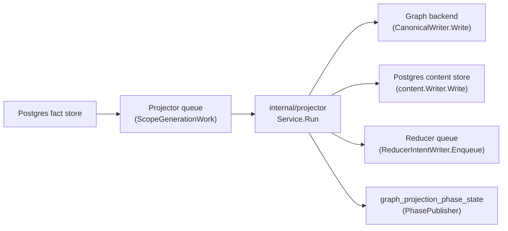
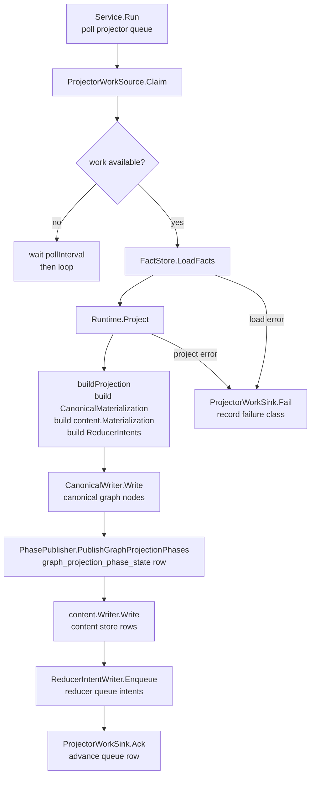

# Projector

## Purpose

`projector` owns source-local projection stages. It turns committed fact
envelopes for one scope generation into canonical graph nodes, content store
rows, and reducer intents for shared-domain follow-up. It does not make
cross-source admission decisions — those belong to `internal/reducer`.

## Where this fits in the pipeline

## Internal flow

## Lifecycle / workflow

`Service.Run` starts one or more worker goroutines (sequential when `Workers`
≤ 1, concurrent otherwise). Each worker calls `ProjectorWorkSource.Claim` to
pull one `ScopeGenerationWork` from the Postgres projector queue. If nothing is
ready, the worker waits `PollInterval` (default 1 s) and retries.

Once a claim is held, the worker loads all fact envelopes for that scope
generation via `FactStore.LoadFacts`, then hands them to `Runtime.Project`. The
`Runtime` builds a `CanonicalMaterialization` (repository, directory, file,
entity, module, import, parameter, class member, nested-function,
Terraform-state rows, and OCI registry rows) and a content materialization in a
single pass via `buildProjection`. It writes
canonical nodes through `CanonicalWriter.Write`, publishes a
`graph_projection_phase_state` row via the `PhasePublisher` so reducer-owned
edge domains can gate on `canonical_nodes_committed`, writes content store rows,
and enqueues `ReducerIntent` values for shared domains such as
`DomainSemanticEntityMaterialization`.

On success the worker calls `ProjectorWorkSink.Ack`. On any error it calls
`ProjectorWorkSink.Fail` with a `FailureClassification` derived from
`ClassifyFailure`. The classifier preserves the stage that failed, maps Neo4j
transient errors, context cancellation, network errors, input validation, and
resource exhaustion into stable durable queue metadata, and sets retry guidance
for operators. When `ProjectorWorkHeartbeater` returns `ErrWorkSuperseded`, the
service stops the current claim without acking or failing it; this is the
expected cancellation path when a newer same-scope generation replaces a live
older projection. A large-generation semaphore (`largeSem`) limits concurrent
projection of scope generations above `LargeGenThreshold` facts to
`LargeGenMaxConcurrent` workers to prevent memory pressure from many
high-cardinality repositories running at once.

## Exported surface

- `Service` — poll-and-dispatch loop; wire `ProjectorWorkSource`, `FactStore`,
  `ProjectionRunner`, `ProjectorWorkSink`, and optionally `ProjectorWorkHeartbeater`
  and `FactCounter` before calling `Service.Run`
- `Runtime` — implements `ProjectionRunner`; takes a `CanonicalWriter`,
  `content.Writer`, `ReducerIntentWriter`, `PhasePublisher`, and `RepairQueue`
- `CanonicalWriter` — interface for writing a `CanonicalMaterialization` to
  the canonical graph backend; implemented by `storage/cypher.CanonicalNodeWriter`
- `ReducerIntentWriter` — interface for enqueuing `ReducerIntent` rows to the
  reducer queue
- `CanonicalMaterialization` — full set of canonical node writes for one
  scope generation: `RepositoryRow`, `DirectoryRow`, `FileRow`, `EntityRow`,
  `ModuleRow`, `ImportRow`, `ParameterRow`, `ClassMemberRow`,
  `NestedFunctionRow`, Terraform-state resource/module/output rows, and OCI
  registry repository/image/tag/referrer rows
- `ScopeGenerationWork` — one claimed queue item; carries `scope.IngestionScope`
  and `scope.ScopeGeneration`
- `Result` — output of one projection pass; includes `content.Result` and
  `IntentResult`
- `ReducerIntent` — one pending shared-domain work item emitted after projection
- `FailureClassification` — structured failure metadata (class, disposition,
  stage) used for durable queue persistence
- `ClassifyFailure(err, stage)` — maps a projection error to a
  `FailureClassification`; understands Neo4j transient codes, context
  cancellation, network errors, and sentinel error types
- `ErrWorkSuperseded` — sentinel returned by the heartbeat path when a newer
  same-scope generation has made the current projector claim obsolete
- `StageError`, `InputValidationError`, `ResourceExhaustedError` — typed errors
  the classifier recognizes
- `EntityTypeLabel(entityType)` — maps content-store entity type strings (e.g.
  `"function"`) to Neo4j node labels (e.g. `"Function"`)
- `EntityTypeLabelMap()` — returns a copy of the full entity-type-to-label
  mapping; used in schema conformance tests
- `ProjectFileStage`, `ProjectEntityStage`, `ProjectRelationshipStage`,
  `ProjectWorkloadStage` — stage helpers that project subsets of facts into
  typed results; useful in unit tests and stage-level benchmarks
- `FilterFileFacts`, `FilterEntityFacts`, `FilterRepositoryFacts` — deduplicated
  fact slices by kind
- `NormalizeFactKind` — strips the legacy `Fact` suffix from fact kind strings
- `BuildProjectionDecision`, `BuildProjectionEvidence` — build persisted
  decision rows for audit tracing
- `RetryableError`, `IsRetryable` — typed retry interface and predicate
- `RetryInjector`, `RetryOnceInjector`, `NewRetryOnceInjector` — fault-injection
  seam for controlled retry testing

See `doc.go` for the full godoc contract.

## Dependencies

- `internal/content` — `content.Writer`, `content.Materialization`,
  `content.Record`, `content.EntityRecord`; projector does not own content
  schema, only populates it
- `internal/facts` — `facts.Envelope`; the durable fact model projector reads
- `internal/queue` — `queue.FailureRecord`; `ClassifyFailure.ToFailureRecord`
  converts to this for queue persistence
- `internal/reducer` — `reducer.Domain`, `reducer.GraphProjectionPhasePublisher`,
  `reducer.GraphProjectionPhaseRepairQueue`, `reducer.GraphProjectionPhaseState`,
  `reducer.DomainSemanticEntityMaterialization`; projector emits intents and
  phase state that reducer consumes
- `internal/scope` — `scope.IngestionScope`, `scope.ScopeGeneration`; scope
  identity flows through every projection call
- `internal/telemetry` — span, metric, and log helpers

Graph writes route through `internal/storage/cypher.CanonicalNodeWriter` via the
`CanonicalWriter` interface. Terraform-state facts are projected as
`TerraformResource`, `TerraformModule`, and `TerraformOutput` nodes with
lineage, serial, provider, tag hash, and correlation-anchor evidence kept as
properties. OCI registry facts are projected as digest-addressed image
manifest/index/descriptor rows; tag facts remain weak mutable observations and
do not define image identity. The projector never calls a Neo4j or NornicDB
driver directly.
Package-registry facts are projected only for stable ecosystem identity and
package-native dependency truth: `PackageRegistryPackageRow`,
`PackageRegistryVersionRow`, and `PackageRegistryDependencyRow` create package,
version, and dependency nodes. Those rows preserve package ID, PURL, BOMRef,
package manager, and source-debug fields so reducers and read surfaces can
explain identity joins without re-parsing collector payloads.
`package_registry.source_hint` remains
provenance-only until reducer correlation proves ownership, publication, or
consumption.
When a generation contains package identity or source hints,
`buildPackageSourceCorrelationReducerIntent` emits one
`package_source_correlation` reducer intent for the scope so the reducer can
classify hints and manifest-backed package consumption against active Git facts
once. Package identity also triggers `supply_chain_impact` so vulnerability
impact can be recomputed when package evidence arrives after vulnerability
intelligence.
AWS cloud facts follow the same source-local rule. The projector does not join
AWS resources to Terraform state; when a generation contains one or more
`aws_resource` facts, `buildAWSCloudRuntimeDriftReducerIntent` emits one
`aws_cloud_runtime_drift` reducer intent for the AWS scope/generation so the
reducer can run the bounded ARN join after source-local projection succeeds.
Container-image identity follows the same handoff rule: when a generation
contains OCI digest/tag facts, AWS image-reference facts, AWS container-image
relationships, or Git content-entity image references,
`buildContainerImageIdentityReducerIntent` emits one
`container_image_identity` reducer intent for that scope/generation. The
projector still does not join images to workloads or runtime evidence; the
reducer owns digest-first admission after source-local projection succeeds.
SBOM and attestation documents use the same reducer-owned boundary. When a
generation contains an `sbom.document` or `attestation.statement` fact,
`buildSBOMAttestationAttachmentReducerIntent` emits one
`sbom_attestation_attachment` reducer intent for that scope/generation. The
projector does not attach components to images; the reducer owns subject-digest
admission after source-local document projection succeeds.
Service-catalog facts follow the same schema-gated handoff. When a generation
contains service-catalog entity, ownership, repository-link, dependency, API,
operational-link, scorecard, or warning facts,
`buildServiceCatalogCorrelationReducerIntent` emits one
`service_catalog_correlation` reducer intent for that scope/generation. The
projector rejects unsupported service-catalog schema versions during projection
so stale collector payloads cannot silently reach the reducer.
PagerDuty incident-routing follows the same reducer-owned boundary. When a
generation contains an `incident.record` fact or any `incident_routing.*` fact,
`buildIncidentRoutingMaterializationReducerIntent` emits one
`incident_routing_materialization` reducer intent for the scope/generation. The
projector does not compare declared, applied, or live routing evidence and does
not create incident, service, runtime, image, commit, pull-request, Jira, or
root-cause graph truth.

## Telemetry

- Metrics: `eshu_dp_projector_run_duration_seconds` — duration of one full claim-
  to-ack cycle; `eshu_dp_projections_completed_total` — counter labeled `status`
  (`succeeded`/`failed`/`ack_failed`); `eshu_dp_projector_stage_duration_seconds`
  — labeled by `stage` (`build_projection`, `canonical_write`, `content_write`,
  `intent_enqueue`); `eshu_dp_queue_claim_duration_seconds` labeled `queue=projector`;
  `eshu_dp_canonical_writes_total` and `eshu_dp_canonical_write_duration_seconds` —
  canonical graph write counters; `eshu_dp_reducer_intents_enqueued_total` — intent
  queue output; `eshu_dp_large_repo_semaphore_wait_seconds` — semaphore wait for
  high-fact-count generations
- Spans: `telemetry.SpanProjectorRun` (`projector.run`) wraps each claim cycle;
  `telemetry.SpanCanonicalProjection` (`canonical.projection`) wraps the
  canonical write; `telemetry.SpanReducerIntentEnqueue` (`reducer_intent.enqueue`)
  wraps intent queue writes
- Logs: scope `projector`, phase `telemetry.PhaseProjection` (`projection`).
  Structured log events: `projector work stage completed` (load_facts and
  project_generation stages), `projector runtime stage completed` (build,
  canonical write, content write, intent enqueue), `projection succeeded`,
  `projection failed`, `projector work canceled during shutdown`, and
  `projector work superseded by newer generation`. All events carry `scope_id`,
  `generation_id`, `source_system`, `worker_id`, `stage`, `duration_seconds`,
  and `failure_class` on error paths.

## Operational notes

- If `eshu_dp_projections_completed_total{status="failed"}` is rising, check
  `failure_class` in structured logs — `dependency_unavailable` with a Neo4j
  transient code is retryable; `projection_bug` or `input_invalid` needs
  investigation.
- `eshu_dp_projector_stage_duration_seconds{stage="canonical_write"}` shows
  whether the graph backend write is the bottleneck. If it is elevated, check
  `eshu_dp_canonical_write_duration_seconds` and graph backend metrics before
  raising worker count.
- `eshu_dp_projector_stage_duration_seconds{stage="content_write"}` covers the
  Postgres content-store write. When this stage dominates, check
  `eshu_dp_postgres_query_duration_seconds` for connection-pool pressure.
- `eshu_dp_large_repo_semaphore_wait_seconds` rising means large-generation
  slots are saturated; raise `LargeGenMaxConcurrent` cautiously and watch
  memory (see `eshu_dp_gomemlimit_bytes`).
- `eshu_dp_queue_oldest_age_seconds{queue="projector"}` aging means workers
  cannot keep up with ingest rate. Add projector workers or scale the runtime
  before changing graph-write timeouts.
- On `/admin/status`, `queue_blockages` indicates work is eligible but held due
  to a conflict key; distinguish this from graph backend slowness before
  changing concurrency settings.

## Extension points

- `CanonicalWriter` — wire a different backend by implementing this interface;
  the projector does not branch on backend brand
- `ProjectionRunner` — `Runtime` is the default implementation; tests substitute
  recording or failing runners
- `ProjectorWorkSource` / `ProjectorWorkSink` — implemented by the Postgres
  projector queue; can be replaced for isolated unit tests
- `RetryInjector` — `RetryOnceInjector` is the only production-shipped injector;
  add new implementations only for bounded fault-injection scenarios, not as a
  general retry mechanism

Do not add backend-conditional logic to `CanonicalWriter.Write` callers.
Backend dialect differences belong only in `internal/storage/cypher` and its
backend-specific adapters.

## Gotchas / invariants

- Projection must be idempotent (`doc.go`). Retries and re-queued items must
  converge on the same graph truth, not create second paths.
- `PhasePublisher.PublishGraphProjectionPhases` must succeed before the projector
  acks a work item. If publish fails and `RepairQueue` is wired, a repair row is
  enqueued so reducer can re-gate on phase state (`runtime.go:191`).
- Terraform-state warning-only generations such as missing exact S3 state
  objects still publish the `terraform_resource_uid` and
  `terraform_module_uid` `canonical_nodes_committed` checkpoints. They write no
  graph nodes, but the checkpoints are the durable "zero rows projected" signal
  workflow completion needs.
- `Module` and `Parameter` entity types are excluded from the generic
  `EntityRow` extraction path because they use different MERGE keys in the graph
  schema; they get their own extraction phases (`canonical_builder.go:227`).
- Terraform entity labels from the content store include backends, imports,
  moved blocks, removed blocks, checks, and lockfile providers. `EntityTypeLabel`
  must know each label before canonical graph writes can project it.
- OCI image identity is digest-backed. `oci_registry.image_tag_observation`
  facts can create weak tag evidence only when they include a resolved digest;
  tag-only facts must not mint canonical image identity. The OCI rows live on
  `CanonicalMaterialization` alongside Terraform rows (`canonical.go:27`), and
  the label map includes the ContainerImage and OciImage labels required by the
  graph schema. OCI registry generations now enqueue one
  `DomainContainerImageIdentity` follow-up intent so active Git/AWS image
  references can be joined against the active OCI digest catalog.
- SBOM component-only generations do not enqueue
  `DomainSBOMAttestationAttachment`. A document or attestation statement is the
  subject anchor; components, dependency edges, external references, and
  warnings only enrich reducer decisions once the document-scoped intent exists.
- File paths in `EntityRow.FilePath` and `FileRow.Path` are repo-qualified
  (`repoPath/relative_path`) to prevent cross-repository MERGE collisions in the
  graph (`canonical_builder.go:112`).
- The `ContentBeforeCanonical` flag on `Runtime` writes the content index before
  graph projection. This is intentional only for local profiles where the graph
  backend may be degraded; do not set it in full-stack deployments
  (`runtime.go:36`).
- Directories in `CanonicalMaterialization.Directories` are sorted root-first
  by `Depth` so parent nodes exist before children during ordered writes
  (`canonical_builder.go:191`).
- `ReducerIntent` values are sorted by `Domain`, `EntityKey`, and `FactID`
  before enqueue to produce a stable queue order (`runtime.go:382`).

No-Regression Evidence: Terraform-state warning-only phase publication is
covered by
`go test ./internal/projector -run TestRuntimeProjectPublishesTerraformStateWarningOnlyCanonicalPhases -count=1`.
It changes no worker count, claim ordering, fact fan-out, graph write
cardinality, batch size, retry timing, or NornicDB setting; it only publishes
the already-required reducer phase rows for warning-only generations that have
zero canonical graph nodes.

No-Observability-Change: existing projector `build_projection` stage logs,
`graph_projection_phase_state` rows, workflow completeness rows,
`/api/v0/index-status`, and queue terminal counters expose whether warning-only
Terraform-state work reached the durable zero-row checkpoint or remains in
reducer convergence.

No-Regression Evidence: SBOM attachment intent routing is covered by
`go test ./internal/projector -run 'TestBuildProjectionQueuesSBOMAttestationAttachment|TestBuildSBOMAttestationAttachmentReducerIntentSkipsComponentOnlyEvidence' -count=1`.
It adds at most one reducer intent per SBOM or attestation scope generation and
does not change graph write cardinality, worker counts, claim ordering, batch
size, retry timing, or backend settings.

No-Regression Evidence: PagerDuty incident-routing intent routing is covered by
`go test ./internal/projector -run 'IncidentRoutingMaterialization' -count=1`.
It adds at most one reducer intent per incident/routing scope generation and
does not change graph writes, worker counts, claim ordering, batch size, retry
timing, or backend settings.

No-Observability-Change: existing projector `intent_enqueue` stage logs,
`eshu_dp_reducer_intents_enqueued_total`, reducer domain counters,
`fact_work_items` terminal state, and `/admin/status` expose whether SBOM
attachment work was queued, drained, retried, or dead-lettered.

## Related docs

- `docs/public/architecture.md` — pipeline and ownership table
- `docs/public/deployment/service-runtimes.md` — local verification runtime lanes
- `docs/public/reference/telemetry/index.md` — metric and span reference
- ADR: `docs/public/reference/cypher-performance.md`
- ADR: `docs/public/reference/backend-conformance.md`
- ADR: `docs/public/reference/cypher-performance.md`
