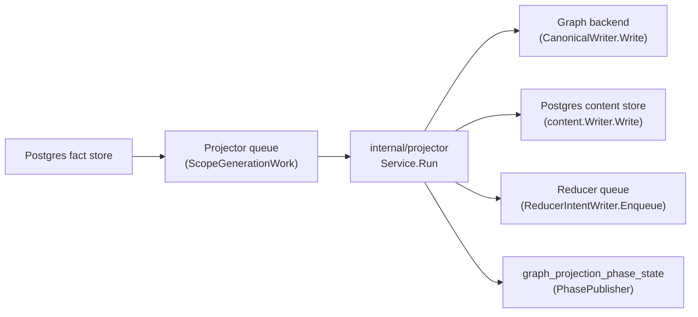
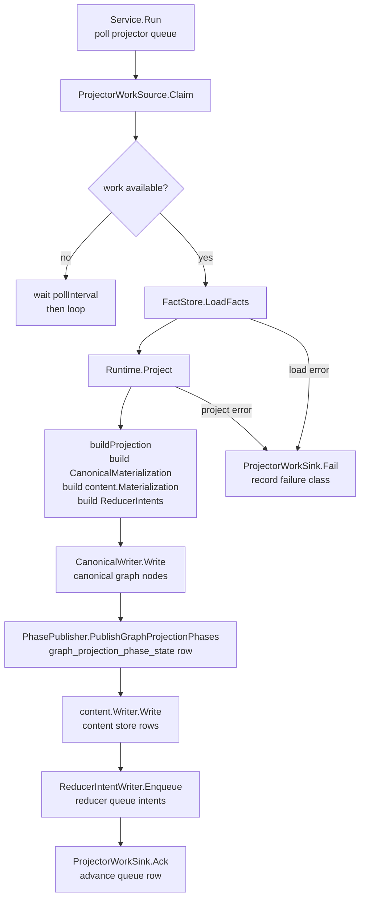

# Projector

## Purpose

`projector` owns source-local projection stages. It turns committed fact
envelopes for one scope generation into canonical graph nodes, content store
rows, source-backed repository ref metadata, and reducer intents for
shared-domain follow-up. It does not make cross-source admission decisions —
those belong to `internal/reducer`.

## Where this fits in the pipeline



## Internal flow



## Lifecycle / workflow

`Service.Run` starts one or more worker goroutines (sequential when `Workers`
≤ 1, concurrent otherwise). Each worker calls `ProjectorWorkSource.Claim` to
pull one `ScopeGenerationWork` from the Postgres projector queue. If nothing is
ready, the worker waits `PollInterval` (default 1 s) and retries.

Once a claim is held, the worker loads all fact envelopes for that scope
generation via `FactStore.LoadFacts`, then hands them to `Runtime.Project`. The
`Runtime` builds a `CanonicalMaterialization` (repository, directory, file,
entity, module, import, parameter, class member, nested-function,
Terraform-state rows, and OCI registry rows) and a content materialization
covering file rows, entity rows, and source-backed repository refs in a single
pass via `buildProjection`. It writes
canonical nodes through `CanonicalWriter.Write`, publishes a
`graph_projection_phase_state` row via the `PhasePublisher` so reducer-owned
edge domains can gate on `canonical_nodes_committed`, writes content store rows,
and enqueues `ReducerIntent` values for shared domains such as
`DomainSemanticEntityMaterialization`.
When a repository fact carries `delta_generation=true`, the canonical
materialization keeps qualified `DeltaFilePaths` and `DeltaDeletedFilePaths` so
the graph writer can scope cleanup to touched files. Delta generations emitted
by the Git collector do not carry repo-wide reducer follow-up facts; shared
projection domains keep their previous truth until they gain a separate
file-scoped delta contract. The source-local delta contract preserves legal Git
path whitespace while rejecting absolute paths and parent traversal.

On success the worker calls `ProjectorWorkSink.Ack`. On any error it calls
`ProjectorWorkSink.Fail` with a `FailureClassification` derived from
`ClassifyFailure`. The classifier preserves the stage that failed, maps Neo4j
transient errors, context cancellation, network errors, input validation, and
resource exhaustion into stable durable queue metadata, and sets retry guidance
for operators. When `ProjectorWorkHeartbeater` returns `ErrWorkSuperseded`, the
service stops the current claim without acking or failing it; this is the
expected cancellation path when a newer same-scope generation replaces a live
older projection. A large-generation semaphore (`largeSem`) limits concurrent
projection of scope generations above `LargeGenThreshold` facts to
`LargeGenMaxConcurrent` workers to prevent memory pressure from many
high-cardinality repositories running at once.

## Exported surface

- `Service` — poll-and-dispatch loop; wire `ProjectorWorkSource`, `FactStore`,
  `ProjectionRunner`, `ProjectorWorkSink`, and optionally `ProjectorWorkHeartbeater`
  and `FactCounter` before calling `Service.Run`
- `Runtime` — implements `ProjectionRunner`; takes a `CanonicalWriter`,
  `content.Writer`, `ReducerIntentWriter`, `PhasePublisher`, and `RepairQueue`
- `CanonicalWriter` — interface for writing a `CanonicalMaterialization` to
  the canonical graph backend; implemented by `storage/cypher.CanonicalNodeWriter`
- `ReducerIntentWriter` — interface for enqueuing `ReducerIntent` rows to the
  reducer queue
- `CanonicalMaterialization` — full set of canonical node writes for one
  scope generation: `RepositoryRow`, `DirectoryRow`, `FileRow`, `EntityRow`,
  `ModuleRow`, `ImportRow`, `ParameterRow`, `ClassMemberRow`,
  `NestedFunctionRow`, Terraform-state resource/module/output rows, and OCI
  registry repository/image/tag/referrer rows. Delta generations also carry
  `DeltaProjection`, `DeltaFilePaths`, and `DeltaDeletedFilePaths`
- `ScopeGenerationWork` — one claimed queue item; carries `scope.IngestionScope`
  and `scope.ScopeGeneration`
- `Result` — output of one projection pass; includes `content.Result` and
  `IntentResult`
- `ReducerIntent` — one pending shared-domain work item emitted after projection
- `FailureClassification` — structured failure metadata (class, disposition,
  stage) used for durable queue persistence
- `ClassifyFailure(err, stage)` — maps a projection error to a
  `FailureClassification`; understands Neo4j transient codes, context
  cancellation, network errors, and sentinel error types
- `ErrWorkSuperseded` — sentinel returned by the heartbeat path when a newer
  same-scope generation has made the current projector claim obsolete
- `StageError`, `InputValidationError`, `ResourceExhaustedError` — typed errors
  the classifier recognizes
- `EntityTypeLabel(entityType)` — maps content-store entity type strings (e.g.
  `"function"`) to Neo4j node labels (e.g. `"Function"`)
- `EntityTypeLabelMap()` — returns a copy of the full entity-type-to-label
  mapping; used in schema conformance tests
- `ProjectFileStage`, `ProjectEntityStage`, `ProjectRelationshipStage`,
  `ProjectWorkloadStage` — stage helpers that project subsets of facts into
  typed results; useful in unit tests and stage-level benchmarks
- `FilterFileFacts`, `FilterEntityFacts`, `FilterRepositoryFacts` — deduplicated
  fact slices by kind
- `NormalizeFactKind` — strips the legacy `Fact` suffix from fact kind strings
- `BuildProjectionDecision`, `BuildProjectionEvidence` — build persisted
  decision rows for audit tracing
- `RetryableError`, `IsRetryable` — typed retry interface and predicate
- `RetryInjector`, `RetryOnceInjector`, `NewRetryOnceInjector` — fault-injection
  seam for controlled retry testing

See `doc.go` for the full godoc contract.

## Dependencies

- `internal/content` — `content.Writer`, `content.Materialization`,
  `content.Record`, `content.EntityRecord`; projector does not own content
  schema, only populates it
- `internal/facts` — `facts.Envelope`; the durable fact model projector reads
- `internal/queue` — `queue.FailureRecord`; `ClassifyFailure.ToFailureRecord`
  converts to this for queue persistence
- `internal/reducer` — `reducer.Domain`, `reducer.GraphProjectionPhasePublisher`,
  `reducer.GraphProjectionPhaseRepairQueue`, `reducer.GraphProjectionPhaseState`,
  `reducer.DomainSemanticEntityMaterialization`; projector emits intents and
  phase state that reducer consumes
- `internal/scope` — `scope.IngestionScope`, `scope.ScopeGeneration`; scope
  identity flows through every projection call
- `internal/telemetry` — span, metric, and log helpers

Graph writes route through `internal/storage/cypher.CanonicalNodeWriter` via the
`CanonicalWriter` interface. Terraform-state facts are projected as
`TerraformResource`, `TerraformModule`, and `TerraformOutput` nodes with
lineage, serial, provider, tag hash, and correlation-anchor evidence kept as
properties. `TerraformResource` also carries a bounded, redaction-safe,
allowlisted subset of the resource's classified attributes as prefixed
scalar properties (`tf_attr_instance_type`, `tf_attr_ami`, ...) — see
`internal/storage/cypher/terraform_attribute_promotion.go` (#5441). OCI
registry facts are projected as digest-addressed image
manifest/index/descriptor rows; tag facts remain weak mutable observations and
do not define image identity. The projector never calls a Neo4j or NornicDB
driver directly.
Package-registry facts are projected only for stable ecosystem identity and
package-native dependency truth: `PackageRegistryPackageRow`,
`PackageRegistryVersionRow`, and `PackageRegistryDependencyRow` create package,
version, and dependency nodes. Those rows preserve package ID, PURL, BOMRef,
package manager, and source-debug fields so reducers and read surfaces can
explain identity joins without re-parsing collector payloads.
`package_registry.source_hint` remains
provenance-only until reducer correlation proves ownership, publication, or
consumption.
Repository content materialization is narrower than source-local projection.
`Runtime.Project` only builds `content.Materialization` rows when the scope
metadata carries a non-empty `repo_id`. Cloud, registry, security-alert, and
other non-repository scopes may still carry fields named `path`, `name`, or
similar provider-native identifiers; those fields must not mint repository
content rows or bypass the content package's non-empty `RepoID` contract.
When a generation contains package identity or source hints,
`buildPackageSourceCorrelationReducerIntent` emits one
`package_source_correlation` reducer intent for the scope so the reducer can
classify hints and manifest-backed package consumption against active Git facts
once. Package identity also triggers `supply_chain_impact` so vulnerability
impact can be recomputed when package evidence arrives after vulnerability
intelligence.
AWS cloud facts follow the same source-local rule. The projector does not join
AWS resources to Terraform state; when a generation contains one or more
`aws_resource` facts, `buildAWSCloudRuntimeDriftReducerIntent` emits one
`aws_cloud_runtime_drift` reducer intent for the AWS scope/generation so the
reducer can run the bounded ARN join after source-local projection succeeds.
The same `aws_resource` generation also emits one
`workload_cloud_relationship_materialization` intent keyed by
`aws_resource_materialization:<scope>` so the reducer waits for the
CloudResource substrate before projecting exact workload-anchored `USES` edges.
Workload endpoints are still exact `MATCH` anchors in the graph writer; missing
or unmaterialized workload instances leave the row unwritten rather than
fabricating a relationship. The projector never writes those service/cloud
relationships itself.
GCP cloud facts follow the same source-local rule. When a generation contains
one or more `gcp_cloud_resource` facts,
`buildGCPResourceMaterializationReducerIntent` emits one
`gcp_resource_materialization` reducer intent for the scope/generation, keyed to
`gcp_resource_materialization:<scope>` so the reducer materializes GCP
`CloudResource` graph nodes and publishes the canonical-nodes phase the GCP
relationship edge projection (#2348) gates on. The same `gcp_cloud_relationship`
generation also emits one `gcp_relationship_materialization` intent via
`buildGCPRelationshipMaterializationReducerIntent`, keyed to the same
`gcp_resource_materialization:<scope>` entity key so the reducer waits for the
GCP CloudResource substrate before projecting `GCP_<TYPE>` edges. The projector
does not create GCP nodes or edges itself. The scope-generation-level intent
builders are assembled in `appendScopeGenerationReducerIntents`.

Live Kubernetes namespace facts follow the same reducer-owned handoff. When a
generation contains `kubernetes_live.namespace`, or when a Kubernetes live
cluster generation is explicitly marked `FreshnessHint=complete`,
`buildKubernetesNamespaceMaterializationReducerIntent` emits one
`kubernetes_namespace_materialization` intent keyed to the scope. The reducer
loads all namespace facts for that generation and materializes their canonical
`KubernetesNamespace` nodes and recognized environment bindings. A complete
snapshot also carries the cluster identity so the reducer can retract nodes
absent from the new generation, including deletion of the last namespace. A
partial empty snapshot emits no work and can never retract previously observed
truth.

`appendScopeGenerationReducerIntents` builds one shared, read-only
`reducerIntentFactIndex` (`reducer_intent_fact_index.go`) over `inputFacts` and
passes it to all 40 `build*ReducerIntent` probes instead of the raw
`inputFacts` slice (issue #4875). Each probe used to independently re-scan the
full generation for its own trigger fact kind(s); the shared index groups fact
positions by `FactKind` once, so a probe that only cares about one or a
handful of kinds looks them up directly instead of walking every fact in the
generation. `inputFacts` is immutable once a scope generation is claimed for
projection, so sharing one read-only index across all 40 probes is
concurrency-safe. Probes that pick their anchor fact from more than one
candidate kind (e.g. `buildSupplyChainImpactReducerIntent`,
`buildContainerImageIdentityReducerIntent`) use the index's
`firstAcrossKinds`/`firstMatchingKindPredicate` helpers, which preserve the
exact same "earliest fact in original `inputFacts` order" anchor selection the
old full scan made — not "earliest fact of the first-checked kind" — so anchor
`FactID`, `Reason`, and `SourceSystem` stay byte-identical.
RDS posture facts follow that same reducer-owned handoff. When a generation
contains an `rds_instance_posture` fact,
`buildRDSPostureMaterializationReducerIntent` emits one
`rds_posture_materialization` reducer intent for the scope/generation. The
projector does not set RDS graph properties, infer exposure, or create RDS
nodes; the reducer waits for the CloudResource canonical-nodes phase and then
projects bounded posture metadata onto existing RDS CloudResource nodes.
EC2 block-device KMS posture follows the same reducer-owned boundary. When a
generation contains an `ec2_instance_posture` fact,
`buildEC2BlockDeviceKMSPostureMaterializationReducerIntent` emits one
`ec2_block_device_kms_posture_materialization` reducer intent for the
scope/generation. The intent has its own entity key because the reducer gates on
two node phases: `ec2_instance_node_materialization:<scope>` for the EC2 source
node and `aws_resource_materialization:<scope>` for the EBS/KMS facts. The
projector does not join block devices to volumes or KMS keys and does not set
EC2 graph properties.
Container-image identity follows the same handoff rule: when a generation
contains OCI digest/tag/referrer facts, AWS, Azure, or GCP image-reference facts, AWS
container-image relationships, or Git content-entity image references,
`buildContainerImageIdentityReducerIntent` emits one
`container_image_identity` reducer intent for that scope/generation. The
projector still does not join images to workloads or runtime evidence; the
reducer owns digest-first admission after source-local projection succeeds.
SBOM and attestation documents use the same reducer-owned boundary. When a
generation contains an `sbom.document`, `attestation.statement`, or OCI
referrer fact,
`buildSBOMAttestationAttachmentReducerIntent` emits one
`sbom_attestation_attachment` reducer intent for that scope/generation. The
projector does not attach components to images; the reducer owns subject-digest
admission after source-local document projection succeeds.
Service-catalog facts follow the same schema-gated handoff. When a generation
contains service-catalog entity, ownership, repository-link, dependency, API,
operational-link, scorecard, or warning facts,
`buildServiceCatalogCorrelationReducerIntent` emits one
`service_catalog_correlation` reducer intent for that scope/generation. The
projector rejects unsupported service-catalog schema versions during projection
so stale collector payloads cannot silently reach the reducer.
Secrets/IAM posture facts follow the same reducer-owned boundary. When a
generation contains any `aws_iam_*`, `k8s_*`, `eks_*`, `vault_*`, or
`secrets_iam_coverage_warning` fact from `facts.SecretsIAMFactKinds`,
`buildSecretsIAMTrustChainReducerIntent` emits one `secrets_iam_trust_chain`
intent for the trigger scope/generation. The projector validates the
`secrets_iam_posture` source schema version and records the trigger fact only.
It does not join AWS IAM, Kubernetes ServiceAccount, or Vault policy evidence
and never derives an access path.
PagerDuty incident-routing follows the same reducer-owned boundary. When a
generation contains an `incident.record` fact or any `incident_routing.*` fact,
`buildIncidentRoutingMaterializationReducerIntent` emits one
`incident_routing_materialization` reducer intent for the scope/generation. The
projector does not compare declared, applied, or live routing evidence and does
not infer service truth from PagerDuty payloads. It does not create incident,
service, runtime, image, commit, pull-request, Jira, or root-cause graph truth.

Observability coverage follows the same reducer-owned boundary. When a
generation contains an AWS observability resource or Grafana-stack source fact,
`buildObservabilityCoverageCorrelationReducerIntent` emits one
`observability_coverage_correlation` reducer intent for the scope/generation.
The projector validates observability schema versions and identifies the trigger
fact only; it does not compare declared, applied, or observed source classes,
does not infer coverage from telemetry values, and does not project COVERS edges.

EC2 internet exposure follows the same reducer-owned boundary. When a generation
contains an `ec2_instance_posture` fact,
`buildEC2InternetExposureMaterializationReducerIntent` emits one
`ec2_internet_exposure_materialization` reducer intent for the
scope/generation, keyed to `ec2_instance_node_materialization:<scope>` so the
reducer waits for the EC2 instance CloudResource canonical-nodes phase. The
projector does not derive exposure, does not inspect raw public IP addresses,
and does not read ENI, security-group, or rule evidence beyond selecting the
trigger fact.

S3 internet exposure follows the same reducer-owned boundary. When a generation
contains an `s3_bucket_posture` fact,
`buildS3InternetExposureMaterializationReducerIntent` emits one
`s3_internet_exposure_materialization` reducer intent for the scope/generation,
keyed to `aws_resource_materialization:<scope>` so the reducer waits for the
same CloudResource canonical-nodes phase as AWS relationship and S3 LOGS_TO
work. The projector does not derive exposed/not_exposed/unknown posture and
never reads raw bucket policies or ACL grants.

S3 external-principal grants follow the same reducer-owned boundary. When a
generation contains an `s3_external_principal_grant` fact,
`buildS3ExternalPrincipalGrantMaterializationReducerIntent` emits one
`s3_external_principal_grant_materialization` reducer intent for the
scope/generation, keyed to `aws_resource_materialization:<scope>` so the
reducer waits for the same CloudResource canonical-nodes phase before writing
`GRANTS_ACCESS_TO` edges. The projector does not create `ExternalPrincipal`
nodes, does not infer access from posture booleans, and never carries raw bucket
policy, statement, ACL, condition, action, resource, or object data.

## Telemetry

- Metrics: `eshu_dp_projector_run_duration_seconds` — duration of one full claim-
  to-ack cycle; `eshu_dp_projections_completed_total` — counter labeled `status`
  (`succeeded`/`failed`/`ack_failed`); `eshu_dp_projector_stage_duration_seconds`
  — labeled by `stage` (`build_projection`, `canonical_write`, `content_write`,
  `intent_enqueue`); `eshu_dp_queue_claim_duration_seconds` labeled `queue=projector`;
  `eshu_dp_canonical_writes_total` and `eshu_dp_canonical_write_duration_seconds` —
  canonical graph write counters; `eshu_dp_reducer_intents_enqueued_total` — intent
  queue output; `eshu_dp_large_repo_semaphore_wait_seconds` — semaphore wait for
  high-fact-count generations
- Spans: `telemetry.SpanProjectorRun` (`projector.run`) wraps each claim cycle;
  `telemetry.SpanCanonicalProjection` (`canonical.projection`) wraps the
  canonical write; `telemetry.SpanReducerIntentEnqueue` (`reducer_intent.enqueue`)
  wraps intent queue writes
- Logs: scope `projector`, phase `telemetry.PhaseProjection` (`projection`).
  Structured log events: `projector work stage completed` (load_facts and
  project_generation stages), `projector runtime stage completed` (build,
  canonical write, content write, intent enqueue), `projection succeeded`,
  `projection failed`, `projector work canceled during shutdown`, and
  `projector work superseded by newer generation`. All events carry `scope_id`,
  `generation_id`, `source_system`, `worker_id`, `stage`, `duration_seconds`,
  and `failure_class` on error paths.

## Operational notes

- If `eshu_dp_projections_completed_total{status="failed"}` is rising, check
  `failure_class` in structured logs — `dependency_unavailable` with a Neo4j
  transient code is retryable; `projection_bug` or `input_invalid` needs
  investigation.
- `eshu_dp_projector_stage_duration_seconds{stage="canonical_write"}` shows
  whether the graph backend write is the bottleneck. If it is elevated, check
  `eshu_dp_canonical_write_duration_seconds` and graph backend metrics before
  raising worker count.
- `eshu_dp_projector_stage_duration_seconds{stage="content_write"}` covers the
  Postgres content-store write. When this stage dominates, check
  `eshu_dp_postgres_query_duration_seconds` for connection-pool pressure.
- `eshu_dp_large_repo_semaphore_wait_seconds` rising means large-generation
  slots are saturated; raise `LargeGenMaxConcurrent` cautiously and watch
  memory (see `eshu_dp_gomemlimit_bytes`).
- `eshu_dp_queue_oldest_age_seconds{queue="projector"}` aging means workers
  cannot keep up with ingest rate. Add projector workers or scale the runtime
  before changing graph-write timeouts.
- On `/admin/status`, `queue_blockages` indicates work is eligible but held due
  to a conflict key; distinguish this from graph backend slowness before
  changing concurrency settings.
- Package-registry canonical writes collect package UIDs from package, version,
  dependency-source, and dependency-target rows. When the runtime is backed by
  Postgres, `PackageRegistryIdentityLocker` takes sorted transaction-scoped
  advisory locks for those UIDs around `CanonicalWriter.Write`. This coordinates
  the ingester embedded projector, standalone projector, and bootstrap-index
  across process boundaries while preserving concurrency for unrelated package
  identities. NornicDB MERGE retry remains the safety net for backend-level
  commit races and changed error formats.

No-Regression Evidence: `go test ./internal/projector -run
'TestRuntimeProject.*PackageRegistryIdentity' -count=1` and `go test
./cmd/ingester ./cmd/projector ./cmd/bootstrap-index -run
'TestBuild(IngesterProjectorRuntime|ProjectorRuntime|BootstrapProjector)'
-count=1` prove projector package UID locks wrap canonical writes only when
package-registry rows are present and that every Postgres-backed projector
runtime wires the durable locker.

Observability Evidence: `go/internal/storage/postgres.PackageRegistryIdentityLocker`
logs `package registry identity advisory locks acquired` with
`package_uid_count`, `lock_key_sample`, and `wait_s` when lock acquisition exceeds
100ms; existing projector `canonical_write` stage metrics and NornicDB retry
metrics still distinguish backend write time from recovered graph conflicts.

## Extension points

- `CanonicalWriter` — wire a different backend by implementing this interface;
  the projector does not branch on backend brand
- `ProjectionRunner` — `Runtime` is the default implementation; tests substitute
  recording or failing runners
- `ProjectorWorkSource` / `ProjectorWorkSink` — implemented by the Postgres
  projector queue; can be replaced for isolated unit tests
- `RetryInjector` — `RetryOnceInjector` is the only production-shipped injector;
  add new implementations only for bounded fault-injection scenarios, not as a
  general retry mechanism

Do not add backend-conditional logic to `CanonicalWriter.Write` callers.
Backend dialect differences belong only in `internal/storage/cypher` and its
backend-specific adapters.

## Gotchas / invariants

- Projection must be idempotent (`doc.go`). Retries and re-queued items must
  converge on the same graph truth, not create second paths.
- `PhasePublisher.PublishGraphProjectionPhases` must succeed before the projector
  acks a work item. If publish fails and `RepairQueue` is wired, a repair row is
  enqueued so reducer can re-gate on phase state (`runtime_phase.go`).
- Terraform-state snapshot-only and warning-only generations still publish the
  `terraform_resource_uid` and `terraform_module_uid`
  `canonical_nodes_committed` checkpoints. Empty state snapshots and missing
  state warnings may write no graph nodes, but the checkpoints are the durable
  "zero rows projected" signal workflow completion needs.
- `Module` and `Parameter` entity types are excluded from the generic
  `EntityRow` extraction path because they use different MERGE keys in the graph
  schema; they get their own extraction phases (`canonical_builder.go:227`).
- Plain `Variable` content entities are excluded from source-local canonical
  `EntityRow` extraction. They stay in the Postgres content/search surface;
  reducer-owned semantic entity materialization writes the smaller graph-backed
  `Variable` subset for module attributes and TSX component assertions.
- Terraform entity labels from the content store include backends, imports,
  moved blocks, removed blocks, checks, and lockfile providers. `EntityTypeLabel`
  must know each label before canonical graph writes can project it.
- OCI image identity is digest-backed. `oci_registry.image_tag_observation`
  facts can create weak tag evidence only when they include a resolved digest;
  tag-only facts must not mint canonical image identity. The OCI rows live on
  `CanonicalMaterialization` alongside Terraform rows (`canonical.go:27`), and
  the label map includes the ContainerImage and OciImage labels required by the
  graph schema. OCI registry generations now enqueue
  `DomainContainerImageIdentity` and `DomainSupplyChainImpact` follow-up
  intents so active Git/AWS/Azure/GCP image references, SBOM attachment evidence, and
  package/advisory facts can be joined against the active OCI digest catalog.
- SBOM component-only generations do not enqueue
  `DomainSBOMAttestationAttachment`. A document or attestation statement is the
  subject anchor; components, dependency edges, external references, and
  warnings only enrich reducer decisions once the document-scoped intent exists.
  OCI referrers count as an attachment subject anchor because the referrer
  payload carries both subject and referrer digests.
- File paths in `EntityRow.FilePath` and `FileRow.Path` are repo-qualified
  (`repoPath/relative_path`) to prevent cross-repository MERGE collisions in the
  graph (`canonical_builder.go:112`).
- The `ContentBeforeCanonical` flag on `Runtime` writes the content index before
  graph projection. This is intentional only for local profiles where the graph
  backend may be degraded; do not set it in full-stack deployments
  (`runtime.go:36`).
- Directories in `CanonicalMaterialization.Directories` are sorted root-first
  by `Depth` so parent nodes exist before children during ordered writes
  (`canonical_builder.go:191`).
- `ReducerIntent` values are sorted by `Domain`, `EntityKey`, and `FactID`
  before enqueue to produce a stable queue order.
- `buildContentEntityRecord`'s `entity_id` fallback (`runtime.go`) only fires
  for a `content_entity` fact that arrives without a collector-minted
  `entity_id` — version skew, a replayed old cassette, or a non-git producer.
  That fallback and `internal/content/shape`'s per-file mint MUST stay in
  lockstep on `content.CanonicalEntityIDWithMetadata`, including its
  dependency-identity gate over `entity_metadata`'s `config_kind`,
  `package_manager`, `lockfile`, and `section` keys. The fallback is exactly
  the path where a divergent minting scheme would silently corrupt identity,
  so both call sites compute `entityMetadataFromPayload`/`content.EntityRecord
  .Metadata` once and pass the same map into the mint call. See
  `internal/content/README.md`'s Identity section.

- Schema-version admission is centralized in `schema_version_admission.go`:
  `validateFactSchemaVersion` calls `facts.ValidateSchemaVersion` once per fact,
  replacing the seven per-family validators and covering every core fact family
  uniformly. Core-owned facts with an unsupported (or blank) schema version are
  rejected; fact kinds core does not own pass through.

No-Regression Evidence: the central gate is one O(1) registry lookup plus, for
an owned kind on the common exact-version path, a string compare —
`go test ./internal/facts -run '^$' -bench BenchmarkValidateSchemaVersion -benchmem`
reports ~10 ns/op and 0 allocs, replacing the previous seven sequential
per-family lookups, so the per-fact projection cost does not regress. Behavior is
covered by `go test ./internal/projector -run 'SchemaVersion|TestProjectEnforcesCentralSchemaVersionForPreviouslyUngatedFamily' -count=1`.

No-Observability-Change: admission rejection continues to surface through the
existing projector `build_projection` stage error and the projection failure
path; no new metric, span, log field, or status row is added.

Performance Evidence: post-#4623 current-main NornicDB full-corpus proof
`post4623-current-main-e2e-cap30-20260703T2225Z` stopped after 18m51s once the
15-minute target was already missed. At stop, source-local projection had
273/895 repositories succeeded with zero failed, retrying, or dead-lettered
items. Among completed source-local writes, `canonical_write` summed 4,754.276s
with a 482.143s max; canonical phase logs split that into `entities` 3,514.763s
sum and 426.327s max, `files` 912.185s sum and 50.210s max. Chunk logs showed
`entities|Variable` as the largest cumulative entity family: 12,887 chunks,
64,005 statements, and 21,515.213s cumulative chunk time. The worst completed
repository carried 12,402 files and 241,719 content entities; its first-
generation canonical write spent 46.686s in files and 426.327s in entities.
Removing plain `Variable` from source-local canonical graph projection targets
that measured graph-write amplification while keeping plain variable lookup in
the content index and semantic variable graph truth in the reducer-owned
semantic entity path.

Observability Evidence: this split uses existing projector stage logs
(`projector runtime stage completed`), canonical phase logs
(`canonical phase group completed`), content-store spans for variable lookups,
and semantic entity reducer logs. It adds no metric name, metric label, worker,
queue domain, runtime knob, graph backend branch, or response field.

No-Regression Evidence: Terraform-state snapshot-only and warning-only phase
publication is covered by
`go test ./internal/projector -run 'TestRuntimeProjectPublishesTerraformStateCanonicalCheckpointsForSnapshotOnly|TestRuntimeProjectPublishesTerraformStateWarningOnlyCanonicalPhases' -count=1`.
It changes no worker count, claim ordering, fact fan-out, graph write
cardinality, batch size, retry timing, or NornicDB setting; it publishes the
already-required reducer phase rows for Terraform-state generations that have
zero canonical graph nodes.

No-Observability-Change: existing projector `build_projection` stage logs,
`graph_projection_phase_state` rows, workflow completeness rows,
`/api/v0/index-status`, and queue terminal counters expose whether warning-only
or snapshot-only Terraform-state work reached the durable zero-row checkpoint
or remains in reducer convergence.

No-Regression Evidence: SBOM attachment intent routing is covered by
`go test ./internal/projector -run 'TestBuildProjectionQueuesSBOMAttestationAttachment|TestBuildSBOMAttestationAttachmentReducerIntentSkipsComponentOnlyEvidence' -count=1`.
It adds at most one reducer intent per SBOM or attestation scope generation and
does not change graph write cardinality, worker counts, claim ordering, batch
size, retry timing, or backend settings.

No-Regression Evidence: PagerDuty incident-routing intent routing is covered by
`go test ./internal/projector -run 'IncidentRoutingMaterialization' -count=1`.
It adds at most one reducer intent per incident/routing scope generation and
does not change graph writes, worker counts, claim ordering, batch size, retry
timing, or backend settings.

No-Observability-Change: existing projector `intent_enqueue` stage logs,
`eshu_dp_reducer_intents_enqueued_total`, reducer domain counters,
`fact_work_items` terminal state, and `/admin/status` expose whether SBOM
attachment work was queued, drained, retried, or dead-lettered.

No-Regression Evidence: non-repository content gating is covered by
`go test ./internal/projector -run 'TestRuntimeProject(SkipsContentMaterializationForNonRepositoryScopes|CopiesRepoIDIntoContentMaterialization|MaterializesExplicitEntityRecords|MaterializesSourceLocalTruthAndReducerIntents)' -count=1`.
It does not change worker counts, claim ordering, fact loading, graph write
cardinality, reducer intent fan-out, batch size, retry timing, or backend
settings; it only prevents repository content writes when scope metadata has no
`repo_id`.

No-Observability-Change: existing projector `build_projection` content row
counts, `content_write` stage logs, projector `failure_class` logs,
`/api/v0/index-status`, and queue terminal counters expose whether a
non-repository scope skipped content rows while canonical and reducer work
continued.

No-Regression Evidence: `go test ./internal/projector -run
'TestBuildCanonicalMaterialization(ExtractsDeltaProjectionScope|PreservesDeltaPathWhitespace)' -count=1`
proves repository delta metadata is qualified to repo-local file paths, preserves
legal Git path whitespace, and rejects absolute or parent-traversal paths.

No-Observability-Change: delta extraction only changes
`CanonicalMaterialization` inputs to the existing canonical writer. Existing
projector stage logs, `canonical.write` spans, phase-publish logs, and content
write result logs still diagnose the projection.

No-Regression Evidence: cloud-inventory admission intent scheduling (#2209) is
covered by `go test ./internal/projector -run 'CloudInventoryAdmission|TestBuildProjectionQueuesSingleAWSCloudRuntimeDriftIntent' -count=1`.
Baseline: the `cloud_inventory_admission` reducer domain was registered and wired
but received no intent, so `reducer_cloud_resource_identity` rows were never
written and `GET /api/v0/cloud/inventory` returned zero rows. After: the
projector enqueues at most one reducer intent per scope generation that carries a
provider cloud-inventory source fact (`aws_resource`, `gcp_cloud_resource`, or
`azure_cloud_resource`) — one per scope, not per fact — scope-keyed and anchored
to the first such fact so reprojection of the same generation converges. Backend:
none changed (Postgres fact store; no Cypher, no graph write in this domain). It
does not change graph write cardinality, worker counts, claim ordering, batch
size, retry timing, or backend settings; the shared `cloud_inventory_admission`
handler is already proven idempotent and bounded under concurrent workers and is
unchanged here.

No-Observability-Change: existing projector `intent_enqueue` stage logs,
`eshu_dp_reducer_intents_enqueued_total`, the reducer domain counters, and
`fact_work_items` terminal state expose whether the `cloud_inventory_admission`
work was queued, drained, retried, or dead-lettered; no new telemetry series or
spans are added.

Benchmark Evidence: issue #4875's shared `reducerIntentFactIndex` refactor is
covered by `BenchmarkAppendScopeGenerationReducerIntentsFanOut`
(`scope_generation_intents_fanout_bench_test.go`), which runs
`appendScopeGenerationReducerIntents` against a representative multi-domain
fixture (`fanOutParityFixture`, spanning all 38 `build*ReducerIntent` domains)
padded to 5,005 total facts with source-code-domain decoy kinds none of the 38
probes match — the dominant real shape the issue describes: a source-heavy
generation where most cloud/k8s/supply-chain probes scan the whole generation
and find nothing. `go test ./internal/projector/... -run '^$' -bench
'^BenchmarkAppendScopeGenerationReducerIntentsFanOut$' -benchmem -count=6` plus
`benchstat` before/after the refactor on this machine (Apple M1 Max) reported:

```
      │   old (full scan)   │      new (shared index)       │
      │       sec/op        │   sec/op     vs base           │
FanOut-10  5433.1µ ± 18%       980.4µ ± 45%  -81.95% (p=0.002 n=6)

      │       B/op          │    B/op      vs base           │
FanOut-10  66.19Ki ± 0%        72.77Ki ± 0%  +9.94% (p=0.002 n=6)

      │    allocs/op        │  allocs/op   vs base           │
FanOut-10     665.0 ± 0%        172.0 ± 0%  -74.14% (p=0.002 n=6)
```

Wall time drops ~82% and allocation count drops ~74%; the ~10% B/op increase is
the shared index's own O(N) position storage (`reducer_intent_fact_index.go`
counts each fact kind once, then fills exactly-sized `[]int` position slices —
no `append`-growth waste), which is expected and bounded by generation size,
not by the number of probes. `TestAppendScopeGenerationReducerIntentsFanOutParity`
(`scope_generation_intents_fanout_parity_test.go`) is the accuracy half of this
proof: it pins the exact anchor `FactID`, `EntityKey`, `Reason`, `SourceSystem`,
and `Payload` every one of the 38 domains emits for the same fixture, captured
from the pre-refactor full-scan implementation, and must still pass unchanged —
a `0/0` symmetric diff of emitted intents old-vs-new.

No-Observability-Change: this refactor changes only how
`appendScopeGenerationReducerIntents` looks up trigger facts internally, not
what it emits. Existing projector `intent_enqueue` stage logs,
`eshu_dp_reducer_intents_enqueued_total`, the reducer domain counters, and
`fact_work_items` terminal state still expose whether each domain's work was
queued, drained, retried, or dead-lettered; no new metric, span, log field, or
runtime knob is added.

## Curated search-document sweeper (design 430)

`SearchDocumentProjectionSweeper` is a decoupled background loop (wired in
`cmd/reducer`) that enqueues `DomainEshuSearchDocument` reducer intents for
repository generations that have indexed content but no curated search-document
projection yet. Pending scopes come from
`postgres.EshuSearchDocumentPendingStore` (active repository scopes with content
and no `reducer_eshu_search_document` fact for the active generation). It is
deliberately separate from `buildProjection` so per-generation projection
behaviour is unchanged.

Concurrency Evidence: the only contested resource is the reducer queue work
item, keyed by `scope_id+generation_id+domain+entity` and inserted
`ON CONFLICT (work_item_id) DO NOTHING`. Re-enqueuing a still-pending scope each
tick is a no-op and an advanced active generation yields a fresh work item, so
the sweeper holds no lease and concurrent reducers converge on the same
idempotent inserts; the handler's per-generation retire-not-in-set write is
idempotent under retry. No-Regression Evidence: the projector per-generation
projection path and its tests are unchanged; the sweeper is additive. The live
round-trip proof (env-gated `TestEshuSearchDocumentProjectionRoundTripLive`)
loaded 2148 entities + 82 files, curated 2183 documents, wrote them, and read
them back through the active-generation store; the pending query returned 32
repository scopes against the live corpus.

Observability Evidence: each sweep emits a structured
`eshu search document projection sweep completed` log with `pending_scopes`,
`enqueued_intents`, and `duration_seconds`; the handler emits the canonical-write
counter and duration plus its per-cycle log with considered/included/skipped/
written/retired counts. No new metric series or spans are added.

## Dead-letter triage (issue #3502, #3514)

`dead_letter_triage.go` turns a failed work item into an operator-facing triage
class on the durable dead-letter row. `TriageFailure` reconciles two signals that
previously disagreed: the canonical `IsRetryable()` / `Retryable()` retry
authority (the live projector- and reducer-queue path) and the rich
`ClassifyFailure` categorization that issue #3514 flagged as dead code with no
production caller. Retryable() stays the sole authority for whether an item is
retried; `TriageClass` only records why it landed where it did, so the durable
`failure_class` reads `retry_exhausted` / `input_invalid` /
`dependency_unavailable` / `resource_exhausted` / `timeout` / `projection_bug`
instead of the coarse `projection_failed` / `reducer_failed` fallback.

#3514 is resolved by wiring, not deletion: the live dead-letter path in
`storage/postgres` (`projector_queue.go` `Fail`, `reducer_queue_helpers.go`
`failIntent`) now calls `deadLetterTriageMetadata`, which runs `ClassifyFailure`
through `TriageFailure`. `Retryable()` remains the single source of truth for the
retry-vs-dead-letter decision; the requeue/backpressure fix from #3513 is
unchanged because the retry branch is taken before triage classification runs.

The triage class feeds the existing operator requeue path with no new surface:
`eshu admin facts replay --failure-class retry_exhausted` drains the safe
transient bucket, while `projection_bug` / `resource_exhausted` map to
`manual_review` and require `--force` after the cause is addressed. The
`reconcileTriage` disposition can never contradict the authority — a retryable
cause never carries `non_retryable` and vice versa, asserted by
`TriageDispositionConflicts` and `TestTriageFailureConsistencyWithRetryable`.

Performance Evidence: the dead-letter path is the cold failure branch, not the
success hot path. `TriageFailure` adds one `ClassifyFailure` call (the same
`errors.As` / type-switch work the reducer already ran via `queueFailureMetadata`)
plus one `fmt.Sprintf` per dead-lettered item; no new query, index, lease, or
graph write is introduced, and the durable `UPDATE` is byte-for-byte the prior
`failProjectorWorkQuery` / `failReducerWorkQuery` with only the `failure_class`,
message, and details argument values changed.
No-Regression Evidence: `cd go && go test ./internal/projector
./internal/storage/postgres ./internal/reducer -race -count=1` passed (3484
tests, no data races); the retry branch and its
`TestProjectorQueueFailMarksRetryableErrorTerminalWhenAttemptBudgetExhausted` /
`TestReducerQueueFailMarksRetryableErrorTerminalWhenAttemptBudgetExhausted`
proofs are unchanged, and `TestProjectorQueueFailDeadLettersWithTriageClass`,
`TestProjectorQueueFailDeadLettersRetryExhaustedWithTriageClass`, and
`TestReducerQueueFailDeadLettersTerminalWithTriageClass` prove the live queue
writes the triage class on the dead-letter row.

Observability Evidence: the operator-facing signal is the durable
`fact_work_items.failure_class` value on dead-lettered rows, surfaced through the
existing `eshu admin facts list --status dead_letter` query and the
`replay --failure-class` filter. The structured `details` string carries
`stage=`, `triage=`, `class=`, `code=`, `disposition=`, `retryable=`, and
`exhausted=` so an operator inspecting one dead letter at 3 AM can tell a
transient pileup (safe to replay) from a poison projection bug (needs code fix)
without reading the projector source. No new metric series or span is added; the
change relabels an existing durable column.

`ManualReviewTriageClasses` exposes the `manual_review` triage classes
(`projection_bug`, `resource_exhausted`) as the single source of truth for the
admin replay-safety guard in `internal/query`, so a poison item cannot drain via
`POST /api/v0/admin/replay` without `--force`. The disposition table
`terminalTriageDispositions` backs both `reconcileTriage` and
`ManualReviewTriageClasses`, so the guard can never drift from the disposition
actually written on a dead-letter row.

Performance Evidence: `ManualReviewTriageClasses` is an in-memory iteration over
a five-entry map plus a sort, evaluated once at `internal/query` package init
(`buildUnsafeReplayFailureClasses`), not on any request or projection path.
`reconcileTriage` keeps the same single map lookup it already did per
dead-lettered item; no new query, index, lock, or graph write is introduced.
No-Regression Evidence: `cd go && go test ./internal/projector ./internal/query
-race -count=1` passed (3486 tests, no data races); the live-path triage proofs
and the retry-branch proofs are unchanged, and the new
`TestReplayRefusesManualReviewTriageClassWithoutForce` /
`TestUnsafeReplayClassesIncludeManualReviewTriage` prove the guard refuses an
un-forced `projection_bug` replay.
No-Observability-Change: the guard reuses the existing
`replay_refused_unsafe_class` governance-audit reason code and the existing
422 refusal envelope; no new metric, span, or log scope is added.

## Related docs

- `docs/public/architecture.md` — pipeline and ownership table
- `docs/public/deployment/service-runtimes.md` — local verification runtime lanes
- `docs/public/reference/telemetry/index.md` — metric and span reference
- ADR: `docs/public/reference/cypher-performance.md`
- ADR: `docs/public/reference/backend-conformance.md`
- ADR: `docs/public/reference/cypher-performance.md`
