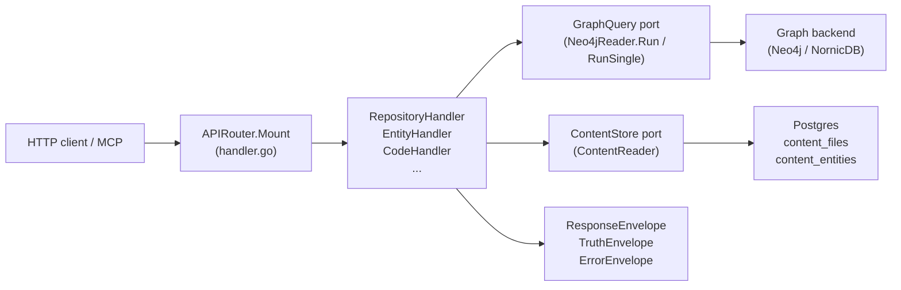
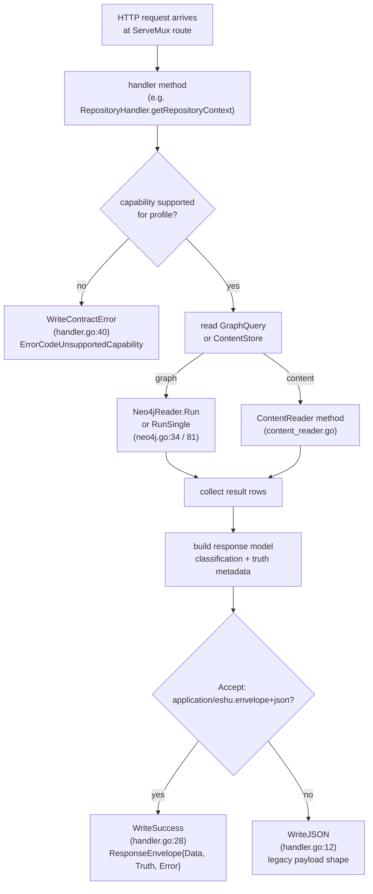

# internal/query

## Purpose

`internal/query` owns the HTTP read surface, OpenAPI assembly, response envelope
contract, and all read models that back the public Eshu query API. It defines the
`GraphQuery` and `ContentStore` ports through which every handler accesses the
graph and Postgres content store, and it enforces the capability matrix that
determines which queries are permitted under each runtime profile.
Code-quality routes also classify graph-derived findings before they reach
HTTP, MCP, or CLI callers; `code_quality.dead_code` returns candidate evidence,
language maturity, exclusions, and truth metadata instead of presenting a raw
Cypher scan as a cleanup list.

## Where this fits in the pipeline

## Internal flow

## Lifecycle / workflow

An HTTP request hits one of the routes registered by `APIRouter.Mount`
(`handler.go:125`). The handler method first checks whether the requested
capability is allowed for the current `QueryProfile` using `capabilityUnsupported`
(`handler.go:105`), which consults `capabilityMatrix` in `contract.go:127`. If
the profile does not support the capability, `WriteContractError` returns HTTP
501 with a structured `ErrorEnvelope` carrying `ErrorCodeUnsupportedCapability`,
the capability ID, and the `RequiredProfile`.

For permitted requests, the handler reads data through `GraphQuery` (for graph
traversals) or `ContentStore` (for Postgres content). `Neo4jReader.Run` and
`Neo4jReader.RunSingle` (`neo4j.go:34`, `neo4j.go:81`) open a read-only Neo4j
session, execute a Cypher query, and return `[]map[string]any` rows. Row values
are extracted via `StringVal`, `BoolVal`, `IntVal`, `StringSliceVal`
(`neo4j.go:120`). `ContentReader` methods (`content_reader.go:44`,
`content_reader_entity.go:13`) issue parametrized Postgres queries against
`content_files` and `content_entities`.
Code dead-code queries add an analysis pass over graph rows so parser-provided
`dead_code_root_kinds`, language maturity, test/generated exclusions, and
candidate classifications are visible in the response body. Unsupported
languages such as JSON package-script metadata are suppressed from cleanup
results before classification. Requests may include a `language` filter; SQL
uses that filter to scan `SqlFunction` candidates directly so mixed
application repositories cannot fill the page with earlier function labels
before SQL routine evidence is evaluated. The analysis block also names modeled framework
roots and Go semantic roots such as same-package direct method calls, imported
receiver method calls, generic constraint methods, fmt Stringer methods,
function-value references, and function-literal reachable calls. It also
reports JavaScript package exports,
Hapi-style handler exports, Next.js
exports, Express/Koa/Fastify/NestJS callbacks, Node migration exports,
TypeScript public API exports, public API re-exports, public type-reference
roots, module-contract exports, and TypeScript interface implementation methods.
It also suppresses parser-proven Python FastAPI, Flask, Celery,
Click, Typer, AWS Lambda handler, dataclass, post-init, property, dunder
protocol, `__all__`, package `__init__.py`, public API base, and public API
member roots, Python `if __name__ == "__main__"` script-main guards, and
Java `main`, constructor, `@Override`, Ant `Task` setter, Gradle plugin
`apply`, task action/property, task setter, task-interface method, public Gradle
DSL, same-class method-reference target roots, Spring component and callback
roots, Java lifecycle callbacks, JUnit test/lifecycle methods, Jenkins
extension and symbol roots, Jenkins initializer/data-bound setter methods, and
Stapler web methods. Java serialization hooks are suppressed from cleanup
candidates when their signatures match JVM runtime contracts, and the analysis
metadata now reports bounded Java reflection plus ServiceLoader and Spring
auto-configuration references as modeled reachability evidence. Rust roots from
parser metadata cover Cargo entrypoints, build scripts, unit tests, Tokio
runtime/test functions, exact `pub` public API items, benchmark functions
registered through parser evidence, and trait implementation methods. Rust
parser evidence also includes path-attribute modules, direct module resolution
status, literal macro-body module/import declarations, conditional derives,
nested annotations, and structured where-clause metadata.
Rust now shares the derived dead-code maturity tier with Go and Java while
exact Rust cleanup remains gated on broader semantic resolution. Rust
`benches/` and `examples/` files are treated as Cargo auxiliary targets rather
than production cleanup candidates; the same root kinds appear in
`modeled_framework_roots` so callers can explain the suppression. The analysis
payload also exposes `dead_code_language_exactness_blockers`, with Rust blockers
for unresolved macro expansion, cfg/Cargo feature selection, semantic module
resolution, and trait dispatch, plus SQL blockers for dynamic SQL,
dialect-specific routine resolution, and migration-order resolution. SQL
`SqlFunction` routines participate in the derived candidate scan, and the query
policy uses a batched exact graph incoming probe so reducer-written `EXECUTES`
edges protect trigger-bound routines without one graph round trip per routine.
Returned candidates can also populate
`dead_code_observed_exactness_blockers` so callers can distinguish language-wide
blockers from blockers actually present in the page they received. Candidates
that carry observed exactness blockers classify as `ambiguous` rather than
cleanup-ready `unused`.
Dead-code candidate paging uses `DeadCodeCandidateRows` in
`content_reader_dead_code_candidates.go:13` when the content read model is
available, pushing the optional language predicate into the Postgres query so
mixed repositories do not fill the bounded page with another language before
policy checks run. When `repo_id` is omitted, the same content-model scan stays
bounded and deterministic by ordering across repository, relative path, entity
name, and entity id instead of returning an empty page. Candidate
hydration then uses `GetEntityContents` in `content_reader_entity.go:49` so
large repo scans merge parser metadata in one bounded content-store read per
candidate page instead of one Postgres round trip per graph row.
The scanner de-duplicates entity IDs across candidate labels before hydration,
so multi-label graph rows do not inflate result counts or content-store reads.
Static TypeScript registry members are reported when parser metadata proves an
exported object registry holds the same-file function value. The analysis
payload names modeled root kinds in `modeled_framework_roots`, reports whether
reflection evidence is modeled, and counts how many suppressions came from
parser metadata. That lets MCP and CLI callers explain why a candidate was
suppressed. Candidate reads remain label-scoped and are repo-anchored when the
request supplies a repository id, then content-backed policy checks run before
completed reducer code-call and inheritance intent rows are checked for incoming
edges. Content-backed incoming-edge checks group candidates by repository before
calling the relational read model so repo-optional scans do not ask one
repository for another repository's entity ids. Exact one-entity graph probes
are avoided: `deadCodeResultsWithGraphIncomingEdges` in
`code_dead_code_scan.go:258` batches candidate ids into one graph read for
content stores without that relational read model and for SQL routine
reachability, whose reducer-owned `EXECUTES` edges are graph-written rather
than stored as completed shared-projection intent rows. Small display limits use a bounded
2,500-row scan window, so a narrow MCP request does not become incomplete just
because most raw candidates are later suppressed. The response separates
display truncation from bounded raw candidate-scan truncation so callers know
whether the returned page was clipped or the scan window was exhausted.

Both backends instrument every query with an OTEL span (`neo4j.query`,
`postgres.query`). Handlers that span multiple read stages use
`startQueryHandlerSpan` (`handler_tracing.go:16`) with a stable span name from
`telemetry.SpanQuery*` constants to attach route and capability attributes.
Repository and service read paths additionally emit stage-start/stage-done log
events via `repositoryQueryStageTimer` and `serviceQueryStageTimer`.

The response is written with `WriteSuccess` when the caller sends
`Accept: application/eshu.envelope+json`; this wraps the payload in a
`ResponseEnvelope` containing `data`, `truth` (`TruthEnvelope`), and `error`
fields. Without that header, `WriteJSON` emits the legacy payload directly.
`BuildTruthEnvelope` (`contract.go:411`) constructs the `TruthEnvelope`; it
panics if the capability string is not in `capabilityMatrix`.

## Exported surface

**Ports and adapters**

- `GraphQuery` — read-only graph port: `Run` and `RunSingle`; implemented by
  `Neo4jReader` (`ports.go:9`)
- `ContentStore` — Postgres content port: file, entity, and catalog reads;
  implemented by `ContentReader` (`ports.go:14`)
- `Neo4jReader` — concrete graph adapter; satisfies `GraphQuery` (`neo4j.go:18`)
- `ContentReader` — concrete Postgres content adapter; satisfies `ContentStore`
  (`content_reader.go:16`)
- `PostgresIaCReachabilityStore` — reducer-materialized IaC cleanup findings
  (`iac_reachability_store.go`)
- `IaCReachabilityStore` — port for IaC cleanup findings (`iac.go:62`)

**Handler structs**

- `APIRouter` — top-level mux; call `Mount` to register all routes
  (`handler.go:110`)
- `RepositoryHandler` — `GET /api/v0/repositories*` routes (`repository.go:21`)
- `EntityHandler` — entity resolution and workload/service context routes
  (`entity.go:11`)
- `CodeHandler` — code search, relationships, dead-code, complexity, call-chain
  (`code.go:11`)
- `ContentHandler` — file and entity content reads (`content_handler.go:11`)
- `InfraHandler` — infrastructure resource and relationship routes (`infra.go:12`)
  including Terraform backend, import, moved, removed, check, and lockfile
  provider entity labels when they have been projected
- `IaCHandler` — IaC quality dead-code routes (`iac.go:22`)
- `ImpactHandler` — blast radius, change surface, deployment trace, dependency
  paths (`impact.go:11`)
- `EvidenceHandler` — relationship evidence drilldown (`evidence.go:14`)
- `DocumentationHandler` — documentation truth findings and evidence packets
  (`documentation.go`)
- `StatusHandler` — pipeline and ingester status routes (`status.go:14`)
- `CompareHandler` — environment comparison (`compare.go:12`)
- `AdminHandler` — work-item inspection, replay, dead-letter, backfill, reindex
  (`admin.go:153`)

**Response contract types**

- `ResponseEnvelope` — top-level wire envelope: `Data`, `Truth`, `Error`
  (`contract.go:108`)
- `TruthEnvelope` — truth metadata: `Level`, `Capability`, `Profile`, `Basis`,
  `Backend`, `Freshness`, `Reason` (`contract.go:75`)
- `TruthFreshness` — freshness state and observation timestamp (`contract.go:69`)
- `ErrorEnvelope` — structured error: `Code`, `Message`, `Capability`,
  `Profiles` (`contract.go:101`)
- `ErrorCode`, `TruthLevel`, `TruthBasis`, `FreshnessState`, `QueryProfile`,
  `GraphBackend` — typed string constants (`contract.go`)

**Handler helpers**

- `WriteJSON`, `WriteError`, `WriteSuccess`, `WriteContractError` — uniform
  response writers (`handler.go`)
- `ReadJSON`, `QueryParam`, `QueryParamInt`, `PathParam` — request parsing
  helpers (`handler.go`)
- `AuthMiddleware` — bearer-token middleware used by `cmd/api` (`auth.go:30`)
- `BuildTruthEnvelope` — builds a `TruthEnvelope` from profile, capability, and
  basis; panics on unknown capability (`contract.go:412`)
- `ParseQueryProfile`, `NormalizeQueryProfile`, `ParseGraphBackend` — input
  validation helpers (`contract.go`)

**OpenAPI**

- `OpenAPISpec()` — concatenates eleven `openapi_paths_*.go` fragments and
  `openAPIComponents` into one JSON string (`openapi.go:49`)
- `ServeOpenAPI`, `ServeSwaggerUI`, `ServeReDoc` — HTTP handlers for
  `/api/v0/openapi.json`, `/api/v0/docs`, `/api/v0/redoc` (`openapi.go`)

**Graph row helpers**

- `StringVal`, `BoolVal`, `IntVal`, `StringSliceVal`, `RepoRefFromRow`,
  `RepoProjection` — safe Neo4j result-row extractors (`neo4j.go`)

See `doc.go` for the full godoc contract.

## Dependencies

- `internal/buildinfo` — `AppVersion()` embedded in the OpenAPI spec
- `internal/contentrefs` — content reference utilities used in content query paths
- `internal/iacreachability` — IaC reachability row types consumed by
  `PostgresIaCReachabilityStore`
- `internal/parser` — entity and language classification constants used for
  dead-code root detection
- `internal/recovery` — `RecoveryService` port satisfied by `recovery.Handler`;
  wired into `AdminHandler.Recovery`
- `internal/status` — `status.Reader` consumed by `StatusHandler.StatusReader`
- `internal/storage/postgres` — status store and recovery store adapters;
  query handlers never import concrete Postgres drivers directly — they go through
  `ContentStore`
- `internal/telemetry` — `EventAttr`, `DefaultServiceNamespace`, span constants
  `SpanQueryRelationshipEvidence`, `SpanQueryDeadIaC`, `SpanQueryInfraResourceSearch`

Handlers depend on the `GraphQuery` and `ContentStore` ports, not on
`neo4jdriver.DriverWithContext` or `*sql.DB` directly. `Neo4jReader` and
`ContentReader` are the only concrete types that touch drivers, and they are
wired in `cmd/api/wiring.go`, not here.

## Telemetry

- Spans: `telemetry.SpanQueryRelationshipEvidence` (`query.relationship_evidence`)
  on evidence drilldown (`evidence.go:43`);
  `telemetry.SpanQueryDocumentationFindings`
  (`query.documentation_findings`),
  `telemetry.SpanQueryDocumentationEvidencePacket`
  (`query.documentation_evidence_packet`), and
  `telemetry.SpanQueryDocumentationPacketFreshness`
  (`query.documentation_packet_freshness`) on documentation truth evidence
  routes (`documentation.go`); `telemetry.SpanQueryDeadIaC` (`query.dead_iac`)
  on IaC dead-code queries (`iac.go`); `telemetry.SpanQueryInfraResourceSearch`
  (`query.infra_resource_search`) on infrastructure search (`infra.go`).
  Per-query spans `neo4j.query` and `postgres.query` on every graph and content
  read.
- Metrics: `eshu_dp_neo4j_query_duration_seconds` and
  `eshu_dp_postgres_query_duration_seconds` (instruments live in
  `internal/telemetry/instruments.go`).
- Log events: `repository_query.stage_started`, `repository_query.stage_completed`
  (via `repositoryQueryStageTimer`); `service_query.stage_started`,
  `service_query.stage_completed` (via `serviceQueryStageTimer`). Both emit
  `operation`, `stage`, `repo_id`, and `duration_seconds`.

## Operational notes

- High latency on `GET /api/v0/repositories/{repo_id}/context` or story routes:
  check the `repository_query.stage_completed` log events for the slow stage
  (`graph_lookup`, `content_hydration`, etc.) before assuming the graph backend
  is the problem.
- `eshu_dp_neo4j_query_duration_seconds` rising across many routes: check graph
  backend health and query plan; do not raise handler timeouts before confirming
  the Cypher query itself is the bottleneck.
- 501 responses with `error.code=unsupported_capability`: the requested
  operation requires a higher `QueryProfile`. Code-only graph capabilities and
  platform-impact queries start at `local_authoritative`; `local_full_stack`
  uses the same handlers with the Compose runtime shape. Check
  `truth.profiles.required` in the response envelope for the minimum profile,
  then verify the ESHU_QUERY_PROFILE env var in the running API.
- `OpenAPISpec()` panics at startup if a handler calls `BuildTruthEnvelope` with
  a capability string not in `capabilityMatrix` (`contract.go:412`). Add missing
  capability IDs to `capabilityMatrix` before shipping new handlers.
- `code_quality.dead_code` is a derived query unless the language maturity row
  says otherwise. Handler changes must preserve `classification`,
  `dead_code_language_maturity`, and `analysis` fields so MCP and CLI callers
  can distinguish actionable unused symbols from excluded or ambiguous ones.
  Go root-kind evidence covers function roots and type roots, including
  `go.dependency_injection_callback`, `go.direct_method_call`,
  `go.fmt_stringer_method`, `go.function_literal_reachable_call`,
  `go.function_value_reference`, `go.generic_constraint_method`,
  `go.imported_direct_method_call`, `go.imported_fmt_stringer_method`,
  `go.interface_implementation_type`, `go.interface_method_implementation`,
  `go.interface_type_reference`, `go.method_value_reference`, and
  `go.type_reference`. JavaScript-family
  analysis must list Node package, CommonJS default export, CommonJS mixin,
  Next.js, Node migration, Hapi-style, TypeScript public API, TypeScript
  module-contract, and TypeScript interface implementation roots, plus Java
  main, constructor, override, Ant `Task` setter, Gradle plugin `apply`, task
  action/property, and public Gradle DSL roots when query policy suppresses
  those candidates; the analysis notes name the same Java root family. Rust
  parser-backed root,
  syntax-evidence, and observed-blocker rows must stay aligned with the
  `deadCodeLanguageMaturity` table because Rust derived classification depends
  on that maturity row, the root suppression policy, and ambiguous
  classification for exactness-blocked candidates.
  The handler scans raw content-model or graph candidates in bounded
  label-scoped pages before policy exclusions, pushes any requested language
  filter into the candidate query, then checks completed reducer code-call
  intent rows for incoming edges on the remaining candidates and uses a
  2,500-row scan window for small result limits. It reports
  `candidate_scan_pages` plus `candidate_scan_rows`.
  `display_truncated` and `candidate_scan_truncated` must stay separate so
  performance bounds do not blur result-list pagination with raw scan coverage.
  Unsupported language metadata and repository-root
  `test/`, `tests/`, and `__tests__/` paths stay out of default cleanup results.
- Content reads return `source_backend=unavailable` when Postgres does not have
  a cached row for the requested file. This is not a Postgres error; the ingester
  has not yet written content for that scope.
- `AuthMiddleware` (`auth.go`) skips auth only when the resolved token is empty
  (dev mode) or the path is in `publicHTTPPaths`. Adding new public routes
  requires updating the `publicHTTPPaths` map.

## Extension points

- `GraphQuery` — implement this interface to add a new graph adapter; no handler
  code branches on the backend brand.
- `ContentStore` — implement this interface to swap the Postgres content reader
  for a different backing store.
- `IaCReachabilityStore` — implement this interface for custom IaC reachability
  sources; `PostgresIaCReachabilityStore` is the only shipped implementation.
- `AdminStore` — implement this interface to redirect admin queue operations to
  a different storage layer.
- OpenAPI fragments — add a new `openapi_paths_*.go` file and reference it in
  `OpenAPISpec()` (`openapi.go:55`); the concatenation order determines the JSON
  path order in the served schema.

Do not add `if graphBackend == "nornicdb"` branches in handler code. Backend
dialect differences belong in `internal/storage/cypher` adapters behind the
`GraphQuery` port.

## Gotchas / invariants

- `BuildTruthEnvelope` panics if `capability` is not in `capabilityMatrix`
  (`contract.go:412`). All capability strings used in handlers must be registered
  in that map before the handler can be called safely.
- The unexported `capabilityUnsupported` returns true when `maxTruthLevel` returns
  `nil` for the current profile; a nil max-truth means the capability is
  explicitly unsupported at that profile level. `APIRouter` and every handler that
  gates on capability call this helper (`handler.go:105`, `contract.go:127`).
- `Neo4jReader` opens a new session per query by calling `NewSession` on the
  driver (`neo4j.go:50`); the session is closed in a `defer`. Do not hold
  sessions across multiple queries in the same handler.
- `ContentReader` traces each Postgres call with an OTEL span labeled
  `db.sql.table`; queries that scan multiple tables need per-call spans to avoid
  misleading attribution (`content_reader.go:45`).
- `WriteSuccess` branches on `acceptsEnvelope(r)` at `handler.go:29`; callers
  that do not send `Accept: application/eshu.envelope+json` receive the legacy
  payload shape. MCP tool dispatch relies on the envelope format; do not break
  this negotiation logic.
- The OpenAPI spec is assembled from string fragments in Go source, not from
  runtime reflection. When a handler changes its request or response shape,
  update the matching `openapi_paths_*.go` fragment in the same PR.

## Related docs

- `docs/docs/reference/http-api.md` — canonical HTTP API contract; must stay in
  lockstep with handler behavior and OpenAPI fragments
- `docs/docs/architecture.md` — capability ports section and API service boundary
- `docs/docs/adrs/2026-04-18-query-time-service-enrichment-gap.md` — service
  enrichment patterns
- `docs/docs/adrs/2026-04-22-nornicdb-graph-backend-candidate.md` — backend
  selection and `ParseGraphBackend` defaults
- `specs/capability-matrix.v1.yaml` — machine-readable capability matrix that
  `capabilityMatrix` (contract.go) must match
