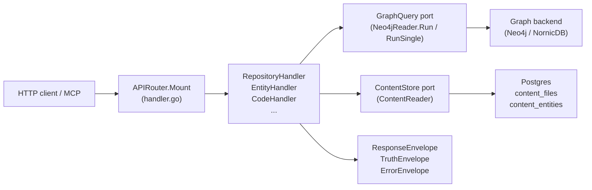
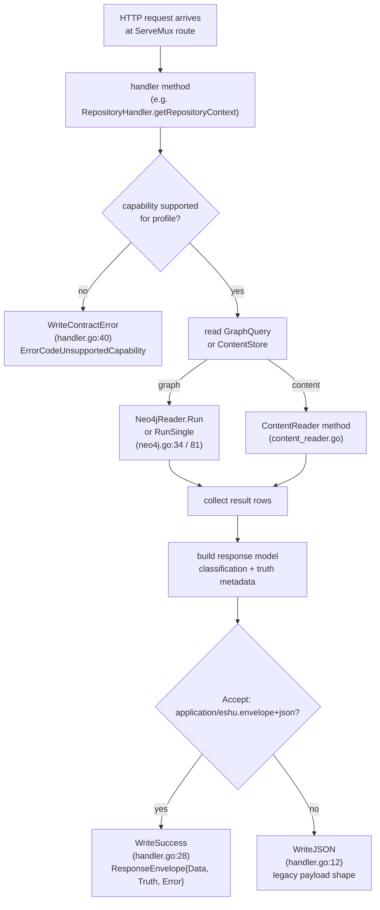

# internal/query

## Purpose

`internal/query` owns the HTTP read surface, OpenAPI assembly, response envelope
contract, and all read models that back the public Eshu query API. It defines the
`GraphQuery` and `ContentStore` ports through which every handler accesses the
graph and Postgres content store, and it enforces the capability matrix that
determines which queries are permitted under each runtime profile.
Code-quality routes also classify graph-derived findings before they reach
HTTP, MCP, or CLI callers; `code_quality.dead_code` returns candidate evidence,
language maturity, exclusions, and truth metadata instead of presenting a raw
Cypher scan as a cleanup list.

## Where this fits in the pipeline

## Internal flow

## Lifecycle / workflow

An HTTP request hits one of the routes registered by `APIRouter.Mount`
(`handler.go:125`). The handler method first checks whether the requested
capability is allowed for the current `QueryProfile` using `capabilityUnsupported`
(`handler.go:105`), which consults `capabilityMatrix` in `contract.go:134`. If
the profile does not support the capability, `WriteContractError` returns HTTP
501 with a structured `ErrorEnvelope` carrying `ErrorCodeUnsupportedCapability`,
the capability ID, and the `RequiredProfile`.

For permitted requests, the handler reads data through `GraphQuery` (for graph
traversals) or `ContentStore` (for Postgres content). `Neo4jReader.Run` and
`Neo4jReader.RunSingle` (`neo4j.go:34`, `neo4j.go:81`) open a read-only Neo4j
session, execute a Cypher query, and return `[]map[string]any` rows. Row values
are extracted via `StringVal`, `BoolVal`, `IntVal`, `StringSliceVal`
(`neo4j.go:120`). `ContentReader` methods (`content_reader.go:44`,
`content_reader_entity.go:13`) issue parametrized Postgres queries against
`content_files` and `content_entities`.

Read-model details stay package-local but out of the top-level index:

- [read-models.md](read-models.md) covers entity-map traversal, package
  registry bounds, CI/CD, service catalog, Kubernetes, and observability
  coverage correlations, supply-chain read models, OCI deployment trace
  enrichment, and
  investigation-route read models.
- [dead-code-reachability.md](dead-code-reachability.md) covers dead-code
  language reachability, exactness blockers, candidate paging, hydration,
  observed blockers, and the language-specific suppression contract.

At the package boundary, all query routes stay anchored, bounded, and explicit
about truth level. Graph reads go through `GraphQuery`, content reads go through
`ContentStore`, and response models keep provenance-only evidence separate from
canonical graph or reducer truth.

## Exported surface

**Ports and adapters**

- `GraphQuery` — read-only graph port: `Run` and `RunSingle`; implemented by
  `Neo4jReader` (`ports.go:9`)
- `ContentStore` — Postgres content port: file, entity, and catalog reads;
  implemented by `ContentReader` (`ports.go:14`)
- `Neo4jReader` — concrete graph adapter; satisfies `GraphQuery` (`neo4j.go:18`)
- `ContentReader` — concrete Postgres content adapter; satisfies `ContentStore`
  (`content_reader.go:16`)
- `PostgresIaCReachabilityStore` — reducer-materialized IaC cleanup findings
  (`iac_reachability_store.go`)
- `IaCReachabilityStore` — port for IaC cleanup findings (`iac.go:74`)
- `SupplyChainImpactReadinessStore` — port for bounded readiness counts and
  scoped package-registry metadata freshness
  (`supply_chain_impact_readiness.go`)
- `PostgresSupplyChainImpactReadinessStore` — Postgres-backed readiness store
  that runs one bounded CTE per impact-findings response, surfaces
  vulnerability source-cache snapshot metadata and package-registry metadata
  freshness for package/repository scopes, and strips absent optional fields
  from the JSON rollup
  (`supply_chain_impact_readiness_postgres.go`)
- `AdvisoryEvidenceStore` — port for source-only vulnerability advisory
  evidence grouped by canonical CVE/GHSA/OSV/NVD identity without implying
  impact (`supply_chain_advisory_evidence.go`)
- `PostgresAdvisoryEvidenceStore` — Postgres-backed source fact read model
  for `GET /api/v0/supply-chain/advisories/evidence`
  (`supply_chain_advisory_evidence.go`)
- `SupplyChainImpactExplanationStore` — port for one-finding supply-chain
  impact explanations that hydrate only referenced evidence fact IDs
  (`supply_chain_impact_explain.go`)
- `PostgresSupplyChainImpactFindingStore` — also implements the explanation
  port by reading exactly one active reducer impact finding and its referenced
  evidence facts (`supply_chain_impact_explain_postgres.go`)
- `SecurityAlertReconciliationStore` — port for reducer-owned provider alert
  comparison rows, including partial provider-source freshness from capped
  open-alert collection (`security_alert_reconciliation.go`)
- `PostgresSecurityAlertReconciliationStore` — Postgres-backed security alert
  reconciliation read model for bounded API/MCP reads; default pages select one
  current row per provider alert identity before state/status filters and
  cursor pagination (`security_alert_reconciliation.go`)
- `SupplyChainImpactFindingRow` — reducer-owned vulnerability impact finding
  row that keeps `observed_version`, `requested_range`, `fixed_version`, and
  `match_reason` separate so API and MCP clients can explain version matching
  without collapsing range-only, unsupported, malformed, affected, and
  known-fixed states. Legacy rows without an explicit detection profile are
  backfilled as precise only for supported exact-version match reasons,
  including npm, NuGet, Cargo, Maven, and Swift paths. Every row carries a
  `Suppression` block decoded from the
  reducer's VEX/operator-policy decision so the `include_suppressed` toggle
  and `suppression_state` filter on
  `GET /api/v0/supply-chain/impact/findings` can hide, surface, and explain
  not-affected, accepted-risk, false-positive, ignored, expired,
  provider-dismissed, and scope-mismatched findings without losing the
  authoring source, justification, author, timestamps, evidence reference, or
  VEX document/statement IDs. Every row also carries a `VulnerableRange`
  string copied from the advisory the reducer's provenance selector picked
  and persisted on the canonical finding payload, so list responses expose
  the same expression as the explain route. Every row also carries a
  `Remediation` block (issue #595) with the installed version, vulnerable
  range, first patched version, every published fixed-version branch,
  manifest range, manifest_allows_fix tri-state, direct/transitive
  designation, parent_package required for transitive upgrades,
  ecosystem, an exact|partial|unknown confidence label, and a closed
  reason enum so API and MCP callers can explain the advisory-only
  safe-upgrade path without re-reading raw advisory or lockfile facts.
  Reason codes include both first-class missing-evidence outcomes —
  `installed_version_missing` (multi-branch advisory + no parseable
  observed version) and `installed_version_malformed` — and the
  upgrade-decision reasons. Older rows that predate remediation
  computation expose a nil `Remediation`; callers must treat that as
  "no remediation computed yet," not "no fix available."

**Handler structs**

- `APIRouter` — top-level mux; call `Mount` to register all routes
  (`handler.go:110`)
- `RepositoryHandler` — `GET /api/v0/repositories*` routes (`repository.go:21`)
- `EntityHandler` — entity resolution, workload/service context routes, service dossier stories, and service investigation coverage (`entity.go:11`, `service_story_handler.go:9`, `service_investigation.go:17`)
- `CodeHandler` — code search, symbol lookup, structural inventory, import
  dependency investigation, call graph metrics, relationships, relationship
  stories, redacted hardcoded-secret investigation in `code_security_secrets.go`,
  dead-code, complexity, call-chain (`code.go:11`)
- `ContentHandler` — file and entity content reads (`content_handler.go:11`)
- `InfraHandler` — infrastructure resource and relationship routes (`infra.go:12`)
  including Terraform backend, import, moved, removed, check, and lockfile
  provider entity labels when they have been projected
- `IaCHandler` — IaC quality and AWS management routes (`iac.go:22`,
  `iac_management.go`, `iac_management_surface.go`, `iac_import_plan.go`)
  - `IaCManagementFindingRow` is the stable read model for AWS-backed IaC
    management status. It exposes the full #124 taxonomy, matched Terraform
    state/config handles, other-IaC ownership hints, service and environment
    candidates, dependency paths, warning flags, missing evidence, and
    provenance evidence atoms. Raw tag evidence remains provenance-only and
    does not promote ownership, service, or environment truth. Sensitive
    tag/evidence values are redacted before the row leaves the query layer, and
    `safety_gate` names review-required findings plus refused follow-up actions
    such as Terraform import-plan generation.
  - Terraform import-plan candidates are read-only response shaping over the
    same bounded active findings. They generate Terraform `import` blocks only
    for safety-approved supported cloud-only resources and return refused
    candidates for ambiguous, sensitive, stale, state-only, or unsupported rows.
- `ImpactHandler` — blast radius, change surface, deployment trace, resource
  investigation, dependency paths (`impact.go:11`)
- `EvidenceHandler` — relationship evidence drilldown and bounded citation
  packet hydration; citation packets reject more than 500 input handles and
  hydrate at most 50 citations per call (`evidence.go`, `evidence_citation.go`)
- `DocumentationHandler` — collected documentation facts, documentation truth
  findings, and evidence packets (`documentation.go`, `documentation_facts.go`)
- `SupplyChainHandler` — SBOM attachment, image identity, source-only advisory
  evidence, impact finding, and one-finding impact explanation routes
  (`supply_chain.go`)
- `StatusHandler` — pipeline and ingester status routes (`status.go:14`)
- `CompareHandler` — environment comparison (`compare.go:12`) with the
  story-packet helpers in `compare_story.go`
- `AdminHandler` — work-item inspection, replay, dead-letter, backfill, reindex
  (`admin.go:153`)

**Response contract types**

- `ResponseEnvelope` — top-level wire envelope: `Data`, `Truth`, `Error`
  (`contract.go:108`)
- `TruthEnvelope` — truth metadata: `Level`, `Capability`, `Profile`, `Basis`,
  `Backend`, `Freshness`, `Reason` (`contract.go:75`)
- `TruthFreshness` — freshness state and observation timestamp (`contract.go:69`)
- `ErrorEnvelope` — structured error: `Code`, `Message`, `Capability`,
  `Profiles` (`contract.go:101`)
- `ErrorCode`, `TruthLevel`, `TruthBasis`, `FreshnessState`, `QueryProfile`,
  `GraphBackend` — typed string constants (`contract.go`)

**Handler helpers**

- `WriteJSON`, `WriteError`, `WriteSuccess`, `WriteContractError` — uniform
  response writers (`handler.go`)
- `ReadJSON`, `QueryParam`, `QueryParamInt`, `PathParam` — request parsing
  helpers (`handler.go`)
- `AuthMiddleware` — bearer-token middleware used by `cmd/api` (`auth.go:30`)
- `BuildTruthEnvelope` — builds a `TruthEnvelope` from profile, capability, and
  basis; panics on unknown capability (`contract.go:547`)
- `ParseQueryProfile`, `NormalizeQueryProfile`, `ParseGraphBackend` — input
  validation helpers (`contract.go`)

**OpenAPI**

- `OpenAPISpec()` — concatenates twelve `openapi_paths_*.go` fragments and
  `openAPIComponents` into one JSON string (`openapi.go:49`); security prompt
  routes live in `openapi_paths_code_security.go`
- `ServeOpenAPI`, `ServeSwaggerUI`, `ServeReDoc` — HTTP handlers for
  `/api/v0/openapi.json`, `/api/v0/docs`, `/api/v0/redoc` (`openapi.go`)

**Graph row helpers**

- `StringVal`, `BoolVal`, `IntVal`, `StringSliceVal`, `RepoRefFromRow`,
  `RepoProjection` — safe Neo4j result-row extractors (`neo4j.go`)

See `doc.go` for the full godoc contract.

## Dependencies

- `internal/buildinfo` — `AppVersion()` embedded in the OpenAPI spec
- `internal/contentrefs` — content reference utilities used in content query paths
- `internal/iacreachability` — IaC reachability row types consumed by
  `PostgresIaCReachabilityStore`
- `internal/parser` — entity and language classification constants used for
  dead-code root detection
- `internal/recovery` — `RecoveryService` port satisfied by `recovery.Handler`;
  wired into `AdminHandler.Recovery`
- `internal/status` — `status.Reader` consumed by `StatusHandler.StatusReader`
- `internal/storage/postgres` — status, recovery, IaC reachability, and AWS
  runtime drift finding adapters; query handlers never import concrete
  Postgres drivers directly — they go through query package adapters and ports
- `internal/telemetry` — `EventAttr`, `DefaultServiceNamespace`, span constants
  `SpanQueryRelationshipEvidence`, `SpanQueryDeadIaC`,
  `SpanQueryIaCUnmanagedResources`, `SpanQueryIaCTerraformImportPlan`, `SpanQueryInfraResourceSearch`, `SpanQueryCodeTopicInvestigation`,
  `SpanQueryHardcodedSecretInvestigation`, `SpanQueryDeadCodeInvestigation`,
  `SpanQueryChangeSurfaceInvestigation`

Handlers depend on the `GraphQuery` and `ContentStore` ports, not on
`neo4jdriver.DriverWithContext` or `*sql.DB` directly. `Neo4jReader` and
`ContentReader` are the only concrete types that touch drivers, and they are
wired in `cmd/api/wiring.go`, not here.

## Telemetry

- Spans: `telemetry.SpanQueryRelationshipEvidence` (`query.relationship_evidence`)
  on evidence drilldown and `telemetry.SpanQueryEvidenceCitationPacket`
  (`query.evidence_citation_packet`) on citation packet hydration;
  `telemetry.SpanQueryDocumentationFindings`
  (`query.documentation_findings`),
  `telemetry.SpanQueryDocumentationFacts`
  (`query.documentation_facts`),
  `telemetry.SpanQueryDocumentationEvidencePacket`
  (`query.documentation_evidence_packet`), and
  `telemetry.SpanQueryDocumentationPacketFreshness`
  (`query.documentation_packet_freshness`) on documentation truth evidence
  routes (`documentation.go`); `telemetry.SpanQueryCodeTopicInvestigation`
  (`query.code_topic_investigation`) on broad code-topic investigation
  (`code_topic.go`); `telemetry.SpanQueryHardcodedSecretInvestigation`
  (`query.hardcoded_secret_investigation`) on redacted hardcoded-secret
  investigation (`code_security_secrets.go`);
  `telemetry.SpanQueryDeadCodeInvestigation`
  (`query.dead_code_investigation`) on dead-code investigation
  (`code_dead_code_investigation.go`); `telemetry.SpanQueryChangeSurfaceInvestigation`
  (`query.change_surface_investigation`) on change-surface investigation;
  `telemetry.SpanQueryResourceInvestigation`
  (`query.resource_investigation`) on resource investigation;
  `telemetry.SpanQueryDeadIaC` (`query.dead_iac`)
  on IaC dead-code queries (`iac.go`); `telemetry.SpanQueryIaCUnmanagedResources`
  (`query.iac_unmanaged_resources`) on AWS management finding list queries,
  `telemetry.SpanQueryIaCManagementStatus` (`query.iac_management_status`) on
  exact status reads, and `telemetry.SpanQueryIaCManagementExplanation`
  (`query.iac_management_explanation`) on grouped evidence explanations;
  `telemetry.SpanQueryIaCTerraformImportPlan`
  (`query.iac_terraform_import_plan`) on read-only Terraform import-plan
  candidate generation; `telemetry.SpanQueryAWSRuntimeDriftFindings`
  (`query.aws_runtime_drift_findings`) on active AWS runtime drift finding
  reads;
  `telemetry.SpanQuerySupplyChainImpactExplanation`
  (`query.supply_chain_impact_explanation`) on one-finding vulnerability
  explanations;
  `telemetry.SpanQueryInfraResourceSearch`
  (`query.infra_resource_search`) on infrastructure search (`infra.go`).
  Per-query spans `neo4j.query` and `postgres.query` on every graph and content
  read.
- Metrics: `eshu_dp_neo4j_query_duration_seconds` and
  `eshu_dp_postgres_query_duration_seconds` (instruments live in
  `internal/telemetry/instruments.go`).
- Log events: `repository_query.stage_started`, `repository_query.stage_completed`
  (via `repositoryQueryStageTimer`); `service_query.stage_started`,
  `service_query.stage_completed` (via `serviceQueryStageTimer`). Both emit
  `operation`, `stage`, `repo_id`, and `duration_seconds`.

## Operational notes

- High latency on `GET /api/v0/repositories/{repo_id}/context` or story routes:
  check the `repository_query.stage_completed` log events for the slow stage
  (`graph_lookup`, `content_hydration`, etc.) before assuming the graph backend
  is the problem.
- `eshu_dp_neo4j_query_duration_seconds` rising across many routes: check graph
  backend health and query plan; do not raise handler timeouts before confirming
  the Cypher query itself is the bottleneck.
- 501 responses with `error.code=unsupported_capability`: the requested
  operation requires a higher `QueryProfile`. Code-only graph capabilities and
  platform-impact queries start at `local_authoritative`; `local_full_stack`
  uses the same handlers with the Compose runtime shape. Check
  `truth.profiles.required` in the response envelope for the minimum profile,
  then verify the ESHU_QUERY_PROFILE env var in the running API.
- `OpenAPISpec()` panics at startup if a handler calls `BuildTruthEnvelope` with
  a capability string not in `capabilityMatrix` (`contract.go:547`). Add missing
  capability IDs to `capabilityMatrix` before shipping new handlers.
- `code_quality.dead_code` is a derived query unless the language maturity row
  says otherwise. Handler changes must preserve `classification`,
  `dead_code_language_maturity`, and `analysis` fields so MCP and CLI callers
  can distinguish actionable unused symbols from excluded or ambiguous ones.
  Go root-kind evidence covers function roots and type roots, including
  `go.dependency_injection_callback`, `go.direct_method_call`,
  `go.fmt_stringer_method`, `go.function_literal_reachable_call`,
  `go.function_value_reference`, `go.generic_constraint_method`,
  `go.imported_direct_method_call`, `go.imported_fmt_stringer_method`,
  `go.interface_implementation_type`, `go.interface_method_implementation`,
  `go.interface_type_reference`, `go.method_value_reference`, and
  `go.type_reference`. JavaScript-family
  analysis must list Node package, CommonJS default export, CommonJS mixin,
  Next.js, Node migration, Hapi-style, TypeScript public API, TypeScript
  module-contract, and TypeScript interface implementation roots, plus Java
  main, constructor, override, Ant Task setter, Gradle plugin `apply`, task
  action/property, and public Gradle DSL roots when query policy suppresses
  those candidates, plus Swift parser-backed roots when query policy suppresses
  those candidates; the analysis notes name the same Java and C root families.
  Rust parser-backed root,
  syntax-evidence, and observed-blocker rows must stay aligned with the
  `deadCodeLanguageMaturity` table because Rust derived classification depends
  on that maturity row, the root suppression policy, and ambiguous
  classification for exactness-blocked candidates.
  The handler scans raw content-model or graph candidates in bounded
  label-scoped pages before policy exclusions, pushes any requested language
  filter into the candidate query, then checks completed reducer code-call
  intent rows for incoming edges on the remaining candidates and uses a
  2,500-row scan window for small result limits. It reports
  `candidate_scan_pages` plus `candidate_scan_rows`.
  `display_truncated` and `candidate_scan_truncated` must stay separate so
  performance bounds do not blur result-list pagination with raw scan coverage.
  Unsupported language metadata and repository-root
  `test/`, `tests/`, and `__tests__/` paths stay out of default cleanup results.
- Hardcoded-secret investigation applies test, fixture, example, and placeholder
  suppression inside the Postgres query before `LIMIT` and `OFFSET`
  (`content_reader_security_secrets.go`). The SQL predicate and Go suppression
  notes both derive from `hardcodedSecretSuppressionRules`, and
  `code_security_secrets.go` treats the returned content-store rows as the
  already-paged result window; do not move suppression back into either Go row
  loop, because that makes `truncated` and offset paging describe the
  pre-suppression row set instead of the visible results.
- Content reads return `source_backend=unavailable` when Postgres does not have
  a cached row for the requested file. This is not a Postgres error; the ingester
  has not yet written content for that scope.
- `AuthMiddleware` (`auth.go`) skips auth only when the resolved token is empty
  (dev mode) or the path is in `publicHTTPPaths`. Adding new public routes
  requires updating the `publicHTTPPaths` map.

## Extension points

- `GraphQuery` — implement this interface to add a new graph adapter; no handler
  code branches on the backend brand.
- `ContentStore` — implement this interface to swap the Postgres content reader
  for a different backing store.
- `IaCReachabilityStore` — implement this interface for custom IaC reachability
  sources; `PostgresIaCReachabilityStore` is the only shipped implementation.
- `AdminStore` — implement this interface to redirect admin queue operations to
  a different storage layer.
- OpenAPI fragments — add a new `openapi_paths_*.go` file and reference it in
  `OpenAPISpec()` (`openapi.go:55`); the concatenation order determines the JSON
  path order in the served schema.

Do not add `if graphBackend == "nornicdb"` branches in handler code. Backend
dialect differences belong in `internal/storage/cypher` adapters behind the
`GraphQuery` port.

## Gotchas / invariants

- `BuildTruthEnvelope` panics if `capability` is not in `capabilityMatrix`
  (`contract.go:547`). All capability strings used in handlers must be registered
  in that map before the handler can be called safely.
- The unexported `capabilityUnsupported` returns true when `maxTruthLevel` returns
  `nil` for the current profile; a nil max-truth means the capability is
  explicitly unsupported at that profile level. `APIRouter` and every handler that
  gates on capability call this helper (`handler.go:105`, `contract.go:134`).
- `Neo4jReader` opens a new session per query by calling `NewSession` on the
  driver (`neo4j.go:50`); the session is closed in a `defer`. Do not hold
  sessions across multiple queries in the same handler.
- `ContentReader` traces each Postgres call with an OTEL span labeled
  `db.sql.table`; queries that scan multiple tables need per-call spans to avoid
  misleading attribution (`content_reader.go:45`).
- Repository-language inventory reads use the Postgres content index through
  `CountRepositoriesByLanguage`, `ListRepositoriesByLanguage`, and
  `RepositoryLanguageInventory`. The API and MCP contract is count-first and
  paged so "how many TypeScript repos?" does not require per-repository
  coverage fan-out.
- `queryContentStoreCoverage` uses `ContentReader.RepositoryCoverage` as the
  bounded count source when content rows are available. The graph count in
  `queryRepositoryGraphCoverageStats` is a no-content fallback, so
  `graph_gap_count` and `content_gap_count` stay zero when graph parity was not
  checked.
- `WriteSuccess` branches on `acceptsEnvelope(r)` at `handler.go:29`; callers
  that do not send `Accept: application/eshu.envelope+json` receive the legacy
  payload shape. MCP tool dispatch relies on the envelope format; do not break
  this negotiation logic.
- The OpenAPI spec is assembled from string fragments in Go source, not from
  runtime reflection. When a handler changes its request or response shape,
  update the matching `openapi_paths_*.go` fragment in the same PR.

## Related docs

- [read-models.md](read-models.md) for route-specific read-model bounds,
  evidence, and investigation-route contracts.
- [dead-code-reachability.md](dead-code-reachability.md) for dead-code language
  roots, exactness blockers, and candidate paging rules.
- `docs/public/reference/http-api.md` for the public HTTP and envelope contract.
- `docs/public/reference/dead-code-reachability-spec.md` for the dead-code
  language maturity contract.

## Package registry aggregate hot-path evidence (#689)

The graph-backed package-registry aggregate (`package_registry_aggregates.go`,
`package_registry_aggregates_handler.go`) is the first aggregate in this
package that emits Cypher rather than SQL, so `scripts/verify-performance-evidence.sh`
flags the file via its hot-path-by-content check. The Cypher follows the
NornicDB-New hot-path query cookbook Area 5 "Grouped Count" and
`PatternOutgoingCountAgg` shapes verbatim: `MATCH (p:Package) WHERE
p.<indexed_prop> = $value RETURN coalesce(p.<group>, 'unknown') AS bucket,
count(p) AS bucket_count ORDER BY bucket_count DESC SKIP $offset LIMIT $limit`.

No-Regression Evidence: `go test ./internal/query -run
'TestPackageRegistryAggregate|TestPackageRegistryInventoryGroupExpression|TestNextPackageRegistryAggregateOffset|TestGraphPackageRegistryAggregateStore'
-count=1` proves the production Reader emits Cypher with the cookbook
hot-path shape — `MATCH (p:Package)` label-property anchor,
indexed-property predicate, deterministic ordering, parameter-bound limit,
and a closed-enum dimension map so the substituted group expression stays
parameter-safe. The indexes the hot path depends on
(`go/internal/graph/schema.go`: `package_registry`, `package_namespace`,
`package_package_manager`, `package_visibility`) ship in the same PR; the
long-standing `package_ecosystem` index covers the default grouping.
Operators applying this PR must re-run `eshu-bootstrap-data-plane` so the
four new indexes exist before the aggregate routes resolve in production. A
`PROFILE` proof against the pinned NornicDB binary is the operator gate for
promoting the routes — the in-process tests guard the Cypher shape, but
`PROFILE` is the only definitive evidence that the planner picks the indexed
seek; capture it after `eshu-bootstrap-data-plane` completes.

Observability Evidence: the aggregate routes add the
`query.package_registry_aggregate` request span registered in
`go/internal/telemetry/contract_package_registry.go` with route and
capability attributes. They re-use the existing `Neo4jReader.Run` tracing
and the `neo4j.query` graph span; no new metric instrument is added.

## Infra resource aggregate hot-path evidence (#690)

The graph-backed infrastructure resource aggregate
(`infra_resource_aggregates.go`, `infra_resource_aggregates_handler.go`)
emits the same Area 5 "Grouped Count" Cypher shape as the package-registry
aggregate, narrowed across the existing infra label families instead of the
single `Package` label. The handler resolves a single optional `category`
input (`k8s`, `terraform`, `argocd`, `crossplane`, `helm`) to a closed label
set via `resolveInfraLabels`, then emits `MATCH (n) WHERE n:<Label1> OR
n:<Label2> ... [AND n.<indexed_prop> = $value] RETURN <bucket_expr> AS
bucket, count(n) AS bucket_count ORDER BY bucket_count DESC SKIP $offset
LIMIT $limit`. Bucket normalization uses the `CASE WHEN n.x IS NULL OR
n.x = '' THEN 'unknown' ELSE n.x END` form so empty-string properties land
in the `unknown` bucket alongside true NULLs (mirrors #695 Copilot fix).

No-Regression Evidence: `go test ./internal/query -run
'TestInfraResourceAggregate|TestInfraResourceInventoryGroup|TestGraphInfraResourceAggregate|TestNextInfraResourceAggregateOffsetBound'
-count=1` proves the production Reader emits the cookbook hot-path shape
across the resolved label set, deterministic `ORDER BY bucket_count DESC`,
parameter-bound `SKIP`/`LIMIT`, and a closed-enum dimension map so the
substituted group expression stays parameter-safe. The
`TestGraphInfraResourceAggregateCountShapeNarrowsToCategoryLabels` test
guards the label narrowing: `category=terraform` produces Cypher matching
`TerraformResource` but not `K8sResource`, and `category` omitted produces
the full label union.

The indexes the hot path depends on ship in the same PR
(`go/internal/graph/schema.go`): `tf_resource_provider`,
`tf_resource_environment`, `tf_resource_service`, `tf_resource_category` on
the `TerraformResource` label, which is the dominant infra fact source.
Property predicates use direct equality (`n.provider = $provider`) rather
than `coalesce(n.provider, '') = $provider`; coalesce around an indexed
property would block planner index selection (Copilot fix #702). The
`TestInfraResourceAggregateWhereClauseUsesDirectEqualityForIndexedProps`
test guards this — a future refactor that reintroduces coalesce in the
WHERE clause fails the suite. K8sResource exposes `k8s_kind`, so
`category=k8s` + `kind=<value>` is the other supported hot path today.
Aggregates over Argo CD, Crossplane, Helm, or CloudFormation labels still
answer but fall back to a label-set scan until matching indexes ship. A
`PROFILE` proof against the pinned NornicDB binary is the operator gate
for promoting the routes once `eshu-bootstrap-data-plane` re-runs the
schema apply step — the in-process tests guard the Cypher shape, but only
`PROFILE` proves the planner picks the new TerraformResource indexes.

Observability Evidence: the aggregate routes add the
`query.infra_resource_aggregate` request span registered in
`go/internal/telemetry/contract.go` with route and capability attributes.
They re-use the existing `Neo4jReader.Run` tracing and the `neo4j.query`
graph span; no new metric instrument is added.
