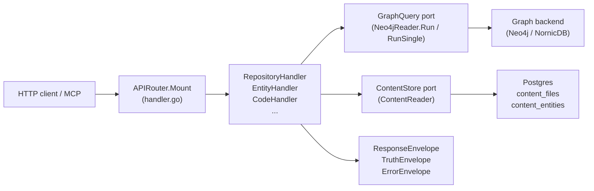
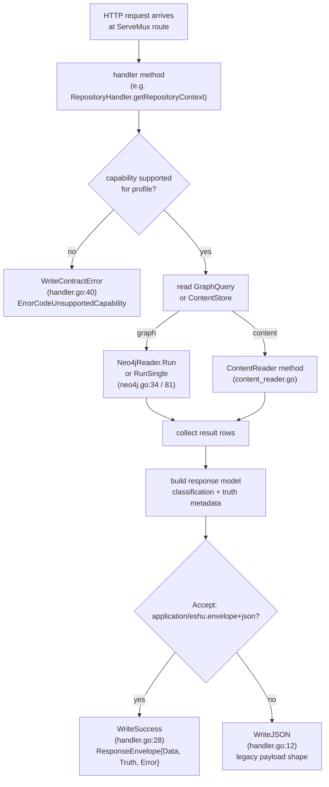

# internal/query

## Purpose

`internal/query` owns the HTTP read surface, OpenAPI assembly, response envelope
contract, and all read models that back the public Eshu query API. It defines the
`GraphQuery` and `ContentStore` ports through which every handler accesses the
graph and Postgres content store, and it enforces the capability matrix that
determines which queries are permitted under each runtime profile.
Code-quality routes also classify graph-derived findings before they reach
HTTP, MCP, or CLI callers; `code_quality.dead_code` returns candidate evidence,
language maturity, exclusions, and truth metadata instead of presenting a raw
Cypher scan as a cleanup list.

## Where this fits in the pipeline

## Internal flow

## Lifecycle / workflow

An HTTP request hits one of the routes registered by `APIRouter.Mount`
(`handler.go:125`). The handler method first checks whether the requested
capability is allowed for the current `QueryProfile` using `capabilityUnsupported`
(`handler.go:105`), which consults `capabilityMatrix` in `contract.go:134`. If
the profile does not support the capability, `WriteContractError` returns HTTP
501 with a structured `ErrorEnvelope` carrying `ErrorCodeUnsupportedCapability`,
the capability ID, and the `RequiredProfile`.

For permitted requests, the handler reads data through `GraphQuery` (for graph
traversals) or `ContentStore` (for Postgres content). `Neo4jReader.Run` and
`Neo4jReader.RunSingle` (`neo4j.go:34`, `neo4j.go:81`) open a read-only Neo4j
session, execute a Cypher query, and return `[]map[string]any` rows. Row values
are extracted via `StringVal`, `BoolVal`, `IntVal`, `StringSliceVal`
(`neo4j.go:120`). `ContentReader` methods (`content_reader.go:44`,
`content_reader_entity.go:13`) issue parametrized Postgres queries against
`content_files` and `content_entities`.

Read-model details stay package-local but out of the top-level index:

- [read-models.md](read-models.md) covers entity-map traversal, package
  registry bounds, CI/CD, service catalog, Kubernetes, and observability
  coverage correlations, supply-chain read models, OCI deployment trace
  enrichment, and
  investigation-route read models.
- [dead-code-reachability.md](dead-code-reachability.md) covers dead-code
  language reachability, exactness blockers, candidate paging, hydration,
  observed blockers, and the language-specific suppression contract.

At the package boundary, all query routes stay anchored, bounded, and explicit
about truth level. Graph reads go through `GraphQuery`, content reads go through
`ContentStore`, and response models keep provenance-only evidence separate from
canonical graph or reducer truth.
Documentation reads follow the same split: target-scoped findings responses can
include `related_facts`, `coverage`, and `missing_evidence` when raw
documentation facts reference a repo or service but no admissible finding exists
for that target. Explicit service or target filters count only target-matching
findings in `coverage.findings_returned` and bound the raw fact preview to the
explicit target reference before falling back to repo-scoped facts. A
`target_kind` value without `target_id` or `service_id` is not treated as a
target selector, and documentation fact reads name every accepted scope or
target anchor in invalid-argument responses. Documentation fact list responses
return bounded page metadata alongside `facts` so HTTP and MCP callers do not
infer completeness from row count alone.
Semantic evidence reads are opt-in routes over durable semantic facts:
`GET /api/v0/semantic/documentation-observations` and
`GET /api/v0/semantic/code-hints`. They require at least one scope or semantic
filter, page by `limit+1` with deterministic `observed_at DESC, fact_id DESC`
ordering, and return sanitized rows with `truth_basis`, provider profile,
prompt version, redaction version, policy state, freshness, and
admission/corroboration state. They do not call providers, read the graph,
expose raw prompts, or mix semantic code hints into deterministic code or
documentation routes.
Component extension reads expose runtime component registry state through
`GET /api/v0/component-extensions` and
`GET /api/v0/component-extensions/{component_id}/diagnostics`. These routes read
`component.Registry.Readback` only when the API or MCP runtime was configured
with `ESHU_COMPONENT_HOME`; otherwise they return a canonical unavailable
envelope. Responses include component ID, version, publisher, manifest digest,
lifecycle states, activation `config_handle` values, and policy diagnostics.
Inventory responses are bounded by `limit` and carry `count`, `total_count`,
and `truncated`; neither inventory nor diagnostics exposes local manifest paths,
activation config paths, or community-index membership as trust.

## Exported surface

**Ports and adapters**

- `GraphQuery` — read-only graph port: `Run` and `RunSingle`; implemented by
  `Neo4jReader` (`ports.go:9`)
- `ContentStore` — Postgres content port: file, entity, and catalog reads;
  implemented by `ContentReader` (`ports.go:14`)
- `Neo4jReader` — concrete graph adapter; satisfies `GraphQuery` (`neo4j.go:18`)
- `ContentReader` — concrete Postgres content adapter; satisfies `ContentStore`
  (`content_reader.go:16`)
- `PostgresIaCReachabilityStore` — reducer-materialized IaC cleanup findings
  (`iac_reachability_store.go`)
- `IaCReachabilityStore` — port for IaC cleanup findings (`iac.go:74`)
- `SupplyChainImpactReadinessStore` — port for bounded readiness counts and
  scoped source and package-registry metadata freshness
  (`supply_chain_impact_readiness.go`)
- `PostgresSupplyChainImpactReadinessStore` — Postgres-backed readiness store
  that runs one bounded CTE per impact-findings response, scopes vulnerability
  source-cache snapshot and durable source-state metadata by requested CVE,
  package, repository-owned ecosystem, or image component ecosystem, surfaces
  package-registry metadata freshness for package/repository scopes, exposes
  VCS/path/URL/editable dependency rows as `dependency_source` unsupported
  target evidence with stable reason codes, and strips absent optional fields
  from the JSON rollup. Readiness treats Composer as a supported
  impact-matcher ecosystem alongside the existing supported matchers, so
  Composer evidence gaps stay explicit instead of being classified as
  unsupported.
  (`supply_chain_impact_readiness_postgres.go`)
- `AdvisoryEvidenceStore` — source-only advisory evidence grouped by canonical
  CVE/GHSA/OSV/NVD identity. Repository, service, and workload scopes resolve
  through active reducer-owned impact findings, not provider-alert-only rows
  (`supply_chain_advisory_evidence.go`)
- `PostgresAdvisoryEvidenceStore` — Postgres-backed source fact read model
  for `GET /api/v0/supply-chain/advisories/evidence`
  (`supply_chain_advisory_evidence.go`)
- `AdvisoryCatalogStore` / `PostgresAdvisoryCatalogStore` — browsable,
  summary-only CVE-intelligence catalog for
  `GET /api/v0/supply-chain/advisories`. Lists canonical advisories without an
  advisory/package/repository/service/workload anchor, ordered by CVSS desc then
  advisory key with keyset pagination and severity/KEV/ecosystem/`q` filters.
  Rows are known intelligence only and do not imply impact
  (`supply_chain_advisory_catalog_model.go`,
  `supply_chain_advisory_catalog_store.go`,
  `supply_chain_advisory_catalog_handler.go`)
- `SupplyChainImpactExplanationStore` — port for one-finding supply-chain
  impact explanations that hydrate only referenced evidence fact IDs
  (`supply_chain_impact_explain.go`)
- `PostgresSupplyChainImpactFindingStore` — also implements the explanation
  port by reading exactly one active reducer impact finding and its referenced
  evidence facts (`supply_chain_impact_explain_postgres.go`)
- `SecurityAlertReconciliationStore` — port for reducer-owned provider alert
  comparison rows, including partial provider-source freshness from capped
  open-alert collection (`security_alert_reconciliation.go`)
- `PostgresSecurityAlertReconciliationStore` — Postgres-backed security alert
  reconciliation read model for bounded API/MCP reads; default pages select one
  current row per provider alert identity before state/status filters and
  cursor pagination (`security_alert_reconciliation.go`)
- `SupplyChainImpactFindingRow` — reducer-owned vulnerability impact finding
  row that keeps `observed_version`, `requested_range`, `fixed_version`, and
  `match_reason` separate so API and MCP clients can explain version matching
  without collapsing range-only, unsupported, malformed, affected, and
  known-fixed states. Legacy rows without an explicit detection profile are
  backfilled as precise only for supported exact-version match reasons,
  including npm, NuGet, Cargo, Maven, Pub, Swift, and Composer paths. Pub rows
  preserve exact hosted `pubspec.lock` versions while manifest ranges stay
  comprehensive. Composer rows preserve exact lockfile versions,
  manifest-only ranges, require versus require-dev scope, transitive paths, and
  missing-evidence reasons from reducer truth rather than reclassifying them in
  the read layer. Every row carries a `Suppression` block decoded from the
  reducer's VEX/operator-policy decision so the `include_suppressed` toggle
  and `suppression_state` filter on
  `GET /api/v0/supply-chain/impact/findings` can hide, surface, and explain
  not-affected, accepted-risk, false-positive, ignored, expired,
  provider-dismissed, and scope-mismatched findings without losing the
  authoring source, justification, author, timestamps, evidence reference, or
  VEX document/statement IDs. The same findings route and its count/inventory
  aggregates accept `image_ref` as an exact reducer-payload predicate; the read
  model does not infer image references from repository names, tags, or OCI
  registry scope strings. Every row also carries a `VulnerableRange`
  string copied from the advisory the reducer's provenance selector picked
  and persisted on the canonical finding payload, so list responses expose
  the same expression as the explain route. Every row also carries a
  `Remediation` block (issue #595) with the installed version, vulnerable
  range, selected fixed-version source, match reason, first patched version,
  every published fixed-version branch, manifest range, manifest_allows_fix
  tri-state, direct/transitive designation, parent_package required for
  transitive upgrades,
  ecosystem, an exact|partial|unknown confidence label, and a closed
  reason enum so API and MCP callers can explain the advisory-only
  safe-upgrade path without re-reading raw advisory or lockfile facts.
  Reason codes include both first-class missing-evidence outcomes —
  `installed_version_missing` (multi-branch advisory + no parseable
  observed version) and `installed_version_malformed` — and the
  upgrade-decision reasons. Older rows that predate remediation
  computation expose a nil `Remediation`; callers must treat that as
  "no remediation computed yet," not "no fix available." Exact
  repository-scoped `reducer_service_catalog_correlation` evidence remains in
  `evidence_path` for list, explain, and MCP readbacks. Catalog entity refs are
  surfaced as catalog anchors without fabricating `service_ids`; only catalog
  evidence that lacks a service id, workload id, and catalog entity ref reports
  `service/workload catalog anchor missing` instead of missing
  service-catalog correlation evidence.

**Handler structs**

- `APIRouter` — top-level mux; call `Mount` to register all routes
  (`handler.go:110`)
- `QueryPlaybookHandler` — catalog and resolver routes for deterministic
  workflow-plan truth: `GET /api/v0/query-playbooks` and
  `POST /api/v0/query-playbooks/resolve` (`query_playbook_handler.go`)
- `RepositoryHandler` — `GET /api/v0/repositories*` routes (`repository.go:21`)
- `EntityHandler` — entity resolution, workload/service context routes, service dossier stories, and service investigation coverage (`entity.go:11`, `service_story_handler.go:9`, `service_investigation.go:17`)
- `CodeHandler` — code search, symbol lookup, structural inventory, import
  dependency investigation, call graph metrics, relationships, relationship
  stories, redacted hardcoded-secret investigation in `code_security_secrets.go`,
  dead-code, complexity, call-chain (`code.go:11`)
- `ContentHandler` — file and entity content reads (`content_handler.go:11`)
- `ComponentExtensionsHandler` — optional component package inventory and
  diagnostics from sanitized runtime registry readback
  (`component_extensions.go`)
- `InfraHandler` — infrastructure resource and relationship routes (`infra.go:12`)
  including Terraform backend, import, moved, removed, check, and lockfile
  provider entity labels when they have been projected
- `IaCHandler` — IaC quality, AWS management, and IaC inventory routes
  (`iac.go:22`, `iac_management.go`, `iac_management_surface.go`,
  `iac_import_plan.go`, `iac_resources.go`)
  - `GET /api/v0/iac/resources` (`iac_resources.go`) is a bounded,
    keyset-paginated browse over the authoritative Terraform/IaC graph. It
    anchors on one of `TerraformResource`, `TerraformModule`, or
    `TerraformDataSource` (the `kind` selector), filters by `type`, `provider`,
    and `module`, requires a 1-200 `limit`, orders by `(name, id)`, and uses
    limit+1 truncation with an `after_name`/`after_id` cursor. It records
    `eshu_dp_iac_resource_list_duration_seconds` and
    `eshu_dp_iac_resource_list_errors_total` through the global meter
    (`iac_resources_metrics.go`). The `Graph` field on `IaCHandler` backs it;
    when nil the route returns 503.
  - `IaCManagementFindingRow` is the stable read model for AWS-backed IaC
    management status. It exposes the full #124 taxonomy, matched Terraform
    state/config handles, other-IaC ownership hints, service and environment
    candidates, dependency paths, warning flags, missing evidence, and
    provenance evidence atoms. Raw tag evidence remains provenance-only and
    does not promote ownership, service, or environment truth. Sensitive
    tag/evidence values are redacted before the row leaves the query layer, and
    `safety_gate` names review-required findings plus refused follow-up actions
    such as Terraform import-plan generation.
  - Terraform import-plan candidates are read-only response shaping over the
    same bounded active findings. They generate Terraform `import` blocks only
    for safety-approved supported cloud-only resources and return refused
    candidates for ambiguous, sensitive, stale, state-only, or unsupported rows.
    Each ready candidate also carries a `config_shape_hint`
    (`iac_config_shape_hints.go`): a structural resource skeleton listing
    argument NAMES and `<FILL_IN>` placeholders only. It emits no values — no
    secrets, tag values, ARNs beyond the import identity, state locators, or
    policy JSON — and refused candidates receive no hint because the safety gate
    runs first.
- `ImpactHandler` — blast radius, change surface, deployment trace, resource
  investigation, dependency paths (`impact.go:11`)
  - Entity-map neighborhood traversal resolves one anchor first, then runs
    bounded per-relationship-family graph reads. No-Regression Evidence:
    `go test ./internal/query -run
    'TestEntityMapPopulatesTypedVerbAndEntityIDForVarLengthEdge' -count=1`
    covers the NornicDB-compatible variable-length row shape from issue #1604:
    one resolved workload anchor, one incoming `DEFINES` relationship family,
    empty backend-derived relationship types, and a backend-reported
    `length(path)=0`. The query now emits the relationship verb as the family
    literal, avoids `RETURN DISTINCT`, deduplicates equivalent rows in Go after
    the bounded graph calls, and reports at least one hop for returned
    neighbors. No-Observability-Change: entity-map reads still use the existing
    `query.entity_map` handler span, graph query spans, HTTP status/error body,
    truth envelope, `coverage.depth`, `coverage.limit`, relationship filters,
    returned relationship counts, and truncation metadata. The change adds no
    route, queue, worker, graph write, runtime knob, metric instrument, or
    metric label.
- `EvidenceHandler` — relationship evidence drilldown and bounded citation
  packet hydration; citation packets reject more than 500 input handles and
  hydrate at most 50 citations per call (`evidence.go`, `evidence_citation.go`)
- `DocumentationHandler` — collected documentation facts, repo or target-scoped
  documentation truth findings, and evidence packets (`documentation.go`,
  `documentation_facts.go`)
- `SemanticEvidenceHandler` — opt-in semantic documentation observation and
  code-hint fact reads (`semantic_evidence.go`,
  `semantic_evidence_read_model.go`)
- `SupplyChainHandler` — SBOM attachment, image identity, advisory evidence,
  impact finding, and one-finding explanation routes; SBOM attachments resolve
  repository selectors while preserving subject/document truth and missing-image evidence (`supply_chain.go`)
- `IncidentHandler` — bounded incident context read packets from active
  incident source facts (`incident_context_handler.go`)
- `WorkItemHandler` — ticket-first Jira/work-item source evidence reads from
  active facts (`work_item_evidence_handler.go`)
- `FreshnessHandler` — bounded scope generation lifecycle drilldown at
  `GET /api/v0/freshness/generations` through the `GenerationLifecycleReader`
  port, plus the changed-since delta at
  `GET /api/v0/freshness/changed-since` through the `ChangedSinceReader` port
  (diffs a prior generation against the current active generation by
  `stable_fact_key` into per-category added/updated/unchanged/retired/superseded
  counts and bounded samples); named scope/repository/generation misses return
  not-found and no current active generation returns an explicit unavailable diff
  (`freshness_generations.go`, `freshness_changed_since.go`)
- `StatusHandler` — pipeline, ingester, index, and semantic extraction status
  routes (`status.go`, `status_semantic_extraction.go`)
- `MetricsHandler` — `/api/v0/metrics/timeseries`; returns unavailable-empty
  points when no source is configured (`metrics.go`)
- `CompareHandler` — environment comparison (`compare.go:12`) with the
  story-packet helpers in `compare_story.go`
- `AdminHandler` — work-item inspection, replay, dead-letter, backfill, reindex
  (`admin.go:153`)

**Response contract types**

- `ResponseEnvelope` — top-level wire envelope: `Data`, `Truth`, `Error`
  (`contract.go:108`)
- `TruthEnvelope` — truth metadata: `Level`, `Capability`, `Profile`, `Basis`,
  `Backend`, `Freshness`, `Reason` (`contract.go:75`)
- `TruthFreshness` — freshness state and observation timestamp (`contract.go:69`)
- `ErrorEnvelope` — structured error: `Code`, `Message`, `Capability`,
  `Profiles` (`contract.go:101`)
- `ErrorCode`, `TruthLevel`, `TruthBasis`, `FreshnessState`, `QueryProfile`,
  `GraphBackend` — typed string constants (`contract.go`)
- `AnswerPacket`, `AnswerPacketInput`, `AnswerTruthClass`, `NewAnswerPacket`,
  `NewAnswerPacketFromCitations` — evidence-backed answer packet contract and
  builder (`answer_packet.go`). The packet is a composition layer over the
  existing envelope: it copies the `TruthEnvelope`, references the canonical
  `ResponseEnvelope` data, folds `TruthLevel`+`TruthBasis` into a single
  `AnswerTruthClass` (`deterministic`, `derived`, `fallback`,
  `semantic_observation`, `code_hint`, `unsupported`), reuses the
  `evidence_citation` handle and `recommended_next_calls` shapes, and refuses to
  attach a confident summary to an unsupported (error-built) or no-evidence
  partial answer. It is a pure contract+builder; route/MCP wiring is follow-up
  work. See `docs/public/reference/answer-packets.md`.
- `QueryPlaybook`, `PlaybookInput`, `PlaybookStep`, `PlaybookParam`,
  `PlaybookDrilldown`, `PlaybookFailureMode`, `ResolvedPlaybook`, `ResolvedCall`,
  `PlaybookVersionRef` — machine-readable query playbook contract
  (`query_playbook.go`, validation in `query_playbook_validate.go`). A playbook
  is a deterministic, bounded, versioned data description of a starter-prompt or
  cookbook workflow: ordered first-class tool calls (never raw Cypher), bounded
  params with default limits, an expected `AnswerTruthClass` and evidence per
  step, optional drilldowns, and declared failure modes with fallbacks.
  `(QueryPlaybook).Validate` enforces the structural contract and rejects raw
  Cypher steps; `(QueryPlaybook).Resolve` deterministically yields the fully
  specified bounded call sequence from declared inputs alone, reading no external
  state. `PlaybookCatalog` is the versioned source of truth
  (`query_playbook_catalog.go`), `PlaybookCatalogVersions` and `LookupPlaybook`
  read it, and `PlaybookToolNames` lets the `mcp` package cross-check referenced
  tool names against `ReadOnlyTools` without an import cycle.
  `QueryPlaybookHandler` exposes the catalog through API/MCP/CLI surfaces that
  do not execute calls, read graph or Postgres state, or expose raw Cypher. See
  `docs/public/reference/query-playbooks.md`.
- `VisualizationPacket`, `VisualizationNode`, `VisualizationEdge`,
  `VisualizationView`, `VisualizationLimits`, `VisualizationTruncation`,
  `VisualizationMaxNodes`, `VisualizationMaxEdges`,
  `BuildServiceStoryVisualizationPacket`,
  `BuildEvidenceCitationVisualizationPacket`,
  `BuildEvidenceCitationVisualizationPacketFromMap`,
  `BuildIncidentContextVisualizationPacket`, and
  `BuildIncidentContextVisualizationPacketFromMap` — compact, bounded, derived
  subgraph views over existing story, evidence-citation, and incident-context
  responses (`visualization_packet.go`, `visualization_packet_story.go`,
  `visualization_packet_evidence.go`, `visualization_packet_decode.go`). Each
  builder is a pure transformation of data the caller already received: it
  performs no graph access, derives stable node/edge IDs from the underlying
  entity/handle identity (never iteration order), sorts by stable ID, enforces
  node/edge bounds with explicit truncation, copies the source `TruthEnvelope`,
  reuses the `evidence_citation` handle shape so a node maps back to a
  citation, and returns an explicit unsupported packet with
  `recommended_next_calls` rather than erroring. The `FromMap` adapters decode
  canonical HTTP/MCP/CLI JSON maps into the same builders; they do not add a new
  data source. Normal visualization flows need no raw Cypher.
  `VisualizationHandler` exposes `POST /api/v0/visualizations/derive`, and MCP
  routes `derive_visualization_packet` to the same handler. See
  `docs/public/reference/visualization-packets.md`.

**Handler helpers**

- `WriteJSON`, `WriteError`, `WriteSuccess`, `WriteContractError` — uniform
  response writers (`handler.go`)
- `ReadJSON`, `QueryParam`, `QueryParamInt`, `PathParam` — request parsing
  helpers (`handler.go`)
- `AuthMiddleware` — bearer-token middleware used by `cmd/api` (`auth.go:30`)
- `BuildTruthEnvelope` — builds a `TruthEnvelope` from profile, capability, and
  basis; panics on unknown capability (`contract.go:547`)
- `ParseQueryProfile`, `NormalizeQueryProfile`, `ParseGraphBackend` — input
  validation helpers (`contract.go`)
- `MetricsTimeSeriesSource`, `PrometheusMetricsTimeSeriesSource`, and related
  types — closed metric series port and Prometheus/Mimir adapter
  (`metrics.go`, `metrics_prometheus.go`)

**OpenAPI**

- `OpenAPISpec()` — concatenates the `openapi_paths_*.go` fragments and
  `openAPIComponents` into one JSON string (`openapi.go:49`); security prompt
  routes live in `openapi_paths_code_security.go`
- `ServeOpenAPI`, `ServeSwaggerUI`, `ServeReDoc` — HTTP handlers for
  `/api/v0/openapi.json`, `/api/v0/docs`, `/api/v0/redoc` (`openapi.go`)

**Graph row helpers**

- `StringVal`, `BoolVal`, `IntVal`, `StringSliceVal`, `RepoRefFromRow`,
  `RepoProjection` — safe Neo4j result-row extractors (`neo4j.go`)

See `doc.go` for the full godoc contract.

## Dependencies

- `internal/buildinfo` — `AppVersion()` embedded in the OpenAPI spec
- `internal/contentrefs` — content reference utilities used in content query paths
- `internal/iacreachability` — IaC reachability row types consumed by
  `PostgresIaCReachabilityStore`
- `internal/parser` — entity and language classification constants used for
  dead-code root detection
- `internal/recovery` — `RecoveryService` port satisfied by `recovery.Handler`;
  wired into `AdminHandler.Recovery`
- `internal/status` — `status.Reader` consumed by `StatusHandler.StatusReader`
- `internal/storage/postgres` — status, recovery, IaC reachability, and AWS
  runtime drift finding adapters; query handlers never import concrete
  Postgres drivers directly — they go through query package adapters and ports
- `internal/telemetry` — `EventAttr`, `DefaultServiceNamespace`, span constants
  `SpanQueryRelationshipEvidence`, `SpanQueryDeadIaC`,
  `SpanQueryIaCUnmanagedResources`, `SpanQueryIaCTerraformImportPlan`, `SpanQueryInfraResourceSearch`, `SpanQueryCodeTopicInvestigation`,
  `SpanQueryHardcodedSecretInvestigation`, `SpanQueryDeadCodeInvestigation`,
  `SpanQueryChangeSurfaceInvestigation`, `SpanQueryWorkItemEvidence`

Handlers depend on the `GraphQuery` and `ContentStore` ports, not on
`neo4jdriver.DriverWithContext` or `*sql.DB` directly. `Neo4jReader` and
`ContentReader` are the only concrete types that touch drivers, and they are
wired in `cmd/api/wiring.go`, not here.

Semantic extraction status is a runtime status projection, not a graph or
content read model. `GET /api/v0/status/semantic-extraction` reports no-provider
mode as `unavailable` with code hints and documentation observations disabled.
When semantic provider profiles are configured, the route includes redacted
`provider_profiles[]` rows with profile id, provider kind, model metadata,
credential source kind, source classes, source-policy state, and profile
health/configuration state. It does not expose credential handles or raw keys,
while deterministic indexing, reducer projection, API reads, MCP tools, and
documentation fact routes remain unaffected.

## Telemetry

- Spans: `telemetry.SpanQueryRelationshipEvidence` (`query.relationship_evidence`)
  on evidence drilldown and `telemetry.SpanQueryEvidenceCitationPacket`
  (`query.evidence_citation_packet`) on citation packet hydration;
  `telemetry.SpanQueryDocumentationFindings`
  (`query.documentation_findings`),
  `telemetry.SpanQueryDocumentationFacts`
  (`query.documentation_facts`),
  `telemetry.SpanQueryDocumentationEvidencePacket`
  (`query.documentation_evidence_packet`), and
  `telemetry.SpanQueryDocumentationPacketFreshness`
  (`query.documentation_packet_freshness`) on documentation truth evidence
  routes (`documentation.go`); the target-fact preview adds a `postgres.query`
  span with `db.operation=list_documentation_target_facts`;
  `telemetry.SpanQuerySemanticEvidence` (`query.semantic_evidence`) on opt-in
  semantic observation and code-hint fact reads;
  `telemetry.SpanQueryCodeTopicInvestigation`
  (`query.code_topic_investigation`) on broad code-topic investigation
  (`code_topic.go`); `telemetry.SpanQueryHardcodedSecretInvestigation`
  (`query.hardcoded_secret_investigation`) on redacted hardcoded-secret
  investigation (`code_security_secrets.go`);
  `telemetry.SpanQueryDeadCodeInvestigation`
  (`query.dead_code_investigation`) on dead-code investigation
  (`code_dead_code_investigation.go`); `telemetry.SpanQueryChangeSurfaceInvestigation`
  (`query.change_surface_investigation`) on change-surface investigation;
  `telemetry.SpanQueryResourceInvestigation`
  (`query.resource_investigation`) on resource investigation;
  `telemetry.SpanQueryDeadIaC` (`query.dead_iac`)
  on IaC dead-code queries (`iac.go`); `telemetry.SpanQueryIaCUnmanagedResources`
  (`query.iac_unmanaged_resources`) on AWS management finding list queries,
  `telemetry.SpanQueryIaCManagementStatus` (`query.iac_management_status`) on
  exact status reads, and `telemetry.SpanQueryIaCManagementExplanation`
  (`query.iac_management_explanation`) on grouped evidence explanations;

  `telemetry.SpanQueryIaCTerraformImportPlan`
  (`query.iac_terraform_import_plan`) on read-only Terraform import-plan
  candidate generation; `telemetry.SpanQueryAWSRuntimeDriftFindings`
  (`query.aws_runtime_drift_findings`) on active AWS runtime drift finding
  reads;
  `telemetry.SpanQuerySupplyChainImpactExplanation`
  (`query.supply_chain_impact_explanation`) on one-finding vulnerability
  explanations;
  `telemetry.SpanQueryInfraResourceSearch`
  (`query.infra_resource_search`) on infrastructure search (`infra.go`);
  `telemetry.SpanQueryWorkItemEvidence`
  (`query.work_item_evidence`) on source-only work-item evidence reads
  (`work_item_evidence_handler.go`).
  Per-query spans `neo4j.query` and `postgres.query` on every graph and content
  read.
- Metrics: `eshu_dp_neo4j_query_duration_seconds` and
  `eshu_dp_postgres_query_duration_seconds` (instruments live in
  `internal/telemetry/instruments.go`).
- Log events: `repository_query.stage_started`, `repository_query.stage_completed`
  (via `repositoryQueryStageTimer`); `service_query.stage_started`,
  `service_query.stage_completed` (via `serviceQueryStageTimer`). Both emit
  `operation`, `stage`, `repo_id`, and `duration_seconds`.

Answer-facing story and investigation responses attach additive
`answer_metadata` companions with normalized evidence handles,
missing-evidence rows, limitations, truncation, coverage, partial reasons, and
recommended next calls. The companion is derived only from the already-built
response payload or incident response struct; it performs no graph,
content-store, provider, reducer, collector, or queue reads and does not add a
new span. Keep the canonical route fields authoritative and use
`answer_metadata` only as the prompt-facing adapter for AnswerPacket composition
or MCP summary text.

Durable no-regression and observability notes for issue-specific query shapes,
including CloudResource candidate reads and NornicDB predicate compatibility,
live in [evidence-notes.md](evidence-notes.md).

## Operational notes

- High latency on `GET /api/v0/repositories/{repo_id}/context` or story routes:
  check the `repository_query.stage_completed` log events for the slow stage
  (`graph_lookup`, `content_hydration`, etc.) before assuming the graph backend
  is the problem.
- `eshu_dp_neo4j_query_duration_seconds` rising across many routes: check graph
  backend health and query plan; do not raise handler timeouts before confirming
  the Cypher query itself is the bottleneck.
- 501 responses with `error.code=unsupported_capability`: the requested
  operation requires a higher `QueryProfile`. Code-only graph capabilities and
  platform-impact queries start at `local_authoritative`; `local_full_stack`
  uses the same handlers with the Compose runtime shape. Check
  `truth.profiles.required` in the response envelope for the minimum profile,
  then verify the ESHU_QUERY_PROFILE env var in the running API.
- `OpenAPISpec()` panics at startup if a handler calls `BuildTruthEnvelope` with
  a capability string not in `capabilityMatrix` (`contract.go:547`). Add missing
  capability IDs to `capabilityMatrix` before shipping new handlers.
- `code_quality.dead_code` is a derived query unless the language maturity row
  says otherwise. Handler changes must preserve `classification`,
  `dead_code_language_maturity`, and `analysis` fields so MCP and CLI callers
  can distinguish actionable unused symbols from excluded or ambiguous ones.
  Go root-kind evidence covers function roots and type roots, including
  `go.dependency_injection_callback`, `go.direct_method_call`,
  `go.fmt_stringer_method`, `go.function_literal_reachable_call`,
  `go.function_value_reference`, `go.generic_constraint_method`,
  `go.imported_direct_method_call`, `go.imported_fmt_stringer_method`,
  `go.interface_implementation_type`, `go.interface_method_implementation`,
  `go.interface_type_reference`, `go.method_value_reference`, and
  `go.type_reference`. JavaScript-family
  analysis must list Node package, CommonJS default export, CommonJS mixin,
  Next.js, Node migration, Hapi-style, TypeScript public API, TypeScript
  module-contract, and TypeScript interface implementation roots, plus Java
  main, constructor, override, Ant Task setter, Gradle plugin `apply`, task
  action/property, and public Gradle DSL roots when query policy suppresses
  those candidates, plus Swift parser-backed roots when query policy suppresses
  those candidates; the analysis notes name the same Java and C root families.
  Rust parser-backed root,
  syntax-evidence, and observed-blocker rows must stay aligned with the
  `deadCodeLanguageMaturity` table because Rust derived classification depends
  on that maturity row, the root suppression policy, and ambiguous
  classification for exactness-blocked candidates.
  The handler scans raw content-model or graph candidates in bounded
  label-scoped pages before policy exclusions, pushes any requested language
  filter into the candidate query, then checks completed reducer code-call
  intent rows for incoming edges on the remaining candidates and uses a
  2,500-row scan window for small result limits. It reports
  `candidate_scan_pages` plus `candidate_scan_rows`.
  `display_truncated` and `candidate_scan_truncated` must stay separate so
  performance bounds do not blur result-list pagination with raw scan coverage.
  Unsupported language metadata and repository-root
  `test/`, `tests/`, and `__tests__/` paths stay out of default cleanup results.
- Hardcoded-secret investigation applies test, fixture, example, and placeholder
  suppression inside the Postgres query before `LIMIT` and `OFFSET`
  (`content_reader_security_secrets.go`). The SQL predicate and Go suppression
  notes both derive from `hardcodedSecretSuppressionRules`, and
  `code_security_secrets.go` treats the returned content-store rows as the
  already-paged result window; do not move suppression back into either Go row
  loop, because that makes `truncated` and offset paging describe the
  pre-suppression row set instead of the visible results.
- Content reads return `source_backend=unavailable` when Postgres does not have
  a cached row for the requested file. This is not a Postgres error; the ingester
  has not yet written content for that scope.
- `AuthMiddleware` (`auth.go`) skips auth only when the resolved token is empty
  (dev mode) or the path is in `publicHTTPPaths`. Adding new public routes
  requires updating the `publicHTTPPaths` map.

## Extension points

- `GraphQuery` — implement this interface to add a new graph adapter; no handler
  code branches on the backend brand.
- `ContentStore` — implement this interface to swap the Postgres content reader
  for a different backing store.
- `IaCReachabilityStore` — implement this interface for custom IaC reachability
  sources; `PostgresIaCReachabilityStore` is the only shipped implementation.
- `AdminStore` — implement this interface to redirect admin queue operations to
  a different storage layer.
- OpenAPI fragments — add a new `openapi_paths_*.go` file and reference it in
  `OpenAPISpec()` (`openapi.go:55`); the concatenation order determines the JSON
  path order in the served schema.

Do not add `if graphBackend == "nornicdb"` branches in handler code. Backend
dialect differences belong in `internal/storage/cypher` adapters behind the
`GraphQuery` port.

## Gotchas / invariants

- `BuildTruthEnvelope` panics if `capability` is not in `capabilityMatrix`
  (`contract.go:547`). All capability strings used in handlers must be registered
  in that map before the handler can be called safely.
- The unexported `capabilityUnsupported` returns true when `maxTruthLevel` returns
  `nil` for the current profile; a nil max-truth means the capability is
  explicitly unsupported at that profile level. `APIRouter` and every handler that
  gates on capability call this helper (`handler.go:105`, `contract.go:134`).
- `Neo4jReader` opens a new session per query by calling `NewSession` on the
  driver (`neo4j.go:50`); the session is closed in a `defer`. Do not hold
  sessions across multiple queries in the same handler.
- `ContentReader` traces each Postgres call with an OTEL span labeled
  `db.sql.table`; queries that scan multiple tables need per-call spans to avoid
  misleading attribution (`content_reader.go:45`).
- Repository-language inventory reads use the Postgres content index through
  `CountRepositoriesByLanguage`, `ListRepositoriesByLanguage`, and
  `RepositoryLanguageInventory`. The API and MCP contract is count-first and
  paged so "how many TypeScript repos?" does not require per-repository
  coverage fan-out.
- `queryContentStoreCoverage` uses `ContentReader.RepositoryCoverage` as the
  bounded count source when content rows are available. The graph count in
  `queryRepositoryGraphCoverageStats` is a no-content fallback, so
  `graph_gap_count` and `content_gap_count` stay zero when graph parity was not
  checked.
- `WriteSuccess` branches on `acceptsEnvelope(r)` at `handler.go:29`; callers
  that do not send `Accept: application/eshu.envelope+json` receive the legacy
  payload shape. MCP tool dispatch relies on the envelope format; do not break
  this negotiation logic.
- Repository story and stats handlers use `WriteSuccess` so MCP can preserve
  `ResponseEnvelope` truth metadata while plain HTTP clients keep the legacy
  JSON body. No-Regression Evidence: `go test ./internal/query -run
  'TestGetRepository(Story|Stats)ReturnsEnvelopeWhenRequested' -count=1`,
  `go test ./internal/mcp -run
  'TestDispatchToolRepo(Story|sitoryStats)ReturnsStructuredEnvelopeData'
  -count=1`, `go test ./cmd/api ./cmd/mcp-server ./internal/query
  ./internal/mcp -count=1`, `golangci-lint run ./...`, and `go test ./...`
  covered the same bounded repository lookup and content coverage input shape;
  there is no graph query, queue, reducer, or runtime path change.
  No-Observability-Change: existing repository story/stats timer stages,
  structured logs, MCP envelope parsing, and HTTP status output remain the
  diagnostic surface.
- Component extension inventory and diagnostics read only the configured local
  component registry on explicit API/MCP request. No-Observability-Change: this
  adds no worker, queue, graph query, Postgres query, or metric label, and path
  redaction plus inventory bounds are applied before HTTP, MCP, or CLI callers
  receive the envelope.
  No-Regression Evidence: `go test ./internal/query -run
  'TestComponentExtensions|TestOpenAPISpecIncludesComponentExtensionRoutes'
  -count=1`, `go test ./internal/mcp -run
  'TestComponentExtension|TestReadOnlyToolsIncludesComponentExtensionDiagnostics'
  -count=1`, and `go test ./cmd/eshu -run
  'TestComponentInventoryCommandReadsCanonicalAPIEnvelope|TestComponentDiagnosticsCommandReadsComponentDrilldown'
  -count=1`.
- The OpenAPI spec is assembled from string fragments in Go source, not from
  runtime reflection. When a handler changes its request or response shape,
  update the matching `openapi_paths_*.go` fragment in the same PR.

## Related docs

- [read-models.md](read-models.md) for route-specific read-model bounds,
  evidence, and investigation-route contracts.
- [dead-code-reachability.md](dead-code-reachability.md) for dead-code language roots, exactness blockers, and candidate paging rules.
- [evidence-notes.md](evidence-notes.md) for issue-specific no-regression and
  observability notes that do not belong in the package overview.
- `docs/public/reference/http-api.md` for the public HTTP and envelope contract.
- `docs/public/reference/dead-code-reachability-spec.md` for the dead-code
  language maturity contract.
