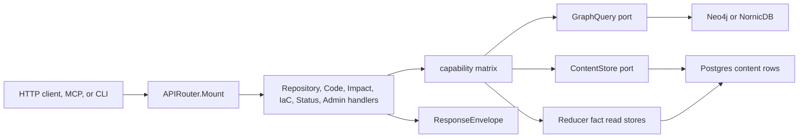

# internal/query

`internal/query` owns Eshu's HTTP read surface. It mounts `/api/v0` routes,
assembles the OpenAPI document, writes the `{data, truth, error}` response
envelope, and builds the read models that API, MCP, and CLI callers consume.

This package is an adapter boundary. Handlers read through ports such as
`GraphQuery`, `ContentStore`, and query-local reducer fact stores. Backend
drivers and storage details stay behind those ports.

## Request Flow

Every public route should follow this shape:

1. Validate request input and bounds.
2. Check the capability gate before expensive reads.
3. Read through a port, not a concrete backend.
4. Return deterministic order, `limit` or singleton scope, and truncation
   metadata for list responses.
5. Use `WriteSuccess` so envelope-aware callers receive `data`, `truth`, and
   `error`.
6. Keep the matching OpenAPI fragment and public reference docs in sync.

## Core Contracts

| Contract | Source | Why it matters |
| --- | --- | --- |
| `APIRouter` | `handler.go` | Registers all API, docs UI, and health routes. |
| `ResponseEnvelope` | `contract.go` | Stable wire shape for HTTP, MCP dispatch, and CLI `--json` consumers. |
| `capabilityMatrix` | `contract.go` | Defines which runtime profiles can answer each capability and at what truth level. |
| `GraphQuery` | `ports.go` | Read-only graph traversal port for Neo4j and NornicDB-backed queries. |
| `ContentStore` | `ports.go` | Relational content and entity read port backed by Postgres. |
| `OpenAPISpec()` | `openapi.go` plus `openapi_paths_*.go` | Static OpenAPI assembly; it does not reflect from handler structs. |

`BuildTruthEnvelope` panics if a capability is missing from
`capabilityMatrix`. Add the capability entry before wiring a handler that calls
it.

## Handler Families

| Handler | Owns |
| --- | --- |
| `RepositoryHandler` | Repository list, context, coverage, story, runtime/deployment artifacts. |
| `EntityHandler` | Entity resolution, workload context, service context, service stories, and service investigation. |
| `CodeHandler` | Code search, symbols, relationships, call chains, structural inventory, import investigation, call graph metrics, code quality, hardcoded-secret investigation, and dead-code reads. |
| `ContentHandler` | Exact file/entity reads, line reads, and content/entity search. |
| `InfraHandler` | Infrastructure search and infrastructure relationship reads. |
| `IaCHandler` | Dead IaC, unmanaged resource status, IaC management explanation, AWS runtime drift, and Terraform import-plan candidates. |
| `ImpactHandler` | Blast radius, change surface, deployment trace, resource investigation, and dependency paths. |
| `EvidenceHandler` | Relationship evidence drilldown and bounded citation packet hydration. |
| `DocumentationHandler` | Documentation findings, evidence packets, and freshness checks. |
| `PackageRegistryHandler` | Package, version, dependency, and ownership/consumption correlation reads. |
| `CICDHandler` | CI/CD run correlation reads. |
| `SupplyChainHandler` | SBOM attachment and supply-chain impact finding reads. |
| `StatusHandler` | Pipeline and ingester status routes. |
| `CompareHandler` | Environment comparison story packets. |
| `AdminHandler` | Work-item inspection, replay, dead-letter, backfill, reindex, and recovery routes. |

## Route Details That Must Stay Stable

- Envelope-aware callers receive `ResponseEnvelope` only when they send
  `Accept: application/eshu.envelope+json`; otherwise `WriteJSON` emits the
  legacy payload directly.
- Repository runtime artifacts parse Dockerfile stage metadata through
  `buildDockerfileRuntimeArtifacts`, including base image, base tag, build
  platform, copy-from, command, port, and environment signals.
- Deployment trace image references can be enriched with projected OCI registry
  truth when `ContainerImage`, `ContainerImageIndex`, or
  `ContainerImageDescriptor` graph rows exist. Digest references surface as
  canonical image identity; mutable tag references surface only when one
  registry tag observation resolves to one projected digest, and conflicting
  tag observations stay ambiguous.
- Entity-map reads resolve exactly one typed start entity before traversal.
  Repository anchors use direct relationship-family traversal by default so
  high-cardinality structural edges do not expand before `limit` can bound the
  result. Keep `TestEntityMap` coverage with route or query-shape changes.
- OCI deployment-trace reads use one bounded query per OCI image-family label
  instead of a `CALL { ... UNION ... }` subquery followed by `MATCH`, because
  NornicDB v1.1.1 rejects that post-`CALL` shape.
- Content-backed Argo CD relationship fallback reads `source_repos` for
  multi-source Applications and emits one `DEPLOYS_FROM` relationship per
  source repo while still accepting the older singular `source_repo` metadata
  field.
- Code topic investigation scores `content_entities` and `content_files` in one
  bounded query and returns ranked `repo_id + relative_path` evidence,
  coverage/truncation, and follow-up handles.
- Structural inventory, import investigation, and call graph metrics require a
  repository, file, or module scope anchor before expanding broad code reads,
  then return deterministic `limit+1` pages with truncation metadata and
  source handles.

## Dead-Code Ownership

Do not duplicate the language-by-language dead-code root model in this README.
The canonical contracts are:

- `code_dead_code_language_maturity.go`
- `code_dead_code_*_roots.go`
- `code_dead_code_*_test.go`
- `docs/public/reference/dead-code-reachability-spec.md`
- `docs/public/reference/http-api.md`

Dead-code handlers must keep candidate reads bounded, de-duplicate entity IDs,
apply parser/root metadata before cleanup classification, preserve language
maturity and exactness-blocker fields, and keep JavaScript/TypeScript
investigation conservative until corpus precision evidence proves cleanup
safety. SQL routine reachability uses batched graph `EXECUTES` probes because
SQL relationship materialization writes those edges directly.

## Handler Details That Must Stay Stable

- `IaCManagementFindingRow` is the stable read model for AWS-backed IaC
  management status. Raw tag evidence remains provenance-only and must not
  promote ownership, service, or environment truth. Sensitive tag and evidence
  values are redacted before the row leaves the query layer.
- Terraform import-plan candidates are read-only response shaping over bounded
  active findings. They generate Terraform `import` blocks only for
  safety-approved supported cloud-only resources and return refused candidates
  for ambiguous, sensitive, stale, state-only, or unsupported rows.
- `PackageRegistryHandler` keeps package, version, dependency, and correlation
  reads anchored by package, ecosystem, version, or repository scope. Keep the
  package-list Cypher on the indexed package scope with direct scalar aliases;
  a prior NornicDB proof returned empty `package_id` values when the query used
  an intermediate `WITH p, count(v)`. Guard with
  `TestPackageRegistryListPackagesUsesIndexedPackageScopeAndTruncates`.
- Citation packets reject more than 500 input handles and hydrate at most 50
  citations per call.
- `DocumentationHandler` owns both documentation findings and collected
  documentation fact reads. Keep finding, packet, freshness, and fact routes
  backed by the Postgres documentation read model.

## OpenAPI And Docs

The OpenAPI schema is assembled from checked-in string fragments. When a route
or response shape changes, update all of these in the same PR:

- the handler and tests under `go/internal/query`
- the matching `openapi_paths_*.go` fragment
- `docs/public/reference/http-api.md`
- the MCP tool docs if the route is exposed through `go/internal/mcp`
- `specs/capability-matrix.v1.yaml` when capability truth changes

## Telemetry

- Spans: `telemetry.SpanQueryRelationshipEvidence` (`query.relationship_evidence`)
  on evidence drilldown and `telemetry.SpanQueryEvidenceCitationPacket`
  (`query.evidence_citation_packet`) on citation packet hydration;
  `telemetry.SpanQueryDocumentationFindings`
  (`query.documentation_findings`),
  `telemetry.SpanQueryDocumentationFacts`
  (`query.documentation_facts`),
  `telemetry.SpanQueryDocumentationEvidencePacket`
  (`query.documentation_evidence_packet`), and
  `telemetry.SpanQueryDocumentationPacketFreshness`
  (`query.documentation_packet_freshness`) on documentation truth evidence
  routes (`documentation.go`); `telemetry.SpanQueryCodeTopicInvestigation`
  (`query.code_topic_investigation`) on broad code-topic investigation
  (`code_topic.go`); `telemetry.SpanQueryHardcodedSecretInvestigation`
  (`query.hardcoded_secret_investigation`) on redacted hardcoded-secret
  investigation (`code_security_secrets.go`);
  `telemetry.SpanQueryDeadCodeInvestigation`
  (`query.dead_code_investigation`) on dead-code investigation
  (`code_dead_code_investigation.go`); `telemetry.SpanQueryChangeSurfaceInvestigation`
  (`query.change_surface_investigation`) on change-surface investigation;
  `telemetry.SpanQueryResourceInvestigation`
  (`query.resource_investigation`) on resource investigation;
  `telemetry.SpanQueryDeadIaC` (`query.dead_iac`)
  on IaC dead-code queries (`iac.go`); `telemetry.SpanQueryIaCUnmanagedResources`
  (`query.iac_unmanaged_resources`) on AWS management finding list queries,
  `telemetry.SpanQueryIaCManagementStatus` (`query.iac_management_status`) on
  exact status reads, and `telemetry.SpanQueryIaCManagementExplanation`
  (`query.iac_management_explanation`) on grouped evidence explanations;
  `telemetry.SpanQueryIaCTerraformImportPlan`
  (`query.iac_terraform_import_plan`) on read-only Terraform import-plan
  candidate generation; `telemetry.SpanQueryAWSRuntimeDriftFindings`
  (`query.aws_runtime_drift_findings`) on active AWS runtime drift finding
  reads;
  `telemetry.SpanQueryInfraResourceSearch`
  (`query.infra_resource_search`) on infrastructure search (`infra.go`).
  Per-query spans `neo4j.query` and `postgres.query` on every graph and content
  read.
- Metrics: `eshu_dp_neo4j_query_duration_seconds` and
  `eshu_dp_postgres_query_duration_seconds` (instruments live in
  `internal/telemetry/instruments.go`).
- Log events: `repository_query.stage_started`, `repository_query.stage_completed`
  (via `repositoryQueryStageTimer`); `service_query.stage_started`,
  `service_query.stage_completed` (via `serviceQueryStageTimer`). Both emit
  `operation`, `stage`, `repo_id`, and `duration_seconds`.

Repository and service story paths emit stage timing logs through
`repositoryQueryStageTimer` and `serviceQueryStageTimer`. Use those logs before
assuming a slow story route is a graph backend problem.

## Extension Checklist

To add a route:

1. Add or extend the handler.
2. Register the route in that handler's `Mount` method.
3. Add the handler to `APIRouter` when it is a new route family.
4. Wire concrete stores in `cmd/api`.
5. Add the capability matrix entry if the route returns truth metadata.
6. Add or update the OpenAPI fragment.
7. Add focused handler tests.
8. Update public reference docs and MCP docs when exposed externally.

To add or change query contracts:

- Add a capability by updating `capabilityMatrix`, the capability spec, the
  handler call to `BuildTruthEnvelope`, and the public HTTP reference.
  `BuildTruthEnvelope` panics for unknown capability IDs.
- Change a response shape by updating the handler, the matching
  `openapi_paths_*.go` fragment, the HTTP reference, and MCP docs when the
  route is tool-backed.
- Add a graph query through `GraphQuery` or a query-local store port. Handler
  files must not import Neo4j, NornicDB, or `*sql.DB` directly.
- Keep package-registry reads anchored: packages require `package_id` or
  `ecosystem`, versions require `package_id`, dependencies require
  `package_id` or `version_id`, and correlations require `package_id` or
  `repository_id`.
- Keep structural inventory, import investigation, and call-graph metrics
  scoped, bounded, deterministically ordered, and `limit+1` truncated.

## Gotchas

- `WriteSuccess` is the envelope path. `WriteJSON` is for legacy payloads,
  health checks, and helpers that intentionally do not negotiate envelopes.
- `AuthMiddleware` skips auth only when the resolved token is empty or the path
  is in `publicHTTPPaths`. Do not add data routes to `publicHTTPPaths` without
  an explicit review.
- Do not branch on backend brand in handler code. Backend-specific Cypher
  behavior belongs behind `GraphQuery` or in documented narrow seams.
- Do not add data routes to `publicHTTPPaths` without explicit review; entries
  there bypass bearer-token auth.
