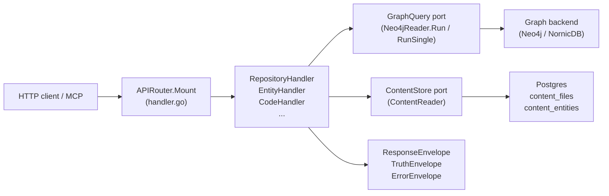
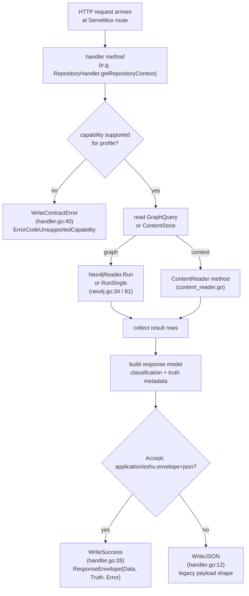

# internal/query

## Purpose

`internal/query` owns the HTTP read surface, OpenAPI assembly, response envelope
contract, and all read models that back the public Eshu query API. It defines the
`GraphQuery` and `ContentStore` ports through which every handler accesses the
graph and Postgres content store, and it enforces the capability matrix that
determines which queries are permitted under each runtime profile.
For a multi-type NornicDB Function relationship story, the content entity ID
is the canonical graph `uid`. The handler resolves that anchor once per request
and checks legacy `id` only when no canonical anchor exists; an unrelated
legacy-ID collision cannot contribute edges to the selected content entity.
Repository-scoped entity resolution and graph code search start from the indexed
`Repository.id` anchor, then expand only that repository's files and entities;
they do not scan the entity universe before applying repository scope. A
canonical `content-entity:` resolution request is served from the authoritative
content row first. A missing canonical content row is an explicit empty result,
not a reason to fall back to a broad graph name scan.
Global code-name search and typed entity resolution do not use an unanchored
graph scan. They call the narrow `EntityNameSearcher` extension on
`ContentReader`, which applies repository grants, normalized language variants,
entity type, and case-sensitive exact or substring matching before a stable
limit. Untyped global entity resolution, unknown types, graph-only container
types, and global substrings shorter than three Unicode characters fail closed.

NornicDB direct-relationship metadata uses the content entity type as its graph
label. When the content row is absent, the compatibility fallback probes the
fixed supported label vocabulary by `uid` and then legacy `id`, optionally
under the selected repository. It never issues an unlabeled property scan.
The static `/api/v0/capabilities` route serves the embedded capability catalog
with the built-in role, grant, data-class, and per-capability authorization
metadata that also backs the MCP capability-catalog tool. Its OpenAPI schema
documents the catalog's `restricted` and `sensitive` data-class sensitivity
values so generated clients can model the role catalog accurately.
The static `/api/v0/surface-inventory` route serves the embedded surface
inventory with collector `collector_contract` provenance: emitted fact kinds,
projection/read consumers, proof gates, fixture references, and the truth profile
that separates deterministic, provider-gated, and optional semantic output.
Code-quality routes also classify graph-derived findings before they reach
HTTP, MCP, or CLI callers; `code_quality.dead_code` returns candidate evidence,
language maturity, exclusions, and truth metadata instead of presenting a raw
Cypher scan as a cleanup list. The dead-code incoming-edge probe is
provenance-weighted (#2719) and now prefers reducer-materialized
`code_reachability_rows` (#2718): a candidate reachable only by a weak
`repo_unique_name` path classifies as `ambiguous` rather than confidently
reachable or `unused`.

No-Regression Evidence: see the #2719 entry in
[evidence-notes.md](evidence-notes.md); the probe stays a bounded read over
dead-code candidates with no added round trips or graph writes.
No-Observability-Change: #2719 reuses the existing dead-code query span and adds
no route, metric, worker, queue, or graph write.

## Where this fits in the pipeline

## Internal flow

## Lifecycle / workflow

An HTTP request hits one of the routes registered by `APIRouter.Mount`
(`handler.go:125`). The handler method first checks whether the requested
capability is allowed for the current `QueryProfile` using `capabilityUnsupported`
(`handler.go:105`), which consults `capabilityMatrix` in `contract.go:134`. If
the profile does not support the capability, `WriteContractError` returns HTTP
501 with a structured `ErrorEnvelope` carrying `ErrorCodeUnsupportedCapability`,
the capability ID, and the `RequiredProfile`.

For permitted requests, the handler reads data through `GraphQuery` (for graph
traversals) or `ContentStore` (for Postgres content). `Neo4jReader.Run` and
`Neo4jReader.RunSingle` (`neo4j.go:34`, `neo4j.go:81`) open a read-only Neo4j
session, execute a Cypher query, and return `[]map[string]any` rows. Row values
are extracted via `StringVal`, `BoolVal`, `IntVal`, `StringSliceVal`
(`neo4j.go:120`). `ContentReader` methods (`content_reader.go:44`,
`content_reader_entity.go:13`) issue parametrized Postgres queries against
`content_files` and `content_entities`.

Read-model details stay package-local but out of the top-level index:

- [read-models.md](read-models.md) covers entity-map traversal, package
  registry bounds, CI/CD, service catalog, Kubernetes, and observability
  coverage correlations, supply-chain read models, OCI deployment trace
  enrichment, and
  investigation-route read models.
- [dead-code-reachability.md](dead-code-reachability.md) covers dead-code
  language reachability, exactness blockers, candidate paging, hydration,
  observed blockers, and the language-specific suppression contract.
- [evidence-5563-cloud-resource-paging.md](evidence-5563-cloud-resource-paging.md)
  records the authorized owner-ledger page boundary, exact graph hydration,
  upgrade backfill, production variant family, interactive SLO, and
  retained/synthetic evidence for cloud resource browsing. API and MCP startup
  run the backfill before mounting routes. It keyset-pages existing
  `CloudResource.uid` values into `graph_node_owner`, then records a durable
  completion marker so later restarts skip the graph scan.

At the package boundary, all query routes stay anchored, bounded, and explicit
about truth level. Graph reads go through `GraphQuery`, content reads go through
`ContentStore`, and response models keep provenance-only evidence separate from
canonical graph or reducer truth.
Import-dependency investigation uses one connected graph pattern per read.
Module filters anchor the exact module name, resolve bounded repository-file
membership, and reject path collisions before import or call paging. Python
cycles are rebuilt from one ordered edge scan, then directional file and module
filters are applied to the completed cycles so reciprocal edges remain visible.
Internal candidate reads stop at 25,000 rows and return HTTP 422 when the caller
must narrow scope. Package pages are distinct and ordered by repository, module,
and language. The
`query.import_dependency_investigation` span records query type, result count,
truncation, and scan overflow.
Call-graph metrics also use one repository-scoped edge pass. The graph query
anchors both `Function` endpoints by indexed `repo_id` and reads each physical
directed `CALLS` edge in one pass, with a 50,001-edge sentinel. Go then
deduplicates caller/callee pairs by canonical `Function.uid` with a legacy `id`
fallback, computes hub degree or reverse-edge recursion, applies the language
filter, sorts exact ties by canonical identity, and pages the finished result.
Repositories with more than 50,000 physical `CALLS` edges
fail closed with HTTP 422 and no partial metric rows. This avoids unbounded
materialization and avoids backend-specific multi-clause aggregate and
mutual-edge shapes on this path while preserving self-calls and duplicate-edge
semantics within the exact bound.
Semantic and hybrid search freshness reads require both an identity-scoped
`search_vector_ready` watermark, no active document projection in a non-ready
state, and no pending versioned vector scope for a non-empty ready projection.
A stale watermark from an earlier projection therefore fails closed; keyword
mode does not consult the vector signal.
Repository relationship rows and relationship evidence drilldown normalize
correlation confidence provenance with `confidence_basis`. The value is
`evidence_constant` for a single extractor weight, `evidence_aggregate` for
resolver corroboration, or `assertion_override` for explicit relationship
assertions. Code `CALLS`/`REFERENCES` rows keep using `resolution_method`;
correlation readers compare the numeric `confidence` field only after checking
the basis/method field.
Relationship-story rows expose the same distinction through a uniform
`provenance` block with confidence state, method/source family, reason, truth
state, and derived/heuristic/unsupported flags. The block is built from already
returned row metadata and does not change canonical admission, graph writes, or
the answer-level truth envelope.
SQL-table blast radius uses only writer-backed branches for `READS_FROM`,
`REFERENCES_TABLE`, `WRITES_TO`, `TRIGGERS`, `INDEXES`, `MIGRATES`, and embedded
queries. View reads are followed through at most two `READS_FROM` edges, while
the response keeps `MAPS_TO_TABLE` as an explicit unmaterialized coverage gap.
Pre-change impact reads (`POST /api/v0/impact/pre-change`) are a productized
entrypoint over the existing change-surface investigation contract. They accept
repo-relative changed paths or structured file changes, preserve deleted,
renamed, and copied status, reject absolute and parent-traversal paths, and
return the same bounded code surface, graph impact rows, coverage, truncation,
answer metadata, and AnswerPacket-shaped response instead of creating a parallel
impact model. Optional base/head refs are provenance for caller-derived changed
inputs; refs alone do not trigger server-side diff derivation.
Developer change plan reads (`POST /api/v0/impact/developer-change-plan`) reuse
that normalized evidence path and return a read-only `developer_change_plan.v1`
artifact. The handler maps missing evidence, affected entities, recommended
tests, bounded next calls, action steps, and patch guidance from the pre-change
impact response; it never generates or applies source patches, and it marks the
plan blocked when required evidence is absent or partial.
Repository context relationship queries include reducer-owned
`CORRELATES_DEPLOYABLE_UNIT` graph edges so deployable-unit correlation readback
uses the same confidence, evidence kind, reason, resolved id, and
resolution-source fields as other typed repository relationships.
Admission-decision reads (`GET /api/v0/evidence/admission-decisions`) are the
pre- or side-graph explanation layer for reducer correlation domains. They are
bounded by `domain`, `scope_id`, and `generation_id`, can be narrowed by shared
state or by an anchor such as repository, service, workload, cloud resource,
package, or incident, and expose source handles plus recommended next calls.
They explain why a candidate was admitted, rejected, ambiguous, stale, missing
evidence, permission hidden, unsupported, or unsafe; they do not promote a
candidate to canonical graph truth unless the reducer's canonical write block
shows an admitted write.

No-Regression Evidence: focused relationship context, evidence drilldown, and
OpenAPI tests cover both Postgres read-model and graph-backed rows:
`go test ./internal/query -run 'RepositoryRelationship|RelationshipEvidence|ConfidenceBasis|OpenAPIRelationship|RelationshipStory.*Provenance' -count=1`.

No-Observability-Change: confidence basis is derived from row attributes already
loaded by the repository context and relationship evidence queries. It adds no
route, graph traversal, Postgres query, metric label, runtime knob, queue work,
or span; existing repository stage logs, Postgres query spans, graph query
spans, and truth envelopes still diagnose the read.

No-Regression Evidence: pre-change impact route, normalization, partial
evidence, truncation, AnswerPacket metadata, and OpenAPI visibility are covered
by `go test ./internal/query -run 'TestPreChangeImpact|TestOpenAPIPreChange' -count=1`.

No-Regression Evidence: developer change plan route, read-only actions, patch
guidance, AnswerPacket metadata, and OpenAPI visibility are covered by
`go test ./internal/query -run 'TestDeveloperChangePlan|TestOpenAPIDeveloperChangePlan' -count=1`.

No-Observability-Change: pre-change impact and developer change plan reuse the
existing query handler span name, change-surface content lookup, optional graph
impact traversal, Postgres/graph spans, truth envelope, limits, offsets,
truncation, and answer metadata. They add no worker, queue claim, graph write,
metric label, or datastore connection.
Semantic search reads (`POST /api/v0/search/semantic`, MCP
`search_semantic_context`) are repository-bounded over active curated search
documents. After repository authorization, the handler resolves the canonical
repository id to exactly one active ingestion-scope id for index reads while
retaining the canonical id as the repository boundary. No active mapping returns
an empty bounded result; multiple active mappings fail closed as ambiguous.
Smaller service/workload/environment anchors remain inside that repository
corpus. The route serves the active generation from the persisted search index,
requires explicit `limit` and `timeout_ms`, and returns derived retrieval
evidence rather than canonical graph truth. Scoped-token requests with no grant
return an empty bounded response without reading the store; out-of-grant
repository ids return not found before scope resolution or store access.
Documentation reads follow the same split: target-scoped findings responses can
include `related_facts`, `coverage`, and `missing_evidence` when raw
documentation facts reference a repo or service but no admissible finding exists
for that target. Explicit service or target filters count only target-matching
findings in `coverage.findings_returned` and bound the raw fact preview to the
explicit target reference before falling back to repo-scoped facts. A
`target_kind` value without `target_id` or `service_id` is not treated as a
target selector, and documentation fact reads name every accepted scope or
target anchor in invalid-argument responses. Documentation fact list responses
return bounded page metadata alongside `facts` so HTTP and MCP callers do not
infer completeness from row count alone.
Documentation finding aggregate count and inventory reads summarize the same
durable finding facts. They keep the per-document permission predicates, apply
scoped-token repository and scope grants before grouping, ordering, limits, and
offsets, and return zero or empty buckets without touching the store when a
scoped token has no repository grants.
Documentation evidence packet and packet-freshness reads apply the same grant
intersection before returning packet payloads, freshness fields, not-found
metadata, or permission-denied metadata. Empty scoped grants short-circuit to
the existing not-found response without a store read, so out-of-grant packet
identifiers and payload-derived denial reasons do not leak.
Service catalog correlation reads intersect scoped-token repository and scope
grants before ordering, limits, cursors, counts, local descriptor summaries, and
missing-evidence metadata. Empty grants return an empty bounded page without
reading correlation or descriptor stores, and out-of-grant repository selectors
fail during selector resolution instead of computing catalog metadata.
Package registry correlation reads apply the same scoped-token grant
intersection before ordering, limits, cursors, counts, and truncation.
Package-only anchors still intersect reducer correlation facts with allowed
repository or scope grants, empty grants return an empty bounded page without a
store read, and out-of-grant repository selectors fail during selector
resolution. Package identity, version, dependency, count, and inventory routes
remain fail-closed for scoped tokens until each route has its own proof.
CI/CD run correlation list, count, and inventory reads also intersect
scoped-token repository and scope grants before ordering, limits, cursors,
aggregate rollups, grouping, offsets, truncation, and count metadata. Commit,
provider-run, artifact-digest, image-ref, and environment anchors still require
an allowed repository or scope match in reducer facts; empty grants return
zero/empty bounded shapes without store or content reads, and out-of-grant
repository selectors fail during selector resolution.
No-Regression Evidence: focused CI/CD scoped-token query and MCP dispatch tests.
No-Observability-Change: existing CI/CD query spans, truth envelopes, limits,
cursors, truncation, count, and inventory metadata diagnose the bounded reads.
Supply-chain vulnerability impact list, count, and inventory reads
(`GET /api/v0/supply-chain/impact/findings`, `/findings/count`, and
`/inventory`, plus the matching `list_supply_chain_impact_findings`,
`count_supply_chain_impact_findings`, and `get_supply_chain_impact_inventory`
MCP tools) intersect reducer impact facts with scoped-token repository and scope
grants inside the canonical-facts CTE, before deduplication, ordering, limits,
truncation, cursors, aggregate grouping, offsets, and count metadata.
Non-repository anchors (CVE, advisory, package, image digest/ref, service,
workload, environment, severity, priority, and suppression filters) still
require an allowed repository or ingestion-scope match. Empty grants return the
existing zero-findings / zero-count / empty-inventory shapes — list reports
`readiness_unavailable` so zero findings is never misread as "no
vulnerabilities" — without reading the impact, readiness, or aggregate stores,
and out-of-grant repository selectors fail during selector resolution without a
store read. Adjacent supply-chain routes (impact explain, advisory detail, SBOM
attestation attachments, container-image identities, and security-alert
reconciliations) stay fail-closed for scoped tokens until each is separately
proven tenant-filtered.
No-Regression Evidence: focused supply-chain impact scoped-token query and MCP
dispatch tests.
No-Observability-Change: existing supply-chain impact query spans, truth
envelopes, readiness envelopes, limits, cursors, truncation, count, and
inventory metadata diagnose the bounded reads.
Container image identity list, count, and inventory reads
(`GET /api/v0/supply-chain/container-images/identities`, `/identities/count`,
and `/identities/inventory`, plus the matching `list_container_image_identities`,
`count_container_image_identities`, and `get_container_image_identity_inventory`
MCP tools) require a different scoped-token predicate than the other families:
identity facts key on the OCI `repository_id` and an OCI registry ingestion
scope, neither of which is a durable join to a git-repository grant. The only
correct attribution is the fact's `source_repository_ids`, so scoped reads keep
only identities whose `source_repository_ids` overlap the union of granted
repository and scope ids, before counts, grouping, ordering, limits, offsets,
truncation, and the source bridge. Images with no source correlation are
invisible to scoped tokens. Empty grants return the existing zero/empty shapes
without store reads, and out-of-grant `source_repository_id` selectors fail
during selector resolution without a store read. Shared-token, all-scope admin,
and local behavior are unchanged.
No-Regression Evidence: focused container image identity scoped-token query and
MCP dispatch tests.
No-Observability-Change: existing container image identity query spans, truth
envelopes, limits, cursors, truncation, count, and inventory metadata diagnose
the bounded reads.
SBOM/attestation attachment list, count, and inventory reads
(`GET /api/v0/supply-chain/sbom-attestations/attachments`, `/attachments/count`,
and `/attachments/inventory`, plus the matching `list_sbom_attestation_attachments`,
`count_sbom_attestation_attachments`, and `get_sbom_attestation_attachment_inventory`
MCP tools) use the same `source_repository_ids`-style attribution as container
image identities: attachment facts key on an image `subject_digest` but carry
git `repository_ids`, so scoped reads keep only attachments whose
`repository_ids` overlap the union of granted repository and scope ids before
counts, grouping, ordering, limits, offsets, and truncation. The
`missing_evidence` probe is grant-bounded in both its `active_images`
(`source_repository_ids`) and `active_attachments` (`repository_ids`) CTEs so a
scoped token cannot detect an out-of-grant image or attachment digest.
Attachments with no granted-repo correlation are invisible to scoped tokens.
Empty grants return the existing zero/empty shapes without store reads, and
out-of-grant repository selectors fail during selector resolution without a
store read. Shared-token, all-scope admin, and local behavior are unchanged.
No-Regression Evidence: focused SBOM attachment scoped-token query and MCP
dispatch tests.
No-Observability-Change: existing SBOM attachment query spans, truth envelopes,
limits, cursors, truncation, count, and inventory metadata diagnose the bounded
reads.
Provider security-alert reconciliation list, count, and inventory reads
(`GET /api/v0/supply-chain/security-alerts/reconciliations`,
`/reconciliations/count`, and `/reconciliations/inventory`, plus the matching
`list_security_alert_reconciliations`, `count_security_alert_reconciliations`,
and `get_security_alert_reconciliation_inventory` MCP tools) intersect
reconciliation facts with the scoped-token grant set (matching `repository_id`,
`provider_repository_id`, or `scope_id`) inside the `security_alert_current`
ranking CTE, before deduplication, ordering, limits, offsets, cursors, grouping,
and count metadata. The existing provider-scope selector resolution is preserved;
out-of-grant repository selectors fail with a not-found response before the
reconciliation store read, and empty grants return the existing zero/empty
shapes without store reads. Non-repository anchors (provider, CVE, GHSA,
package) still require a granted-repository match. Shared-token, all-scope
admin, and local behavior are unchanged.
No-Regression Evidence: focused security-alert reconciliation scoped-token query
and MCP dispatch tests.
No-Observability-Change: existing security-alert reconciliation query spans,
truth envelopes, coverage, limits, cursors, truncation, count, and inventory
metadata diagnose the bounded reads.
Advisory-evidence reads (`GET /api/v0/supply-chain/advisories/evidence`, MCP
`list_advisory_evidence`) follow a different scoped-token contract because the
facts are global CVE/advisory data with no repository of their own. The bare
`cve_id`/`advisory_id`/`package_id` path returns public advisory data to any
authenticated caller regardless of grants. The
repository/service/workload-anchored path derives advisory anchors from
reducer impact findings, so scoped reads intersect those impact findings with
the granted repository/scope set (`fact.payload->>'repository_id'` or
`fact.scope_id`) inside the `impact_candidates` CTE before advisory facts are
seeded, and an out-of-grant repository selector fails as not-found before any
store read. A scoped caller therefore learns only which advisories affect its
own repositories while still being able to look up public advisory detail by
id. Shared-token, all-scope admin, and local behavior are unchanged.
No-Regression Evidence: focused advisory-evidence scoped-token query and MCP
dispatch tests.
No-Observability-Change: existing advisory-evidence query span, truth envelope,
limits, and source-only freshness metadata diagnose the bounded reads.
Infra resource aggregate reads (`GET /api/v0/infra/resources/count` and
`/inventory`, plus the matching `count_infra_resources` and
`get_infra_resource_inventory` MCP tools) are graph-backed whole-graph `MATCH (n)` scans
over the closed infrastructure label set. Scoped tokens bind a
repository-anchored predicate so totals, per-provider / per-environment /
per-label rollups, and inventory buckets are computed over only the resources
attributable to granted repositories. The predicate is fail-closed with two
durable joins: canonical IaC entity nodes (TerraformResource, K8sResource,
CloudFormationResource, ArgoCDApplication, HelmChart, ...) carry a durable
`repo_id` property, so the direct property compare against the grant arrays is
the join; CloudResource nodes carry no `repo_id` and anchor to a repository only
through the canonical
`(:Repository)-[:DEFINES]->(:Workload)<-[:INSTANCE_OF]-(:WorkloadInstance)-[:USES]->(n)`
chain, matched by an `EXISTS` subquery anchored on the indexed `Repository.id`
grant filter (the production `workloadScopePredicate` shape). Nodes with no
granted `repo_id` and no USES path from a granted repository (for example
tfstate-only TerraformBackend / TerraformLockProvider nodes that carry no
durable repository signal) match nothing and stay invisible to scoped tokens.
Empty grants return the bounded zero/empty shapes without a graph read.
Shared-token, all-scope admin, and local behavior are unchanged: the predicate
renders only in scoped mode, so the unscoped Cypher is byte-identical.
No-Regression Evidence: the scoped predicate and grant parameters render only
when the filter carries a grant set; focused tests assert the unscoped where
clause is unchanged (no `$allowed_repository_ids` / `scopeRepo` traversal) and
the scoped query binds the repository-anchored predicate, alongside the gate,
empty-grant no-store-read, and grant-propagation tests.
No-Observability-Change: existing infra resource aggregate query span
(`SpanQueryInfraResourceAggregate`), truth envelope, per-dimension rollups,
limits, offsets, truncation, and inventory metadata diagnose the bounded reads.
Infra resource search (`POST /api/v0/infra/resources/search`, MCP
`find_infra_resources`) and infra relationships
(`POST /api/v0/infra/relationships`, MCP `analyze_infra_relationships`) run
their own whole-graph Cypher rather than the aggregate store, so they reuse the
same `infraResourceScopePredicate` (`infra_scope.go`). Search appends the
predicate to its `MATCH (n)` WHERE chain so the matched rows, `count`, `limit`,
and `truncated` flag are computed over only granted-repository resources; an
empty-grant scoped token returns the bounded empty page without a graph read.
The category-only Argo CD snapshot avoids NornicDB's broad OR-label scan by
reading `ArgoCDApplication` and `ArgoCDApplicationSet` separately under the
same grant predicate and per-label `limit + 1` bound. The second read excludes
dual-labeled nodes; Go performs one deterministic global merge before applying
the response limit and truncation flag. Additional query or structured filters
retain the general search path.
Relationships anchor the seed node `n` and every OPTIONAL MATCH neighbor
(`target` / `source`) to a granted repository: a relationship is visible only
when both endpoints are attributable to a granted repository, an out-of-grant or
unanchorable seed returns `not_found` (no existence disclosure, indistinguishable
from a missing entity), a neighbor that fails the predicate is dropped from the
edge list (the OPTIONAL MATCH leaves it null), and an empty grant fails closed
without a graph read. The durable join is the same two-arm shape: canonical IaC
entity nodes match on `repo_id`, CloudResource nodes match through the
`(:Repository)-[:DEFINES]->(:Workload)<-[:INSTANCE_OF]-(:WorkloadInstance)-[:USES]->`
chain. No fuzzy name or provider-id boundary is used.
No-Regression Evidence: focused infra search and relationship scoped-token query
and MCP dispatch tests (`go test ./internal/query ./internal/mcp -run
'InfraSearch|InfraRelationships|InfraSearchAndRelationships'`) assert the gate
allows both routes, the unscoped Cypher carries no grant predicate or `scopeRepo`
traversal (the pinned `MATCH (n) WHERE n.id = $entity_id` anchor is preserved),
the scoped Cypher binds the anchor + neighbor predicates and grant parameters,
empty grants short-circuit before the graph, and out-of-grant seeds return
`not_found`.
No-Observability-Change: the existing infra search query span
(`SpanQueryInfraResourceSearch`), relationship handler truth envelope, and
`results` / `count` / `limit` / `truncated` and `outgoing` / `incoming` response
metadata diagnose the bounded reads; the scope predicate adds no new spans,
metrics, or fields.
IaC resource browse (`GET /api/v0/iac/resources`, HTTP-only; no MCP tool maps to
it) is a hybrid exact-current read. `PostgresIaCInventoryStore` joins active
`scope_generations` to non-tombstone `content_entity` facts and performs
authorization, full-inventory search, typed filters, `(name, id)` keyset
pagination, totals, and bounded facets there. Only those exact candidate uids
are hydrated from one canonical graph label (`TerraformResource`,
`TerraformModule`, or `TerraformDataSource`). The graph query deliberately keeps
the simple `n.uid IN $candidate_ids` predicate required by NornicDB's property
index seek; the handler then fails closed unless every candidate's id, name, and
generation matches its graph row. This excludes retained superseded graph nodes
without turning generation filtering into a multi-second graph scan. An
empty-grant token or empty current candidate set returns a bounded empty page
without a graph read.
No-Regression Evidence: focused query and Postgres tests (`go test
./internal/query ./internal/storage/postgres -run
'IaCInventory|IaCResource|ActiveInventoryIndex|SchemaOrder' -count=1`) cover
active-generation selection, caller grants, full-inventory search, stable
pagination, bounded facets, empty inventory, and missing, duplicate, renamed,
or stale-generation graph hydration.
Performance Evidence: the retained 8,080,369-fact proof reduced the
representative current-IaC read from 1,351.841 ms and 851,388 reads to 93.671 ms
and 24,723 reads with exact old/new set differences of 0/0. Simple indexed
`n.uid` hydration took 2.838-3.901 ms warm for 51 current candidates; the legacy
`n.id`-plus-generation shape took 10-11 seconds and was rejected. Generation is
still compared exactly in the handler before any row is returned.
No-Observability-Change: the existing IaC resource list query span
(`SpanQueryIaCResources`), truth envelope, `kind` / `resources` / `count` /
`limit` / `truncated` / `next_cursor` / `summary` response metadata, and
per-kind duration/error metrics diagnose the bounded reads. Inventory search,
summary, graph, and consistency errors use bounded reason values.
Incident-context reads (`GET /api/v0/incidents/{incident_id}/context`, MCP
`get_incident_context`) authorize scoped tokens against the reducer-owned durable
incident→repository correlation edge (`reducer_incident_repository_correlation`,
exact/derived outcomes only). The handler resolves the incident's PagerDuty
provider service id (`payload->'service'->>'id'`) and joins it to the durable
edge on `(provider, provider_service_id)`, keeping only edge-bearing
correlations (`provenance_only = false` and a non-blank `repository_id`); the
fuzzy service-name fingerprint never authorizes. A scoped read proceeds only when
at least one durable owning repository is granted. An out-of-grant owner, an
incident with no durable edge (ambiguous, unresolved, rejected, or
name-fingerprint-only routing), and an empty-grant token all return an identical
not-found envelope with no incident id, service id, or repository id, so a scoped
caller cannot tell an out-of-grant incident apart from one that does not exist.
Empty grants fail closed before any read. Shared-token, all-scope admin, and
local behavior are unchanged: the durable-edge authorizer is consulted only in
scoped mode.
No-Regression Evidence: focused incident-context scoped-token query and MCP
dispatch tests (route gate allow/adjacent-reject, empty-grant no-store-read,
in-grant served, out-of-grant not-found, no-durable-edge not-found, shared
unchanged).
No-Observability-Change: existing incident-context query span
(`SpanQueryIncidentContext`), truth envelope, limits, truncation, and
missing-evidence metadata diagnose the bounded reads.
Semantic evidence reads are opt-in routes over durable semantic facts:
`GET /api/v0/semantic/documentation-observations` and
`GET /api/v0/semantic/code-hints`. They require at least one scope or semantic
filter, page by `limit+1` with deterministic `observed_at DESC, fact_id DESC`
ordering, and return sanitized rows with `truth_basis`, provider profile,
prompt version, redaction version, policy state, freshness, and
admission/corroboration state. They do not call providers, read the graph,
expose raw prompts, or mix semantic code hints into deterministic code or
documentation routes.

Documentation findings, documentation evidence packets, and semantic-evidence
rows surface an optional bounded `source_acl_state` (`allowed`, `denied`,
`partial`, `missing`, `stale`) the collector observed on the fact's
`acl_summary` (#2164, #1901 vertical). It is a DISTINCT access-posture axis kept
separate from freshness and the binary permission decision: a row can be fresh
yet denied, or stale yet allowed, and `partial` or `stale` ACL — which the binary
permission flag cannot express — has its own representation. The reader fails
closed: only a bounded value from `facts.ValidSourceACLState` is read verbatim (a
`boundedSourceACLState` helper drops empty, absent, or non-bounded values), so
absence means "no ACL claim."

On top of that surfacing, `source_acl_disclosure.go` enforces the USER-APPROVED
disclosure policy (#2164). `applySourceACLDisclosure` maps the bounded posture
and the per-caller read decision onto a bounded `access_disposition`
(`visible`/`access_denied`/`partial`/`stale`/`missing`) and, for any posture that
is not cleanly readable, strips every field outside a bounded identity/state
allowlist so no protected content/excerpt is returned:

- `denied` (or a binary-denied caller) → `access_denied` with
  `permission_denied: true`, `content_withheld: true`, content stripped. The
  findings list discloses the row instead of silently dropping it; the single
  evidence-packet read returns `403 permission_denied`.
- `partial` → `partial` marker with `content_withheld: true`.
- `stale` → surfaced as stale, content intact (permitted-but-stale).
- `missing` → disclosed as missing.
- `allowed`/no-claim → `visible`.

Withholding is fail-closed (allowlist, not denylist) and the #2138 truth labels
(`freshness_state`, `truth_level`, `admission_state`, `corroboration_state`,
`missing_evidence`, `unsupported_reason`) are preserved on a withheld row and
never collapsed into the access marker. Per-row dispositions are recorded as
bounded, content-free span attributes (`eshu.query.source_acl.*_count`); no
source id, path, title, url, or user identity appears in any label.

No-Regression Evidence: `go test ./internal/query -run
'SourceACLDisposition|ApplySourceACLDisclosure|EnforcementProofMatrix|EvidencePacketEnforcement|SemanticEvidenceRowEnforcement|ACLDistinctFromFreshness|DisclosesDenied|DisclosesUnknown'
-count=1` proves the full disclosure matrix (allowed/denied/partial/stale/missing),
content-withheld on denied and partial, the ACL axis independent of freshness
(fresh+denied, stale+allowed), and the #2138 labels preserved on withheld rows;
`go test ./cmd/api ./cmd/mcp-server ./internal/query ./internal/mcp -count=1`
keeps the API and MCP envelope contracts green (MCP proxies the same routes, so
the disclosure surfaces with parity).
No-Observability-Change: this slice adds no metric instrument, label, span,
queue, worker, or runtime knob, and adds no source ids, paths, titles, urls, or
user identities to any label. The field rides the existing
`query.semantic_evidence`/documentation readback spans and truth envelopes.

Component extension reads expose runtime component registry state through
`GET /api/v0/component-extensions` and
`GET /api/v0/component-extensions/{component_id}/diagnostics`. These routes read
`component.Registry.Readback` only when the API or MCP runtime was configured
with `ESHU_COMPONENT_HOME`; otherwise they return a canonical unavailable
envelope. Responses include component ID, version, publisher, manifest digest,
lifecycle states, activation `config_handle` values, and policy diagnostics.
Inventory responses are bounded by `limit` and carry `count`, `total_count`,
and `truncated`; neither inventory nor diagnostics exposes local manifest paths,
activation config paths, or community-index membership as trust.

CODEOWNERS ownership reads use one indexed graph query for an initial page and
three mutually exclusive indexed queries for a cursor page. The handler merges
the cursor branches back into the documented `(order_index, pattern,
owner_ref)` order and retains only `limit+1` rows. This avoids a pinned
NornicDB mixed-`OR` failure that silently produced an empty page while keeping
the maximum in-process merge bounded to 603 rows. The live exactness and timing
proof is recorded in `evidence-5419-codeowners-nornicdb-pagination.md`.

## Exported surface

The package exports four groups of contracts:

- Ports and adapters: `GraphQuery`, `ContentStore`, `Neo4jReader`,
  `ContentReader`, metrics sources, and route-specific stores such as
  supply-chain readiness, advisory evidence, IaC reachability, freshness, and
  metrics time-series ports.
- Handler structs: `APIRouter` plus route owners including repository, entity,
  code, content, component-extension, infrastructure, IaC, impact, evidence,
  documentation, semantic-evidence, supply-chain, incident, work-item,
  codeowners-ownership, freshness, status, metrics, compare, and admin
  handlers.
- Response contracts: `ResponseEnvelope`, `TruthEnvelope`, `ErrorEnvelope`,
  `AnswerPacket`, query playbooks, investigation workflows, visualization
  packets, and the typed constants that describe truth level, freshness,
  profile, backend, and errors.
- Helpers: uniform response writers, JSON/path/query parsers, bearer-token
  middleware, truth-envelope builders, OpenAPI assembly, and graph row
  extraction helpers.

See `doc.go` for the godoc contract, `read-models.md` for route-specific
read-model bounds, and public reference docs for long-lived API/MCP wire
contracts. Keep detailed route evidence near the owning implementation or
scoped `AGENTS.md` entry instead of expanding this index.

## Dependencies

- `internal/buildinfo` — `AppVersion()` embedded in the OpenAPI spec
- `internal/contentrefs` — content reference utilities used in content query paths
- `internal/iacreachability` — IaC reachability row types consumed by
  `PostgresIaCReachabilityStore`
- `internal/parser` — entity and language classification constants used for
  dead-code root detection
- `internal/recovery` — `RecoveryService` port satisfied by `recovery.Handler`;
  wired into `AdminHandler.Recovery`
- `internal/status` — `status.Reader` consumed by `StatusHandler.StatusReader`
- `internal/storage/postgres` — status, recovery, IaC reachability, and AWS
  runtime drift finding adapters; query handlers never import concrete
  Postgres drivers directly — they go through query package adapters and ports
- `internal/telemetry` — `EventAttr`, `DefaultServiceNamespace`, span constants
  `SpanQueryRelationshipEvidence`, `SpanQueryDeadIaC`,
  `SpanQueryIaCUnmanagedResources`, `SpanQueryIaCTerraformImportPlan`, `SpanQueryInfraResourceSearch`, `SpanQueryCodeTopicInvestigation`,
  `SpanQueryHardcodedSecretInvestigation`, `SpanQueryDeadCodeInvestigation`,
  `SpanQueryChangeSurfaceInvestigation`, `SpanQueryWorkItemEvidence`

Handlers depend on the `GraphQuery` and `ContentStore` ports, not on
`neo4jdriver.DriverWithContext` or `*sql.DB` directly. `Neo4jReader` and
`ContentReader` are the only concrete types that touch drivers, and they are
wired in `cmd/api/wiring.go`, not here.

Semantic extraction status is a runtime status projection, not a graph or
content read model. `GET /api/v0/status/semantic-extraction` reports no-provider
mode as `unavailable` with code hints and documentation observations disabled.
When semantic provider profiles are configured, the route includes redacted
`provider_profiles[]` rows with profile id, provider kind, model metadata,
embedding dimensions, credential source kind, source classes, source-policy
state, and profile health/configuration state. It does not expose credential
handles or raw keys. Governed `search_documents` profiles may feed the semantic
search vector read/build lane, while canonical graph truth and documentation
fact routes remain unaffected.

Answer narration status is a runtime status projection, not a narration
generator. `GET /api/v0/status/answer-narration` reports the optional governed
narration posture as disabled by default, with deterministic answer packets
available as the canonical fallback. The route exposes low-cardinality state,
reason, retention posture, policy hash, and validator reason-code metadata only;
it must not emit prompts, provider responses, credential handles, source
identifiers, local paths, or canonical truth changes. The route uses capability
`answer_narration.status` and shares its handler with MCP
`get_answer_narration_status`.

Hosted governance status is also a runtime status projection. `GET
/api/v0/status/governance` reports only redacted governance mode, policy state,
source kind, optional policy revision hash, readiness booleans, aggregate
counts, and low-cardinality reason codes. Its `audit` section reports event,
denied, unavailable, event-type, actor-class, scope-class, reason, and ACL-state
counts only. It derives explicit runtime readback from `ESHU_GOVERNANCE_*`
settings, the private `governance_audit_events` aggregate summary when wired,
and semantic aggregate status; it must not emit raw policy JSON, tenant or
workspace identifiers, repository or source identifiers, detailed audit hashes,
correlation ids, credential handles, provider endpoints, prompts, provider
responses, local paths, or token values. The route uses capability
`hosted_governance.status` and shares its handler with MCP
`get_hosted_governance_status`.

Ingester status is a runtime status projection from `internal/status`.
`GET /api/v0/status/ingesters` and
`GET /api/v0/status/ingesters/{ingester}` remain shared-token status routes for
full operational readback, but scoped-token detail responses expose coordinator
counts instead of collector instance rows. Scoped responses keep runtime health,
queue, stage-summary, scope-activity, and domain-backlog counters visible while
leaving collector instance identifiers, display names, tenant and workspace
values, queue conflict keys, repository/source identifiers, provider payloads,
local paths, and credentials out of the payload.

Collector status is the same runtime-status family. `GET
/api/v0/status/collectors` keeps the shared-token per-instance readback for
operators, but scoped-token responses collapse collector runtimes into aggregate
rows keyed by safe operational categories. Scoped responses keep collector kind,
runtime mode, status category, health, counts, evidence-source summaries, and
aggregate timestamps while leaving collector instance identifiers, display
names, source-system detail, queue conflict keys, tenant/workspace values,
provider payloads, local paths, and credentials out of the payload. The legacy
`/api/v0/collectors` alias remains unavailable to scoped tokens.

The live operations board at `GET /api/v0/status/operations` is exact and
complete for all-scopes operators: it combines process-wide health, collector,
stage, domain-backlog, and queue aggregates with bounded live activity. A
scoped caller receives only live-activity rows restricted to its granted
repositories or ingestion scopes, with repository and worker identities
redacted. The process-wide aggregate sections are omitted because they cannot
be attributed to those grants; `completeness_state=scoped_live_activity_only`,
`withheld_sections`, and a derived truth level make that boundary explicit.

No-Observability-Change: this is a response-projection and truth-label fix; it
adds no datastore call, queue stage, retry path, or concurrency boundary. The
existing `eshu-api` request span and `eshu_dp_postgres_query_duration_seconds`
status/live-activity query measurements continue to diagnose the route.

Hosted readiness follows the same aggregate rule for scoped tokens. `GET
/api/v0/status/hosted-readiness` keeps hosted readiness checks, queue counters,
collector-generation replay blockers, repository counts, diagnostic route
names, and coordinator aggregate counters visible, but it replaces coordinator
instance rows with aggregate counts so
collector instance identifiers, display names, queue conflict keys,
tenant/workspace values, provider payloads, local paths, and credentials stay
out of the payload.

`GET /api/v0/status/collector-readiness` (alias `/api/v0/collector-readiness`)
projects `status.CollectorPromotionProofs` over the full collector fleet into a
redacted, console-consumable readiness read model: per-family promotion state,
runtime category, health, claim state, reducer readback status, evidence counts,
last proof time, blockers, and a recommended next action. The MCP tool
`get_collector_readiness` maps to the same route so API and MCP return identical
readiness truth. Scoped tokens drop the per-instance identifier so a scoped
caller sees family-level readiness only; full per-grant `permission_hidden`
filtering is tracked as a follow-up.

## Telemetry

- Spans: `telemetry.SpanQueryRelationshipEvidence` (`query.relationship_evidence`)
  on evidence drilldown and `telemetry.SpanQueryEvidenceCitationPacket`
  (`query.evidence_citation_packet`) on citation packet hydration. Hydrated
  citations carry the unified evidence contract (issue #3489): `confidence`, a
  byte-level citation (`byte_offset`/`byte_length`, `content_hash`,
  `commit_sha`), and a typed `provenance` object. `evidenceCitation.toCanonical`
  round-trips one citation into `truth.Evidence`.
  `telemetry.SpanQueryDocumentationFindings`
  (`query.documentation_findings`),
  `telemetry.SpanQueryDocumentationFacts`
  (`query.documentation_facts`),
  `telemetry.SpanQueryDocumentationEvidencePacket`
  (`query.documentation_evidence_packet`), and
  `telemetry.SpanQueryDocumentationPacketFreshness`
  (`query.documentation_packet_freshness`) on documentation truth evidence
  routes (`documentation.go`); `telemetry.SpanQueryDocumentationAggregate`
  (`query.documentation_aggregate`) on documentation finding count and
  inventory routes (`documentation_finding_aggregates_handler.go`); the
  target-fact preview adds a `postgres.query` span with
  `db.operation=list_documentation_target_facts`;
  `telemetry.SpanQuerySemanticEvidence` (`query.semantic_evidence`) on opt-in
  semantic observation and code-hint fact reads;
  `telemetry.SpanQueryCodeTopicInvestigation`
  (`query.code_topic_investigation`) on broad code-topic investigation
  (`code_topic.go`); `telemetry.SpanQueryHardcodedSecretInvestigation`
  (`query.hardcoded_secret_investigation`) on redacted hardcoded-secret
  investigation (`code_security_secrets.go`);
  `telemetry.SpanQueryDeadCodeInvestigation`
  (`query.dead_code_investigation`) on dead-code investigation
  (`code_dead_code_investigation.go`); `telemetry.SpanQueryChangeSurfaceInvestigation`
  (`query.change_surface_investigation`) on change-surface investigation;
  `telemetry.SpanQueryResourceInvestigation`
  (`query.resource_investigation`) on resource investigation;
  `telemetry.SpanQueryDeadIaC` (`query.dead_iac`)
  on IaC dead-code queries (`iac.go`); `telemetry.SpanQueryIaCUnmanagedResources`
  (`query.iac_unmanaged_resources`) on AWS management finding list queries,
  `telemetry.SpanQueryIaCManagementStatus` (`query.iac_management_status`) on
  exact status reads, and `telemetry.SpanQueryIaCManagementExplanation`
  (`query.iac_management_explanation`) on grouped evidence explanations;

  `telemetry.SpanQueryIaCTerraformImportPlan`
  (`query.iac_terraform_import_plan`) on read-only Terraform import-plan
  candidate generation; `telemetry.SpanQueryAWSRuntimeDriftFindings`
  (`query.aws_runtime_drift_findings`) on active AWS runtime drift finding
  reads;
  `telemetry.SpanQuerySupplyChainImpactExplanation`
  (`query.supply_chain_impact_explanation`) on one-finding vulnerability
  explanations;
  `telemetry.SpanQueryInfraResourceSearch`
  (`query.infra_resource_search`) on infrastructure search (`infra.go`);
  `telemetry.SpanQueryWorkItemEvidence`
  (`query.work_item_evidence`) on source-only work-item evidence reads
  (`work_item_evidence_handler.go`).
  Per-query spans `neo4j.query` and `postgres.query` on every graph and content
  read.
- Metrics: `eshu_dp_neo4j_query_duration_seconds` and
  `eshu_dp_postgres_query_duration_seconds` (instruments live in
  `internal/telemetry/instruments.go`).
- Log events: `repository_query.stage_started`, `repository_query.stage_completed`
  (via `repositoryQueryStageTimer`); `service_query.stage_started`,
  `service_query.stage_completed` (via `serviceQueryStageTimer`). Both emit
  `operation`, `stage`, `repo_id`, and `duration_seconds`.

Answer-facing story and investigation responses attach additive
`answer_metadata` companions with normalized evidence handles,
missing-evidence rows, limitations, truncation, coverage, partial reasons, and
recommended next calls. The companion is derived only from the already-built
response payload or incident response struct; it performs no graph,
content-store, provider, reducer, collector, or queue reads and does not add a
new span. Keep the canonical route fields authoritative and use
`answer_metadata` only as the prompt-facing adapter for AnswerPacket composition
or MCP summary text.

Durable no-regression and observability notes for issue-specific query shapes,
including CloudResource candidate reads and NornicDB predicate compatibility,
live in [evidence-notes.md](evidence-notes.md).

## Operational notes

- High latency on `GET /api/v0/repositories/{repo_id}/context` or story routes:
  check the `repository_query.stage_completed` log events for the slow stage
  (`graph_lookup`, `content_hydration`, etc.) before assuming the graph backend
  is the problem.
- `eshu_dp_neo4j_query_duration_seconds` rising across many routes: check graph
  backend health and query plan; do not raise handler timeouts before confirming
  the Cypher query itself is the bottleneck.
- 501 responses with `error.code=unsupported_capability`: the requested
  operation requires a higher `QueryProfile`. Code-only graph capabilities and
  platform-impact queries start at `local_authoritative`; `local_full_stack`
  uses the same handlers with the Compose runtime shape. Check
  `truth.profiles.required` in the response envelope for the minimum profile,
  then verify the ESHU_QUERY_PROFILE env var in the running API.
- `/api/v0/code/complexity` treats `entity_id` as the exact selector. A
  duplicate `function_name` returns `409` with `error.code=ambiguous` and
  bounded `error.details.candidates`; clients should retry with one returned
  `entity_id` rather than accepting the first name match.
  No-Regression Evidence: `go test ./internal/query ./internal/mcp -run
  'TestHandleComplexityRejectsAmbiguousFunctionNameInEnvelope|TestResolveRouteMapsCalculateCyclomaticComplexityEntityID' -count=1`
  failed before the name lookup stopped using `LIMIT 1`, then passed after the
  graph read became a deterministic bounded candidate probe and MCP forwarded
  exact `entity_id` retries.
  No-Observability-Change: the route still performs one `GraphQuery.Run` call
  through the existing graph query abstraction, so it remains covered by the
  shared `neo4j.query` span and `eshu_dp_neo4j_query_duration_seconds`
  histogram; the change only bounds the candidate list before refusing
  ambiguity.
- `/api/v0/code/relationships` returns `target_resolution.status=ambiguous`
  with bounded entity candidates when a repo-scoped name matches multiple
  non-test entities. It does not query the graph or fall back to a first match
  until the caller supplies an exact `entity_id`.
  No-Regression Evidence: `go test ./internal/query -run
  'TestHandleRelationshipsReturnsAmbiguousCandidatesWithoutGuessing|TestHandleRelationshipsResolvesRepoScopedNameToNonTestEntityID' -count=1`
  failed before direct relationships returned structured ambiguity and passed
  after the name resolver stopped before graph access on multiple candidates.
  No-Observability-Change: ambiguous name responses are resolved from the
  content index and intentionally avoid graph reads; resolved entity-id paths
  keep the existing graph query instrumentation unchanged.
- `OpenAPISpec()` panics at startup if a handler calls `BuildTruthEnvelope` with
  a capability string not in `capabilityMatrix` (`contract.go:547`). Add missing
  capability IDs to `capabilityMatrix` before shipping new handlers.
- `code_quality.dead_code` is a derived query unless the language maturity row
  says otherwise. Handler changes must preserve `classification`,
  `dead_code_language_maturity`, and `analysis` fields so MCP and CLI callers
  can distinguish actionable unused symbols from excluded or ambiguous ones.
  Go root-kind evidence covers function roots and type roots, including
  `go.dependency_injection_callback`, `go.direct_method_call`,
  `go.fmt_stringer_method`, `go.function_literal_reachable_call`,
  `go.function_value_reference`, `go.generic_constraint_method`,
  `go.imported_direct_method_call`, `go.imported_fmt_stringer_method`,
  `go.interface_implementation_type`, `go.interface_method_implementation`,
  `go.interface_type_reference`, `go.method_value_reference`, and
  `go.type_reference`. JavaScript-family
  analysis must list Node package, CommonJS default export, CommonJS mixin,
  Next.js, Node migration, Hapi-style, TypeScript public API, TypeScript
  module-contract, and TypeScript interface implementation roots, plus Java
  main, constructor, override, Ant Task setter, Gradle plugin `apply`, task
  action/property, and public Gradle DSL roots when query policy suppresses
  those candidates, plus Swift parser-backed roots when query policy suppresses
  those candidates; the analysis notes name the same Java and C root families.
  Rust parser-backed root,
  syntax-evidence, and observed-blocker rows must stay aligned with the
  `deadCodeLanguageMaturity` table because Rust derived classification depends
  on that maturity row, the root suppression policy, and ambiguous
  classification for exactness-blocked candidates.
  The handler scans raw content-model or graph candidates in bounded
  label-scoped pages before policy exclusions, pushes any requested language
  filter into the candidate query, then checks completed reducer code-call
  intent rows for incoming edges on the remaining candidates and uses a
  shared 2,500-row scan window for small result limits. Label pages are
  round-robined inside that ceiling so a saturated early label cannot starve
  later labels or multiply downstream work. It reports the shared maximum as
  `candidate_scan_limit`, the maximum share one label may consume as
  `candidate_scan_limit_per_label`, and
  `candidate_scan_pages` plus `candidate_scan_rows`.
  `display_truncated` and `candidate_scan_truncated` must stay separate so
  performance bounds do not blur result-list pagination with raw scan coverage.
  Unsupported language metadata and repository-root
  `test/`, `tests/`, and `__tests__/` paths stay out of default cleanup results.
- Hardcoded-secret investigation applies test, fixture, example, and placeholder
  suppression inside the Postgres query before `LIMIT` and `OFFSET`
  (`content_reader_security_secrets.go`). The SQL predicate and Go suppression
  notes both derive from `hardcodedSecretSuppressionRules`, and
  `code_security_secrets.go` treats the returned content-store rows as the
  already-paged result window; do not move suppression back into either Go row
  loop, because that makes `truncated` and offset paging describe the
  pre-suppression row set instead of the visible results.
- Content reads return `source_backend=unavailable` when Postgres does not have
  a cached row for the requested file. This is not a Postgres error; the ingester
  has not yet written content for that scope.
- `AuthMiddleware` (`auth.go`) skips auth only when the resolved token is empty
  (dev mode) or the method/path is accepted by `publicHTTPRoute`. Adding new
  public routes requires updating that helper. OIDC login and callback are exact
  public GET routes. Dynamic SAML metadata/login/ACS paths are checked by
  `auth_public_routes.go` so provider identifiers can vary without opening a
  wider prefix. All data routes still require bearer or browser-session auth.
- `OAuthProtectedResourceHandler` and `PostureOAuthChallengePolicy`
  (`auth_oauth_discovery.go`, issue #5163, F-2) implement the RFC 9728 discovery
  route and the gated `WWW-Authenticate` challenge. Enablement is derived per
  request from `DeriveAuthPosture` plus the active bearer issuers, never a
  static flag. A `401` augments its challenge only for a credential-less or
  unrecognized-credential denial: `unauthorizedResponse` reads an
  `OAuthChallengePolicy` from the request context that
  `authMiddlewareWithRoutePolicy` attaches at exactly those sites, and the
  resolver-error site keys on `ErrBearerCredentialUnrecognized` (wrapped by the
  bearer resolver only for pre-match outcomes) so a recognized-but-rejected or
  infra-error `401` stays byte-identically bare — the `#59467` fail-safe.
- Browser session routes (`browser_session_handler.go`) exchange an explicit
  scoped credential for host-scoped HttpOnly session and readable CSRF cookies.
  Middleware hashes cookie and CSRF secrets before resolver calls, then attaches
  the same tenant/workspace/scoped grant context handlers already understand.
  Unsafe cookie-authenticated requests require `X-Eshu-CSRF`, and shared API
  keys stay on the bearer path because they do not carry tenant/workspace
  bounds for session creation.
- `writeBrowserSessionCookies` (`browser_session_handler.go`) decides the
  Secure cookie attribute per request via `browserSessionCookieSecure`
  (`browser_session_cookie_secure.go`), gated by each cookie-issuing handler's
  `CookieSecure` field (`CookieSecureMode`, env `ESHU_AUTH_COOKIE_SECURE`,
  default `auto`). `cmd/api` resolves the env value once at startup with
  `ValidateCookieSecureMode`, which fails startup closed on an unrecognized
  value (matching `ParseQueryProfile`/`ParseGraphBackend`); the request-time
  `ParseCookieSecureMode` only normalizes the Go zero value (an unset struct
  field) to `auto` and never sees raw operator input. `auto` keeps Secure set
  for every request except a plain-HTTP loopback origin (`localhost`,
  `127.0.0.0/8`, `::1`), which relaxes it so local development without TLS
  keeps a persistent session; any other plain-HTTP origin still gets
  `Secure=true`, so the browser drops the cookie rather than this server ever
  issuing a non-Secure cookie outside loopback. `always` restores the
  pre-#4964 always-Secure behavior. `BrowserSessionHandler`,
  `LocalIdentityHandler`, and `SAMLHandler` all thread the same
  `CookieSecure` value through to this decision (#4964).
- `BrowserSessionCookieName`/`BrowserSessionCSRFCookieName` (`auth.go`) use
  the `__Host-` prefix (RFC 6265bis), which browsers reject outright unless
  Secure is set — so a relaxed, non-Secure cookie cannot use that name.
  `browserSessionCookieNames` (`browser_session_cookie_secure.go`) selects the
  `__Host-` names when Secure and the bare `BrowserSessionCookieNameInsecure`/
  `BrowserSessionCSRFCookieNameInsecure` names when relaxed; every read path
  (`tryBrowserSessionAuth` in `auth.go`, `browserSessionHashFromCookie` in
  `browser_session_handler.go`) goes through `browserSessionCookieValue`,
  which checks both names so a session authenticates regardless of which
  variant issued it. Logout clears both variants unconditionally since the
  handler has no durable record of which one a given browser holds.
- SAML routes (`saml_handler.go`) are public only for metadata, login, and ACS.
  Login stores a RelayState hash with the AuthnRequest ID; ACS requires that
  RelayState, validates the SAML response through `crewjam/saml`, reserves a
  replay hash before session creation, and then creates the same browser-session
  cookies as the explicit credential exchange. SAML claims identify an external
  subject; they do not grant permissions until the store resolves them to an
  Eshu `AuthContext`.
- `RequestMetricsMiddleware` (`request_metrics.go`) wraps the application mux and
  records `eshu_dp_api_request_duration_seconds` and
  `eshu_dp_api_request_errors_total` per endpoint, labeled by the matched route
  pattern and `status_class`. It resolves the route via `mux.Handler` without
  mutating the request, so cardinality stays bounded by registered routes. The
  API and MCP server wire it around their router mux; the admin surface is
  intentionally not counted.

## Extension points

- `GraphQuery` — implement this interface to add a new graph adapter; no handler
  code branches on the backend brand.
- `ContentStore` — implement this interface to swap the Postgres content reader
  for a different backing store.
- `IaCReachabilityStore` — implement this interface for custom IaC reachability
  sources; `PostgresIaCReachabilityStore` is the only shipped implementation.
- `AdminStore` — implement this interface to redirect admin queue operations to
  a different storage layer.
- OpenAPI fragments — add a new `openapi_paths_*.go` file and reference it in
  `OpenAPISpec()` (`openapi.go:55`); the concatenation order determines the JSON
  path order in the served schema.

Do not add `if graphBackend == "nornicdb"` branches in handler code. Backend
dialect differences belong in `internal/storage/cypher` adapters behind the
`GraphQuery` port.

## Safe replay (admin recovery)

`POST /api/v0/admin/replay` (`admin_replay.go`) is a guarded recovery action.
It requires an explicit `reason` and `idempotency_key`, gates on an admin
(all-scopes) token, refuses unsafe failure classes (`input_invalid`,
`unsafe_payload`, and the manual-review dead-letter triage classes
`projection_bug` and `resource_exhausted` sourced from
`projector.ManualReviewTriageClasses`) unless forced, records an
`admin_recovery_action` governance audit event for every accepted or refused
attempt, and dedupes concurrent or duplicate delivery through the durable
`admin_replay_requests` ledger. The unsafe set is the single source of truth
for both the targeted-class refusal and the broad-selector SQL exclusion, so a
poison `projection_bug` never drains via a scope-wide replay without force.

- Conflict domain: `admin_replay_requests.idempotency_key` (primary key) is the
  serialization point; exactly one concurrent request wins the
  `INSERT ... ON CONFLICT DO NOTHING` claim and runs the replay, while losers
  return the recorded outcome (`duplicate=true`) or a `409`. The underlying
  `fact_work_items` replay UPDATE is row-level idempotent
  (`WHERE status IN ('dead_letter','failed')`), so it never overwrites in-flight
  or pending work.
- No-Regression Evidence: additive guarded path over the existing replay store;
  the dead-letter/skip/backfill SQL is unchanged and the new idempotency claim is
  one bounded INSERT plus an optional SELECT per request. Verified by
  `go test ./internal/query ./internal/storage/postgres ./cmd/eshu ./cmd/api`
  covering the replay/retry matrix (duplicate, in-progress, key-reuse, unsafe
  class, unauthorized, force) and the store claim/complete logic.
- Observability Evidence: every decision emits an `admin_recovery_action`
  governance audit event with actor class, admin scope class, decision, and
  reason code, carrying no work-item, scope, generation, or payload identifiers.

## Gotchas / invariants

- `BuildTruthEnvelope` panics if `capability` is not in `capabilityMatrix`
  (`contract.go:547`). All capability strings used in handlers must be registered
  in that map before the handler can be called safely.
- The unexported `capabilityUnsupported` returns true when `maxTruthLevel` returns
  `nil` for the current profile; a nil max-truth means the capability is
  explicitly unsupported at that profile level. `APIRouter` and every handler that
  gates on capability call this helper (`handler.go:105`, `contract.go:134`).
- `Neo4jReader` opens a new session per query by calling `NewSession` on the
  driver (`neo4j.go:50`); the session is closed in a `defer`. Do not hold
  sessions across multiple queries in the same handler.
- `/api/v0/code/cypher` and MCP `execute_cypher_query` are an escape hatch, not
  a general write surface. The handler gates `graph_query.read_only_cypher`
  before it touches `GraphQuery`, rejects mutation/admin tokens before execution,
  appends a bounded probe `LIMIT`, keeps the 30 second graph context deadline,
  and returns structured envelope errors when callers request envelopes.
  No-Regression Evidence: `go test ./internal/query -run
  'TestValidateReadOnlyCypher|TestHandleCypherQuery' -count=1` covers
  whitespace/comment mutation bypasses, unsupported-profile short-circuiting,
  deadline propagation, limit bounding, truncation, and structured invalid
  Cypher errors. Observability Evidence: successful reads still use the existing
  `neo4j.query` span in `Neo4jReader.Run`; rejected mutation/admin queries and
  unsupported profiles fail before graph execution, so they add no graph,
  reducer, queue, or worker telemetry cardinality.
- `/api/v0/code/visualize` and MCP `visualize_graph_query` share that read-only
  Cypher safety path: the handler gates `visualization.graph_query`, rejects
  mutations, bounds the query with `boundedReadOnlyCypher`, executes it under the
  same 30 second deadline against `GraphQuery`, then projects the returned graph
  nodes, relationships, and paths into a bounded `VisualizationPacket`
  (`BuildGraphQueryVisualizationPacket`) instead of returning a hardcoded
  browser URL. Scalar-only results yield an explicit unsupported packet.
  No-Regression Evidence: `go test ./internal/query -run
  'TestHandleVisualizeQuery' -count=1` covers graph-entity projection, the
  empty/scalar-only result contract, and mutation rejection. Observability
  Evidence: reads reuse the existing `neo4j.query` span in `Neo4jReader.Run`; the
  projection is a pure in-memory transform that adds no new telemetry.
- `ContentReader` traces each Postgres call with an OTEL span labeled
  `db.sql.table`; queries that scan multiple tables need per-call spans to avoid
  misleading attribution (`content_reader.go:45`).
- `ContentReader.SearchEntityNames` is the only global entity-name read. Its
  explicit scope enum prevents an empty repository grant from becoming an
  all-repository query, and `db.operation=search_entity_names` identifies the
  bounded Postgres call in traces. `/api/v0/code/search` asks this store for
  `limit+1`, returns at most the public 200-row ceiling, and reports exact
  `count` / `limit` / `truncated` page metadata. Repository display names are
  hydrated once for the distinct repository IDs in the bounded page; a
  per-result `LATERAL` scan over `ingestion_scopes` is forbidden.
- `/api/v0/code/language-query` treats `entity_type=variable` as pure
  content-backed (`contentBackedEntityTypes`), not graph-first. The
  canonical-graph skip in the projector's `canonical_builder.go` removes plain
  `Variable` nodes from the graph projection but leaves ALL `Variable` rows —
  plain and semantic — in `content_entities`. Routing `variable` through the
  graph-first path (`graphFirstContentBackedEntityTypes`) is unsafe: a FEW
  semantic `Variable` graph nodes still exist (module attributes, TSX/Elixir
  component-type-assertion variables), and any non-empty graph result there
  short-circuits the content fallback in
  `queryGraphFirstContentByLanguageWithSemanticFilter`, silently omitting the
  plain variables the query is meant to surface. `entity_type=module_attribute`
  keeps the graph-first route since it legitimately wants the semantic graph
  node first.
  No-Regression Evidence: `go test ./internal/query -run
  'TestHandleLanguageQueryVariableFallsBackToContentStore|TestHandleLanguageQueryVariableIncludesContentVariablesWhenGraphHasSemanticRow|TestHandleLanguageQuery_TSXVariableAssertionUsesContentMetadata|TestHandleLanguageQuery_TSXReactFCWrapperUsesContentBackedPath|TestHandleLanguageQuery_TSXReactFunctionComponentWrapperUsesContentBackedPath|TestHandleLanguageQuery_ElixirModuleAttributeUsesGraphMetadataWithoutContent'
  -count=1` proves plain variables are never omitted when a semantic Variable
  graph row exists for the same language/repo, and that `module_attribute`
  keeps its graph-first semantic readback. No-Observability-Change: existing
  graph query spans, content-store Postgres spans, HTTP route attribution,
  result limits, and response fields diagnose the path; no new telemetry or
  public field is added.
- Repository-language inventory reads use the Postgres content index through
  `CountRepositoriesByLanguage`, `ListRepositoriesByLanguage`, and
  `RepositoryLanguageInventory`. The API and MCP contract is count-first and
  paged so "how many TypeScript repos?" does not require per-repository
  coverage fan-out.
- Repository source browsing reads optional `ListRepositoryRefs` support from
  the content store. `/branches` prefers those source-backed refs, while
  `/tree` and `/content` reject a selected ref that is unknown, unavailable, or
  not equal to the indexed commit instead of falling back silently.
- `queryContentStoreCoverage` uses `ContentReader.RepositoryCoverage` as the
  bounded count source when content rows are available. The graph count in
  `queryRepositoryGraphCoverageStats` is a no-content fallback, so
  `graph_gap_count` and `content_gap_count` stay zero when graph parity was not
  checked.
- `WriteSuccess` branches on `acceptsEnvelope(r)` at `handler.go:29`; callers
  that do not send `Accept: application/eshu.envelope+json` receive the legacy
  payload shape. MCP tool dispatch relies on the envelope format; do not break
  this negotiation logic.
- Repository story and stats handlers use `WriteSuccess` so MCP can preserve
  `ResponseEnvelope` truth metadata while plain HTTP clients keep the legacy
  JSON body. No-Regression Evidence: `go test ./internal/query -run
  'TestGetRepository(Story|Stats)ReturnsEnvelopeWhenRequested' -count=1`,
  `go test ./internal/mcp -run
  'TestDispatchToolRepo(Story|sitoryStats)ReturnsStructuredEnvelopeData'
  -count=1`, `go test ./cmd/api ./cmd/mcp-server ./internal/query
  ./internal/mcp -count=1`, `golangci-lint run ./...`, and `go test ./...`
  covered the same bounded repository lookup and content coverage input shape;
  there is no graph query, queue, reducer, or runtime path change.
  No-Observability-Change: existing repository story/stats timer stages,
  structured logs, MCP envelope parsing, and HTTP status output remain the
  diagnostic surface.
- Component extension inventory and diagnostics read only the configured local
  component registry on explicit API/MCP request. No-Observability-Change: this
  adds no worker, queue, graph query, Postgres query, or metric label, and path
  redaction plus inventory bounds are applied before HTTP, MCP, or CLI callers
  receive the envelope.
  No-Regression Evidence: `go test ./internal/query -run
  'TestComponentExtensions|TestOpenAPISpecIncludesComponentExtensionRoutes'
  -count=1`, `go test ./internal/mcp -run
  'TestComponentExtension|TestReadOnlyToolsIncludesComponentExtensionDiagnostics'
  -count=1`, and `go test ./cmd/eshu -run
  'TestComponentInventoryCommandReadsCanonicalAPIEnvelope|TestComponentDiagnosticsCommandReadsComponentDrilldown'
  -count=1`.
- The OpenAPI spec is assembled from string fragments in Go source, not from
  runtime reflection. When a handler changes its request or response shape,
  update the matching `openapi_paths_*.go` fragment in the same PR.

## Related docs

- [read-models.md](read-models.md) for route-specific read-model bounds,
  evidence, and investigation-route contracts.
- [dead-code-reachability.md](dead-code-reachability.md) for dead-code language roots, exactness blockers, and candidate paging rules.
- [evidence-notes.md](evidence-notes.md) and [dashboard correctness evidence](../../../docs/internal/evidence/5244-5253-dashboard-correctness.md)
  for issue-specific no-regression, performance, and observability proof.
- `docs/public/reference/http-api.md` for the public HTTP and envelope contract.
- `docs/public/reference/dead-code-reachability-spec.md` for the dead-code
  language maturity contract.
