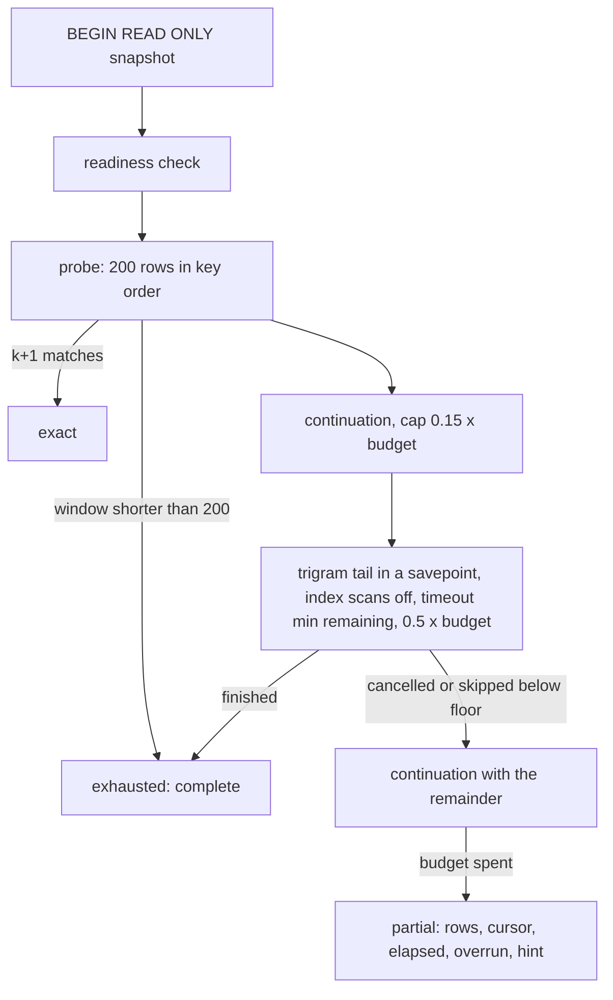

# unscoped

Budgeted file-content substring search with no repository filter (#7730).
It replaces the single `ILIKE ... ORDER BY ... LIMIT ... OFFSET` statement the
API and MCP `search_file_content` tool ran across all repositories, whose cost
depended on a planner row estimate and on the total size of the trigram
candidate set.

## Flow

Cursor rules: the cursor is the last visited key; only a completed window
advances it; every statement reads strictly after it; `offset` is served by
reading `offset + limit + 1` matches under the same budget.

## Contract

- `Searcher.Search` returns `querycontract.FileSearchPage`. `Partial` is set
  when the budget ended the search first; `Files` is then an ordered prefix of
  the exact answer. A client resumes with `Partial.Cursor` and
  `offset = max(0, offset - Partial.RowsMatched)`. `Partial.Progressed` is false when the call
  completed no window: its cursor is the request cursor and resuming repeats the
  request, so the hint then says to scope with repo_id or ask the operator to raise the server budget.
- `overrun_ms` is how far a cancelled statement ran past its own timeout.
  PostgreSQL cannot interrupt the lowercase copy and the TOAST decompression
  of one value, so a single large candidate adds to the wall time. Above
  100 ms the partial reason is `budget_exceeded_on_large_document`.
- `ESHU_CONTENT_SEARCH_BUDGET_MS` (100..10000, default 800) sets the budget.
  An invalid value fails startup. Every internal timeout scales with it.

## Telemetry

Span `postgres.query` (`db.operation=search_file_content_any_repo_page`) with
`search.scope`, `search.budget_ms`, `search.elapsed_ms`, `search.overrun_ms`,
`search.probe_rows_visited`, `search.continuation_steps`,
`search.continuation_rows`, `search.tail_ran`, `search.tail_cancelled`,
`search.outcome`, `search.cursor_present`. Counters
`eshu_dp_content_search_unscoped_total{outcome}` and
`eshu_dp_content_search_tail_cancel_total`; histograms
`eshu_dp_content_search_unscoped_duration_seconds{outcome}` and
`eshu_dp_content_search_unscoped_overrun_seconds`. One `content_search.unscoped_partial`
log line per partial result. No pattern text is recorded anywhere.

## Gotchas

- The tail's plan is not the planner's choice: `enable_indexscan = off` leaves
  the trigram bitmap as the only cheap path. The live plan test pins that.
- SET LOCAL of the statement timeout is made outside the savepoint and tracked;
  `enable_indexscan` is set inside it, so a cancel reverts it.
- All statements use pgx `QueryExecModeExec` so the planner sees bound values.
